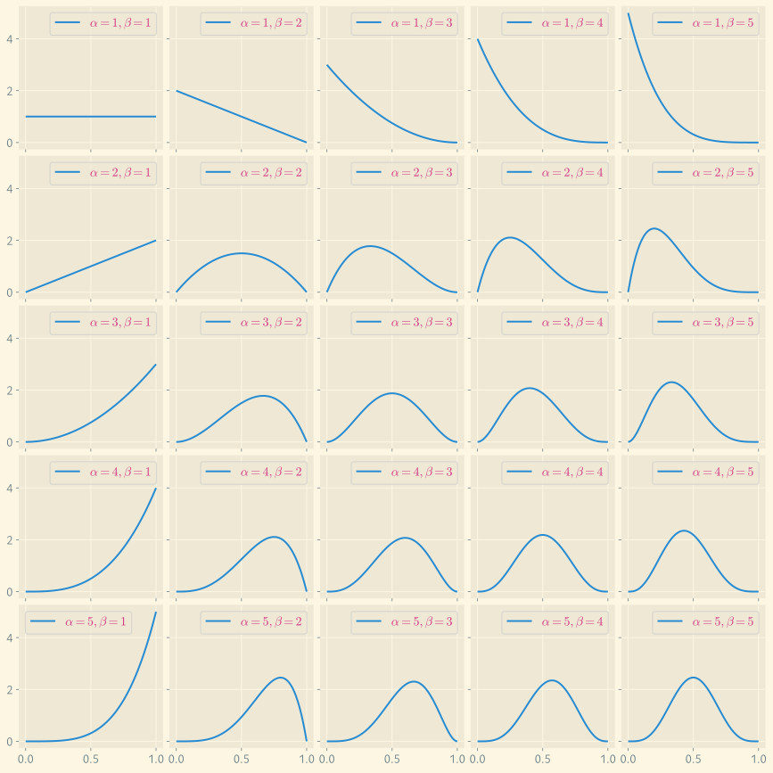
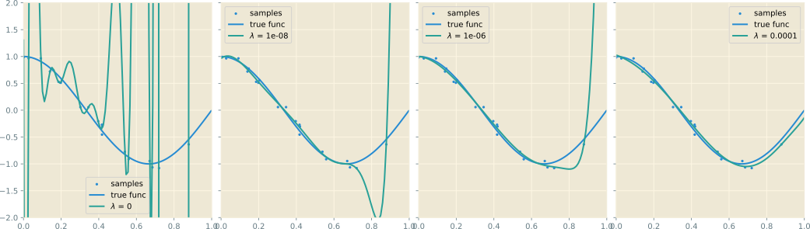
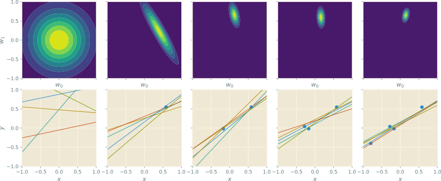
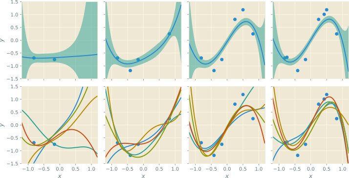
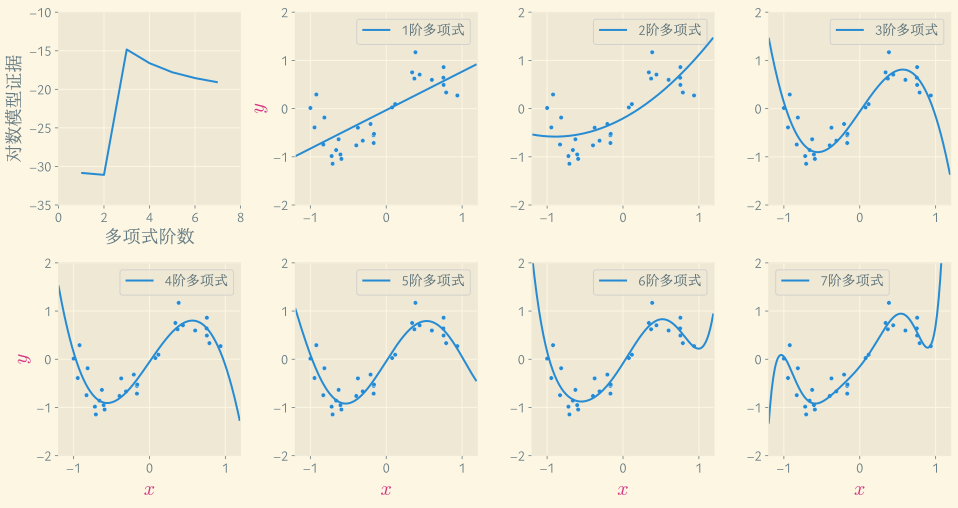

---
presentation:
  margin: 0
  center: false
  transition: "none"
  enableSpeakerNotes: true
  slideNumber: "c/t"
  navigationMode: "linear"
---

@import "../css/font-awesome-4.7.0/css/font-awesome.css"
@import "../css/theme/solarized.css"
@import "../css/logo.css"
@import "../css/font.css"
@import "../css/color.css"
@import "../css/margin.css"
@import "../css/table.css"
@import "../css/main.css"
@import "../plugin/zoom/zoom.js"
@import "../plugin/notes/notes.js"
@import "../plugin/customcontrols/plugin.js"
@import "../plugin/customcontrols/style.css"
@import "../plugin/chalkboard/plugin.js"
@import "../plugin/chalkboard/style.css"
@import "../plugin/reveal.js-menu/menu.js"
@import "../js/anychart/anychart-core.min.js"
@import "../js/anychart/anychart-venn.min.js"
@import "../js/anychart/pastel.min.js"
@import "../js/anychart/venn-entropy.js"

<!-- slide data-notes="" -->

# 机器学习

## 贝叶斯概率

### 计算机学院&emsp;张腾

#### *tengzhang@hust.edu.cn*

<!-- slide vertical=true data-notes="" -->

##### 大纲

---

@import "../vega/outline.json" {as="vega" .top-2}

<!-- slide data-notes="" -->

##### 概率

---

概率是用来刻画不确定性的工具

频率主义：独立重复试验中随机事件发生频率的极限

局限：若随机事件非可重复怎么办？

下一轮学科评估，华科计算机得 A+ 的概率有多大？

明天大 A 股上涨的概率有多大？

今年祖国统一的概率有多大？

<!-- slide vertical=true data-notes="" -->

##### 概率

---

我们有一些观测

- 近两年学院引进了很多高水平的青年教师
- 资深教授大项目接连不断
- 毕业生去向越来越好

- 市场情绪回暖，成交量温和放大
- 宏观经济数据稳中向好
- 公司年报业绩亮眼

- 解放军展示先进装备，频繁秀肌肉
- 美国深陷中东泥潭，在亚太地区影响力减弱
- 多个西方国家元首访问中国寻求合作

根据这些观测，我们对上页问题的概率会有自己的判断

<!-- slide data-notes="" -->

##### 贝叶斯公式

---

贝叶斯主义：概率是观测者对随机事件发生的主观信念 (belief)

\begin{align}
    \underbrace{p(\Theta|X)}_{后验} & = \frac{\overbrace{p(X|\Theta)}^{似然} \overbrace{p(\Theta)}^{先验}}{\underbrace{p(X)}_{证据}} = \frac{p(X|\Theta) p(\Theta) }{\int p(X|\Theta) p(\Theta) \diff \Theta}
\end{align}

- 先验 (prior) ：对随机事件$\Theta$发生 (评上 A+) 的初始信念
- 似然 (likelihood) ：随机事件$\Theta$与观测$X$的匹配程度 (上轮评上 A+ 的学校有多少大力引才、项目不断)
- 证据 (evidence) ：观测$X$，它是贝叶斯主义者做推断的基础
- 后验 (posterior) ：得到观测$X$后，观测者对初始信念的修正

<!-- slide vertical=true data-notes="" -->

##### 应用到机器学习

---

$\Theta$为参数或模型，$X$为训练数据

\begin{align}
    \underbrace{p(\Theta|X)}_{后验} & = \frac{\overbrace{p(X|\Theta)}^{似然} \overbrace{p(\Theta)}^{先验}}{\underbrace{p(X)}_{证据}} = \frac{p(X|\Theta) p(\Theta) }{\int p(X|\Theta) p(\Theta) \diff \Theta}
\end{align}

根据是否利用先验，有两种估计$\Theta$的方式：

- 极大似然 (maximum likelihood, ML)，$\Theta^{\ml} = \argmax_\Theta ~ p(X|\Theta)$
- 最大后验 (maximum a posterior, MAP)，$\Theta^{\map} = \argmax_\Theta ~ p(\Theta|X)$

前者为频率主义者的做法，后者为贝叶斯主义者的做法

<!-- slide data-notes="" -->

##### 频率 _vs._ 贝叶斯

---

以抛硬币为例，记$\theta = p(正面)$，观测$X$：$t$次抛掷中有$k$次正面

频率主义：

- $\theta$是固定的未知参数，有了观测后，通过极大似然估计$\theta$
- $\theta$的不确定性来自观测，不同观测会估计出不同的$\theta$
- 估计的评估：如果有多个观测，在每个观测上做极大似然，看结果的方差，如果只有一个观测，先通过自举法 (bootstrap) 构造多个不同的观测，再分别做极大似然

贝叶斯主义：

- $\theta$不是固定的数，而是$[0,1]$上的随机变量 (硬币空间上的分布)
- 观测只有一个，是确定的，$\theta$的不确定性来自观测者，观测者的信息越完全/不完全，不确定性越小/越大，$\theta$的分布越窄/宽

<!-- slide vertical=true data-notes="" -->

##### 频率主义

---

观测$X$：$t$次抛掷中有$k$次正面，似然是二项式分布

\begin{align}
    p(X | \theta) = \binom{t}{k} \theta^k (1 - \theta)^{t-k}
\end{align}

假设某次观测抛了$10$次全正，根据极大似然有$\theta^{\ml} = 1$

预测：该硬币抛掷$100\%$都是正面

<!-- slide data-notes="" -->

##### 贝叶斯主义

---

观测$X$：$t$次抛掷中有$k$次正面，似然$p(X | \theta) = \binom{t}{k} \theta^k (1 - \theta)^{t-k}$

先验取参数为$(\alpha,\beta)$的贝塔分布：

\begin{align}
    p(\theta) & = \BetaDist(\theta|\alpha,\beta) \\
    & = \frac{\theta^{\alpha - 1} (1-\theta)^{\beta - 1}}{\int_0^1 \theta^{\alpha - 1} (1-\theta)^{\beta - 1} \diff \theta} \\
    & = \frac{\theta^{\alpha - 1} (1-\theta)^{\beta - 1}}{\BetaFunc(\alpha,\beta)}
\end{align}

- $\alpha+\beta-2$次多项式函数
- 在$[0,1]$上单峰值
- $\alpha$、$\beta$控制峰值位置

 分母$\BetaFunc(\alpha,\beta) = \int_0^1 \theta^{\alpha - 1} (1-\theta)^{\beta - 1} \diff \theta$是第一类欧拉积分，归一化用

<!-- slide vertical=true data-notes="" -->

##### 共轭先验

---

证据和后验分别为

\begin{align}
    p(X) & = \int_0^1 p(\theta) p(X|\theta) \diff \theta = \binom{t}{k} \frac{1}{\BetaFunc(\alpha,\beta)} \int_0^1  \theta^{\alpha + k - 1} (1 - \theta)^{\beta + t-k-1} \diff \theta \\
    & = \binom{t}{k} \frac{\BetaFunc(\alpha+k,\beta+t-k)}{\BetaFunc(\alpha,\beta)}
\end{align}

\begin{align}
    p(\theta|X) = \frac{p(\theta) p(X|\theta)}{p(X)} = \frac{\theta^{\alpha + k - 1} (1-\theta)^{\beta + t - k - 1}}{\BetaFunc(\alpha+k,\beta+t-k)} = \BetaDist(\theta|\alpha+k,\beta+t-k)
\end{align}

- 似然$p(X | \theta) = \binom{t}{k} \theta^k (1 - \theta)^{t-k}$，先验也呈型$\theta^\spadesuit (1-\theta)^\heartsuit$，选贝塔分布
- 若先验的选择使得后验与先验同属一个分布族，仅参数有变化，则该先验称为该似然的共轭先验 (conjugate prior)，贝塔分布是{伯努利分布|二项式分布|几何分布|负二项式分布}的共轭先验
- 先验分布的参数$(\alpha,\beta)$由观测者自己选，可视为观测者的领域知识；也可视为伪数据：在$X$前还观测过$\alpha+\beta$次抛掷，其中$\alpha$次正面

<!-- slide vertical=true data-notes="" -->

##### 最大后验 预测分布

---

后验

\begin{align}
    p(\theta|X) = \frac{\theta^{\alpha + k - 1} (1-\theta)^{\beta + t - k - 1}}{\BetaFunc(\alpha+k,\beta+t-k)} = \BetaDist(\theta|\alpha+k,\beta+t-k)
\end{align}

若目标就是估计$\theta$，采用 MAP 估计：$\theta^{\map} = \argmax_\theta ~ p(\theta|X)$

- 由于先验 (伪数据) 的存在，不会出现频率主义中$\theta^{\ml} = 1$的情况

若目标是对下次抛硬币的结果$\xh$做预测，有两种做法：

- 先估计$\theta^{\map}$，再计算$p(\xh|\theta^{\map})$，但这样做忽略了$\theta$的随机性，尤其当后验$p(\theta|X)$是个平坦的分布时，只取一个点来做决策风险很大
- 预测分布 (predictive distribution)：根据$\theta$的后验做加权平均

\begin{align}
    p(\xh|X) = \int p(\xh|\theta) p(\theta|X) \diff \theta
\end{align}

<!-- slide data-notes="" -->

##### 模型选择 频率主义

---

若有一组模型$\{ \mc_i \}_{i=1,2,\ldots}$，如何选择？

频率主义者：$\dc = \dc_{\train} \uplus \dc_{\val}$，$\mc_i \xrightarrow[训练]{\dc_{\train}} \theta_i \xrightarrow[验证]{\dc_{\val}} (\mc^\star, \theta^\star)$

局限：数据不能全部用来训练模型，数据利用率不高

<!-- slide vertical=true data-notes="" -->

##### 模型选择 贝叶斯主义

---

贝叶斯主义者

\begin{align}
    p (\mc_i | \dc) = \frac{p(\dc | \mc_i) p(\mc_i)}{p(\dc)} = \frac{p(\dc | \mc_i) p(\mc_i)}{\sum_j p(\dc | \mc_j) p(\mc_j)}
\end{align}

模型选择：最大后验，$\mc = \argmax_{\mc_i} p (\mc_i | \dc)$

模型平均：未知样本$\xh$的预测分布为

\begin{align}
    p (\xh | \dc) & = \sum_i p (\xh | \mc_i, \dc) p (\mc_i | \dc) \\
    & = \sum_i \underbrace{\left( \int p (\xh | \mc_i, \theta_i) p (\theta_i | \mc_i, \dc) \diff \theta_i \right)}_{单个模型的预测分布} p (\mc_i | \dc)
\end{align}

<!-- slide vertical=true data-notes="" -->

##### 模型选择 贝叶斯主义

---

贝叶斯主义者

\begin{align}
    p (\mc_i | \dc) = \frac{p(\dc | \mc_i) p(\mc_i)}{p(\dc)} = \frac{p(\dc | \mc_i) p(\mc_i)}{\sum_j p(\dc | \mc_j) p(\mc_j)}
\end{align}

先验：如果对模型没有特别的偏好，$p(\mc_i)$可以选均匀分布

似然：$p(\dc | \mc_i)$恰是推断参数$\theta_i$时贝叶斯公式 (下式) 的分母，称为模型证据 (model evidence)，在选定参数$\theta_i$的先验后，模型$\mc_i$生成数据$\dc$的概率

\begin{align}
    p (\theta_i | \dc, \mc_i) = \frac{p(\dc | \theta_i, \mc_i) p(\theta_i | \mc_i)}{p(\dc | \mc_i)} = \frac{p(\dc | \theta_i, \mc_i) p(\theta_i | \mc_i)}{\int p(\dc | \theta_i, \mc_i) p(\theta_i | \mc_i) \diff \theta_i}
\end{align}

 之前推断参数$\theta_i$的贝叶斯公式中没有将$\mc_i$显式写出来，因为它是公式中所有概率的条件变量

<!-- slide data-notes="" -->

##### 贝叶斯因子

---

模型后验几率：先验几率与模型证据比值的乘积，后者也称为贝叶斯因子 (Bayes factor)

\begin{align}
    \frac{p(\mc_1 | \dc)}{p(\mc_2 | \dc)} = \frac{p(\mc_1)}{p(\mc_2)} \cdot \frac{p(\dc | \mc_1)}{p(\dc | \mc_2)} = \frac{p(\mc_1)}{p(\mc_2)} \cdot \frac{\int p(\dc | \theta_1, \mc_1) p(\theta_1 | \mc_1) \diff \theta_1}{\int p(\dc | \theta_2, \mc_2) p(\theta_2 | \mc_2) \diff \theta_2}
\end{align}

不同人对模型有不同的偏好，将贝叶斯因子公布，其他人可根据自己的先验几率计算后验几率从而选择模型

优点：只需计算模型证据$p(\dc | \mc_i)$即可完成模型选择，所有数据都可用于训练，不用再分出一部分作为验证集

<!-- slide vertical=true data-notes="" -->

##### 贝叶斯因子

---

以抛硬币为例

- 数据$\dc$为$100$次抛掷中有$60$次正面
- 模型$\mc_1$：正面概率固定为$0.5$，
- 模型$\mc_2$：正面概率固定为未知参数$\theta$，$\theta$先验为$\BetaDist(\theta|2,2)$
- 模型先验为均匀分布，$p(\mc_1) = p(\mc_2) = 0.5$

\begin{align}
    p(\dc | \mc_1) & = \binom{100}{60} \frac{1}{2^{100}} \approx 0.010843866711637987 \\
    p(\dc | \mc_2) & = \int_0^1 p(\dc | \theta, \mc_2) p(\theta | \mc_2) \diff \theta = \int_0^1 \binom{100}{60} \theta^{60} (1 - \theta)^{40} \frac{\theta (1-\theta)}{\BetaFunc(2,2)} \diff \theta \\
    & = \binom{100}{60} \frac{\BetaFunc(62,42)}{\BetaFunc(2,2)} \approx 0.014141848222515001
\end{align}

数据给出的证据更利于$\mc_2$

<!-- slide data-notes="" -->

##### 模型证据 定性分析

---

\begin{align}
    \underbrace{p(\dc | \mc)}_{模型证据} \underbrace{p(\theta | \dc, \mc)}_{参数后验} = \underbrace{p(\dc | \theta, \mc)}_{参数似然} \underbrace{p(\theta | \mc)}_{参数先验}
\end{align}

- 设参数先验是个宽度为$\Delta_{\prior}$的平坦分布
- 设参数后验集中在$\theta^{\map}$附近，宽度为$\Delta_{\posterior}$

\begin{align}
    p(\dc | \mc) & \approx p(\dc | \theta^{\map}, \mc) \frac{\Delta_{\posterior}}{\Delta_{\prior}} \\
    & \Longrightarrow \ln p(\dc | \mc) \approx \ln p(\dc | \theta^{\map}, \mc) + \ln \frac{\Delta_{\posterior}}{\Delta_{\prior}}
\end{align}

- 第一项是最大后验$\theta^{\map}$对数据的匹配程度
- 第二项惩罚模型的复杂度，越复杂的模型解释数据的能力越强，越能使得宽阔平坦的先验变成集中陡峭的后验，$\Delta_{\posterior}/\Delta_{\prior}$越小
- 最大化模型证据就是在拟合数据和防过拟合之间做权衡，对给定数据应选择复杂度恰好的模型，即奥卡姆剃刀准则 (Occam's razor)

<!-- slide data-notes="" -->

##### 再看朴素贝叶斯

---

朴素贝叶斯通过极大似然估计$p(y), ~ p(x_1 | y), ~ \ldots, ~ p(x_d | y)$

记$\alpha_k = p(y = k)$，于是$\sum_{k \in [c]} \alpha_k = 1$且

\begin{align}
    p(y | \alpha_k) = \prod_{k \in [c]} p(y = k)^{\ib(y=k)} = \prod_{k \in [c]} \alpha_k^{\ib(y=k)}
\end{align}

是分类分布，伯努利分布的多元扩展，$c=2$即为伯努利分布

伯努利分布呈$\theta^\spadesuit (1-\theta)^\heartsuit$的形式，共轭先验是贝塔分布

\begin{align}
    \BetaDist(\theta|\alpha,\beta) = \frac{\theta^{\alpha - 1} (1-\theta)^{\beta - 1}}{\int_0^1 \theta^{\alpha - 1} (1-\theta)^{\beta - 1} \diff \theta} = \frac{\theta^{\alpha - 1} (1-\theta)^{\beta - 1}}{\BetaFunc(\alpha,\beta)}
\end{align}

分类分布的共轭先验是贝塔分布的多元扩展？

<!-- slide vertical=true data-notes="" -->

##### 狄利克雷分布

---

伽玛函数 (第二类欧拉积分) 和贝塔函数 (第一类欧拉积分)：

\begin{align}
    & \Gamma(m) = \int_0^\infty \theta^{m - 1} \exp(- \theta) \diff \theta \\
    & \BetaFunc(\alpha,\beta) = \int_0^1 \theta^{\alpha - 1} (1-\theta)^{\beta - 1} \diff \theta = \frac{\Gamma(\alpha) \Gamma(\beta)}{\Gamma(\alpha+\beta)}
\end{align}

由贝塔函数可导出贝塔分布

\begin{align}
    \BetaDist(\theta|\alpha,\beta) = \frac{\theta^{\alpha - 1} (1-\theta)^{\beta - 1}}{\BetaFunc(\alpha,\beta)} = \frac{\Gamma(\alpha+\beta)}{\Gamma(\alpha) \Gamma(\beta)} \theta^{\alpha - 1} (1-\theta)^{\beta - 1}
\end{align}

贝塔分布的多元扩展为狄利克雷分布

\begin{align}
    \Dir(\alphav | \mv) = \frac{\Gamma(m_1 + \cdots + m_c)}{\Gamma(m_1) \cdots \Gamma(m_c)} \prod_{k \in [c]} \alpha_k^{m_k - 1}, \quad \sum_{k \in [c]} \alpha_k = 1
\end{align}

<!-- slide vertical=true data-notes="" -->

##### 狄利克雷分布先验

---

@import "../dot/conjugate-prior.dot" {.left10per}

记$\alpha_k = p(y = k)$，于是

\begin{align}
    p(y | \alphav) = \prod_{k \in [c]} p(y = k)^{\ib(y=k)} = \prod_{k \in [c]} \alpha_k^{\ib(y=k)}, \quad \sum_{k \in [c]} \alpha_k = 1
\end{align}

设$\alphav$服从参数为$\mv$的狄利克雷分布：

\begin{align}
    p(\alphav) = \Dir(\alphav | \mv) = \frac{\Gamma(m_1 + \cdots + m_c)}{\Gamma(m_1) \cdots \Gamma(m_c)} \prod_{k \in [c]} \alpha_k^{m_k - 1}, \quad \sum_{k \in [c]} \alpha_k = 1
\end{align}

<!-- slide data-notes="" -->

##### 狄利克雷分布后验

---

根据贝叶斯公式，后验

\begin{align}
    p(\alphav | \yv) & \propto p(\alphav) p(\yv|\alphav) \\
    & = \left( \frac{\Gamma(m_1 + \cdots + m_c)}{\Gamma(m_1) \cdots \Gamma(m_c)} \prod_{k \in [c]} \alpha_k^{m_k - 1} \right) \left( \prod_{i \in [m]} \prod_{k \in [c]} \alpha_k^{\ib(y^{(i)}=k)} \right) \\
    & = \frac{\Gamma(m_1 + \cdots + m_c)}{\Gamma(m_1) \cdots \Gamma(m_c)} \prod_{k \in [c]} \alpha_k^{m_k - 1} \alpha_k^{\sum_{i \in [m]} \ib(y^{(i)}=k)}                                                  \\
    & = \frac{\Gamma(m_1 + \cdots + m_c)}{\Gamma(m_1) \cdots \Gamma(m_c)} \prod_{k \in [c]} \alpha_k^{A_k + m_k - 1}                                                                                        \\
    & \propto \Dir(\alphav | A_1 + m_1, \ldots, A_c + m_c)
\end{align}

其中$A_k = \sum_{i \in [m]} \ib(y^{(i)} = k)$为第$k$类样本数

这就验证了狄利克雷分布是分类分布的共轭先验

<!-- slide vertical=true data-notes="" -->

##### 最大后验估计

---

记$A_k = \sum_{i \in [m]} \ib(y^{(i)} = k)$为第$k$类样本数，后验

\begin{align}
    p(\alphav | \yv) \propto \frac{\Gamma(m_1 + \cdots + m_c)}{\Gamma(m_1) \cdots \Gamma(m_c)} \prod_{k \in [c]} \alpha_k^{A_k + m_k - 1}
\end{align}

最大后验估计$\alpha_k$只需求解优化问题

\begin{align}
    & \max_{\alpha_k} ~ \sum_{k \in [c]} (A_k + m_k - 1) \ln \alpha_k, \quad \st ~ \sum_{k \in [c]} \alpha_k = 1 \\[4pt]
    & \alpha_k^{\map} = \frac{A_k + m_k - 1}{\sum_{j \in [c]} (A_j + m_j - 1)}
\end{align}

- 取$\mv = \onev$，则$\alpha_k^{\map} = \alpha_k^{\ml}$，此时狄利克雷分布退化为均匀分布，先验不包含观测者的任何偏好，最大后验估计退化为极大似然估计
- 取$\mv = \boldsymbol{2}$得到拉普拉斯平滑，此时的朴素贝叶斯才是真·贝叶斯

<!-- slide vertical=true data-notes="" -->

##### 真·朴素贝叶斯 小结

---

|  类别  |                         似然                         |                      共轭先验                       |                                     后验                                     |
| :----: | :--------------------------------------------------: | :-------------------------------------------------: | :--------------------------------------------------------------------------: |
| 枚举型 | $\left. \mathrm{Cate}(\yv \right\arrowvert \alphav)$ | $\left. \mathrm{Dir}(\alphav \right\arrowvert \mv)$ | $\left. \mathrm{Dir}(\alphav \right\arrowvert m_1 + A_1, \ldots, m_c + A_c)$ |

|    特征     |                             似然                              |                       共轭先验                       |                                     后验                                     |
| :---------: | :-----------------------------------------------------------: | :--------------------------------------------------: | :--------------------------------------------------------------------------: |
|   枚举型    |     $\left. \mathrm{Cate}(\xv \right\arrowvert \thetav)$      | $\left. \mathrm{Dir}(\thetav \right\arrowvert \mv)$  | $\left. \mathrm{Dir}(\thetav \right\arrowvert m_1 + A_1, \ldots, m_c + A_c)$ |
| $\{ 0,1 \}$ |   $\left. \mathrm{Bern}(x_j \right\arrowvert \theta_{kj})$    | $\left. \BetaDist(\theta_{kj} \right\arrowvert m,n)$ |  $\left. \BetaDist(\theta_{kj} \right\arrowvert m + B_{kj},n+\bar{B}_{kj})$  |
|    $\nb$    |     $\left. \mathrm{Mult}(\xv \right\arrowvert \thetav)$      | $\left. \mathrm{Dir}(\thetav \right\arrowvert \mv)$  | $\left. \mathrm{Dir}(\thetav \right\arrowvert m_1 + A_1, \ldots, m_c + A_c)$ |
|    $\rb$    | $\left. \nc(x_{kj} \right\arrowvert \mu_{kj}, \sigma_{kj}^2)$ |     均值未知、精度 (方差的倒数) 已知时，高斯分布     |
|      -      |                               -                               |     均值已知、精度 (方差的倒数) 未知时，伽玛分布     |
|      -      |                               -                               |   均值、精度 (方差的倒数) 都未知时，高斯-伽玛分布    |

共轭先验的参数就是拉普拉斯平滑中的系数

<!-- slide data-notes="" -->

##### 再看线性回归

---

特征空间$\rb^d$，标记空间$\rb$，线性回归模型

\begin{align}
    f(\xv, \wv) = w_0 + w_1 \phi_1(\xv) + \cdots + w_n \phi_{n-1}(\xv)
\end{align}

其中$w_0$是截距，$\phi_1, \ldots, \phi_{n-1}$是固定的基函数 (basis function)

- 多项式函数：若输入空间为$\rb$，$\phi_j (x) = x^j$，即为多项式回归
- 样条函数 (spline function)：多项式函数的局限性是它是全局的，$\xv$在输入空间某处的微小变化会引起$f(\xv, \wv)$在整个空间上的变化，若将输入空间分成若干个区域，每个区域用不同的多项式，即为样条函数
- 径向基函数 (RBF)：$\phi_j(x) = \exp (-(x - \mu_j)^2 / (2 \sigma^2))$
- 对数几率函数、双曲正切函数
- 傅里叶基函数：不同频率的正弦函数、余弦函数
- 小波：与傅里叶基函数的关系类似于样条函数与多项式函数，小波保持空间上的局部性

 得益于基函数的存在，$f(\xv, \wv)$能表示非线性关系，但它关于参数$\wv$是线性的，故仍称为线性模型

<!-- slide vertical=true data-notes="" -->

##### 线性回归

---

模型：

- 选定基函数$\phi_0, \ldots, \phi_{n-1}$，其中$\phi_0$为恒取值$1$的基函数
- 给定特征向量$\xv$，标记$y = \phiv (\xv)^\top \wv + \nc(0, \beta^{-1})$，其中$\wv$、$\beta$为参数

为表示方便，引入设计矩阵 (design matrix)

\begin{align}
    \Phiv & = \begin{bmatrix}
                \phi_0(\xv_1) & \phi_1(\xv_1) & \cdots & \phi_{n-1}(\xv_1) \\
                \phi_0(\xv_2) & \phi_1(\xv_2) & \cdots & \phi_{n-1}(\xv_2) \\
                \vdots        & \vdots        & \ddots & \vdots            \\
                \phi_0(\xv_m) & \phi_1(\xv_m) & \cdots & \phi_{n-1}(\xv_m)
            \end{bmatrix} =
    \begin{bmatrix}
        \phiv(\xv_1)^\top \\ \phiv(\xv_2)^\top \\ \vdots \\ \phiv(\xv_m)^\top
    \end{bmatrix} \in \rb^{m \times n} \\
    & = \begin{bmatrix} \varphiv_0 & \varphiv_1 & \cdots & \varphiv_{n-1} \end{bmatrix}
\end{align}

<!-- slide data-notes="" -->

##### 极大似然

---

数据集$\dc = \{ (\xv_i, y_i) \}_{i \in [m]}$，对数似然

\begin{align}
    \ln p (\yv | \wv, \beta) & = \ln \prod_{i \in [m]} \nc(y_i | \phiv (\xv_i)^\top \wv, \beta^{-1}) \\
     & = \ln \prod_{i \in [m]} \sqrt{\frac{\beta}{2 \pi}} \exp \left( -\frac{\beta}{2} (y_i - \phiv (\xv_i)^\top \wv)^2 \right) \\
     & = \frac{m}{2} \ln \beta - \frac{m}{2} \ln (2 \pi) - \beta \cdot \frac{1}{2} \| \yv - \Phiv \wv \|_2^2
\end{align}

令关于$\wv$、$\beta$的梯度为零可得极大似然解

- $\wv^{\ml} = (\Phiv^\top \Phiv)^{-1} \Phiv^\top \yv$，其中$(\Phiv^\top \Phiv)^{-1} \Phiv^\top$为 Moore-Penrose 伪逆
- $\beta^{\ml} = (\| \yv - \Phiv \wv^{\ml} \|_2^2 / m)^{-1}$，$\wv^{\ml}$预测的残差的方差的倒数

 似然$p (\yv | \wv, \beta)$的条件变量里应该还包含$\xv_1, \ldots, \xv_m$，但贝叶斯线性回归不对特征向量的分布进行建模，它们永远作为条件变量出现在$|$的右边，因此就统一省略了

<!-- slide vertical=true data-notes="" -->

##### 最小二乘

---

对于$\wv$，显然最大似然 等价于 最小二乘 等价于 列空间投影

\begin{align}
    \argmax_\wv \ln p & (\yv | \wv, \beta) \Longleftrightarrow \argmin_\wv \frac{1}{2} \| \yv - \Phiv \wv \|_2^2 \\
    & \Longleftrightarrow \argmin_{\yv'} \frac{1}{2} \| \yv - \yv' \|_2^2, ~ \st ~ \yv' \in \mathrm{span} \{ \varphiv_0, \ldots, \varphiv_{n-1} \}
\end{align}

根据极大似然解，投影点为

\begin{align}
    \yv' = \Phiv \wv^{\ml} = \Phiv (\Phiv^\top \Phiv)^{-1} \Phiv^\top \yv
\end{align}

因此$\Phiv (\Phiv^\top \Phiv)^{-1} \Phiv^\top$也称为投影矩阵 (projection matrix)

<!-- slide vertical=true data-notes="" -->

##### 列空间投影

---

验证$\yv' = \Phiv \wv^{\ml} = \Phiv (\Phiv^\top \Phiv)^{-1} \Phiv^\top \yv$就是投影点

$\yv'$属于列空间$\mathrm{span} \{ \varphiv_0, \ldots, \varphiv_{n-1} \}$是显然的

$\yv - \yv'$正交于列空间$\mathrm{span} \{ \varphiv_0, \ldots, \varphiv_{n-1} \}$

\begin{align}
    (\yv - \yv')^\top \varphiv_j & = \yv^\top \varphiv_j - \yv^\top \Phiv (\Phiv^\top \Phiv)^{-1} \Phiv^\top \varphiv_j \\
    & = \yv^\top \varphiv_j - \yv^\top [\Phiv (\Phiv^\top \Phiv)^{-1} \Phiv^\top \Phiv]_j \\
    & = \yv^\top \varphiv_j - \yv^\top [\Phiv]_j \\
    & = \yv^\top \varphiv_j - \yv^\top \varphiv_j \\
    & = 0
\end{align}

<!-- slide data-notes="" -->

##### 正则化最小二乘

---

为避免过拟合，约束$\wv$的可行域，问题形式化为

\begin{align}
    (\spadesuit) \quad \min_\wv \frac{1}{2} \| \yv - \Phiv \wv \|_2^2, \quad \st ~ \frac{1}{2} \| \wv \|_2^2 - \eta \le 0
\end{align}

- 目标函数的等高线是椭圆，可行域是圆，最优解$\wv^\star$在其相切处
- 椭圆和圆在$\wv^\star$处有共同的切线，因此梯度平行

拉格朗日对偶问题为

\begin{align}
    \max_{\lambda \ge 0} \min_{\wv} L(\wv, \lambda) = \frac{1}{2} \| \yv - \Phiv \wv \|_2^2 + \lambda \left( \frac{1}{2} \| \wv \|_2^2 - \eta \right)
\end{align}

- 令拉格朗日函数$L(\wv, \lambda)$关于$\wv$的梯度为零，即是要求梯度平行
- 关于$\wv$的内层优化问题就是正则化最小二乘
- 对任意给定$\eta$，都存在一个$\lambda$使其最优解与式$(\spadesuit)$的最优解相同

<!-- slide vertical=true data-notes="" -->

##### 正则化最小二乘

---

一般形式

\begin{align}
    \min_{\wv} \frac{1}{2} \| \yv - \Phiv \wv \|_2^2 + \lambda \cdot \Omega (\wv)
\end{align}

- $\Omega (\wv) = \|\wv\|_2^2$，岭回归 (ridge regression)，$\wv^\star = (\Phiv^\top \Phiv + \lambda \Iv_n)^{-1} \Phiv^\top \yv$
- $\Omega (\wv) = \|\wv\|_1$，最小绝对值收敛和选择算子 (least absolute shrinkage and selection operator, LASSO)，可得到稀疏的$\wv$

正则项的系数$\lambda$需通过验证集去挑选

<!-- slide vertical=true data-notes="" -->

##### 正则化最小二乘

---

数据：$20$个样本，$x \sim \uc[0,1]$，$y = \cos (3 \pi x  / 2) + \nc(0, 1) / 10$

模型：$20$阶多项式基函数，$\ell_2$正则，正则项系数$\lambda$

无正则项时过拟合，随着$\lambda$指数递增，抗过拟合越来越好

<!-- slide data-notes="" -->

##### 贝叶斯线性回归

---

假设$\beta$已知，$\wv$的先验取高斯分布$\nc (\muv_0, \Sigmav_0)$

$\wv$的后验

\begin{align}
    p & (\wv | \yv) \propto p (\yv | \wv) p (\wv) \\
     & \propto \exp \bigg( - \frac{\beta}{2} \| \yv - \Phiv \wv \|_2^2 \bigg) \exp \bigg( -\frac{1}{2} (\wv - \muv_0)^\top \Sigmav_0^{-1} (\wv - \muv_0) \bigg) \\
     & \propto \exp \bigg( - \frac{1}{2} \wv^\top (\underbrace{\beta \Phiv^\top \Phiv + \Sigmav_0^{-1}}_{\Sigmav_m^{-1}}) \wv + \wv^\top \Sigmav_m^{-1} \underbrace{\Sigmav_m (\beta \Phiv^\top \yv + \Sigmav_0^{-1} \muv_0)}_{\muv_m} \bigg) \\
     & \propto \exp \bigg( - \frac{1}{2} \wv^\top \Sigmav_m^{-1} \wv + \wv^\top \Sigmav_m^{-1} \muv_m \bigg) \\
     & \propto \exp \bigg( - \frac{1}{2} (\wv - \muv_m)^\top \Sigmav_m^{-1} (\wv - \muv_m) \bigg) \sim \nc (\wv | \muv_m, \Sigmav_m)
\end{align}

 若$\beta$未知，共轭先验为高斯-伽玛分布$\nc (\wv | \muv_0, \beta^{-1} \Sigmav_0) \Gam (\beta | a_0, b_0)$，预测分布为学生 t 分布

<!-- slide vertical=true data-notes="" -->

##### 贝叶斯线性回归

---

数据：$x \sim \uc[-1,1]$，$y = x / 2 + \nc(0, 0.01)$

模型：$f(x) = w_0 + w_1 x$，先验：$(w_0, w_1) \sim \nc(\zerov, \Iv_2 / 4)$

<!-- slide data-notes="" -->

##### 先验 正则化

---

取$\muv_0 = \zerov$、$\Sigmav_0 = \alpha^{-1} \Iv_n$，$\Sigmav_m^{-1} = \beta \Phiv^\top \Phiv + \alpha \Iv_n$、$\muv_m = \beta \Sigmav_m \Phiv^\top \yv$

\begin{align}
    \argmax_\wv \ln p (\wv | \yv)
     & = \argmin_\wv \frac{1}{2} (\wv - \muv_m)^\top \Sigmav_m^{-1} (\wv - \muv_m) \\
     & = \argmin_\wv \left\{ \frac{1}{2} \wv^\top \Sigmav_m^{-1} \wv - \wv^\top \Sigmav_m^{-1} \muv_m \right\} \\
     & = \argmin_\wv \left\{ \frac{1}{2} \wv^\top (\beta \Phiv^\top \Phiv + \alpha \Iv_n) \wv + \beta \wv^\top \Phiv^\top \yv \right\}                                                       \\
     & = \argmin_\wv \left\{ \frac{\beta}{2} \| \yv - \Phiv \wv \|_2^2 + \frac{\alpha}{2} \|\wv\|_2^2 \right\}
\end{align}

岭回归 等价于 高斯先验下的最大后验

<!-- slide vertical=true data-notes="" -->

##### 先验 正则化

---

更一般的，$\wv$的先验取

\begin{align}
    p (\wv | \muv_0, \alpha) = \left( \frac{q}{2} \left( \frac{\alpha}{2} \frac{1}{\Gamma(1/q)} \right)^{1/q} \right)^n \exp \left( - \frac{\alpha}{2} \| \wv - \muv_0 \|_q^q \right)
\end{align}

$q = 2$即为$(\alpha / (2 \pi))^{n/2} \exp (- (\alpha/2) \| \wv - \muv_0 \|_2^2) = \nc(\wv | \muv_0, \alpha^{-1} \Iv_n)$

$q = 1$即为$(\alpha/4)^n \exp (- (\alpha/2) \| \wv - \muv_0 \|_1) = \mathrm{Lap}(\wv | \muv_0, (\alpha/2)^{-1})$

\begin{align}
    p (\wv | \yv) \propto p(\wv) p(\yv | \wv) \propto \exp \left( - \frac{\alpha}{2} \| \wv - \muv_0 \|_1 - \frac{\beta}{2} \| \yv - \Phiv \wv \|_2^2 \right)
\end{align}

取$\muv_0 = \zerov$，LASSO 等价于 拉普拉斯先验下的最大后验

 只有$q=2$时为似然的共轭先验

<!-- slide data-notes="" -->

##### 预测分布

---

对任意未知样本$\xv$，其预测$y$的分布为

\begin{align}
    p (y | \yv)
     & = \int p (y | \wv) p (\wv | \yv) \diff \wv \\
     & = \int \nc (y | \phiv(\xv)^\top \wv, \beta^{-1}) \nc (\wv | \muv_m, \Sigmav_m) \diff \wv                                                                                                                       \\
     & = \int \frac{\beta^{1/2}}{(2 \pi)^{1/2}} \exp \left( -\frac{\beta}{2} (y - \phiv(\xv)^\top \wv)^2 \right) \\
     & \qquad \cdot \frac{1}{(2 \pi)^{n/2} |\Sigmav_m|^{1/2}} \exp \left( -\frac{1}{2} (\wv - \muv_m)^\top \Sigmav_m^{-1} (\wv - \muv_m) \right) \diff \wv
\end{align}

$\wv$只出现在$\exp(\cdot)$中且是负二次型，服从高斯分布

<!-- slide vertical=true data-notes="" -->

##### 预测分布

---

整理$\wv$的相关项，确定高斯分布的均值、协方差

\begin{align}
      & - \frac{\beta}{2} (y - \phiv(\xv)^\top \wv)^2 -\frac{1}{2} (\wv - \muv_m)^\top \Sigmav_m^{-1} (\wv - \muv_m)                                                                                                                                                                        \\
    = & - \frac{1}{2} \wv^\top (\underbrace{\beta \phiv(\xv) \phiv(\xv)^\top + \Sigmav_m^{-1}}_{\Sigmav^{-1}}) \wv + \wv^\top \Sigmav^{-1} \underbrace{\Sigmav (\beta \phiv(\xv) y + \Sigmav_m^{-1} \muv_m)}_{\muv} \\
    & \qquad \qquad - \frac{\beta}{2} y^2 - \frac{1}{2} \muv_m^\top \Sigmav_m^{-1} \muv_m \\
    = & - \frac{1}{2} (\wv - \muv)^\top \Sigmav^{-1} (\wv - \muv) - \frac{\beta}{2} y^2 - \frac{1}{2} \muv_m^\top \Sigmav_m^{-1} \muv_m + \frac{1}{2} \muv^\top \Sigmav^{-1} \muv
\end{align}

将$\wv$积分掉可得

\begin{align}
    p (y | \yv) = \frac{\beta^{1/2}}{(2 \pi)^{1/2}} \frac{|\Sigmav|^{1/2}}{|\Sigmav_m|^{1/2}} \exp \left( - \frac{\beta}{2} y^2 - \frac{1}{2} \muv_m^\top \Sigmav_m^{-1} \muv_m + \frac{1}{2} \muv^\top \Sigmav^{-1} \muv \right)
\end{align}

<!-- slide vertical=true data-notes="" -->

##### 预测分布

---

注意$\muv = \Sigmav (\beta \phiv(\xv) y + \Sigmav_m^{-1} \muv_m)$中也有$y$，继续化简

\begin{align}
    \frac{1}{2} \muv^\top \Sigmav^{-1} \muv & = \frac{1}{2} (\beta \phiv(\xv) y + \Sigmav_m^{-1} \muv_m)^\top \Sigmav (\beta \phiv(\xv) y + \Sigmav_m^{-1} \muv_m)                                                                      \\
     & = \frac{y^2}{2} \beta^2 \phiv(\xv)^\top \Sigmav \phiv(\xv) + y \beta \phiv(\xv)^\top \Sigmav \Sigmav_m^{-1} \muv_m + \frac{1}{2} \muv_m^\top \Sigmav_m^{-1} \Sigmav \Sigmav_m^{-1} \muv_m
\end{align}

注意$\Sigmav^{-1} = \beta \phiv(\xv) \phiv(\xv)^\top + \Sigmav_m^{-1}$，根据 Sherman-Morrison 公式

\begin{align}
    \Sigmav = (\Sigmav_m^{-1} + \beta \phiv(\xv) \phiv(\xv)^\top)^{-1} = \Sigmav_m - \frac{\beta \Sigmav_m \phiv(\xv) \phiv(\xv)^\top \Sigmav_m}{1 + \beta \phiv(\xv)^\top \Sigmav_m \phiv(\xv)}
\end{align}

于是可以对$\phiv(\xv)^\top \Sigmav \phiv(\xv)$、$\phiv(\xv)^\top \Sigmav \Sigmav_m^{-1} \muv_m$继续化简

<!-- slide vertical=true data-notes="" -->

##### 预测分布

---

Sherman-Morrison 公式

\begin{align}
    \Sigmav = (\Sigmav_m^{-1} + \beta \phiv(\xv) \phiv(\xv)^\top)^{-1} = \Sigmav_m - \frac{\beta \Sigmav_m \phiv(\xv) \phiv(\xv)^\top \Sigmav_m}{1 + \beta \phiv(\xv)^\top \Sigmav_m \phiv(\xv)}
\end{align}

\begin{align}
    \phiv(\xv)^\top \Sigmav \phiv(\xv)
     & = \phiv(\xv)^\top \left( \Sigmav_m - \frac{\beta \Sigmav_m \phiv(\xv) \phiv(\xv)^\top \Sigmav_m}{1 + \beta \phiv(\xv)^\top \Sigmav_m \phiv(\xv)} \right) \phiv(\xv) \\
     & = \frac{\phiv(\xv)^\top \Sigmav_m \phiv(\xv)}{1 + \beta \phiv(\xv)^\top \Sigmav_m \phiv(\xv)}
\end{align}

\begin{align}
    \phiv(\xv)^\top \Sigmav \Sigmav_m^{-1} \muv_m
     & = \phiv(\xv)^\top \left( \Sigmav_m - \frac{\beta \Sigmav_m \phiv(\xv) \phiv(\xv)^\top \Sigmav_m}{1 + \beta \phiv(\xv)^\top \Sigmav_m \phiv(\xv)} \right) \Sigmav_m^{-1} \muv_m                                                                                    \\
     & = \phiv(\xv)^\top \muv_m - \frac{\beta \phiv(\xv)^\top \Sigmav_m \phiv(\xv) \phiv(\xv)^\top \muv_m}{1 + \beta \phiv(\xv)^\top \Sigmav_m \phiv(\xv)} \\
     & = \frac{\phiv(\xv)^\top \muv_m}{1 + \beta \phiv(\xv)^\top \Sigmav_m \phiv(\xv)}
\end{align}

<!-- slide vertical=true data-notes="" -->

##### 预测分布

---

$y$的相关项为负二次函数

\begin{align}
    & - \frac{\beta}{2} y^2 + \frac{1}{2} \muv^\top \Sigmav^{-1} \muv \\
     = & - \frac{\beta}{2} y^2 + \frac{y^2}{2} \frac{\beta^2 \phiv(\xv)^\top \Sigmav_m \phiv(\xv)}{1 + \beta \phiv(\xv)^\top \Sigmav_m \phiv(\xv)} + y \frac{\beta \phiv(\xv)^\top \muv_m}{1 + \beta \phiv(\xv)^\top \Sigmav_m \phiv(\xv)} + \const \\
     = & - \frac{y^2}{2} \frac{\beta}{1 + \beta \phiv(\xv)^\top \Sigmav_m \phiv(\xv)} + y \frac{\beta \phiv(\xv)^\top \muv_m}{1 + \beta \phiv(\xv)^\top \Sigmav_m \phiv(\xv)} + \const                                                              \\
     = & - \frac{1}{2} \frac{\beta }{1 + \beta \phiv(\xv)^\top \Sigmav_m \phiv(\xv)} (y - \phiv(\xv)^\top \muv_m)^2 + \const
\end{align}

预测分布$p (y | \yv) = \nc ( y | \phiv(\xv)^\top \muv_m, \beta^{-1} + \phiv(\xv)^\top \Sigmav_m \phiv(\xv) )$，其中

\begin{align}
    \muv_m = \Sigmav_m (\beta \Phiv^\top \yv + \Sigmav_0^{-1} \muv_0), \quad \Sigmav_m^{-1} = \beta \Phiv^\top \Phiv + \Sigmav_0^{-1}
\end{align}

<!-- slide data-notes="" -->

##### 预测分布 均值

---

预测分布$p (y | \yv) = \nc ( y | \phiv(\xv)^\top \muv_m, \beta^{-1} + \phiv(\xv)^\top \Sigmav_m \phiv(\xv) )$，其中

\begin{align}
    \muv_m = \Sigmav_m (\beta \Phiv^\top \yv + \Sigmav_0^{-1} \muv_0), \quad \Sigmav_m^{-1} = \beta \Phiv^\top \Phiv + \Sigmav_0^{-1}
\end{align}

$\muv_m$是$\wv$后验 (高斯分布) 的均值，即$\wv^{\map}$，故预测分布的均值就是最大后验模型$\wv^{\map}$的预测结果

取先验均值$\muv_0$为零，则$\muv_m = \beta \Sigmav_m \Phiv^\top \yv$，于是预测分布的均值

\begin{align}
    \phiv(\xv)^\top \muv_m = \beta \phiv(\xv)^\top \Sigmav_m \Phiv^\top \yv = \sum_{i \in [m]} \beta \phiv(\xv)^\top \Sigmav_m \phiv(\xv_i) y_i = \sum_{i \in [m]} \kappa (\xv, \xv_i) y_i
\end{align}

其中$\kappa (\xv, \xv_i) = \beta \phiv(\xv)^\top \Sigmav_m \phiv(\xv_i)$称为等效核 (equivalent kernel)

等效核 -> 某种相似度，最大后验预测与类推学派也是有联系的

<!-- slide vertical=true data-notes="" -->

##### 预测分布 方差

---

预测分布$p (y | \yv) = \nc ( y | \phiv(\xv)^\top \muv_m, \beta^{-1} + \phiv(\xv)^\top \Sigmav_m \phiv(\xv) )$，其中

\begin{align}
    \muv_m = \Sigmav_m (\beta \Phiv^\top \yv + \Sigmav_0^{-1} \muv_0), \quad \Sigmav_m^{-1} = \beta \Phiv^\top \Phiv + \Sigmav_0^{-1}
\end{align}

方差中的第一项$\beta^{-1}$为固有噪声

第二项随样本增多单调递减趋向零，故最终预测的不确定性只剩噪声项，注意$\Sigmav_m^{-1} = \beta \Phiv^\top \Phiv + \Sigmav_0^{-1} = \Sigmav_{m-1}^{-1} + \beta \phiv(\xv_m)^\top \phiv(\xv_m)$

\begin{align}
    \phiv(\xv)^\top \Sigmav_m \phiv(\xv) & = \phiv(\xv)^\top (\Sigmav_{m-1}^{-1} + \beta \phiv(\xv_m)^\top \phiv(\xv_m))^{-1} \phiv(\xv) \\
    & = \phiv(\xv)^\top \left( \Sigmav_{m-1} - \frac{\beta \Sigmav_{m-1} \phiv(\xv_m) \phiv(\xv_m)^\top \Sigmav_{m-1}}{1 + \beta \phiv(\xv_m)^\top \Sigmav_{m-1} \phiv(\xv_m)} \right) \phiv(\xv) \\
    & = \phiv(\xv)^\top \Sigmav_{m-1} \phiv(\xv) - \frac{\beta (\phiv(\xv)^\top \Sigmav_{m-1} \phiv(\xv_m))^2}{1 + \beta \phiv(\xv_m)^\top \Sigmav_{m-1} \phiv(\xv_m)} \\
    & < \phiv(\xv)^\top \Sigmav_{m-1} \phiv(\xv)
\end{align}

<!-- slide vertical=true data-notes="" -->

##### 预测分布

---

数据：$x \sim \uc[-1,1]$，$y = \sin(\pi x) + \nc(0, 0.1)$

模型：$4$阶多项式，先验：$\wv \sim \nc(\zerov, \Iv_5)$

<!-- slide data-notes="" -->

##### 全贝叶斯

---

取$\muv_0 = \zerov$、$\Sigmav_0 = \alpha^{-1} \Iv_n$，$\Sigmav_m^{-1} = \beta \Phiv^\top \Phiv + \alpha \Iv_n$、$\muv_m = \beta \Sigmav_m \Phiv^\top \yv$

在$\alpha$、$\beta$都是已知常数的前提下，预测分布为

\begin{align}
    p (y | \yv) = \nc( y | \beta \phiv(\xv)^\top \Sigmav_m \Phiv^\top \yv, \beta^{-1} + \phiv(\xv)^\top (\beta \Phiv^\top \Phiv + \alpha \Iv_n)^{-1} \phiv(\xv) )
\end{align}

全贝叶斯 (fully Bayes)：$\alpha$、$\beta$都是随机变量，不能当作已知常数，预测分布需要将其积分掉

\begin{align}
    p (y | \yv) = \iiint p(y | \wv, \beta) p (\wv | \yv, \alpha, \beta) p(\alpha, \beta | \yv) \diff \wv \diff \alpha \diff \beta
\end{align}

单独对$\wv$积分或单独对$\alpha$、$\beta$积分都不难，但一起积分很难，因为$\wv$是受$\alpha$、$\beta$影响的

<!-- slide vertical=true data-notes="" -->

##### 经验贝叶斯

---

预测分布为

\begin{align}
    p (y | \yv) = \iiint p(y | \wv, \beta) p (\wv | \yv, \alpha, \beta) p(\alpha, \beta | \yv) \diff \wv \diff \alpha \diff \beta
\end{align}

经验贝叶斯 (empirical Bayes)：先最大化模型证据$p(\yv | \alpha, \beta)$得到$\widehat{\alpha}$、$\widehat{\beta}$，再用其做近似预测

\begin{align}
    p (y | \yv) \approx p (y | \yv, \widehat{\alpha}, \widehat{\beta}) = \int p(y | \wv, \widehat{\beta}) p (\wv | \yv, \widehat{\alpha}, \widehat{\beta}) \diff \wv
\end{align}

该方法也称为第二型极大似然 (type 2 maximum likelihood)，或证据近似 (evidence approximation)

<!-- slide data-notes="" -->

##### 模型证据

---

模型证据

\begin{align}
    p(\yv | \alpha, \beta) & = \int p(\yv | \wv, \beta) p( \wv | \alpha) \diff \wv \\
    & = \int \frac{\beta^{m/2}}{(2 \pi)^{m/2}} \exp \left( - \frac{\beta}{2} \| \yv - \Phiv \wv \|_2^2 \right) \frac{\alpha^{n/2}}{(2 \pi)^{n/2}} \exp \left( -\frac{\alpha}{2} \wv^\top \wv \right) \diff \wv
\end{align}

整理$\wv$的相关项，确定高斯分布的均值、协方差

\begin{align}
    E(\wv) & = - \frac{\beta}{2} \| \yv - \Phiv \wv \|_2^2 - \frac{\alpha}{2} \wv^\top \wv                                                                                                                                                                        \\
    & = - \frac{1}{2} \wv^\top (\underbrace{\beta \Phiv^\top \Phiv + \alpha \Iv_n}_{\Sigmav^{-1}}) \wv + \wv^\top \Sigmav^{-1} \underbrace{\Sigmav (\beta \Phiv^\top \yv)}_{\muv} - \frac{\beta}{2} \yv^\top \yv \\
    & = - \frac{1}{2} (\wv - \muv)^\top \Sigmav^{-1} (\wv - \muv) - \frac{\beta}{2} \yv^\top \yv + \frac{1}{2} \muv^\top \Sigmav^{-1} \muv
\end{align}

 积分项是似然乘以先验，因此这里的$\muv$、$\Sigmav$就是$\wv$后验的均值、协方差矩阵

<!-- slide vertical=true data-notes="" -->

##### 模型证据

---

将$\wv$积分掉，模型证据

\begin{align}
    p(\yv | \alpha, \beta) = \frac{\beta^{m/2} \alpha^{n/2} |\Sigmav|^{1/2}}{(2 \pi)^{m/2}} \exp \left( - \frac{\beta}{2} \yv^\top \yv + \frac{1}{2} \muv^\top \Sigmav^{-1} \muv \right)
\end{align}

其中$\Sigmav^{-1} = \beta \Phiv^\top \Phiv + \alpha \Iv_n$、$\muv = \beta \Sigmav \Phiv^\top \yv$，代入

\begin{align}
    - \frac{\beta}{2} \yv^\top & \yv + \frac{1}{2} \muv^\top \Sigmav^{-1} \muv = - \frac{1}{2} (\beta \yv^\top \yv - 2 \muv^\top \Sigmav^{-1} \class{blue}{\muv} + \muv^\top \class{green}{\Sigmav^{-1}} \muv) \\
    & = - \frac{1}{2} (\beta \yv^\top \yv - 2 \muv^\top \Sigmav^{-1} \class{blue}{\beta \Sigmav \Phiv^\top \yv} + \muv^\top \class{green}{(\beta \Phiv^\top \Phiv + \alpha \Iv_n)} \muv) \\
    & = - \frac{1}{2} (\beta \yv^\top \yv - 2 \beta \muv^\top \Phiv^\top \yv + \beta \muv^\top \Phiv^\top \Phiv \muv + \alpha \muv^\top \muv) \\
    & = - \frac{\beta}{2} \| \yv - \Phiv \muv \|_2^2 - \frac{\alpha}{2} \muv^\top \muv
\end{align}

<!-- slide vertical=true data-notes="" -->

##### 模型证据

---

注意$|\Sigmav|^{1/2} = |\Sigmav^{-1}|^{-1/2}$，对数模型证据

\begin{align}
    \ln p(\yv | \alpha, \beta) = \frac{n}{2} \ln \alpha + \frac{m}{2} \ln \beta - \frac{1}{2} \ln |\Sigmav^{-1}| - \frac{\beta}{2} \| \yv - \Phiv \muv \|_2^2 - \frac{\alpha}{2} \muv^\top \muv - \frac{m}{2} \ln (2 \pi)
\end{align}

<!-- slide data-notes="" -->

##### 最大化模型证据

---

对数模型证据

\begin{align}
    \ln p(\yv | \alpha, \beta) = \frac{n}{2} \ln \alpha + \frac{m}{2} \ln \beta - \frac{1}{2} \ln |\Sigmav^{-1}| - \frac{\beta}{2} \| \yv - \Phiv \muv \|_2^2 - \frac{\alpha}{2} \muv^\top \muv - \frac{m}{2} \ln (2 \pi)
\end{align}

注意$\Sigmav^{-1} = \beta \Phiv^\top \Phiv + \alpha \Iv_n$，设$\beta \Phiv^\top \Phiv$特征值为$\{ \lambda_i \}_{i \in [n]}$，则$\Sigmav^{-1}$特征值为$\{ \lambda_i + \alpha \}_{i \in [n]}$

\begin{align}
    & \ln |\Sigmav^{-1}| = \ln \prod_{i \in [n]} (\lambda_i + \alpha) = \sum_{i \in [n]} \ln (\lambda_i + \alpha) \\
    & \frac{\diff \ln |\Sigmav^{-1}|}{\diff \alpha} = \sum_{i \in [n]} \frac{\diff \ln (\lambda_i + \alpha)}{\diff \alpha} = \sum_{i \in [n]} \frac{1}{\lambda_i + \alpha} \\
    & \frac{\diff \ln |\Sigmav^{-1}|}{\diff \beta} = \sum_{i \in [n]} \frac{1}{\lambda_i + \alpha} \frac{\diff \lambda_i}{\diff \beta} = \sum_{i \in [n]} \frac{1}{\lambda_i + \alpha} \frac{\lambda_i}{\beta}
\end{align}

 注意$\beta \Phiv^\top \Phiv \vv_i = \lambda_i \vv_i$，两者呈线性关系，故$\diff \lambda_i / \diff \beta = \lambda_i / \beta$。

<!-- slide vertical=true data-notes="" -->

##### 最大化模型证据

---

令对数模型证据关于$\alpha$的导数为零

\begin{align}
    & \frac{\diff \ln p(\yv | \alpha, \beta)}{\diff \alpha} = \frac{n}{2\alpha} - \frac{1}{2} \sum_{i \in [n]} \frac{1}{\lambda_i + \alpha} - \frac{1}{2} \muv^\top \muv = 0 \\
    \Longrightarrow ~ & \alpha \muv^\top \muv = n - \sum_{i \in [n]} \frac{\alpha}{\lambda_i + \alpha} = \sum_{i \in [n]} \frac{\lambda_i}{\lambda_i + \alpha} \triangleq \gamma \\
    \Longrightarrow ~ & \alpha = \frac{\gamma}{\muv^\top \muv}
\end{align}

注意$\gamma$、$\muv = (\beta \Phiv^\top \Phiv + \alpha \Iv_n)^{-1} (\beta \Phiv^\top \yv)$都与$\alpha$相关，故交替求解

- 每轮先根据当前的$\alpha$计算$\gamma$、$\muv$，再根据最新的$\gamma$、$\muv$更新$\alpha$
- $\Phiv^\top \Phiv$的特征值可以事先算好，乘以$\beta$就是$\lambda_i$

<!-- slide vertical=true data-notes="" -->

##### 最大化模型证据

---

令对数模型证据关于$\beta$的导数为零

\begin{align}
    & \frac{\diff \ln p(\yv | \alpha, \beta)}{\diff \beta} = \frac{m}{2\beta} - \frac{1}{2} \sum_{i \in [n]} \frac{1}{\lambda_i + \alpha} \frac{\lambda_i}{\beta} - \frac{1}{2} \| \yv - \Phiv \muv \|_2^2 = 0 \\
    \Longrightarrow ~ & \frac{m - \gamma}{\beta} = \| \yv - \Phiv \muv \|_2^2 \\
    \Longrightarrow ~ & \frac{1}{\beta} = \frac{1}{m - \gamma} \| \yv - \Phiv \muv \|_2^2
\end{align}

注意$\muv = (\beta \Phiv^\top \Phiv + \alpha \Iv_n)^{-1} (\beta \Phiv^\top \yv)$与$\beta$相关，故交替求解

- $\alpha$、$\beta$可以一起更新
- 每轮先根据当前的$\alpha$、$\beta$计算$\gamma$、$\muv$，再根据最新的$\gamma$、$\muv$更新$\alpha$、$\beta$

<!-- slide data-notes="" -->

##### 最大化模型证据 解释

---

极大似然 _vs._ 最大后验

\begin{align}
    \min_\wv & ~ \frac{1}{2} \| \yv - \Phiv \wv \|_2^2 \Longrightarrow \wv^{\ml} = (\Phiv^\top \Phiv)^{-1} \Phiv^\top \yv \\
    \min_\wv & ~ \left\{ \frac{\beta}{2} \| \yv - \Phiv \wv \|_2^2 + \frac{\alpha}{2} \|\wv\|_2^2 \right\} \Longrightarrow \wv^{\map} = (\beta \Phiv^\top \Phiv + \alpha \Iv_n)^{-1} \beta \Phiv^\top \yv
\end{align}

设$\beta \Phiv^\top \Phiv$对应于$\lambda_i$的特征向量为$\uv_i$，且全部已标准正交化

\begin{align}
    \beta \Phiv^\top \Phiv & \underbrace{\begin{bmatrix} \uv_1 & \cdots & \uv_n \end{bmatrix}}_{\Uv} = \underbrace{\begin{bmatrix} \uv_1 & \cdots & \uv_n \end{bmatrix}}_{\Uv} \underbrace{\begin{bmatrix} \lambda_1 \\ & \ddots \\ & & \lambda_n \end{bmatrix}}_{\Lambdav}
\end{align}

\begin{align}
    \Longrightarrow ~ & \beta \Phiv^\top \Phiv = \Uv \Lambdav \Uv^\top \\
    & (\beta \Phiv^\top \Phiv)^{-1} = \Uv \Lambdav^{-1} \Uv^\top \\
    & (\beta \Phiv^\top \Phiv + \alpha \Iv_n)^{-1} = (\Uv \Lambdav \Uv^\top + \alpha \Iv_n)^{-1} = \Uv (\Lambdav + \alpha \Iv_n)^{-1} \Uv^\top
\end{align}

<!-- slide vertical=true data-notes="" -->

##### 最大化模型证据 解释

---

极大似然 _vs._ 最大后验

\begin{align}
    \wv^{\ml} & = (\Phiv^\top \Phiv)^{-1} \Phiv^\top \yv = \Uv \Lambdav^{-1} \Uv^\top \beta \Phiv^\top \yv \\
    & = \begin{bmatrix} \uv_1 & \cdots & \uv_n \end{bmatrix} \begin{bmatrix} \uv_1^\top / \lambda_1 \\ \vdots \\ \uv_n^\top / \lambda_n \end{bmatrix} \beta \Phiv^\top \yv = \sum_{i \in [n]} \uv_i \frac{\beta \uv_i^\top \Phiv^\top \yv}{\lambda_i}
\end{align}

\begin{align}
    \wv^{\map} & = (\beta \Phiv^\top \Phiv + \alpha \Iv_n)^{-1} \beta \Phiv^\top \yv = \Uv (\Lambdav + \alpha \Iv_n)^{-1} \Uv^\top \beta \Phiv^\top \yv \\
    & = \begin{bmatrix} \uv_1 & \cdots & \uv_n \end{bmatrix} \begin{bmatrix} \uv_1^\top / (\lambda_1 + \alpha) \\ \vdots \\ \uv_n^\top / (\lambda_n + \alpha) \end{bmatrix} \beta \Phiv^\top \yv = \sum_{i \in [n]} \uv_i \frac{\beta \uv_i^\top \Phiv^\top \yv}{\lambda_i + \alpha}
\end{align}

以$\uv_1, \ldots, \uv_n$为坐标轴表示解空间，则$\wv^{\map}$、$\wv^{\ml}$在第$i$个轴上的坐标分别为$\frac{\beta \uv_i^\top \Phiv^\top \yv}{\lambda_i + \alpha}$、$\frac{\beta \uv_i^\top \Phiv^\top \yv}{\lambda_i}$，比值为$\frac{\lambda_i}{\lambda_i + \alpha}$

<!-- slide vertical=true data-notes="" -->

##### 最大化模型证据 解释

---

在第$i$个轴上，$\wv^{\map}$与$\wv^{\ml}$的坐标比值为$\frac{\lambda_i}{\lambda_i + \alpha}$

- 若$\lambda_i \gg \alpha$，则比值接近$1$，$\wv^{\map}$很接近于$\wv^{\ml}$，这个方向很重要
- 若$\lambda_i \ll \alpha$，则比值接近$0$，$\wv^{\map}$接近零，这个方向不重要
- $\gamma = \sum_{i \in [n]} \frac{\lambda_i}{\lambda_i + \alpha}$表示先验“认为”的必要的变量 (有效变量) 个数

\begin{align}
    \frac{1}{\beta^{\ml}} = \frac{1}{m} \| \yv - \Phiv \wv^{\ml} \|_2^2, \quad \frac{1}{\beta} = \frac{1}{m - \gamma} \| \yv - \Phiv \wv^{\map} \|_2^2
\end{align}

- 注意$y - \phiv (\xv)^\top \wv \sim \nc(0, \beta^{-1})$，$\beta^{-1}$是回归残差的方差
- 极大似然估计单变量高斯分布的方差除以$m$是有偏的，除以$m-1$无偏，因为有一个自由度被用于校正极大似然估计均值的偏差
- 贝叶斯线性回归的先验“认为”要用$\gamma$个自由度校正极大似然估计均值的偏差，因此估计$\beta^{-1}$时除以$m - \gamma$
