---
presentation:
  margin: 0
  center: false
  transition: "none"
  enableSpeakerNotes: true
  slideNumber: "c/t"
  navigationMode: "linear"
---

@import "../css/font-awesome-4.7.0/css/font-awesome.css"
@import "../css/theme/solarized.css"
@import "../css/logo.css"
@import "../css/font.css"
@import "../css/color.css"
@import "../css/margin.css"
@import "../css/table.css"
@import "../css/main.css"
@import "../plugin/zoom/zoom.js"
@import "../plugin/notes/notes.js"
@import "../plugin/customcontrols/plugin.js"
@import "../plugin/customcontrols/style.css"
@import "../plugin/chalkboard/plugin.js"
@import "../plugin/chalkboard/style.css"
@import "../plugin/reveal.js-menu/menu.js"
@import "../js/anychart/anychart-core.min.js"
@import "../js/anychart/anychart-venn.min.js"
@import "../js/anychart/pastel.min.js"
@import "../js/anychart/venn-ml.js"

<!-- slide data-notes="" -->

# 机器学习

## 机器学习定义

### 计算机学院&emsp;张腾

#### *tengzhang@hust.edu.cn*

<!-- slide vertical=true data-notes="" -->

##### 大纲

---

@import "../vega/outline.json" {as="vega" .top-2}

<!-- slide data-notes="" -->

##### 机器学习定义

---

机器学习之父<a href="https://en.wikipedia.org/wiki/Tom_M._Mitchell" target=_balnk>汤姆·米切尔</a>，1997 年出版《机器学习》

> A {==computer program==} is said to learn from {==experience E==} with respect to some class of {==tasks T==} and {==performance measure P==}, if its performance at tasks in T, as measured by P, improves with experience E.  

> DeepSeek 的翻译: 若计算机程序在某类任务 T 中的表现 (以评估指标 P 衡量) 随经验 E 的积累而提升，则称该程序具备从经验 E 中学习的能力。

 汤姆·米切尔，Tom M. Mitchell，美国卡内基梅隆大学计算机学院院长，美国国家工程院、美国艺术与科学院院士，国际人工智能促进会 (AAAI) 前任主席，国际机器学习大会 (ICML) 创始人之一

<!-- slide vertical=true data-notes="" -->

##### 机器学习定义

---

若计算机程序在某类任务 T 中的表现 (以评估指标 P 衡量) 随经验 E 的积累而提升，则称该程序具备从经验 E 中学习的能力

四个关键元素

- 程序：某个机器学习算法的具体实现
- 经验：通常以数据的形式存在
- 任务：各种类型，监督学习、半监督学习、无监督学习、……
- 评估：不同类型的任务有不同的评估指标

<!-- slide data-notes="" -->

##### 数据

---

结构型数据：二维表格

| 花萼长度 | 花萼宽度 | 花瓣长度 | 花瓣宽度 |     标记     |
| :------: | :------: | :------: | :------: | :----------: |
|   5.1    |   3.5    |   1.4    |   0.2    |    山鸢尾    |
|   4.9    |   3.0    |   1.4    |   0.2    |    山鸢尾    |
|   7.0    |   3.2    |   4.7    |   1.4    |   杂色鸢尾   |
|   6.4    |   3.2    |   4.5    |   1.5    |   杂色鸢尾   |
|   6.2    |   3.4    |   5.4    |   2.3    | 维吉尼亚鸢尾 |
|   5.9    |   3.0    |   5.1    |   1.8    | 维吉尼亚鸢尾 |

- 行：{==样本==} (example, sample) 或 {==示例==} (instance) 或 {==数据点==} (data point)
- 列：{==特征==} (feature) 或 {==属性==} (attribute) 或 {==协变量==} (covariate) ，最后一列为{==标记==} (label) 或 {==目标==} (target)

 该表格取自<a href="https://en.wikipedia.org/wiki/Iris_flower_data_set" target=_blank>鸢尾花数据集</a>，由美国植物学家 <a href="https://en.wikipedia.org/wiki/Edgar_Anderson" target=_blank>Edgar Shannon Anderson</a> 收集，英国统计学家 <a href="https://en.wikipedia.org/wiki/Ronald_Fisher" target=_blank>Ronald Aylmer Fisher</a> 引入到统计分析中，共有 150 个样本、3 个类别，每类 50 个样本

<!-- slide vertical=true data-notes="" -->

##### 鸢尾花数据集

---

sklearn 集成了该数据集

@import "../python/iris-info.py" {line_begin=0 line_end=107 .line-numbers .top0 bottom1 .left4 highlight=[]}

<!-- slide vertical=true data-notes="" -->

##### 数据分布可视化

---

将样本看成欧几里得空间$\rb^4$中的点

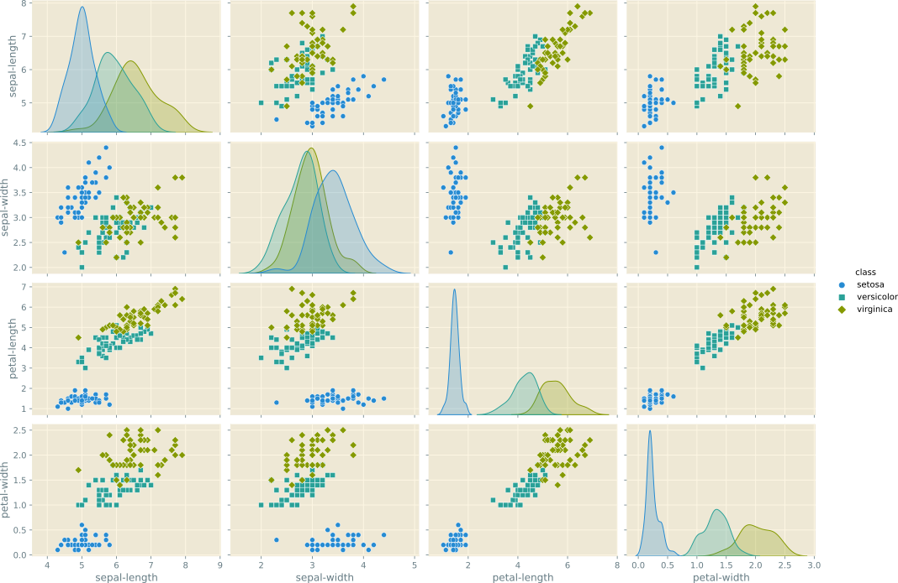

<!-- slide vertical=true data-notes="" -->

##### 数据

---

非结构型数据，包括但不限于

    

        
图片

        
        
    

    

        
文本

        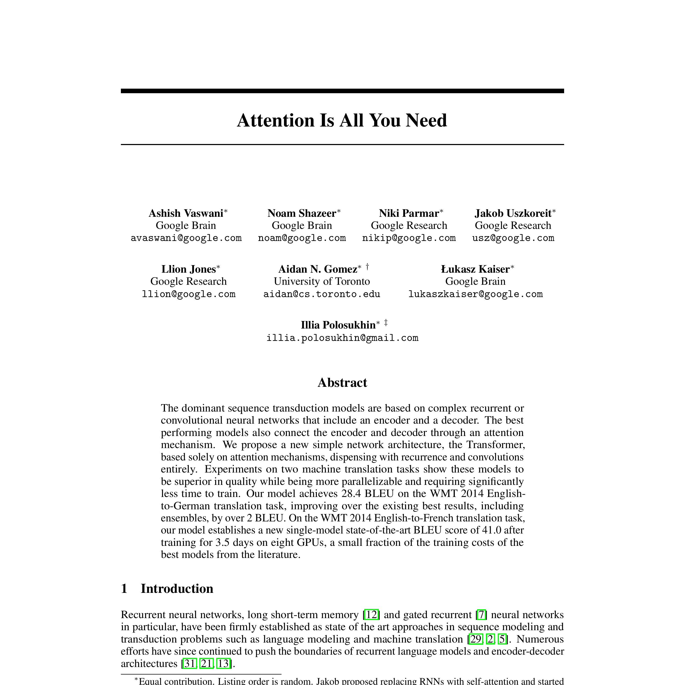
        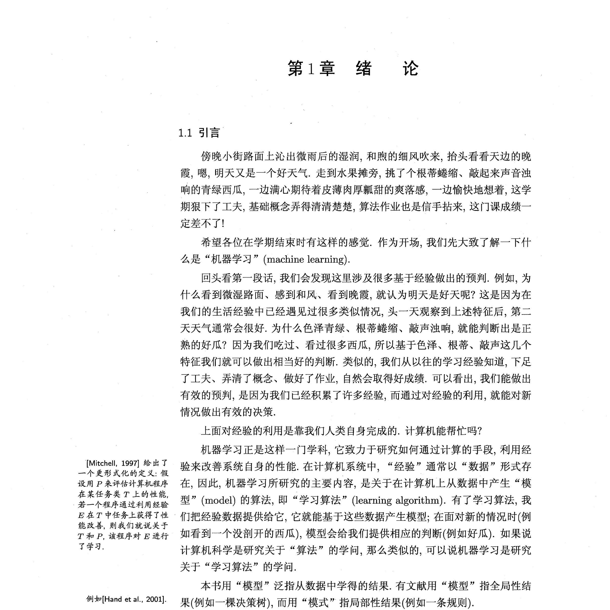
    

    

        
语音

        
        
    

    

        
基因

        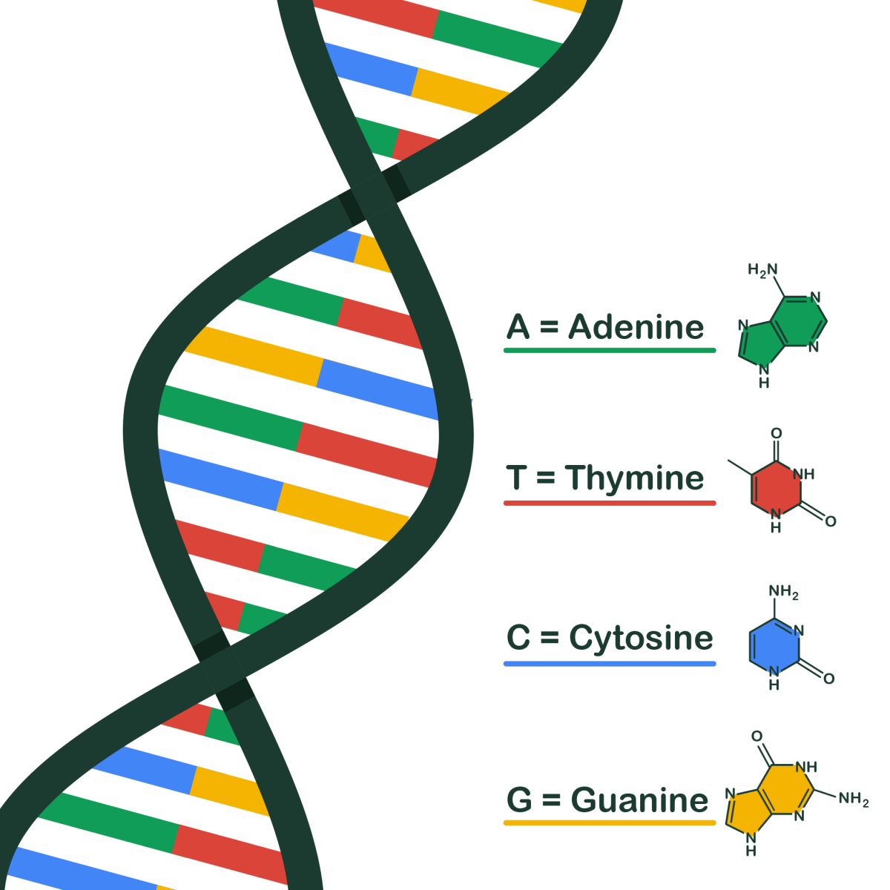
        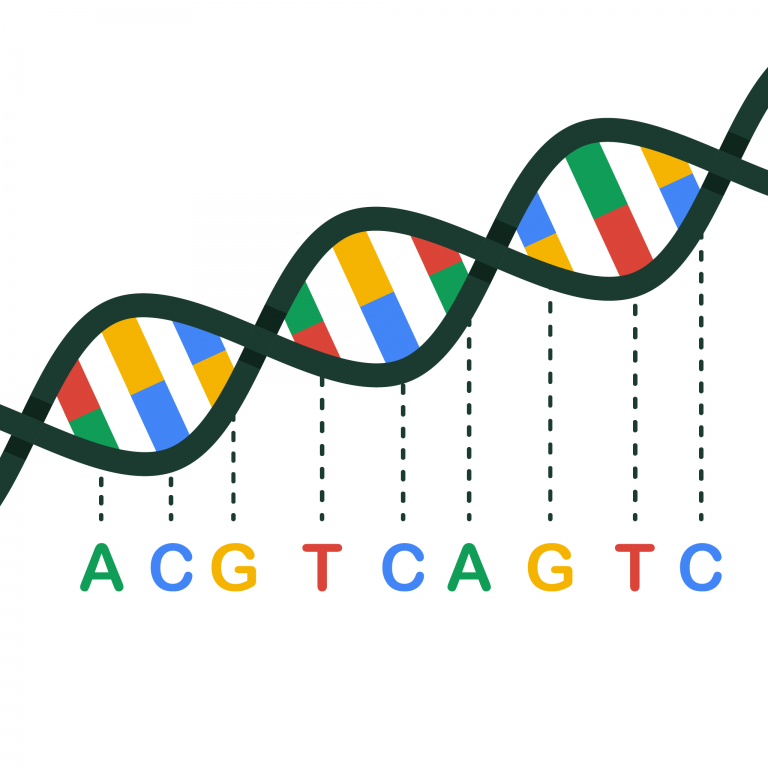
    

<!-- slide data-notes="" -->

##### 监督学习

---

所有样本都有标记

| 原始数据 | 样本/示例/数据点 | 属性/特征/协变量 | 标记/目标 |
| :------: | :--------------: | :--------------: | :-------: |
|  $o_1$   |  $(\xv_1, y_1)$  |     $\xv_1$      |   $y_1$   |
|  $o_2$   |  $(\xv_2, y_2)$  |     $\xv_2$      |   $y_2$   |
| $\vdots$ |     $\vdots$     |     $\vdots$     | $\vdots$  |
|  $o_m$   |  $(\xv_m, y_m)$  |     $\xv_m$      |   $y_m$   |

任务类型：

- 二分类 (binary classification)：$y \in \{ 1, -1 \}$或者$y \in \{ 1, 0 \}$
- 多分类 (multi-class classification)：$y \in [c] \triangleq \{ 1, 2, \ldots, c \}$
- 回归 (regression)：$y \in \rb$或连续集合
- 结构预测：$y$是向量、序列、句法树、……

<!-- slide vertical=true data-notes="" -->

##### 二分类

---

乳腺癌预测：美国威斯康星大学医院 William H. Wolberg 博士及其合作者于 1995 年收集

一共 569 个样本，2 个类别，其中恶性 (212)、良性 (357)

特征从乳腺肿块细针穿刺的数字化图像计算而来，对每张图像中的细胞核计算 radius (半径)、texture (纹理)、perimeter (周长)、area (面积)、smoothness (平滑度)、compactness (紧凑度)、concavity (凹度)、concave points (凹点)、symmetry (对称性)、fractal dimension (分形维数) 等 10 个特征，然后取平均值、标准差、极值，共得到 30 个特征

<!-- slide vertical=true data-notes="" -->

##### 二分类

---

sklearn 集成了该数据集

@import "../python/cancer-info.py" {line_begin=0 line_end=119 .line-numbers .top0 .bottom1 .left4 highlight=[]}

<!-- slide data-notes="" -->

##### 多分类

---

手写数字识别：美国国家标准与技术研究所 (National Institute of Standards and Technology, NIST) 收集，共 10 个类别

- <a href="https://en.wikipedia.org/wiki/MNIST_database" target=_blank>MNIST</a> (Modified NIST) 数据集收集了其中 70000 张图片，其中 60000 张训练、10000 张测试，每张图片为 28 x 28 像素
- <a href="https://archive.ics.uci.edu/datasets" target=_blank>UCI</a> 数据集收集了其中 5620 张图片，其中 3823 张训练、1797 张测试，每张图片为 8 x 8 像素，下图为测试集中的前 40 张图片

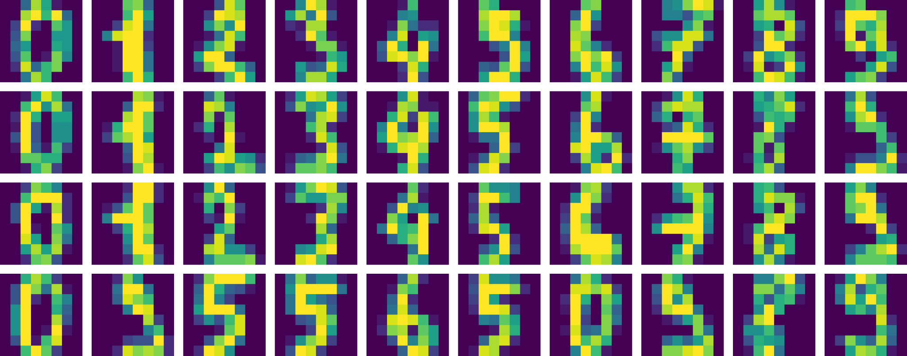

<!-- slide vertical=true data-notes="" -->

##### 多分类

---

sklearn 中的 digits 数据集就是 UCI 数据集中的测试集

@import "../python/digit-info.py" {line_begin=1 line_end=48 .line-numbers .top0 .bottom1 .left4 highlight=[]}

<!-- slide data-notes="" -->

##### 回归

---

糖尿病检测：美国国立糖尿病与消化与肾脏疾病研究所收集，一共 442 个样本，$y$是糖尿病人一年后病情进展的定量测量，每个样本包含 10 个特征：

- 年龄
- 性别
- 身体质量指数
- 平均血压
- 血清总胆固醇
- 低密度脂蛋白
- 高密度脂蛋白
- 总胆固醇 / 高密度脂蛋白
- 血清甘油三酯水平的对数
- 血糖水平

<!-- slide vertical=true data-notes="" -->

##### 回归

---

sklearn 集成了该数据集

@import "../python/diabetes-info.py" {line_begin=0 line_end=119 .line-numbers .top0 .bottom1 .left4 highlight=[]}

<!-- slide data-notes="" -->

##### 结构预测 向量

---

多分类，标量标记经独热编码 (one-hot encoding) 后变成向量

\begin{align}
    0 & \to \ldots 0001 \\
    1 & \to \ldots 0010 \\
    2 & \to \ldots 0100 \\
    3 & \to \ldots 1000 \\
    \vdots & \to \ldots \ldots
\end{align}

多标记学习 (multi-label learning)，用于图片中的多物体识别任务

\begin{align}
    \{ 🐶, 🐱 \} & \to \ldots 00011 \\
    \{ 🐶, 🐔 \} & \to \ldots 00101 \\
    \{ 🐱, 🪿 \} & \to \ldots 01010 \\
    \{ 🐖, 🐔, 🪿 \} & \to \ldots 11100 \\
    \vdots & \to \ldots \ldots
\end{align}

<!-- slide vertical=true data-notes="" -->

##### 结构预测 序列

---

机器翻译：平行语料库

| 中                               | 英                                                                                                       |
| :------------------------------- | :------------------------------------------------------------------------------------------------------- |
| 苟利国家生死以，岂因祸福避趋之。 | Were it to benefit my country, I would lay down my life; What have I to fear when fortune comes or goes? |
| 我跟他谈笑风生。                 | I was chatting with him in a lively and pleasant manner.                                                 |
| 撸起袖子加油干。                 | Roll up our sleeves to work harder.                                                                      |
| 不忘初心，方得始终。             | Never forget why you started, and you can accomplish your mission.                                       |

<!-- slide vertical=true data-notes="" -->

##### 结构预测 序列

---

问答系统：阅读理解、知识竞赛

| 问                                                                                                       | 答                                                                                                                                                                                                                                                 |
| :------------------------------------------------------------------------------------------------------- | :------------------------------------------------------------------------------------------------------------------------------------------------------------------------------------------------------------------------------------------------- |
| 《周鼎传》：公讳鼎，字实甫，自为童子时即以言动自持...自是豪强屏息...，文中“自是豪强屏息”中“屏”的意思是？ | 收敛行迹                                                                                                                                                                                                                                           |
| 什么是基金定投？有什么优缺点？                                                                           | 基金定投是定期定额投资基金的方式。优点包括摊平成本、强制储蓄、享受复利、操作便捷、门槛低；缺点主要是收益慢、可能短期亏损、流动性受限。适合有长期理财需求、不想花太多时间研究市场的投资者，建议选择历史业绩稳健的指数基金或主动管理型基金进行定投。 |

<!-- slide vertical=true data-notes="" -->

##### 结构预测 句法树

---

用于对自然语言的句法分析

- {==S==}：句子
- {==NP==}：名词短语 (noun phrase)
- {==VP==}：动词短语 (verb phrase)
- {==PP==}：介词短语 (prepositional phrase)
- {==N==}：名词
- {==V==}：动词
- {==P==}：介词
- {==U==}：体标记

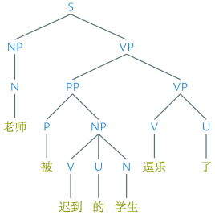

<!-- slide data-notes="" -->

##### 半监督学习

---

只有部分样本有标记，常见于标记获许代价很高的场景，关键问题如何利用未标记样本的分布信息辅助学习？

| 原始数据  | 样本/示例/数据点 | 属性/特征/协变量 | 标记/目标 |
| :-------: | :--------------: | :--------------: | :-------: |
|   $o_1$   |  $(\xv_1, y_1)$  |     $\xv_1$      |   $y_1$   |
| $\vdots$  |     $\vdots$     |     $\vdots$     | $\vdots$  |
|   $o_l$   |  $(\xv_l, y_l)$  |     $\xv_m$      |   $y_l$   |
| $o_{l+1}$ | $(\xv_{l+1}, -)$ |   $\xv_{l+1}$    |    $-$    |
| $\vdots$  |     $\vdots$     |     $\vdots$     | $\vdots$  |
| $o_{l+u}$ | $(\xv_{l+u}, -)$ |   $\xv_{l+u}$    |    $-$    |

任务类型：

- 转导 (transductive) 学习：只需预测$\xv_{l+1}, \ldots, \xv_{l+u}$的标记
- 归纳 (inductive) 学习：必须有显式的模型，能对未见样本进行预测

<!-- slide data-notes="" -->

##### 无监督学习

---

所有样本都没有标记

| 原始数据 | 样本/示例/数据点 | 属性/特征/协变量 | 标记/目标 |
| :------: | :--------------: | :--------------: | :-------: |
|  $o_1$   |   $(\xv_1, -)$   |     $\xv_1$      |    $-$    |
|  $o_2$   |   $(\xv_2, -)$   |     $\xv_2$      |    $-$    |
| $\vdots$ |     $\vdots$     |     $\vdots$     | $\vdots$  |
|  $o_m$   |   $(\xv_m, -)$   |     $\xv_m$      |    $-$    |

任务类型：

- 聚类 (clustering)：依相似度将数据分成若干个簇 (cluster)
- 降维 (dimension reduction)：为样本学习更好的特征表示
- 密度估计 (density estimation)：估计数据所来自的概率分布$p(\xv)$

<!-- slide vertical=true data-notes="" -->

##### 聚类

---

最具代表性的是$k$-均值 ($k$-means) 算法，其中$k$是目标簇数，需事先指定 (算法的输入)

基本想法：设数据聚成$k$个簇$\cc_1, \ldots, \cc_k$，每个样本都恰属于某一个簇，每个样本到所在簇簇中心的距离小于与其它簇中心的距离

优化问题：$\min_{\muv_i} \sum_{i \in [k]} \sum_{\xv \in \cc_i} \| \xv - \muv_i \|_2^2, ~ \st ~ \muv_i = \sum_{\xv \in \cc_i} \xv / |\cc_i|.$

求解算法：随机初始化$k$个簇中心，重复以下两步直至收敛：

1. 将每个样本分配到距其最近的簇中心
2. 更新每个簇的中心

 $k$-均值的名称由 James MacQueen 于 1967 年首次使用，但其思想可追溯到 1957 年的 Hugo Steinhaus，上述求解算法最初在 1957 年由贝尔实验室的 Stuart Lloyd 作为一种脉冲码调制技术提出，但直到 1982 年才公开发表，最终结果是优化问题的局部最优解 (不是全局最优) 且受簇中心的初始化影响，1965 年Edward W. Forgy 发表了本质上相同的方法，故该算法有时也称为 Lloyd–Forgy 方法

<!-- slide vertical=true data-notes="" -->

##### 聚类

---

从 6 个中心随机生成、各向同性、标准差为 1 的正态分布里各采样 2000 个样本，并指定聚成 4 个簇

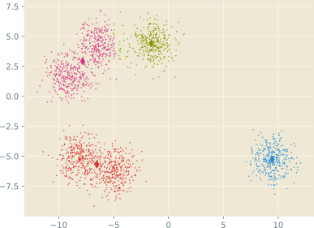

<!-- slide data-notes="" -->

##### 降维

---

- 输入：$\rb^D$中的$m$个点，写成矩阵的形式$\Xv \in \rb^{m \times D}$
- 输出：$\Xv \Wv \in \rb^{m \times d}$，其中$\Wv = [\wv_1, \ldots, \wv_d] \in \rb^{D \times d}$为投影矩阵、所有列为相互正交的单位向量、$d < D$

\begin{align}
    \Xv \in \rb^{m \times D} \xrightarrow[降维]{\Wv \in \rb^{D \times d}} \Xv \Wv \in \rb^{m \times d} \xrightarrow[重构]{\Wv^\top \in \rb^{d \times D}} \Xv \Wv \Wv^\top \in \rb^{m \times D}
\end{align}

主成分分析 ({==p==}rincipal {==c==}omponents {==a==}nalysis, PCA) 目标为{==最小化重构误差==}

\begin{align}
    \min_{\Wv} \| \Xv - \Xv \Wv \Wv^\top \|_F^2, \quad \st ~ \Wv^\top \Wv = \Iv.
\end{align}

 PCA 由 Karl Pearson 于 1901 年提出，之后在 1930 年左右由 Harold Hotelling 独立发展并命名，在力学中叫主轴定理 (principal axis theorem)，在信号处理中叫做离散 K-L 转换 (discrete Karhunen–Loève transform, KLT)

<!-- slide vertical=true data-notes="" -->

##### 降维

---

输入为$\rb^2$中 500 个点，服从正态分布 (等高线为一族椭圆)，$\rb^2 \mapsto \rb$重构误差最小的投影方向 (主成分) 是椭圆的长轴

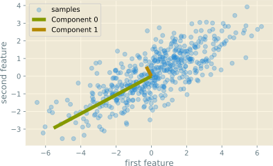

<!-- slide data-notes="" -->

##### 密度估计 直方图

---

选定 bin 的起始点和宽度，统计样本落在每个 bin 中的个数，再归一化就是概率密度

20 个样本，其中 6 个采样自$\nc(0,1)$，14 个采样自$\nc(0,5)$

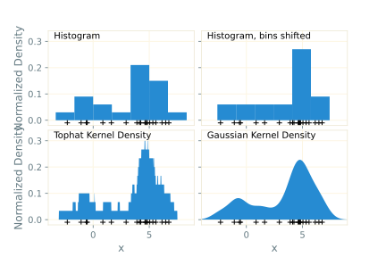

由上图可见直方图估计对 bin 的选取很敏感

<!-- slide vertical=true data-notes="" -->

##### 密度估计 直方图

---

假设某个 bin 为区间$\ic = [x-h, x+h]$，则点$x$处的概率估计为

\begin{align}
    p(x) = \frac{1}{mh} \sum_{i \in [m]} \frac{1}{2} \ib \left( \left| \frac{x - x_i}{h} \right| \le 1 \right) = \frac{1}{mh} \sum_{i \in [m]} \kappa \left( \frac{x - x_i}{h} \right)
\end{align}

其中$\ib(\cdot)$是指示函数 (indicator function)、$\kappa(u) = \frac{1}{2} \ib(|u| \le 1)$

直方图估计有两个问题

1. 不平滑，指示函数不连续、不可导
2. 误差大，不同$x_i$与$x$的距离不同，重要性理应不同，例如若希望$x_i$的重要性随着与$x$的距离增加而线性减小，则需修改$\kappa$为

\begin{align}
    \kappa(u) = \underbrace{(1 - |u|)}_{重要性权重} \ib(|u| \le 1) = \left( 1 - \left| \frac{x - x_i}{h} \right| \right) \ib \left( \left| \frac{x - x_i}{h} \right| \le 1 \right)
\end{align}

<!-- slide vertical=true data-notes="" -->

##### 密度估计 核函数

---

类似$\kappa(u) = (1 - |u|) \ib(|u| \le 1)$之类关于$0$中心对称的非负函数称为核函数 (kernel function)，对应的估计为核密度估计 (kernel density estimation, KDE)

|      核      |                          $\kappa(u)$                          |
| :----------: | :-----------------------------------------------------------: |
|    tophat    |             $\frac{1}{2} \ib( \shu u \shu \le 1)$             |
|    linear    |          $(1 - \shu u \shu) \ib(\shu u \shu \le 1)$           |
| epanechnikov |        $\frac{3}{4} (1 - u^2) \ib(\shu u \shu \le 1)$         |
|    cosine    | $\frac{\pi}{4} \cos (\frac{\pi}{2} u) \ib(\shu u \shu \le 1)$ |
|   gaussian   |       $\frac{1}{\sqrt{2 \pi}} \exp (-\frac{1}{2} u^2)$        |
| exponential  |              $\frac{1}{2} \exp (- \shu u \shu)$               |

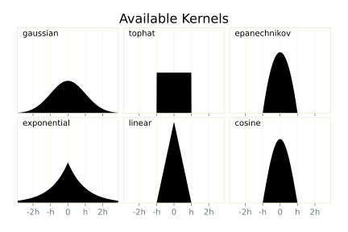

 sklearn 提供了上面 6 种核函数，此外$\frac{15}{16} (1 - u^2)^2 \ib(|u| \le 1)$、$\frac{35}{32} (1 - u^2)^3 \ib(|u| \le 1)$也是常用核函数

<!-- slide vertical=true data-notes="" -->

##### 密度估计 核函数

---

100 个样本，其中 30 个采样自$\nc(0,1)$，70 个采样自$\nc(0,5)$

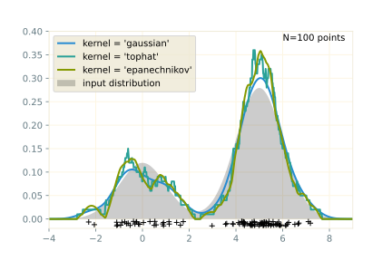

<!-- slide data-notes="" -->

##### 其他学习任务

---

强化学习 (reinforcement learning)：研究智能体 (agent) 在环境 (environment) 中如何根据状态 (state) 采取行动 (action) 以最大化期望收益 (reward)

- 智能体：炒股机器人
- 环境：股票市场
- 状态：股票价格、手中筹码、剩余资金
- 行动：买/卖股票
- 收益：赚钱就是正收益，赔钱就是负收益

迁移学习 (transfer learning)：假设在旧任务上已经学得一个模型，如何利用该模型辅助新任务的学习，任务间的相似度很关键

- 旧任务：C++，新任务：Python

 受课时所限，本课程不会涉及这些机器学习任务，前者可单独作为一门课程，后者也至少需要 2-3 周的研讨班，此外还有主动学习 (active learning)、元学习 (meta learning) 等，不一而足

<!-- slide data-notes="" -->

##### 机器学习方法分类

---

米哈尔斯基 等《机器学习：一种人工智能途径》 _Machine Learning: An Artificial Intelligence Approach_, 1983

- 从样本中学习
- 在问题求解和规划中学习
- 通过观察和发现学习
- 从指令中学习

费根鲍姆 等《人工智能手册》 _The Handbook of Artificial Intelligence_, 1983

- 机械学习，死记硬背式学习，信息存储检索
- 示教学习，类似于“从指令中学习”
- 类比学习，类似于“通过观察和发现学习”
- {==归纳学习==}，类似于“从样本中学习”，目前研究最多、应用最广

<!-- slide vertical=true data-notes="" -->

##### 机器学习方法分类

---

佩德罗·多明戈斯于 2015 年在《终极算法》中提出

- 符号学派：规则学习，决策树
- 连接学派：感知机，神经网络
- {--进化学派--}
- 统计学派：朴素贝叶斯，贝叶斯网
- 类推学派：k-近邻，支持向量机

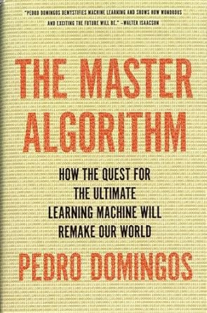

 佩德罗·多明戈斯，Pedro Domingos，华盛顿大学计算机科学与工程学院终身名誉教授，以研究能进行不确定推断的马尔可夫逻辑网而在机器学习领域闻名，2015 年出版 <i>The Master Algorithm</i> 一书，中文译作《终极算法》

<!-- slide data-notes="" -->

##### 约会问题

---

| 次序 | 时间 | 方式 | 天气 | 课业 | 疫情 | 电视 | 约会 |
| :--: | :--: | :--: | :--: | :--: | :--: | :--: | :--: |
|  1   | 周六 | 吃饭 | 晴天 | 轻松 | 清零 | 精彩 |  是  |
|  6   | 周六 | 逛街 | 晴天 | 轻松 | 平缓 | 无聊 |  是  |
|  10  | 周六 | 学习 | 雨天 | 轻松 | 严峻 | 无聊 |  否  |
|  13  | 周六 | 逛街 | 晴天 | 适中 | 清零 | 精彩 |  否  |
|  14  | 周间 | 逛街 | 阴天 | 适中 | 清零 | 精彩 |  ?   |

### 约还是不约，让{==机器学习==}来拯救你

<!-- slide vertical=true data-notes="" -->

##### 符号学派

---

| 次序 | 时间 | 方式 | 天气 | 课业 | 疫情 | 电视 | 约会 |
| :--: | :--: | :--: | :--: | :--: | :--: | :--: | :--: |
|  1   | 周六 | 吃饭 | 晴天 | 轻松 | 清零 | 精彩 |  是  |
|  6   | 周六 | 逛街 | 晴天 | 轻松 | 平缓 | 无聊 |  是  |
|  10  | 周六 | 学习 | 雨天 | 轻松 | 严峻 | 无聊 |  否  |
|  13  | 周六 | 逛街 | 晴天 | 适中 | 清零 | 精彩 |  否  |
|  14  | 周间 | 逛街 | 阴天 | 适中 | 清零 | 精彩 |  ?   |

用 {==if-then==} 形式的{==合取规则==}尽可能地概括正样本

\begin{align}
    是 \longleftarrow (天气 = 晴天) \wedge (课业 = 轻松)
\end{align}

- 可解释强，人类可以秒懂
- 将规则集合组织成树的形式即为{==决策树==} (decision tree)

<!-- slide vertical=true data-notes="" -->

##### 连接学派

---

| 次序 | 时间 | 方式 | 天气 | 课业 | 疫情 | 电视 | 约会 |
| :--: | :--: | :--: | :--: | :--: | :--: | :--: | :--: |
|  1   | 周六 | 吃饭 | 晴天 | 轻松 | 清零 | 精彩 |  是  |
|  6   | 周六 | 逛街 | 晴天 | 轻松 | 平缓 | 无聊 |  是  |
|  10  | 周六 | 学习 | 雨天 | 轻松 | 严峻 | 无聊 |  否  |
|  13  | 周六 | 逛街 | 晴天 | 适中 | 清零 | 精彩 |  否  |
|  14  | 周间 | 逛街 | 阴天 | 适中 | 清零 | 精彩 |  ?   |

用{==感知机==} (perceptron) 拟合数据

\begin{align}
    \{1, -1\} \longleftarrow \sign(w_0 + w_1 \cdot 次序 + \cdots + w_7 \cdot 电视)
\end{align}

- 数据中的知识体现为感知机的参数$w_0, w_1, \ldots, w_7$
- 将大量感知机并行串联就是{==神经网络==} (neural network)

<!-- slide vertical=true data-notes="" -->

##### 统计学派

---

| 次序 | 时间 | 方式 | 天气 | 课业 | 疫情 | 电视 | 约会 |
| :--: | :--: | :--: | :--: | :--: | :--: | :--: | :--: |
|  1   | 周六 | 吃饭 | 晴天 | 轻松 | 清零 | 精彩 |  是  |
|  6   | 周六 | 逛街 | 晴天 | 轻松 | 平缓 | 无聊 |  是  |
|  10  | 周六 | 学习 | 雨天 | 轻松 | 严峻 | 无聊 |  否  |
|  13  | 周六 | 逛街 | 晴天 | 适中 | 清零 | 精彩 |  否  |
|  14  | 周间 | 逛街 | 阴天 | 适中 | 清零 | 精彩 |  ?   |

利用{==贝叶斯公式==}求{==后验==} (posterior)

\begin{align}
    p (约会 \mid 次序, 时间, \ldots, 电视) = \frac{p(次序, 时间, \ldots, 电视 \mid 约会) ~ p(约会)}{p(次序, 时间, \ldots, 电视)}
\end{align}

- $p (约会)$为{==先验==} (prior)，反映在没有任何信息的情况下对约会的信念
- 数据通过{==似然==} (likelihood) $p(次序, \ldots, 电视 \mid 约会)$调整对约会的信念

<!-- slide vertical=true data-notes="" -->

##### 类推学派

---

| 次序 | 时间 | 方式 | 天气 | 课业 | 疫情 | 电视 | 约会 |
| :--: | :--: | :--: | :--: | :--: | :--: | :--: | :--: |
|  1   | 周六 | 吃饭 | 晴天 | 轻松 | 清零 | 精彩 |  是  |
|  6   | 周六 | 逛街 | 晴天 | 轻松 | 平缓 | 无聊 |  是  |
|  10  | 周六 | 学习 | 雨天 | 轻松 | 严峻 | 无聊 |  否  |
|  13  | 周六 | 逛街 | 晴天 | 适中 | 清零 | 精彩 |  否  |
|  14  | 周间 | 逛街 | 阴天 | 适中 | 清零 | 精彩 |  ?   |

引入{==相似度==}函数$s(\cdot, \cdot)$和样本{==权重==}$\alpha$

\begin{align}
    \{1, -1\} \longleftarrow \sign(\alpha_1 \cdot s(\xv_1, \xv_5) \cdot y_1 + \cdots + \alpha_4 \cdot s(\xv_4, \xv_5) \cdot y_4)
\end{align}

- $\class{blue}{k}${==-近邻==}：$s(\cdot, \cdot)$为欧氏距离，最近的$k$个样本权重为$1/s$，其余为$0$
- {==支持向量机==}：$s(\cdot, \cdot)$为核函数，权重为对偶问题的拉格朗日乘子变量

<!-- slide data-notes="" -->

##### 百家争鸣

---

Q：哪个算法更好？

A：不存在最强的算法，否则机器学习课把最强算法一讲就可以结课了

假设$\xv \in \{ 0,1 \}^2$、$y \in \{0,1\}$

| $x_1$ | $x_2$ | $y$ |  薛吒  |  薛跋  |  薛深  |
| :---: | :---: | :-: | :----: | :----: | :----: |
|   0   |   0   |  0  | 抛硬币 | 决策树 | 感知机 |
|   1   |   1   |  1  |   ^    |   ^    |   ^    |
|   1   |   0   |  ?  |   ^    |   ^    |   ^    |
|   0   |   1   |  ?  |   ^    |   ^    |   ^    |

<!-- slide vertical=true data-notes="" -->

##### 百家争鸣

---

| $x_1$ | $x_2$ | $y$ |              薛吒              |            薛跋            |                     薛深                     |
| :---: | :---: | :-: | :----------------------------: | :------------------------: | :------------------------------------------: |
|   0   |   0   |  0  | $ \sgn(\mathrm{rand}() - 0.5)$ | $ x_1 = 1 \wedge x_2 = 1 $ | $ \sgn(0.7 \cdot x_1 + 0.3 \cdot x_2 - 0.5)$ |
|   1   |   1   |  1  |               ^                |             ^              |                      ^                       |
|   1   |   0   |  ?  |               1                |             0              |                      1                       |
|   0   |   1   |  ?  |               1                |             0              |                      0                       |

|    真实模型    | $\yv$ |    薛吒    |    薛跋    |    薛深    |
| :------------: | :---: | :--------: | :--------: | :--------: |
| $x_1 \cup x_2$ | 1、1  | 全对，完胜 | 全错，完败 | 对一，错一 |
| $x_1 \cap x_2$ | 0、0  | 全错，完败 | 全对，完胜 | 对一，错一 |
|     $x_1$      | 1、0  | 对一，错一 | 对一，错一 | 全对，完胜 |
|     $x_2$      | 0、1  | 对一，错一 | 对一，错一 | 全错，完败 |

若四个真实模型出现概率相同，则所有算法期望表现相同

 $\sgn(正数) = 1$、$\sgn(负数) = 0$、$\sgn(\cdot) = (\sign(\cdot) + 1)/2$

<!-- slide data-notes="" -->

##### 没有免费的午餐

---

前页的结果并非偶然，在对真实模型一无所知 (只能假设等概率出现) 的情况下，所有算法的期望错误率均为$1/2$，与随便猜等同，这称为没有免费的午餐 (no free lunch, NFL) 定理

设数据集$D \subseteq (\xc \times \{0,1\})^m$，其中$\xc$是{==离散==}的，$p(f \mid A, D)$为算法$A$基于$D$产生模型$f$的概率

模型集合$\gc = \{ \xc \mapsto \{0,1\} \}$，易知$|\gc| = 2^{|\xc|}$

给定$g \in \gc$为真实模型，则算法$A$的期望预测错误率为

\begin{align}
    E (A \mid D, g) = \eb_\xv \int_f \ib(f(\xv) \ne g(\xv)) \cdot p(f \mid A, D) ~ \diff f
\end{align}

 模型集合$\gc$在机器学习理论中称为假设空间 (hypothesis space)

<!-- slide vertical=true data-notes="" -->

##### 没有免费的午餐

---

假设$\gc$中模型为真实模型的概率均为$1 / |\gc|$，则算法$A$的期望预测错误率

\begin{align}
    \sum_g \frac{E (A \mid D, g)}{|\gc|} & = \sum_g \frac{1}{|\gc|} \eb_\xv \int_f \ib(f(\xv) \ne g(\xv)) \cdot p(f \mid A, D) ~ \diff f \\
    & = \eb_\xv \int_f p(f \mid A, D) \frac{1}{|\gc|} \class{blue}{\sum_g \ib(f(\xv) \ne g(\xv))} ~ \diff f \\
    & = \eb_\xv \int_f \frac{p(f \mid A, D)}{2} ~ \diff f = \eb_\xv \frac{1}{2} = \frac{1}{2}
\end{align}

其中$\sum_g \ib(f(\xv) \ne g(\xv)) = |\gc| / 2$是因为$\xc$是离散的，对任意$\xv \in \xc$，$\gc$中的$2^{|\xc|}$个模型恰有一半预测$\xv$为正、一半预测$\xv$为负

<!-- slide vertical=true data-notes="" -->

##### 没有免费的午餐

---

NFL 定理的启示：脱离具体的任务空谈什么算法好没有意义！

乘出租车 vs. 骑电瓶车

- 若任务是周末从华科去黄鹤楼，那算法“乘出租车”好
- 若任务是课后从西十二去西一食堂，那算法“骑电瓶车”好

NFL 定理假设了$g$的等可能性，但根据已有数据其实可以确定假设空间中部分模型为真实模型的可能性较高、而另一些则较低，因此学习算法自身的偏倚 (bias) 应与任务 (数据) 相匹配

<!-- slide data-notes="" -->

##### 评估 回归

---

给定模型$f: \xc \mapsto \rb$、数据集$D = \{ (\xv_i, y_i) \}_{i \in [m]}$，回归任务最常用的评估指标{==均方损失==} ({==m==}ean {==s==}quared {==e==}rror, MSE) 定义为

\begin{align}
    E_D (f) = \frac{1}{m} \sum_{i \in [m]} (f(\xv_i) - y_i)^2
\end{align}

除此之外，以下损失也常用于回归任务

- 均方根损失 ({==r==}oot {==MSE==}, RMSE)：$\sqrt{\frac{1}{m} \sum_{i \in [m]} (f(\xv_i) - y_i)^2}$
- 平均绝对损失 ({==m==}ean {==a==}bsolute {==e==}rror, MAE)：$\frac{1}{m} \sum_{i \in [m]} |f(\xv_i) - y_i|$
- Huber 损失：$\frac{1}{m} \sum_{i \in [m]} \begin{cases} (f(\xv_i) - y_i)^2, & |f(\xv_i) - y_i| \le \delta \\ 2 \delta (|f(\xv_i) - y_i| - \delta/2), & |f(\xv_i) - y_i| > \delta \end{cases}$
- 支持向量损失：$\frac{1}{m} \sum_{i \in [m]} \begin{cases} 0, & |f(\xv_i) - y_i| \le \delta \\ |f(\xv_i) - y_i| - \delta, & |f(\xv_i) - y_i| > \delta \end{cases}$

<!-- slide vertical=true data-notes="" -->

##### 评估 二分类

---

给定模型$f: \xc \mapsto \rb$、数据集$D = \{ (\xv_i, y_i) \}_{i \in [m]}$，$y_i \in \{1,-1\}$，分类任务最常用的评估指标{==错误率==} (error rate) 定义为

\begin{align}
    E_D (f) = \frac{1}{m} \sum_{i \in [m]} \ib (y_i f(\xv_i) < 0)
\end{align}

此外$\acc_D (f) = 1 - E_D (f)$为{==准确率==} (accuracy)

错误率也称为 0-1 损失，不连续、难优化，常用以下替代损失

- 对率损失：$\frac{1}{m} \sum_{i \in [m]} \ln (1 + \exp( - y_i f(\xv_i)))$，用于对率损失
- 指数损失：$\frac{1}{m} \sum_{i \in [m]} \exp (- y_i f(\xv_i))$，用于 AdaBoost
- 合页 (hinge) 损失：$\frac{1}{m} \sum_{i \in [m]} \max \{ 0, 1 - y_i f(\xv_i) \}$，用于支持向量机
- 平方合页损失：$\frac{1}{m} \sum_{i \in [m]} (\max \{ 0, 1 - y_i f(\xv_i) \})^2$，用于支持向量机

<!-- slide data-notes="" -->

##### 混淆矩阵

---

只看准确率有时不够全面

- {==类别不平衡==}：对某种传染病做预测，数据集中阳性 1%、阴性 99%，此时无脑预测阴性也有 99% 的准确率，但对于疾病预测完全没用
- {==误分类代价差别大==}：将阴性预测为阳性会导致该病人接受进一步的检查，将阳性预测为阴性会导致潜在的大面积疾病传播

二分类结果的混淆矩阵 (confusion matrix)

|             |  预测 正样本   |  预测 负样本   |
| :---------: | :------------: | :------------: |
| 真实 正样本 | $\TP$ (真正例) | $\FN$ (假反例) |
| 真实 负样本 | $\FP$ (假正例) | $\TN$ (真反例) |

需要更精细的评估指标

\begin{align}
    准确率 = \frac{\TP + \TN}{\TP + \TN + \FP + \FN}
\end{align}

<!-- slide vertical=true data-notes="" -->

##### 查准率 查全率

---

|             |  预测 正样本   |  预测 负样本   |
| :---------: | :------------: | :------------: |
| 真实 正样本 | $\TP$ (真正例) | $\FN$ (假反例) |
| 真实 负样本 | $\FP$ (假正例) | $\TN$ (真反例) |

- {==查准率==} (precision)：$\frac{\TP}{\TP + \FP}$，预测的正样本中有多少是正样本
- {==查全率==} (recall)：$\frac{\TP}{\TP + \FN}$，所有正样本中有多少被预测出来了

查准率、查全率是一对矛盾的指标，单看其中一个没意义

<ol class="fragment" data-fragment-index="1">
    <li>若想尽可能筛出阳性病例，就尽量多选，这样查全率高、但查准率较低</li>
    <li>若想筛出的病例中阳性占比高，就只选有把握的，这样查准率高、但查全率较低</li>
</ol>

 precision、recall 也有人译作精确率、召回率，个人觉得没有查准率、查全率好

<!-- slide vertical=true data-notes="" -->

##### 查准查全曲线

---

对于可以输出预测值的模型，可以将所有样本按模型的输出排序，前面的最可能是正样本，后面的最不可能是正样本，分类的过程就是在排序中寻找“截断点”，通过调整截断点可以得到一系列查准率、查全率，连线后就是查准查全曲线

模型 A 优于模型 B

- A 的曲线完全在 B 的右上方
- A 的曲线下面积大于 B
- A 的曲线与$P=R$的交点 (平衡点) 更大

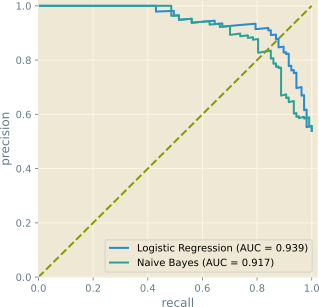

 曲线下面积缩写为 AUC (area under curve)

<!-- slide data-notes="" -->

##### F1 分数

---

查准查全曲线下面积不太容易算，平衡点过于简单

更常用的是查准率、查全率的调和平均，称为$F_1$

\begin{align}
    \mathrm{F_1} = 2 \bigg/ \left( \frac{1}{P} + \frac{1}{R} \right) = 2 \bigg/ \frac{2 \cdot \TP + \FP + \FN}{\TP} = \frac{2 \cdot \TP}{样本数 + \TP - \TN}
\end{align}

若对查准率、查全率的重视程度不同

<ul class="fragment" data-fragment-index="1">
    <li>曹操：宁教我负天下人，休教天下人负我</li>
    <li>蒋汪：宁可错杀三千，不可放过一个</li>
</ul>

\begin{align}
    \mathrm{F_\beta} = (1+\beta^2) \bigg/ \left( \frac{1}{P} + \frac{\beta^2}{R} \right) = \frac{(1 + \beta^2) \cdot P \cdot R}{\beta^2 \cdot P + R}
\end{align}

 根据$平方平均 \ge 算术平均 \ge 几何平均 \ge 调和平均$，$F_1$最重视较小值

<!-- slide data-notes="" -->

##### ROC 曲线

---

ROC 曲线与查准查全曲线类似，只不过纵横轴不同

- 纵轴为{==真正例率==} (true positive rate, TPR)，正类被预测对的比例
- 横轴为{==假正例率==} (false positive rate, FPR)，负类被预测错的比例

\begin{align}
    \mathrm{TPR} = \frac{\TP}{\TP+\FN}, \quad \mathrm{FPR} = \frac{\FP}{\TN+\FP}
\end{align}

模型 A 优于模型 B

- A 的曲线完全在 B 的左上方
- A 的曲线下面积大于 B

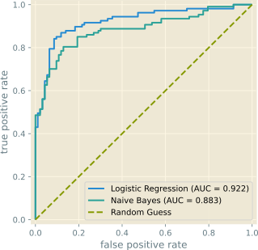

 ROC (receiver operating characteristic) 曲线全称是“受试者工作特征”曲线，源于二战中用于敌机检测的雷达信号分析技术，上世纪六七十年代开始被用于心理学、医学检测中，后被引入机器学习领域

<!-- slide vertical=true data-notes="" -->

##### ROC 曲线

---

设正样本数$m^+$、负样本数$m^-$，所有样本按模型的预测值排序

ROC 曲线从左下角$(0,0)$开始绘制，设当前绘制点为$(x,y)$

- 真正例，新的绘制点为$(x, y + \frac{1}{m^+})$
- 假正例，新的绘制点为$(x + \frac{1}{m^-}, y)$

根据绘制过程可知

\begin{align}
    \mathrm{AUC} = \frac{1}{m^+ m^-} \sum_{x^+} \sum_{x^-} \left( \ib (f(x^+) > f(x^-)) + \frac{1}{2} \ib (f(x^+) = f(x^-)) \right)
\end{align}

ROC 曲线 vs. 查准查全曲线

- 前者更重视样本预测的排序质量
- 后者更重视类别不平衡时对小类的预测

<!-- slide data-notes="" -->

##### 评估 多分类

---

多分类同样有错误率、准确率

\begin{align}
    E_D (f) = \frac{1}{m} \sum_{i \in [m]} \ib (y_i \ne f(\xv_i)), \quad \acc_D (f) = 1 - E_D (f)
\end{align}

以及混淆矩阵

|             | 预测第$1$类 | 预测第$2$类 | &emsp;&emsp; ... &emsp;&emsp; | 预测第$c$类 |
| :---------: | :---------: | :---------: | ----------------------------- | ----------- |
| 真实第$1$类 |   &emsp;    |   &emsp;    | &emsp;                        | &emsp;      |
| 真实第$2$类 |   &emsp;    |   &emsp;    | &emsp;                        | &emsp;      |
|     ...     |   &emsp;    |   &emsp;    | &emsp;                        | &emsp;      |
| 真实第$c$类 |   &emsp;    |   &emsp;    | &emsp;                        | &emsp;      |

<!-- slide vertical=true data-notes="" -->

##### 评估 交叉熵损失

---

错误率不连续、难优化，通常采用交叉熵 (cross-entropy) 损失

设$c$个类别的预测函数分别为$f_1, \ldots, f_c$，则样本$x$的预测结果为

\begin{align}
    \pv = \left[ \frac{e^{f_1(x)}}{\sum_{j \in [c]} e^{f_i(x)}}, \frac{e^{f_2(x)}}{\sum_{j \in [c]} e^{f_i(x)}}, \ldots, \frac{e^{f_c(x)}}{\sum_{j \in [c]} e^{f_i(x)}} \right] \quad \longleftarrow \softmax
\end{align}

这是一个$c$维向量，同时也是一个离散概率分布

类标记$y$可转化为独热编码$\ev_y$，这也是一个$c$维离散概率分布

替代损失的要求：关于$\pv$、$\ev_y$连续，且$\pv$、$\ev_y$越接近损失越小

问题：给定离散概率分布$\qv$，如何度量分布$\pv$与它的距离？

<!-- slide vertical=true data-notes="" -->

##### 评估 交叉熵损失

---

交叉熵$H_{\qv} (\pv) \triangleq - \sum_i q_i \ln p_i$

当$\pv = \qv$时交叉熵最小，此时交叉熵$H_{\qv} (\pv)$即为分布$\qv$的熵$H(\qv)$

\begin{align}
    \min_{\pv} H_{\qv} (\pv) = - \sum_i q_i \ln p_i, \quad \st ~ \sum_i p_i = 1
\end{align}

拉格朗日函数为$L(p_i, \alpha) = - \sum_i q_i \ln p_i + \alpha (\sum_i p_i - 1)$，于是

\begin{align}
    \nabla_{p_i} L(p_i, \alpha) & = - \frac{q_i}{p_i} + \alpha = 0 \Longrightarrow q_i = \alpha p_i \\
    & \Longrightarrow \sum_i q_i = \alpha \sum_i p_i \Longrightarrow \alpha = 1 \Longrightarrow \pv = \qv
\end{align}

对$(x,y)$，$y \in [c]$，交叉熵损失为$- \ln \frac{e^{f_y(x)}}{\sum_{j \in [c]} e^{f_i(x)}}$

<!-- slide vertical=true data-notes="" -->

##### 评估 交叉熵损失

---

对$(x,y)$，$y \in \{1, -1\}$，$\qv = [(1+y)/2; (1-y)/2]$，交叉熵损失为

\begin{align}
    \mathrm{CE} & = - \frac{1+y}{2} \ln \frac{e^{f_1(x)}}{e^{f_1(x)}+e^{f_2(x)}} - \frac{1-y}{2} \ln \frac{e^{f_2(x)}}{e^{f_1(x)}+e^{f_2(x)}} \\
    & = - \frac{1+y}{2} \ln \frac{e^{f_1(x)-f_2(x)}}{e^{f_1(x)-f_2(x)}+1} - \frac{1-y}{2} \ln \frac{1}{e^{f_1(x)-f_2(x)}+1} \\
    & = - \frac{1+y}{2} \ln \frac{e^{w(x)}}{e^{w(x)}+1} - \frac{1-y}{2} \ln \frac{1}{e^{w(x)}+1} \quad \leftarrow w(x) \triangleq f_1(x)-f_2(x) \\
    & = \begin{cases}
        \ln (1 + e^{-w(x)}), & y = 1 \\
        \ln (1 + e^{-w(x)}), & y = -1
    \end{cases} \\
    & = \ln (1 + e^{- y w(x)})
\end{align}

由此可见，多分类的交叉熵损失就是二分类的对率损失的拓展

<!-- slide data-menu-title="sklearn中的性能度量" data-background-iframe="https://scikit-learn.org/stable/modules/model_evaluation.html" vertical=true data-background-interactive data-notes="" -->
