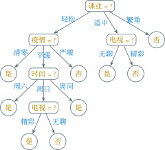
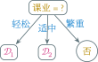
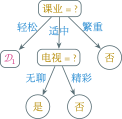
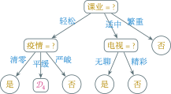
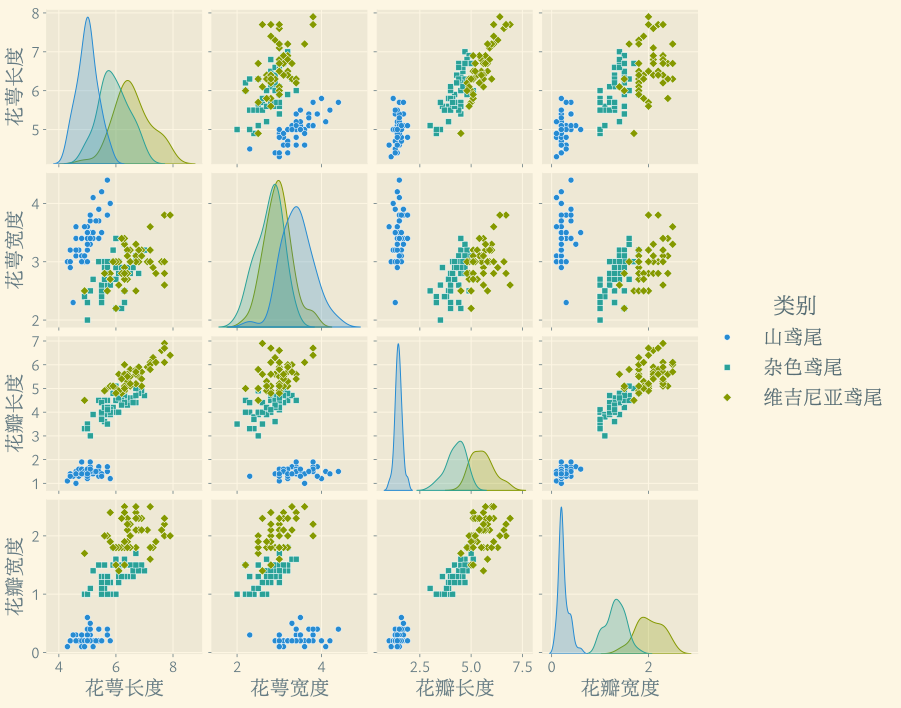
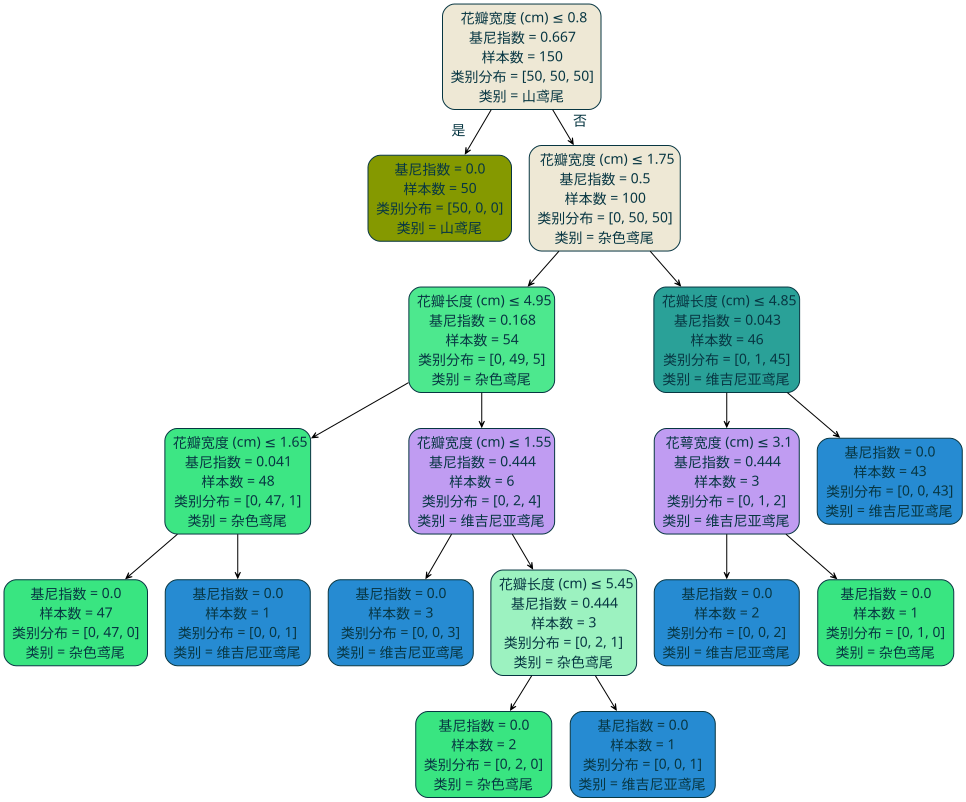
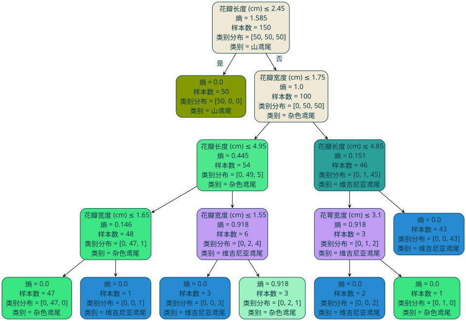

---
presentation:
  margin: 0
  center: false
  transition: "none"
  enableSpeakerNotes: true
  slideNumber: "c/t"
  navigationMode: "linear"
---

@import "../css/font-awesome-4.7.0/css/font-awesome.css"
@import "../css/theme/solarized.css"
@import "../css/logo.css"
@import "../css/font.css"
@import "../css/color.css"
@import "../css/margin.css"
@import "../css/table.css"
@import "../css/main.css"
@import "../plugin/zoom/zoom.js"
@import "../plugin/notes/notes.js"
@import "../plugin/customcontrols/plugin.js"
@import "../plugin/customcontrols/style.css"
@import "../plugin/chalkboard/plugin.js"
@import "../plugin/chalkboard/style.css"
@import "../plugin/reveal.js-menu/menu.js"
@import "../js/anychart/anychart-core.min.js"
@import "../js/anychart/anychart-venn.min.js"
@import "../js/anychart/pastel.min.js"
@import "../js/anychart/venn-ml.js"

<!-- slide data-notes="" -->

<div class="bottom20"></div>

# 机器学习

<hr class="width50 center">

## 决策树

<div class="bottom8"></div>

### 计算机学院&emsp;张腾

#### *tengzhang@hust.edu.cn*

<!-- slide vertical=true data-notes="" -->

##### 大纲

---

@import "../vega/outline.json" {as="vega" .top-2}

<!-- slide data-notes="" -->

##### 符号学派 规则学习

---

规则学习中的{==规则==} (rule) 指狭义的逻辑规则，呈 if-then 形式

<p>
\begin{align}
    \overbrace{\otimes}^{规则头} \underbrace{\gets}_{蕴含} \overbrace{f_1 \wedge \underbrace{f_2}_{文字} \wedge \cdots \wedge f_L}^{规则体}
\end{align}
</p>

文字 (literal)：对特征进行检验的布尔表达式，如$(天气 = 雨天)$

- 规则头：也是文字，一般表示规则判定的标记、类别或概念
- 规则体：即前提，由逻辑文字组成的合取式，文字个数称为规则长度

<div class="top2"></div>

一个规则可以看成一个学习模型

符合规则的样本称为被该规则{==覆盖==} (cover)

<!-- slide vertical=true data-notes="" -->

##### 覆盖

---

<div class="threelines column7-border-right-solid head-highlight-1 tr-hover row9-border-top-dashed top-3 fs10 left4 righta row1-column3-blue row2-column3-blue row3-column3-blue row4-column3-blue row5-column3-blue row1-column6-blue row2-column6-blue row3-column6-blue row4-column6-blue row5-column6-blue  row1-column8-blue row2-column8-blue row3-column8-blue row4-column8-blue row5-column8-blue row11-column5-red row12-column5-red row16-column5-red row11-column8-red row12-column8-red row16-column8-red">

| 次序 | 时间 | 方式 | 天气 | 课业 | 疫情 | 电视 | 约会 |
| :--: | :--: | :--: | :--: | :--: | :--: | :--: | :--: |
|  1   | 周六 | 吃饭 | 晴天 | 轻松 | 清零 | 精彩 |  是  |
|  2   | 周日 | 吃饭 | 阴天 | 轻松 | 清零 | 精彩 |  是  |
|  3   | 周日 | 吃饭 | 晴天 | 轻松 | 清零 | 精彩 |  是  |
|  4   | 周六 | 吃饭 | 阴天 | 轻松 | 清零 | 精彩 |  是  |
|  5   | 周间 | 吃饭 | 晴天 | 轻松 | 清零 | 精彩 |  是  |
|  6   | 周六 | 逛街 | 晴天 | 轻松 | 平缓 | 无聊 |  是  |
|  7   | 周日 | 逛街 | 晴天 | 适中 | 平缓 | 无聊 |  是  |
|  8   | 周日 | 逛街 | 晴天 | 轻松 | 平缓 | 精彩 |  是  |
|  9   | 周日 | 逛街 | 阴天 | 适中 | 平缓 | 精彩 |  否  |
|  10  | 周六 | 学习 | 雨天 | 轻松 | 严峻 | 无聊 |  否  |
|  11  | 周间 | 学习 | 雨天 | 繁重 | 严峻 | 精彩 |  否  |
|  12  | 周间 | 吃饭 | 晴天 | 繁重 | 严峻 | 无聊 |  否  |
|  13  | 周六 | 逛街 | 晴天 | 适中 | 清零 | 精彩 |  否  |
|  14  | 周间 | 逛街 | 阴天 | 适中 | 清零 | 精彩 |  否  |
|  15  | 周日 | 逛街 | 晴天 | 轻松 | 平缓 | 无聊 |  否  |
|  16  | 周间 | 吃饭 | 晴天 | 繁重 | 严峻 | 精彩 |  否  |
|  17  | 周六 | 吃饭 | 阴天 | 适中 | 平缓 | 精彩 |  否  |

</div>

<p class="top-51per left60per fs14">$\class{blue}{是 \gets (方式 = 吃饭) \wedge (疫情 = 清零)}$</p>

<p class="top28per left60per fs14">$\class{red}{否 \gets (课业 = 繁重)}$</p>

<!-- slide vertical=true data-notes="" -->

##### 冲突

---

一个样本若被判定结果不同的多个规则覆盖，称发生了{==冲突==}

{==冲突消解==} (conflict resolution)：

- 投票法：少数服从多数
- 排序法：在规则集合上定义一个优先级顺序
- 元规则法：规则的规则，例如“发生冲突时使用长度最小的规则”

<div class="top2"></div>

规则集合未必能覆盖所有未知样本

<p>
\begin{align}
    规则集合 = \begin{cases}
        是 \gets (方式 = 吃饭) \wedge (疫情 = 清零) \\
        否 \gets (课业 = 繁重) \end{cases}
\end{align}
</p>

默认规则：例如“未被规则集合覆盖的都不约会”

<!-- slide data-notes="" -->

##### 序贯覆盖

---

序贯覆盖 (sequential covering)，即逐条归纳

- 从空规则开始，将正类作为规则头，遍历每个特征的取值
- 若当前规则的规则体仅覆盖正类样本，则由此产生一条规则
- 去掉所有已被覆盖的样本
- 在剩下的训练数据集上重复上述过程

<!-- slide vertical=true data-notes="" -->

##### 序贯覆盖 单文字规则

---

<div class="threelines column7-border-right-solid head-highlight-1 tr-hover top-3 fs10 left4 righta row9-border-top-dashed row1-column2-magenta row1-column8-magenta row4-column2-magenta row4-column8-magenta row6-column2-magenta row6-column8-magenta row10-column2-magenta row10-column8-magenta row13-column2-magenta row13-column8-magenta row17-column2-magenta row17-column8-magenta">

| 次序 | 时间 | 方式 | 天气 | 课业 | 疫情 | 电视 | 约会 |
| :--: | :--: | :--: | :--: | :--: | :--: | :--: | :--: |
|  1   | 周六 | 吃饭 | 晴天 | 轻松 | 清零 | 精彩 |  是  |
|  2   | 周日 | 吃饭 | 阴天 | 轻松 | 清零 | 精彩 |  是  |
|  3   | 周日 | 吃饭 | 晴天 | 轻松 | 清零 | 精彩 |  是  |
|  4   | 周六 | 吃饭 | 阴天 | 轻松 | 清零 | 精彩 |  是  |
|  5   | 周间 | 吃饭 | 晴天 | 轻松 | 清零 | 精彩 |  是  |
|  6   | 周六 | 逛街 | 晴天 | 轻松 | 平缓 | 无聊 |  是  |
|  7   | 周日 | 逛街 | 晴天 | 适中 | 平缓 | 无聊 |  是  |
|  8   | 周日 | 逛街 | 晴天 | 轻松 | 平缓 | 精彩 |  是  |
|  9   | 周日 | 逛街 | 阴天 | 适中 | 平缓 | 精彩 |  否  |
|  10  | 周六 | 学习 | 雨天 | 轻松 | 严峻 | 无聊 |  否  |
|  11  | 周间 | 学习 | 雨天 | 繁重 | 严峻 | 精彩 |  否  |
|  12  | 周间 | 吃饭 | 晴天 | 繁重 | 严峻 | 无聊 |  否  |
|  13  | 周六 | 逛街 | 晴天 | 适中 | 清零 | 精彩 |  否  |
|  14  | 周间 | 逛街 | 阴天 | 适中 | 清零 | 精彩 |  否  |
|  15  | 周日 | 逛街 | 晴天 | 轻松 | 平缓 | 无聊 |  否  |
|  16  | 周间 | 吃饭 | 晴天 | 繁重 | 严峻 | 精彩 |  否  |
|  17  | 周六 | 吃饭 | 阴天 | 适中 | 平缓 | 精彩 |  否  |

</div>

<p class="top-53per left60per fs14">$是 \gets (时间 = 周六)$</p>

<!-- slide vertical=true data-notes="" -->

##### 序贯覆盖 单文字规则

---

<div class="threelines column7-border-right-solid head-highlight-1 tr-hover top-3 fs10 left4 righta row9-border-top-dashed row2-column2-magenta row2-column8-magenta row3-column2-magenta row3-column8-magenta row7-column2-magenta row7-column8-magenta row8-column2-magenta row8-column8-magenta row9-column2-magenta row9-column8-magenta row15-column2-magenta row15-column8-magenta">

| 次序 | 时间 | 方式 | 天气 | 课业 | 疫情 | 电视 | 约会 |
| :--: | :--: | :--: | :--: | :--: | :--: | :--: | :--: |
|  1   | 周六 | 吃饭 | 晴天 | 轻松 | 清零 | 精彩 |  是  |
|  2   | 周日 | 吃饭 | 阴天 | 轻松 | 清零 | 精彩 |  是  |
|  3   | 周日 | 吃饭 | 晴天 | 轻松 | 清零 | 精彩 |  是  |
|  4   | 周六 | 吃饭 | 阴天 | 轻松 | 清零 | 精彩 |  是  |
|  5   | 周间 | 吃饭 | 晴天 | 轻松 | 清零 | 精彩 |  是  |
|  6   | 周六 | 逛街 | 晴天 | 轻松 | 平缓 | 无聊 |  是  |
|  7   | 周日 | 逛街 | 晴天 | 适中 | 平缓 | 无聊 |  是  |
|  8   | 周日 | 逛街 | 晴天 | 轻松 | 平缓 | 精彩 |  是  |
|  9   | 周日 | 逛街 | 阴天 | 适中 | 平缓 | 精彩 |  否  |
|  10  | 周六 | 学习 | 雨天 | 轻松 | 严峻 | 无聊 |  否  |
|  11  | 周间 | 学习 | 雨天 | 繁重 | 严峻 | 精彩 |  否  |
|  12  | 周间 | 吃饭 | 晴天 | 繁重 | 严峻 | 无聊 |  否  |
|  13  | 周六 | 逛街 | 晴天 | 适中 | 清零 | 精彩 |  否  |
|  14  | 周间 | 逛街 | 阴天 | 适中 | 清零 | 精彩 |  否  |
|  15  | 周日 | 逛街 | 晴天 | 轻松 | 平缓 | 无聊 |  否  |
|  16  | 周间 | 吃饭 | 晴天 | 繁重 | 严峻 | 精彩 |  否  |
|  17  | 周六 | 吃饭 | 阴天 | 适中 | 平缓 | 精彩 |  否  |

</div>

<p class="top-53per left60per fs14">$是 \gets (时间 = 周日)$</p>

<!-- slide vertical=true data-notes="" -->

##### 序贯覆盖 双文字规则

---

<div class="threelines column7-border-right-solid head-highlight-1 tr-hover row9-border-top-dashed top-3 fs10 left4 righta row1-column2-magenta row1-column3-magenta row1-column8-magenta row4-column2-magenta row4-column3-magenta row4-column8-magenta row17-column2-magenta row17-column3-magenta row17-column8-magenta">

| 次序 | 时间 | 方式 | 天气 | 课业 | 疫情 | 电视 | 约会 |
| :--: | :--: | :--: | :--: | :--: | :--: | :--: | :--: |
|  1   | 周六 | 吃饭 | 晴天 | 轻松 | 清零 | 精彩 |  是  |
|  2   | 周日 | 吃饭 | 阴天 | 轻松 | 清零 | 精彩 |  是  |
|  3   | 周日 | 吃饭 | 晴天 | 轻松 | 清零 | 精彩 |  是  |
|  4   | 周六 | 吃饭 | 阴天 | 轻松 | 清零 | 精彩 |  是  |
|  5   | 周间 | 吃饭 | 晴天 | 轻松 | 清零 | 精彩 |  是  |
|  6   | 周六 | 逛街 | 晴天 | 轻松 | 平缓 | 无聊 |  是  |
|  7   | 周日 | 逛街 | 晴天 | 适中 | 平缓 | 无聊 |  是  |
|  8   | 周日 | 逛街 | 晴天 | 轻松 | 平缓 | 精彩 |  是  |
|  9   | 周日 | 逛街 | 阴天 | 适中 | 平缓 | 精彩 |  否  |
|  10  | 周六 | 学习 | 雨天 | 轻松 | 严峻 | 无聊 |  否  |
|  11  | 周间 | 学习 | 雨天 | 繁重 | 严峻 | 精彩 |  否  |
|  12  | 周间 | 吃饭 | 晴天 | 繁重 | 严峻 | 无聊 |  否  |
|  13  | 周六 | 逛街 | 晴天 | 适中 | 清零 | 精彩 |  否  |
|  14  | 周间 | 逛街 | 阴天 | 适中 | 清零 | 精彩 |  否  |
|  15  | 周日 | 逛街 | 晴天 | 轻松 | 平缓 | 无聊 |  否  |
|  16  | 周间 | 吃饭 | 晴天 | 繁重 | 严峻 | 精彩 |  否  |
|  17  | 周六 | 吃饭 | 阴天 | 适中 | 平缓 | 精彩 |  否  |

</div>

<p class="top-53per left60per fs14">$是 \gets (时间 = 周六) \wedge (方式 = 吃饭)$</p>

<!-- slide vertical=true data-notes="" -->

##### 序贯覆盖 双文字规则

---

<div class="threelines column7-border-right-solid head-highlight-1 tr-hover row9-border-top-dashed top-3 fs10 left4 righta row2-column2-magenta row2-column3-magenta row2-column8-magenta row3-column2-magenta row3-column3-magenta row3-column8-magenta">

| 次序 | 时间 | 方式 | 天气 | 课业 | 疫情 | 电视 | 约会 |
| :--: | :--: | :--: | :--: | :--: | :--: | :--: | :--: |
|  1   | 周六 | 吃饭 | 晴天 | 轻松 | 清零 | 精彩 |  是  |
|  2   | 周日 | 吃饭 | 阴天 | 轻松 | 清零 | 精彩 |  是  |
|  3   | 周日 | 吃饭 | 晴天 | 轻松 | 清零 | 精彩 |  是  |
|  4   | 周六 | 吃饭 | 阴天 | 轻松 | 清零 | 精彩 |  是  |
|  5   | 周间 | 吃饭 | 晴天 | 轻松 | 清零 | 精彩 |  是  |
|  6   | 周六 | 逛街 | 晴天 | 轻松 | 平缓 | 无聊 |  是  |
|  7   | 周日 | 逛街 | 晴天 | 适中 | 平缓 | 无聊 |  是  |
|  8   | 周日 | 逛街 | 晴天 | 轻松 | 平缓 | 精彩 |  是  |
|  9   | 周日 | 逛街 | 阴天 | 适中 | 平缓 | 精彩 |  否  |
|  10  | 周六 | 学习 | 雨天 | 轻松 | 严峻 | 无聊 |  否  |
|  11  | 周间 | 学习 | 雨天 | 繁重 | 严峻 | 精彩 |  否  |
|  12  | 周间 | 吃饭 | 晴天 | 繁重 | 严峻 | 无聊 |  否  |
|  13  | 周六 | 逛街 | 晴天 | 适中 | 清零 | 精彩 |  否  |
|  14  | 周间 | 逛街 | 阴天 | 适中 | 清零 | 精彩 |  否  |
|  15  | 周日 | 逛街 | 晴天 | 轻松 | 平缓 | 无聊 |  否  |
|  16  | 周间 | 吃饭 | 晴天 | 繁重 | 严峻 | 精彩 |  否  |
|  17  | 周六 | 吃饭 | 阴天 | 适中 | 平缓 | 精彩 |  否  |

</div>

<p class="top-53per left60per fs14">$是 \gets (时间 = 周日) \wedge (方式 = 吃饭)$</p>

<!-- slide vertical=true data-notes="" -->

##### 序贯覆盖 双文字规则

---

<div class="threelines column7-border-right-solid head-highlight-1 tr-hover row9-border-top-dashed top-3 fs10 left4 righta row2-column2-magenta row2-column3-magenta row2-column8-magenta row3-column2-magenta row3-column3-magenta row3-column8-magenta row5-column2-red row5-column5-red row5-column8-red">

| 次序 | 时间 | 方式 | 天气 | 课业 | 疫情 | 电视 | 约会 |
| :--: | :--: | :--: | :--: | :--: | :--: | :--: | :--: |
|  1   | 周六 | 吃饭 | 晴天 | 轻松 | 清零 | 精彩 |  是  |
|  2   | 周日 | 吃饭 | 阴天 | 轻松 | 清零 | 精彩 |  是  |
|  3   | 周日 | 吃饭 | 晴天 | 轻松 | 清零 | 精彩 |  是  |
|  4   | 周六 | 吃饭 | 阴天 | 轻松 | 清零 | 精彩 |  是  |
|  5   | 周间 | 吃饭 | 晴天 | 轻松 | 清零 | 精彩 |  是  |
|  6   | 周六 | 逛街 | 晴天 | 轻松 | 平缓 | 无聊 |  是  |
|  7   | 周日 | 逛街 | 晴天 | 适中 | 平缓 | 无聊 |  是  |
|  8   | 周日 | 逛街 | 晴天 | 轻松 | 平缓 | 精彩 |  是  |
|  9   | 周日 | 逛街 | 阴天 | 适中 | 平缓 | 精彩 |  否  |
|  10  | 周六 | 学习 | 雨天 | 轻松 | 严峻 | 无聊 |  否  |
|  11  | 周间 | 学习 | 雨天 | 繁重 | 严峻 | 精彩 |  否  |
|  12  | 周间 | 吃饭 | 晴天 | 繁重 | 严峻 | 无聊 |  否  |
|  13  | 周六 | 逛街 | 晴天 | 适中 | 清零 | 精彩 |  否  |
|  14  | 周间 | 逛街 | 阴天 | 适中 | 清零 | 精彩 |  否  |
|  15  | 周日 | 逛街 | 晴天 | 轻松 | 平缓 | 无聊 |  否  |
|  16  | 周间 | 吃饭 | 晴天 | 繁重 | 严峻 | 精彩 |  否  |
|  17  | 周六 | 吃饭 | 阴天 | 适中 | 平缓 | 精彩 |  否  |

</div>

<p class="top-53per left60per fs14">$是 \gets (时间 = 周日) \wedge (方式 = 吃饭)$</p>

<p class="left60per fs14">$\class{red}{是 \gets (时间 = 周间) \wedge (课业 = 轻松)}$</p>

<!-- slide vertical=true data-notes="" -->

##### 序贯覆盖 双文字规则

---

<div class="threelines column7-border-right-solid head-highlight-1 tr-hover row9-border-top-dashed top-3 fs10 left4 righta row2-column2-magenta row2-column3-magenta row2-column8-magenta row3-column2-magenta row3-column3-magenta row3-column8-magenta row5-column2-red row5-column5-red row5-column8-red row1-column3-yellow row1-column5-yellow row1-column8-yellow row4-column3-yellow row4-column5-yellow row4-column8-yellow">

| 次序 | 时间 | 方式 | 天气 | 课业 | 疫情 | 电视 | 约会 |
| :--: | :--: | :--: | :--: | :--: | :--: | :--: | :--: |
|  1   | 周六 | 吃饭 | 晴天 | 轻松 | 清零 | 精彩 |  是  |
|  2   | 周日 | 吃饭 | 阴天 | 轻松 | 清零 | 精彩 |  是  |
|  3   | 周日 | 吃饭 | 晴天 | 轻松 | 清零 | 精彩 |  是  |
|  4   | 周六 | 吃饭 | 阴天 | 轻松 | 清零 | 精彩 |  是  |
|  5   | 周间 | 吃饭 | 晴天 | 轻松 | 清零 | 精彩 |  是  |
|  6   | 周六 | 逛街 | 晴天 | 轻松 | 平缓 | 无聊 |  是  |
|  7   | 周日 | 逛街 | 晴天 | 适中 | 平缓 | 无聊 |  是  |
|  8   | 周日 | 逛街 | 晴天 | 轻松 | 平缓 | 精彩 |  是  |
|  9   | 周日 | 逛街 | 阴天 | 适中 | 平缓 | 精彩 |  否  |
|  10  | 周六 | 学习 | 雨天 | 轻松 | 严峻 | 无聊 |  否  |
|  11  | 周间 | 学习 | 雨天 | 繁重 | 严峻 | 精彩 |  否  |
|  12  | 周间 | 吃饭 | 晴天 | 繁重 | 严峻 | 无聊 |  否  |
|  13  | 周六 | 逛街 | 晴天 | 适中 | 清零 | 精彩 |  否  |
|  14  | 周间 | 逛街 | 阴天 | 适中 | 清零 | 精彩 |  否  |
|  15  | 周日 | 逛街 | 晴天 | 轻松 | 平缓 | 无聊 |  否  |
|  16  | 周间 | 吃饭 | 晴天 | 繁重 | 严峻 | 精彩 |  否  |
|  17  | 周六 | 吃饭 | 阴天 | 适中 | 平缓 | 精彩 |  否  |

</div>

<p class="top-53per left60per fs14">$是 \gets (时间 = 周日) \wedge (方式 = 吃饭)$</p>

<p class="left60per fs14">$\class{red}{是 \gets (时间 = 周间) \wedge (课业 = 轻松)}$</p>

<p class="left60per fs14">$\class{yellow}{是 \gets (方式 = 吃饭) \wedge (课业 = 轻松)}$</p>

<!-- slide vertical=true data-notes="" -->

##### 序贯覆盖 双文字规则

---

<div class="threelines column7-border-right-solid head-highlight-1 tr-hover row9-border-top-dashed top-3 fs10 left4 righta row2-column2-magenta row2-column3-magenta row2-column8-magenta row3-column2-magenta row3-column3-magenta row3-column8-magenta row5-column2-red row5-column5-red row5-column8-red row1-column3-yellow row1-column5-yellow row1-column8-yellow row4-column3-yellow row4-column5-yellow row4-column8-yellow row8-column5-blue row8-column7-blue row8-column8-blue">

| 次序 | 时间 | 方式 | 天气 | 课业 | 疫情 | 电视 | 约会 |
| :--: | :--: | :--: | :--: | :--: | :--: | :--: | :--: |
|  1   | 周六 | 吃饭 | 晴天 | 轻松 | 清零 | 精彩 |  是  |
|  2   | 周日 | 吃饭 | 阴天 | 轻松 | 清零 | 精彩 |  是  |
|  3   | 周日 | 吃饭 | 晴天 | 轻松 | 清零 | 精彩 |  是  |
|  4   | 周六 | 吃饭 | 阴天 | 轻松 | 清零 | 精彩 |  是  |
|  5   | 周间 | 吃饭 | 晴天 | 轻松 | 清零 | 精彩 |  是  |
|  6   | 周六 | 逛街 | 晴天 | 轻松 | 平缓 | 无聊 |  是  |
|  7   | 周日 | 逛街 | 晴天 | 适中 | 平缓 | 无聊 |  是  |
|  8   | 周日 | 逛街 | 晴天 | 轻松 | 平缓 | 精彩 |  是  |
|  9   | 周日 | 逛街 | 阴天 | 适中 | 平缓 | 精彩 |  否  |
|  10  | 周六 | 学习 | 雨天 | 轻松 | 严峻 | 无聊 |  否  |
|  11  | 周间 | 学习 | 雨天 | 繁重 | 严峻 | 精彩 |  否  |
|  12  | 周间 | 吃饭 | 晴天 | 繁重 | 严峻 | 无聊 |  否  |
|  13  | 周六 | 逛街 | 晴天 | 适中 | 清零 | 精彩 |  否  |
|  14  | 周间 | 逛街 | 阴天 | 适中 | 清零 | 精彩 |  否  |
|  15  | 周日 | 逛街 | 晴天 | 轻松 | 平缓 | 无聊 |  否  |
|  16  | 周间 | 吃饭 | 晴天 | 繁重 | 严峻 | 精彩 |  否  |
|  17  | 周六 | 吃饭 | 阴天 | 适中 | 平缓 | 精彩 |  否  |

</div>

<p class="top-53per left60per fs14">$是 \gets (时间 = 周日) \wedge (方式 = 吃饭)$</p>

<p class="left60per fs14">$\class{red}{是 \gets (时间 = 周间) \wedge (课业 = 轻松)}$</p>

<p class="left60per fs14">$\class{yellow}{是 \gets (方式 = 吃饭) \wedge (课业 = 轻松)}$</p>

<p class="left60per fs14">$\class{blue}{是 \gets (课业 = 轻松) \wedge (电视 = 精彩)}$</p>

<!-- slide vertical=true data-notes="" -->

##### 序贯覆盖 双文字规则

---

<div class="threelines column7-border-right-solid head-highlight-1 tr-hover row9-border-top-dashed top-3 fs10 left4 righta row2-column2-magenta row2-column3-magenta row2-column8-magenta row3-column2-magenta row3-column3-magenta row3-column8-magenta row5-column2-red row5-column5-red row5-column8-red row1-column3-yellow row1-column5-yellow row1-column8-yellow row4-column3-yellow row4-column5-yellow row4-column8-yellow row8-column5-blue row8-column7-blue row8-column8-blue row7-column5-orange row7-column7-orange row7-column8-orange">

| 次序 | 时间 | 方式 | 天气 | 课业 | 疫情 | 电视 | 约会 |
| :--: | :--: | :--: | :--: | :--: | :--: | :--: | :--: |
|  1   | 周六 | 吃饭 | 晴天 | 轻松 | 清零 | 精彩 |  是  |
|  2   | 周日 | 吃饭 | 阴天 | 轻松 | 清零 | 精彩 |  是  |
|  3   | 周日 | 吃饭 | 晴天 | 轻松 | 清零 | 精彩 |  是  |
|  4   | 周六 | 吃饭 | 阴天 | 轻松 | 清零 | 精彩 |  是  |
|  5   | 周间 | 吃饭 | 晴天 | 轻松 | 清零 | 精彩 |  是  |
|  6   | 周六 | 逛街 | 晴天 | 轻松 | 平缓 | 无聊 |  是  |
|  7   | 周日 | 逛街 | 晴天 | 适中 | 平缓 | 无聊 |  是  |
|  8   | 周日 | 逛街 | 晴天 | 轻松 | 平缓 | 精彩 |  是  |
|  9   | 周日 | 逛街 | 阴天 | 适中 | 平缓 | 精彩 |  否  |
|  10  | 周六 | 学习 | 雨天 | 轻松 | 严峻 | 无聊 |  否  |
|  11  | 周间 | 学习 | 雨天 | 繁重 | 严峻 | 精彩 |  否  |
|  12  | 周间 | 吃饭 | 晴天 | 繁重 | 严峻 | 无聊 |  否  |
|  13  | 周六 | 逛街 | 晴天 | 适中 | 清零 | 精彩 |  否  |
|  14  | 周间 | 逛街 | 阴天 | 适中 | 清零 | 精彩 |  否  |
|  15  | 周日 | 逛街 | 晴天 | 轻松 | 平缓 | 无聊 |  否  |
|  16  | 周间 | 吃饭 | 晴天 | 繁重 | 严峻 | 精彩 |  否  |
|  17  | 周六 | 吃饭 | 阴天 | 适中 | 平缓 | 精彩 |  否  |

</div>

<p class="top-53per left60per fs14">$是 \gets (时间 = 周日) \wedge (方式 = 吃饭)$</p>

<p class="left60per fs14">$\class{red}{是 \gets (时间 = 周间) \wedge (课业 = 轻松)}$</p>

<p class="left60per fs14">$\class{yellow}{是 \gets (方式 = 吃饭) \wedge (课业 = 轻松)}$</p>

<p class="left60per fs14">$\class{blue}{是 \gets (课业 = 轻松) \wedge (电视 = 精彩)}$</p>

<p class="left60per fs14">$\class{orange}{是 \gets (课业=适中) \wedge (电视 = 无聊)}$</p>

<!-- slide vertical=true data-notes="" -->

##### 序贯覆盖 三文字规则

---

<div class="threelines column7-border-right-solid head-highlight-1 tr-hover row9-border-top-dashed top-3 fs10 left4 righta row2-column2-magenta row2-column3-magenta row2-column8-magenta row3-column2-magenta row3-column3-magenta row3-column8-magenta row5-column2-red row5-column5-red row5-column8-red row1-column3-yellow row1-column5-yellow row1-column8-yellow row4-column3-yellow row4-column5-yellow row4-column8-yellow row8-column5-blue row8-column7-blue row8-column8-blue row7-column5-orange row7-column7-orange row7-column8-orange row6-column2-cyan row6-column3-cyan row6-column5-cyan row6-column8-cyan">

| 次序 | 时间 | 方式 | 天气 | 课业 | 疫情 | 电视 | 约会 |
| :--: | :--: | :--: | :--: | :--: | :--: | :--: | :--: |
|  1   | 周六 | 吃饭 | 晴天 | 轻松 | 清零 | 精彩 |  是  |
|  2   | 周日 | 吃饭 | 阴天 | 轻松 | 清零 | 精彩 |  是  |
|  3   | 周日 | 吃饭 | 晴天 | 轻松 | 清零 | 精彩 |  是  |
|  4   | 周六 | 吃饭 | 阴天 | 轻松 | 清零 | 精彩 |  是  |
|  5   | 周间 | 吃饭 | 晴天 | 轻松 | 清零 | 精彩 |  是  |
|  6   | 周六 | 逛街 | 晴天 | 轻松 | 平缓 | 无聊 |  是  |
|  7   | 周日 | 逛街 | 晴天 | 适中 | 平缓 | 无聊 |  是  |
|  8   | 周日 | 逛街 | 晴天 | 轻松 | 平缓 | 精彩 |  是  |
|  9   | 周日 | 逛街 | 阴天 | 适中 | 平缓 | 精彩 |  否  |
|  10  | 周六 | 学习 | 雨天 | 轻松 | 严峻 | 无聊 |  否  |
|  11  | 周间 | 学习 | 雨天 | 繁重 | 严峻 | 精彩 |  否  |
|  12  | 周间 | 吃饭 | 晴天 | 繁重 | 严峻 | 无聊 |  否  |
|  13  | 周六 | 逛街 | 晴天 | 适中 | 清零 | 精彩 |  否  |
|  14  | 周间 | 逛街 | 阴天 | 适中 | 清零 | 精彩 |  否  |
|  15  | 周日 | 逛街 | 晴天 | 轻松 | 平缓 | 无聊 |  否  |
|  16  | 周间 | 吃饭 | 晴天 | 繁重 | 严峻 | 精彩 |  否  |
|  17  | 周六 | 吃饭 | 阴天 | 适中 | 平缓 | 精彩 |  否  |

</div>

<p class="top-53per left60per fs14">$是 \gets (时间 = 周日) \wedge (方式 = 吃饭)$</p>

<p class="left60per fs14">$\class{red}{是 \gets (时间 = 周间) \wedge (课业 = 轻松)}$</p>

<p class="left60per fs14">$\class{yellow}{是 \gets (方式 = 吃饭) \wedge (课业 = 轻松)}$</p>

<p class="left60per fs14">$\class{blue}{是 \gets (课业 = 轻松) \wedge (电视 = 精彩)}$</p>

<p class="left60per fs14">$\class{orange}{是 \gets (课业=适中) \wedge (电视 = 无聊)}$</p>

<p class="left60per fs14">$\class{cyan}{是 \gets (时间 = 周六) \wedge (方式=逛街) \\ \quad \quad \quad \wedge (课业 = 轻松)}$</p>

<!-- slide data-notes="" -->

##### 决策树

---

序贯覆盖：删除样本

决策树：划分样本



<!-- slide vertical=true data-notes="" -->

##### 基本算法

---

输入：训练集$\dc = \{ (\xv_i, y_i) \}_{i \in [m]}$，属性集$\ac = \{ a_j \}_{j \in [d]}$<br>过程：函数$\TG(\dc,\ac)$

1. 生成结点$\node$
2. {==if==} $\dc$中样本全属于同一类别$C$ {==then==} &nbsp;&nbsp;&nbsp;&nbsp;<span class="cyan">// 递归情形 1</span>
3. &emsp;&emsp;将$\node$标记为$C$类叶结点 {==return==}
4. {==if==} $\ac = \emptyset$ {==or==} $\dc$中样本在$\ac$上取值相同 {==then==} &nbsp;&nbsp;&nbsp;&nbsp;<span class="cyan">// 递归情形 2</span>
5. &emsp;&emsp;将$\node$标记为叶结点，其类别标记为$\dc$中样本最多的类 {==return==}
6. 从$\ac$中选择最优划分属性$a^\star$，对$a^\star$的每一个取值$a^\star_v$，为$\node$生成一个分支，令$\dc_v$表示$\dc$在$a^\star$上取值为$a^\star_v$的样本子集
7. {==if==} $\dc_v = \emptyset$ {==then==} &nbsp;&nbsp;&nbsp;&nbsp;<span class="cyan">// 递归情形 3</span>
8. &emsp;&emsp;将分支结点标记为叶结点，其类别标记为$\dc$中样本最多的类 {==return==}
9. {==else==}
10. &emsp;&emsp;以$\TG(\dc_v, \ac \setminus \{ a^\star \})$为分支结点

输出：以$\node$为根结点的一棵决策树

<!-- slide data-notes="" -->

##### 信息增益

---

目标：随着划分的不断进行，决策树结点的{==纯度==}越来越高

设数据集$\dc$中第$k$类样本的比例为$p_k = p(y = k)$，{==熵==}定义为

<p>
\begin{align}
    H(\dc) = - \sum_{k \in [C]} p_k \log p_k
\end{align}
</p>

- 当$p_1 = \cdots = p_C = 1/C$时，$H(\dc) = \log C$，熵最大，纯度最低
- 当某个$p_i = 1$、其余为零时，$H(\dc) = 0$，熵最小，纯度最高

<div class="top2"></div>

设属性$a$取值为$a_1, \ldots, a_V$，据此可将$\dc$划分为$\dc_1, \ldots, \dc_V$

用属性$a$对$\dc$进行划分产生的{==信息增益==} (information gain)

<p>
\begin{align}
    \gain(\dc,a) = H(\dc) - \sum_{v \in [V]} \frac{|\dc_v|}{|\dc|} H(\dc_v)
\end{align}
</p>

<!-- slide vertical=true data-notes="" -->

##### 构建决策树

---

<div class="threelines column7-border-right-solid head-highlight-1 tr-hover row9-border-top-dashed top-3 fs10 left4 righta row1-column2-red row4-column2-red row6-column2-red row10-column2-red row13-column2-red row17-column2-red row2-column2-yellow row3-column2-yellow row7-column2-yellow row8-column2-yellow row9-column2-yellow row15-column2-yellow row5-column2-blue row11-column2-blue row12-column2-blue row14-column2-blue row16-column2-blue">

| 次序 | 时间 | 方式 | 天气 | 课业 | 疫情 | 电视 | 约会 |
| :--: | :--: | :--: | :--: | :--: | :--: | :--: | :--: |
|  1   | 周六 | 吃饭 | 晴天 | 轻松 | 清零 | 精彩 |  是  |
|  2   | 周日 | 吃饭 | 阴天 | 轻松 | 清零 | 精彩 |  是  |
|  3   | 周日 | 吃饭 | 晴天 | 轻松 | 清零 | 精彩 |  是  |
|  4   | 周六 | 吃饭 | 阴天 | 轻松 | 清零 | 精彩 |  是  |
|  5   | 周间 | 吃饭 | 晴天 | 轻松 | 清零 | 精彩 |  是  |
|  6   | 周六 | 逛街 | 晴天 | 轻松 | 平缓 | 无聊 |  是  |
|  7   | 周日 | 逛街 | 晴天 | 适中 | 平缓 | 无聊 |  是  |
|  8   | 周日 | 逛街 | 晴天 | 轻松 | 平缓 | 精彩 |  是  |
|  9   | 周日 | 逛街 | 阴天 | 适中 | 平缓 | 精彩 |  否  |
|  10  | 周六 | 学习 | 雨天 | 轻松 | 严峻 | 无聊 |  否  |
|  11  | 周间 | 学习 | 雨天 | 繁重 | 严峻 | 精彩 |  否  |
|  12  | 周间 | 吃饭 | 晴天 | 繁重 | 严峻 | 无聊 |  否  |
|  13  | 周六 | 逛街 | 晴天 | 适中 | 清零 | 精彩 |  否  |
|  14  | 周间 | 逛街 | 阴天 | 适中 | 清零 | 精彩 |  否  |
|  15  | 周日 | 逛街 | 晴天 | 轻松 | 平缓 | 无聊 |  否  |
|  16  | 周间 | 吃饭 | 晴天 | 繁重 | 严峻 | 精彩 |  否  |
|  17  | 周六 | 吃饭 | 阴天 | 适中 | 平缓 | 精彩 |  否  |

</div>

<div class="left55per top-60per">

<p class="fs12">
\begin{align}
    H(\dc) & = - \frac{8}{17} \log \frac{8}{17} - \frac{9}{17} \log \frac{9}{17} \\
    & = \log 17 - \frac{18}{17} \log 3 - \frac{24}{17} = 0.998
\end{align}
</p>

<p class="fs12 top4">
\begin{align}
    \class{red}{\dc_1}-周六，\class{yellow}{\dc_2}-周日，\class{blue}{\dc_3}-周间
\end{align}
</p>

<p class="fs12 top4">
\begin{align}
    \class{red}{H(\dc_1)} & = - \frac{3}{6} \log \frac{3}{6} - \frac{3}{6} \log \frac{3}{6} = \log 2 = 1 \\[4pt]
    \class{yellow}{H(\dc_2)} & = - \frac{4}{6} \log \frac{4}{6} - \frac{2}{6} \log \frac{2}{6} \\
    & = \log 3 - \frac{2}{3} = 0.918 \\[4pt]
    \class{blue}{H(\dc_3)} & = - \frac{1}{5} \log \frac{1}{5} - \frac{4}{5} \log \frac{4}{5} \\
    & = \log 5 - \frac{8}{5} = 0.722
\end{align}
</p>

<p class="fs12 top4">
\begin{align}
    \gain & (\dc, 时间) = 0.998 - \frac{6}{17} \times 1 \\
    & - \frac{6}{17} \times 0.918 - \frac{5}{17} \times 0.722 = 0.108
\end{align}
</p>

</div>

<!-- slide vertical=true data-notes="" -->

##### 构建决策树

---

<div class="threelines column7-border-right-solid head-highlight-1 tr-hover row9-border-top-dashed top-3 fs10 left4 righta row1-column3-red row2-column3-red row3-column3-red row4-column3-red row5-column3-red row12-column3-red row16-column3-red row17-column3-red row6-column3-yellow row7-column3-yellow row8-column3-yellow row9-column3-yellow row13-column3-yellow row14-column3-yellow row15-column3-yellow row10-column3-blue row11-column3-blue">

| 次序 | 时间 | 方式 | 天气 | 课业 | 疫情 | 电视 | 约会 |
| :--: | :--: | :--: | :--: | :--: | :--: | :--: | :--: |
|  1   | 周六 | 吃饭 | 晴天 | 轻松 | 清零 | 精彩 |  是  |
|  2   | 周日 | 吃饭 | 阴天 | 轻松 | 清零 | 精彩 |  是  |
|  3   | 周日 | 吃饭 | 晴天 | 轻松 | 清零 | 精彩 |  是  |
|  4   | 周六 | 吃饭 | 阴天 | 轻松 | 清零 | 精彩 |  是  |
|  5   | 周间 | 吃饭 | 晴天 | 轻松 | 清零 | 精彩 |  是  |
|  6   | 周六 | 逛街 | 晴天 | 轻松 | 平缓 | 无聊 |  是  |
|  7   | 周日 | 逛街 | 晴天 | 适中 | 平缓 | 无聊 |  是  |
|  8   | 周日 | 逛街 | 晴天 | 轻松 | 平缓 | 精彩 |  是  |
|  9   | 周日 | 逛街 | 阴天 | 适中 | 平缓 | 精彩 |  否  |
|  10  | 周六 | 学习 | 雨天 | 轻松 | 严峻 | 无聊 |  否  |
|  11  | 周间 | 学习 | 雨天 | 繁重 | 严峻 | 精彩 |  否  |
|  12  | 周间 | 吃饭 | 晴天 | 繁重 | 严峻 | 无聊 |  否  |
|  13  | 周六 | 逛街 | 晴天 | 适中 | 清零 | 精彩 |  否  |
|  14  | 周间 | 逛街 | 阴天 | 适中 | 清零 | 精彩 |  否  |
|  15  | 周日 | 逛街 | 晴天 | 轻松 | 平缓 | 无聊 |  否  |
|  16  | 周间 | 吃饭 | 晴天 | 繁重 | 严峻 | 精彩 |  否  |
|  17  | 周六 | 吃饭 | 阴天 | 适中 | 平缓 | 精彩 |  否  |

</div>

<div class="left55per top-60per">

<p class="fs12">
\begin{align}
    H(\dc) & = - \frac{8}{17} \log \frac{8}{17} - \frac{9}{17} \log \frac{9}{17} \\
    & = \log 17 - \frac{18}{17} \log 3 - \frac{24}{17} = 0.998
\end{align}
</p>

<p class="fs12 top4">
\begin{align}
    \class{red}{\dc_1}-吃饭，\class{yellow}{\dc_2}-逛街，\class{blue}{\dc_3}-学习
\end{align}
</p>

<p class="fs12 top4">
\begin{align}
    \class{red}{H(\dc_1)} & = - \frac{5}{8} \log \frac{5}{8} - \frac{3}{8} \log \frac{3}{8} \\
    & = 3 - \frac{5}{8} \log 5 - \frac{3}{8} \log 3 = 0.954 \\[4pt]
    \class{yellow}{H(\dc_2)} & = - \frac{3}{7} \log \frac{3}{7} - \frac{4}{7} \log \frac{4}{7} \\
    & = \log 7 - \frac{3}{7} \log 3 - \frac{8}{7} = 0.985 \\[4pt]
    \class{blue}{H(\dc_3)} & = 0
\end{align}
</p>

<p class="fs12 top4">
\begin{align}
    \gain & (\dc, 方式) = 0.998 - \frac{8}{17} \times 0.954 \\
    & - \frac{7}{17} \times 0.985 = 0.143
\end{align}
</p>

</div>

<!-- slide vertical=true data-notes="" -->

##### 构建决策树

---

<div class="threelines column7-border-right-solid head-highlight-1 tr-hover row9-border-top-dashed top-3 fs10 left4 righta row1-column4-red row3-column4-red row5-column4-red row6-column4-red row7-column4-red row8-column4-red row12-column4-red row13-column4-red row15-column4-red row16-column4-red row2-column4-yellow row4-column4-yellow row9-column4-yellow row14-column4-yellow row17-column4-yellow row10-column4-blue row11-column4-blue">

| 次序 | 时间 | 方式 | 天气 | 课业 | 疫情 | 电视 | 约会 |
| :--: | :--: | :--: | :--: | :--: | :--: | :--: | :--: |
|  1   | 周六 | 吃饭 | 晴天 | 轻松 | 清零 | 精彩 |  是  |
|  2   | 周日 | 吃饭 | 阴天 | 轻松 | 清零 | 精彩 |  是  |
|  3   | 周日 | 吃饭 | 晴天 | 轻松 | 清零 | 精彩 |  是  |
|  4   | 周六 | 吃饭 | 阴天 | 轻松 | 清零 | 精彩 |  是  |
|  5   | 周间 | 吃饭 | 晴天 | 轻松 | 清零 | 精彩 |  是  |
|  6   | 周六 | 逛街 | 晴天 | 轻松 | 平缓 | 无聊 |  是  |
|  7   | 周日 | 逛街 | 晴天 | 适中 | 平缓 | 无聊 |  是  |
|  8   | 周日 | 逛街 | 晴天 | 轻松 | 平缓 | 精彩 |  是  |
|  9   | 周日 | 逛街 | 阴天 | 适中 | 平缓 | 精彩 |  否  |
|  10  | 周六 | 学习 | 雨天 | 轻松 | 严峻 | 无聊 |  否  |
|  11  | 周间 | 学习 | 雨天 | 繁重 | 严峻 | 精彩 |  否  |
|  12  | 周间 | 吃饭 | 晴天 | 繁重 | 严峻 | 无聊 |  否  |
|  13  | 周六 | 逛街 | 晴天 | 适中 | 清零 | 精彩 |  否  |
|  14  | 周间 | 逛街 | 阴天 | 适中 | 清零 | 精彩 |  否  |
|  15  | 周日 | 逛街 | 晴天 | 轻松 | 平缓 | 无聊 |  否  |
|  16  | 周间 | 吃饭 | 晴天 | 繁重 | 严峻 | 精彩 |  否  |
|  17  | 周六 | 吃饭 | 阴天 | 适中 | 平缓 | 精彩 |  否  |

</div>

<div class="left55per top-60per">

<p class="fs12">
\begin{align}
    H(\dc) & = - \frac{8}{17} \log \frac{8}{17} - \frac{9}{17} \log \frac{9}{17} \\
    & = \log 17 - \frac{18}{17} \log 3 - \frac{24}{17} = 0.998
\end{align}
</p>

<p class="fs12 top4">
\begin{align}
    \class{red}{\dc_1}-晴天，\class{yellow}{\dc_2}-阴天，\class{blue}{\dc_3}-雨天
\end{align}
</p>

<p class="fs12 top4">
\begin{align}
    \class{red}{H(\dc_1)} & = - \frac{6}{10} \log \frac{6}{10} - \frac{4}{10} \log \frac{4}{10} \\
    & = \log 5 - \frac{3}{5} \log 3 - \frac{2}{5} = 0.971 \\[4pt]
    \class{yellow}{H(\dc_2)} & = - \frac{2}{5} \log \frac{2}{5} - \frac{3}{5} \log \frac{3}{5} \\
    & = \log 5 - \frac{3}{5} \log 3 - \frac{2}{5} = 0.971 \\[4pt]
    \class{blue}{H(\dc_3)} & = 0
\end{align}
</p>

<p class="fs12 top4">
\begin{align}
    \gain & (\dc, 天气) = 0.998 - \frac{10}{17} \times 0.971 \\
    & - \frac{5}{17} \times 0.971 = 0.141
\end{align}
</p>

</div>

<!-- slide vertical=true data-notes="" -->

##### 构建决策树

---

<div class="threelines column7-border-right-solid head-highlight-1 tr-hover row9-border-top-dashed top-3 fs10 left4 righta row1-column5-red row2-column5-red row3-column5-red row4-column5-red row5-column5-red row6-column5-red row8-column5-red row10-column5-red row15-column5-red row7-column5-yellow row9-column5-yellow row13-column5-yellow row14-column5-yellow row17-column5-yellow row11-column5-blue row12-column5-blue row16-column5-blue">

| 次序 | 时间 | 方式 | 天气 | 课业 | 疫情 | 电视 | 约会 |
| :--: | :--: | :--: | :--: | :--: | :--: | :--: | :--: |
|  1   | 周六 | 吃饭 | 晴天 | 轻松 | 清零 | 精彩 |  是  |
|  2   | 周日 | 吃饭 | 阴天 | 轻松 | 清零 | 精彩 |  是  |
|  3   | 周日 | 吃饭 | 晴天 | 轻松 | 清零 | 精彩 |  是  |
|  4   | 周六 | 吃饭 | 阴天 | 轻松 | 清零 | 精彩 |  是  |
|  5   | 周间 | 吃饭 | 晴天 | 轻松 | 清零 | 精彩 |  是  |
|  6   | 周六 | 逛街 | 晴天 | 轻松 | 平缓 | 无聊 |  是  |
|  7   | 周日 | 逛街 | 晴天 | 适中 | 平缓 | 无聊 |  是  |
|  8   | 周日 | 逛街 | 晴天 | 轻松 | 平缓 | 精彩 |  是  |
|  9   | 周日 | 逛街 | 阴天 | 适中 | 平缓 | 精彩 |  否  |
|  10  | 周六 | 学习 | 雨天 | 轻松 | 严峻 | 无聊 |  否  |
|  11  | 周间 | 学习 | 雨天 | 繁重 | 严峻 | 精彩 |  否  |
|  12  | 周间 | 吃饭 | 晴天 | 繁重 | 严峻 | 无聊 |  否  |
|  13  | 周六 | 逛街 | 晴天 | 适中 | 清零 | 精彩 |  否  |
|  14  | 周间 | 逛街 | 阴天 | 适中 | 清零 | 精彩 |  否  |
|  15  | 周日 | 逛街 | 晴天 | 轻松 | 平缓 | 无聊 |  否  |
|  16  | 周间 | 吃饭 | 晴天 | 繁重 | 严峻 | 精彩 |  否  |
|  17  | 周六 | 吃饭 | 阴天 | 适中 | 平缓 | 精彩 |  否  |

</div>

<div class="left55per top-60per">

<p class="fs12">
\begin{align}
    H(\dc) & = - \frac{8}{17} \log \frac{8}{17} - \frac{9}{17} \log \frac{9}{17} \\
    & = \log 17 - \frac{18}{17} \log 3 - \frac{24}{17} = 0.998
\end{align}
</p>

<p class="fs12 top4">
\begin{align}
    \class{red}{\dc_1}-轻松，\class{yellow}{\dc_2}-适中，\class{blue}{\dc_3}-繁重
\end{align}
</p>

<p class="fs12 top4">
\begin{align}
    \class{red}{H(\dc_1)} & = - \frac{7}{9} \log \frac{7}{9} - \frac{2}{9} \log \frac{2}{9} \\
    & = 2 \log 3 - \frac{7}{9} \log 7 - \frac{2}{9} = 0.764 \\[4pt]
    \class{yellow}{H(\dc_2)} & = - \frac{1}{5} \log \frac{1}{5} - \frac{4}{5} \log \frac{4}{5} \\
    & = \log 5 - \frac{8}{5} = 0.722 \\[4pt]
    \class{blue}{H(\dc_3)} & = 0
\end{align}
</p>

<p class="fs12 top4">
\begin{align}
    \gain & (\dc, 课业) = 0.998 - \frac{9}{17} \times 0.764 \\
    & - \frac{5}{17} \times 0.722 = 0.381
\end{align}
</p>

</div>

<!-- slide vertical=true data-notes="" -->

##### 构建决策树

---

<div class="threelines column7-border-right-solid head-highlight-1 tr-hover row9-border-top-dashed top-3 fs10 left4 righta row1-column6-red row2-column6-red row3-column6-red row4-column6-red row5-column6-red row13-column6-red row14-column6-red row6-column6-yellow row7-column6-yellow row8-column6-yellow row9-column6-yellow row15-column6-yellow row17-column6-yellow row10-column6-blue row11-column6-blue row12-column6-blue row16-column6-blue">

| 次序 | 时间 | 方式 | 天气 | 课业 | 疫情 | 电视 | 约会 |
| :--: | :--: | :--: | :--: | :--: | :--: | :--: | :--: |
|  1   | 周六 | 吃饭 | 晴天 | 轻松 | 清零 | 精彩 |  是  |
|  2   | 周日 | 吃饭 | 阴天 | 轻松 | 清零 | 精彩 |  是  |
|  3   | 周日 | 吃饭 | 晴天 | 轻松 | 清零 | 精彩 |  是  |
|  4   | 周六 | 吃饭 | 阴天 | 轻松 | 清零 | 精彩 |  是  |
|  5   | 周间 | 吃饭 | 晴天 | 轻松 | 清零 | 精彩 |  是  |
|  6   | 周六 | 逛街 | 晴天 | 轻松 | 平缓 | 无聊 |  是  |
|  7   | 周日 | 逛街 | 晴天 | 适中 | 平缓 | 无聊 |  是  |
|  8   | 周日 | 逛街 | 晴天 | 轻松 | 平缓 | 精彩 |  是  |
|  9   | 周日 | 逛街 | 阴天 | 适中 | 平缓 | 精彩 |  否  |
|  10  | 周六 | 学习 | 雨天 | 轻松 | 严峻 | 无聊 |  否  |
|  11  | 周间 | 学习 | 雨天 | 繁重 | 严峻 | 精彩 |  否  |
|  12  | 周间 | 吃饭 | 晴天 | 繁重 | 严峻 | 无聊 |  否  |
|  13  | 周六 | 逛街 | 晴天 | 适中 | 清零 | 精彩 |  否  |
|  14  | 周间 | 逛街 | 阴天 | 适中 | 清零 | 精彩 |  否  |
|  15  | 周日 | 逛街 | 晴天 | 轻松 | 平缓 | 无聊 |  否  |
|  16  | 周间 | 吃饭 | 晴天 | 繁重 | 严峻 | 精彩 |  否  |
|  17  | 周六 | 吃饭 | 阴天 | 适中 | 平缓 | 精彩 |  否  |

</div>

<div class="left55per top-60per">

<p class="fs12">
\begin{align}
    H(\dc) & = - \frac{8}{17} \log \frac{8}{17} - \frac{9}{17} \log \frac{9}{17} \\
    & = \log 17 - \frac{18}{17} \log 3 - \frac{24}{17} = 0.998
\end{align}
</p>

<p class="fs12 top4">
\begin{align}
    \class{red}{\dc_1}-清零，\class{yellow}{\dc_2}-平缓，\class{blue}{\dc_3}-严峻
\end{align}
</p>

<p class="fs12 top4">
\begin{align}
    \class{red}{H(\dc_1)} & = - \frac{5}{7} \log \frac{5}{7} - \frac{2}{7} \log \frac{2}{7} \\
    & = \log 7 - \frac{5}{7} \log 5 - \frac{2}{7} = 0.863 \\[4pt]
    \class{yellow}{H(\dc_2)} & = - \frac{3}{6} \log \frac{3}{6} - \frac{3}{6} \log \frac{3}{6} = \log 2 = 1 \\[4pt]
    \class{blue}{H(\dc_3)} & = 0
\end{align}
</p>

<p class="fs12 top4">
\begin{align}
    \gain & (\dc, 疫情) = 0.998 - \frac{7}{17} \times 0.863 \\
    & - \frac{6}{17} \times 1 = 0.289
\end{align}
</p>

</div>

<!-- slide vertical=true data-notes="" -->

##### 构建决策树

---

<div class="threelines column7-border-right-solid head-highlight-1 tr-hover row9-border-top-dashed top-3 fs10 left4 righta row1-column7-red row2-column7-red row3-column7-red row4-column7-red row5-column7-red row8-column7-red row9-column7-red row11-column7-red row13-column7-red row14-column7-red row16-column7-red row17-column7-red row6-column7-yellow row7-column7-yellow row10-column7-yellow row12-column7-yellow row15-column7-yellow">

| 次序 | 时间 | 方式 | 天气 | 课业 | 疫情 | 电视 | 约会 |
| :--: | :--: | :--: | :--: | :--: | :--: | :--: | :--: |
|  1   | 周六 | 吃饭 | 晴天 | 轻松 | 清零 | 精彩 |  是  |
|  2   | 周日 | 吃饭 | 阴天 | 轻松 | 清零 | 精彩 |  是  |
|  3   | 周日 | 吃饭 | 晴天 | 轻松 | 清零 | 精彩 |  是  |
|  4   | 周六 | 吃饭 | 阴天 | 轻松 | 清零 | 精彩 |  是  |
|  5   | 周间 | 吃饭 | 晴天 | 轻松 | 清零 | 精彩 |  是  |
|  6   | 周六 | 逛街 | 晴天 | 轻松 | 平缓 | 无聊 |  是  |
|  7   | 周日 | 逛街 | 晴天 | 适中 | 平缓 | 无聊 |  是  |
|  8   | 周日 | 逛街 | 晴天 | 轻松 | 平缓 | 精彩 |  是  |
|  9   | 周日 | 逛街 | 阴天 | 适中 | 平缓 | 精彩 |  否  |
|  10  | 周六 | 学习 | 雨天 | 轻松 | 严峻 | 无聊 |  否  |
|  11  | 周间 | 学习 | 雨天 | 繁重 | 严峻 | 精彩 |  否  |
|  12  | 周间 | 吃饭 | 晴天 | 繁重 | 严峻 | 无聊 |  否  |
|  13  | 周六 | 逛街 | 晴天 | 适中 | 清零 | 精彩 |  否  |
|  14  | 周间 | 逛街 | 阴天 | 适中 | 清零 | 精彩 |  否  |
|  15  | 周日 | 逛街 | 晴天 | 轻松 | 平缓 | 无聊 |  否  |
|  16  | 周间 | 吃饭 | 晴天 | 繁重 | 严峻 | 精彩 |  否  |
|  17  | 周六 | 吃饭 | 阴天 | 适中 | 平缓 | 精彩 |  否  |

</div>

<div class="left55per top-60per">

<p class="fs12">
\begin{align}
    H(\dc) & = - \frac{8}{17} \log \frac{8}{17} - \frac{9}{17} \log \frac{9}{17} \\
    & = \log 17 - \frac{18}{17} \log 3 - \frac{24}{17} = 0.998
\end{align}
</p>

<p class="fs12 top4">
\begin{align}
    \class{red}{\dc_1}-精彩，\class{yellow}{\dc_2}-无聊
\end{align}
</p>

<p class="fs12 top4">
\begin{align}
    \class{red}{H(\dc_1)} & = - \frac{6}{12} \log \frac{6}{12} - \frac{6}{12} \log \frac{6}{12} = 1 \\[4pt]
    \class{yellow}{H(\dc_2)} & = - \frac{2}{5} \log \frac{2}{5} - \frac{3}{5} \log \frac{3}{5} \\
    & = \log 5 - \frac{3}{5} \log 3 - \frac{2}{5} = 0.971
\end{align}
</p>

<p class="fs12 top4">
\begin{align}
    \gain & (\dc, 电视) = 0.998 - \frac{12}{17} \times 1 \\
    & - \frac{5}{17} \times 0.971 = 0.006
\end{align}
</p>

</div>

<!-- slide data-notes="" -->

##### 构建决策树

---

<div class="threelines column7-border-right-solid head-highlight-1 tr-hover row9-border-top-dashed top-3 fs10 left4 righta">

| 次序 | 时间 | 方式 | 天气 | 课业 | 疫情 | 电视 | 约会 |
| :--: | :--: | :--: | :--: | :--: | :--: | :--: | :--: |
|  1   | 周六 | 吃饭 | 晴天 | 轻松 | 清零 | 精彩 |  是  |
|  2   | 周日 | 吃饭 | 阴天 | 轻松 | 清零 | 精彩 |  是  |
|  3   | 周日 | 吃饭 | 晴天 | 轻松 | 清零 | 精彩 |  是  |
|  4   | 周六 | 吃饭 | 阴天 | 轻松 | 清零 | 精彩 |  是  |
|  5   | 周间 | 吃饭 | 晴天 | 轻松 | 清零 | 精彩 |  是  |
|  6   | 周六 | 逛街 | 晴天 | 轻松 | 平缓 | 无聊 |  是  |
|  7   | 周日 | 逛街 | 晴天 | 适中 | 平缓 | 无聊 |  是  |
|  8   | 周日 | 逛街 | 晴天 | 轻松 | 平缓 | 精彩 |  是  |
|  9   | 周日 | 逛街 | 阴天 | 适中 | 平缓 | 精彩 |  否  |
|  10  | 周六 | 学习 | 雨天 | 轻松 | 严峻 | 无聊 |  否  |
|  11  | 周间 | 学习 | 雨天 | 繁重 | 严峻 | 精彩 |  否  |
|  12  | 周间 | 吃饭 | 晴天 | 繁重 | 严峻 | 无聊 |  否  |
|  13  | 周六 | 逛街 | 晴天 | 适中 | 清零 | 精彩 |  否  |
|  14  | 周间 | 逛街 | 阴天 | 适中 | 清零 | 精彩 |  否  |
|  15  | 周日 | 逛街 | 晴天 | 轻松 | 平缓 | 无聊 |  否  |
|  16  | 周间 | 吃饭 | 晴天 | 繁重 | 严峻 | 精彩 |  否  |
|  17  | 周六 | 吃饭 | 阴天 | 适中 | 平缓 | 精彩 |  否  |

</div>

<div class="left55per top-60per">

<p class="fs16">
\begin{align}
    & \gain (\dc, 时间) = 0.108 \\
    & \gain (\dc, 方式) = 0.143 \\
    & \gain (\dc, 天气) = 0.141 \\
    & \gain (\dc, 课业) = \class{blue}{0.381} \\
    & \gain (\dc, 疫情) = 0.289 \\
    & \gain (\dc, 电视) = 0.006 \\[4pt]
    & 属性\class{blue}{课业}的信息增益最大 \\[4pt]
    & \dc_1 = \{ 1, 2, 3, 4, 5, 6, 8, 10, 15 \} \\
    & \dc_2 = \{ 7, 9, 13, 14, 17 \} \\
    & \dc_3 = \{ 11, 12, 16 \} ，全负
\end{align}
</p>

</div>



<!-- slide vertical=true data-notes="" -->

##### 构建决策树

---

<div class="threelines column7-border-right-solid head-highlight-1 tr-hover row2-border-top-dashed top-3 fs10 left4 righta">

| 次序 | 时间 | 方式 | 天气 | 课业 | 疫情 | 电视 | 约会 |
| :--: | :--: | :--: | :--: | :--: | :--: | :--: | :--: |
|  7   | 周日 | 逛街 | 晴天 | 适中 | 平缓 | 无聊 |  是  |
|  9   | 周日 | 逛街 | 阴天 | 适中 | 平缓 | 精彩 |  否  |
|  13  | 周六 | 逛街 | 晴天 | 适中 | 清零 | 精彩 |  否  |
|  14  | 周间 | 逛街 | 阴天 | 适中 | 清零 | 精彩 |  否  |
|  17  | 周六 | 吃饭 | 阴天 | 适中 | 平缓 | 精彩 |  否  |

</div>

<p class="fs16">
\begin{align}
    & 时间: \frac{2}{5} H(\class{blue}{\{ 7,9 \}}) + \frac{2}{5} H(\{ 13,17 \}) + \frac{1}{5} H(\{ 14 \}) > 0 \\
    & 方式: \frac{4}{5} H(\class{blue}{\{ 7,9,13,14 \}}) + \frac{1}{5} H(\{ 17 \}) > 0 \\
    & 天气: \frac{2}{5} H(\class{blue}{\{ 7,13 \}}) + \frac{3}{5} H(\{ 9,14,17 \}) > 0 \\
    & 疫情: \frac{3}{5} H(\class{blue}{\{ 7,9,17 \}}) + \frac{2}{5} H(\{ 13,14 \}) > 0 \\
    & 电视: \frac{1}{5} H(\{ 7 \}) + \frac{4}{5} H(\{ 9,13,14,17 \}) = 0
\end{align}
</p>



<!-- slide data-notes="" -->

##### 构建决策树

---

<div class="threelines column7-border-right-solid head-highlight-1 tr-hover row8-border-top-dashed top-3 fs10 left4 righta row1-column2-red row4-column2-red row6-column2-red row8-column2-red row2-column2-yellow row3-column2-yellow row7-column2-yellow row9-column2-yellow row5-column2-blue">

| 次序 | 时间 | 方式 | 天气 | 课业 | 疫情 | 电视 | 约会 |
| :--: | :--: | :--: | :--: | :--: | :--: | :--: | :--: |
|  1   | 周六 | 吃饭 | 晴天 | 轻松 | 清零 | 精彩 |  是  |
|  2   | 周日 | 吃饭 | 阴天 | 轻松 | 清零 | 精彩 |  是  |
|  3   | 周日 | 吃饭 | 晴天 | 轻松 | 清零 | 精彩 |  是  |
|  4   | 周六 | 吃饭 | 阴天 | 轻松 | 清零 | 精彩 |  是  |
|  5   | 周间 | 吃饭 | 晴天 | 轻松 | 清零 | 精彩 |  是  |
|  6   | 周六 | 逛街 | 晴天 | 轻松 | 平缓 | 无聊 |  是  |
|  8   | 周日 | 逛街 | 晴天 | 轻松 | 平缓 | 精彩 |  是  |
|  10  | 周六 | 学习 | 雨天 | 轻松 | 严峻 | 无聊 |  否  |
|  15  | 周日 | 逛街 | 晴天 | 轻松 | 平缓 | 无聊 |  否  |

</div>

<p class="fs16">
\begin{align}
    & \gain (\dc_1, 时间) = H (\dc_1) - \frac{4}{9} \class{red}{H(\{ 1,4,6,10 \})} - \frac{4}{9} \class{yellow}{H(\{ 2,3,8,15 \})} - \frac{1}{9} \class{blue}{H(\{ 5 \})} \\
    & = \left( - \frac{7}{9} \log \frac{7}{9} - \frac{2}{9} \log \frac{2}{9} \right) - \frac{4}{9} \left( - \frac{3}{4} \log \frac{3}{4} - \frac{1}{4} \log \frac{1}{4} \right) - \frac{4}{9} \left( - \frac{3}{4} \log \frac{3}{4} - \frac{1}{4} \log \frac{1}{4} \right) \\
    & = \frac{8}{3} \log 3 - \frac{7}{9} \log 7 - 2 = 0.043
\end{align}
</p>


<!-- slide vertical=true data-notes="" -->

##### 构建决策树

---

<div class="threelines column7-border-right-solid head-highlight-1 tr-hover row8-border-top-dashed top-3 fs10 left4 righta row1-column3-red row2-column3-red row3-column3-red row4-column3-red row5-column3-red row6-column3-yellow row7-column3-yellow row9-column3-yellow row8-column3-blue">

| 次序 | 时间 | 方式 | 天气 | 课业 | 疫情 | 电视 | 约会 |
| :--: | :--: | :--: | :--: | :--: | :--: | :--: | :--: |
|  1   | 周六 | 吃饭 | 晴天 | 轻松 | 清零 | 精彩 |  是  |
|  2   | 周日 | 吃饭 | 阴天 | 轻松 | 清零 | 精彩 |  是  |
|  3   | 周日 | 吃饭 | 晴天 | 轻松 | 清零 | 精彩 |  是  |
|  4   | 周六 | 吃饭 | 阴天 | 轻松 | 清零 | 精彩 |  是  |
|  5   | 周间 | 吃饭 | 晴天 | 轻松 | 清零 | 精彩 |  是  |
|  6   | 周六 | 逛街 | 晴天 | 轻松 | 平缓 | 无聊 |  是  |
|  8   | 周日 | 逛街 | 晴天 | 轻松 | 平缓 | 精彩 |  是  |
|  10  | 周六 | 学习 | 雨天 | 轻松 | 严峻 | 无聊 |  否  |
|  15  | 周日 | 逛街 | 晴天 | 轻松 | 平缓 | 无聊 |  否  |

</div>

<p class="fs16">
\begin{align}
    & \gain (\dc_1, 方式) = H (\dc_1) - \frac{5}{9} \class{red}{H(\{ 1,2,3,4,5 \})} - \frac{3}{9} \class{yellow}{H(\{ 6,8,15 \})} - \frac{1}{9} \class{blue}{H(\{ 10 \})} \\
    & = \left( - \frac{7}{9} \log \frac{7}{9} - \frac{2}{9} \log \frac{2}{9} \right) - \frac{3}{9} \left( - \frac{2}{3} \log \frac{2}{3} - \frac{1}{3} \log \frac{1}{3} \right) \\
    & = \frac{5}{3} \log 3 - \frac{7}{9} \log 7 = 0.458
\end{align}
</p>


<!-- slide vertical=true data-notes="" -->

##### 构建决策树

---

<div class="threelines column7-border-right-solid head-highlight-1 tr-hover row8-border-top-dashed top-3 fs10 left4 righta row1-column4-red row3-column4-red row5-column4-red row6-column4-red row7-column4-red row9-column4-red row2-column4-yellow row4-column4-yellow row8-column4-blue">

| 次序 | 时间 | 方式 | 天气 | 课业 | 疫情 | 电视 | 约会 |
| :--: | :--: | :--: | :--: | :--: | :--: | :--: | :--: |
|  1   | 周六 | 吃饭 | 晴天 | 轻松 | 清零 | 精彩 |  是  |
|  2   | 周日 | 吃饭 | 阴天 | 轻松 | 清零 | 精彩 |  是  |
|  3   | 周日 | 吃饭 | 晴天 | 轻松 | 清零 | 精彩 |  是  |
|  4   | 周六 | 吃饭 | 阴天 | 轻松 | 清零 | 精彩 |  是  |
|  5   | 周间 | 吃饭 | 晴天 | 轻松 | 清零 | 精彩 |  是  |
|  6   | 周六 | 逛街 | 晴天 | 轻松 | 平缓 | 无聊 |  是  |
|  8   | 周日 | 逛街 | 晴天 | 轻松 | 平缓 | 精彩 |  是  |
|  10  | 周六 | 学习 | 雨天 | 轻松 | 严峻 | 无聊 |  否  |
|  15  | 周日 | 逛街 | 晴天 | 轻松 | 平缓 | 无聊 |  否  |

</div>

<p class="fs16">
\begin{align}
    & \gain (\dc_1, 天气) = H (\dc_1) - \frac{6}{9} \class{red}{H(\{ 1,3,5,6,8,15 \})} - \frac{2}{9} \class{yellow}{H(\{ 2,4 \})} - \frac{1}{9} \class{blue}{H(\{ 10 \})} \\
    & = \left( - \frac{7}{9} \log \frac{7}{9} - \frac{2}{9} \log \frac{2}{9} \right) - \frac{6}{9} \left( - \frac{5}{6} \log \frac{5}{6} - \frac{1}{6} \log \frac{1}{6} \right) \\
    & = \frac{4}{3} \log 3 - \frac{7}{9} \log 7 + \frac{5}{9} \log 5 - \frac{8}{9} = 0.331
\end{align}
</p>


<!-- slide vertical=true data-notes="" -->

##### 构建决策树

---

<div class="threelines column7-border-right-solid head-highlight-1 tr-hover row8-border-top-dashed top-3 fs10 left4 righta row1-column6-red row2-column6-red row3-column6-red row4-column6-red row5-column6-red row6-column6-yellow row7-column6-yellow row9-column6-yellow row8-column6-blue">

| 次序 | 时间 | 方式 | 天气 | 课业 | 疫情 | 电视 | 约会 |
| :--: | :--: | :--: | :--: | :--: | :--: | :--: | :--: |
|  1   | 周六 | 吃饭 | 晴天 | 轻松 | 清零 | 精彩 |  是  |
|  2   | 周日 | 吃饭 | 阴天 | 轻松 | 清零 | 精彩 |  是  |
|  3   | 周日 | 吃饭 | 晴天 | 轻松 | 清零 | 精彩 |  是  |
|  4   | 周六 | 吃饭 | 阴天 | 轻松 | 清零 | 精彩 |  是  |
|  5   | 周间 | 吃饭 | 晴天 | 轻松 | 清零 | 精彩 |  是  |
|  6   | 周六 | 逛街 | 晴天 | 轻松 | 平缓 | 无聊 |  是  |
|  8   | 周日 | 逛街 | 晴天 | 轻松 | 平缓 | 精彩 |  是  |
|  10  | 周六 | 学习 | 雨天 | 轻松 | 严峻 | 无聊 |  否  |
|  15  | 周日 | 逛街 | 晴天 | 轻松 | 平缓 | 无聊 |  否  |

</div>

<p class="fs16">
\begin{align}
    & \gain (\dc_1, 疫情) = H (\dc_1) - \frac{5}{9} \class{red}{H(\{ 1,2,3,4,5 \})} - \frac{3}{9} \class{yellow}{H(\{ 6,8,15 \})} - \frac{1}{9} \class{blue}{H(\{ 10 \})} \\
    & = \left( - \frac{7}{9} \log \frac{7}{9} - \frac{2}{9} \log \frac{2}{9} \right) - \frac{3}{9} \left( - \frac{2}{3} \log \frac{2}{3} - \frac{1}{3} \log \frac{1}{3} \right) \\
    & = \frac{5}{3} \log 3 - \frac{7}{9} \log 7 = 0.458
\end{align}
</p>


<!-- slide vertical=true data-notes="" -->

##### 构建决策树

---

<div class="threelines column7-border-right-solid head-highlight-1 tr-hover row8-border-top-dashed top-3 fs10 left4 righta row1-column7-red  row2-column7-red row3-column7-red row4-column7-red row5-column7-red row7-column7-red row6-column7-yellow row8-column7-yellow row9-column7-yellow">

| 次序 | 时间 | 方式 | 天气 | 课业 | 疫情 | 电视 | 约会 |
| :--: | :--: | :--: | :--: | :--: | :--: | :--: | :--: |
|  1   | 周六 | 吃饭 | 晴天 | 轻松 | 清零 | 精彩 |  是  |
|  2   | 周日 | 吃饭 | 阴天 | 轻松 | 清零 | 精彩 |  是  |
|  3   | 周日 | 吃饭 | 晴天 | 轻松 | 清零 | 精彩 |  是  |
|  4   | 周六 | 吃饭 | 阴天 | 轻松 | 清零 | 精彩 |  是  |
|  5   | 周间 | 吃饭 | 晴天 | 轻松 | 清零 | 精彩 |  是  |
|  6   | 周六 | 逛街 | 晴天 | 轻松 | 平缓 | 无聊 |  是  |
|  8   | 周日 | 逛街 | 晴天 | 轻松 | 平缓 | 精彩 |  是  |
|  10  | 周六 | 学习 | 雨天 | 轻松 | 严峻 | 无聊 |  否  |
|  15  | 周日 | 逛街 | 晴天 | 轻松 | 平缓 | 无聊 |  否  |

</div>

<p class="fs16">
\begin{align}
    & \gain (\dc_1, 电视) = H (\dc_1) - \frac{6}{9} \class{red}{H(\{ 1,2,3,4,5,8 \})} - \frac{3}{9} \class{yellow}{H(\{ 6,10,15 \})} \\
    & = \left( - \frac{7}{9} \log \frac{7}{9} - \frac{2}{9} \log \frac{2}{9} \right) - \frac{3}{9} \left( - \frac{2}{3} \log \frac{2}{3} - \frac{1}{3} \log \frac{1}{3} \right) \\
    & = \frac{5}{3} \log 3 - \frac{7}{9} \log 7 = 0.458
\end{align}
</p>


<!-- slide data-notes="" -->

##### 构建决策树

---

<p class="fs16">
\begin{align}
    & \gain (\dc_1, 时间) = 0.043 \\
    & \gain (\dc_1, 方式) = 0.458 \\
    & \gain (\dc_1, 天气) = 0.331 \\
    & \gain (\dc_1, 疫情) = \class{blue}{0.458} \\
    & \gain (\dc_1, 电视) = 0.458 \\[4pt]
    & \{ 1, 2, 3, 4, 5 \} 全正，\{ 10 \} 全负 \\[4pt]
    & \dc_4 = \{ 6, 8, 15 \} \\
\end{align}
</p>

<div class="threelines column7-border-right-solid head-highlight-1 tr-hover row3-border-top-dashed top0 fs14 left4 righta">

| 次序 | 时间 | 方式 | 天气 | 课业 | 疫情 | 电视 | 约会 |
| :--: | :--: | :--: | :--: | :--: | :--: | :--: | :--: |
|  6   | 周六 | 逛街 | 晴天 | 轻松 | 平缓 | 无聊 |  是  |
|  8   | 周日 | 逛街 | 晴天 | 轻松 | 平缓 | 精彩 |  是  |
|  15  | 周日 | 逛街 | 晴天 | 轻松 | 平缓 | 无聊 |  否  |

</div>

<p class="fs16">
\begin{align}
    & \gain (\dc_4, 时间) = \gain (\dc_4, 电视) = H(\dc_4) - \frac{2}{3} \times 1, ~ 不妨选时间
\end{align}
</p>



<!-- slide vertical=true data-notes="" -->

##### ID3 决策树

---

ID3 ({==i==}terative {==d==}ichotomiser)


<!-- slide data-notes="" -->

##### 增益率 基尼指数

---

信息增益偏好取值数目多的属性，将“次序”加入属性集会如何？

{==C4.5 决策树==}：使用增益率选择最优划分属性

<p>
\begin{align}
    \mathrm{Gain\_ratio} = \frac{\gain(\dc,a)}{\mathrm{IV}(a)}, \quad \mathrm{IV}(a) = -\sum_{v \in [V]} \frac{|\dc_v|}{|\dc|} \log \frac{|\dc_v|}{|\dc|}
\end{align}
</p>

{==分类回归树==} ({==c==}lassification {==a==}nd {==r==}egression {==t==}ree, CART)

<p>
\begin{align}
    \gini(\dc) = \sum_{k \in [C]} \sum_{k' \ne k} p_k p_{k'}, \quad \mathrm{Gini\_index} (\dc,a) = \sum_{v \in [V]} \frac{|\dc_v|}{|\dc|} \gini(\dc_v)
\end{align}
</p>

<div class="top2"></div>

- 基尼值等于从$\dc$中随机抽两个样本，其标记不一致的概率，{==越小越纯==}
- 分类回归树选择$a^\star = \argmin_{a \in \ac} ~ \mathrm{Gini\_index} (\dc,a)$

<!-- slide data-notes="" -->

##### 连续属性

---

给定数据集$\dc$和属性$a$，假设$m$个样本出现了$n$个不同的取值

<p>
\begin{align}
    a_1 < a_2 < \cdots < a_n
\end{align}
</p>

考虑$n-1$个区间的中点作为候选划分点

<p>
\begin{align}
    T_a = \left\{ \frac{a_i+a_{i+1}}{2} \mid i \in [n-1] \right\}
\end{align}
</p>

每个划分点$t$将数据集$\dc$分为$\dc_+^{(t)}$和$\dc_-^{(t)}$两部分，信息增益为

<p>
\begin{align}
    \gain(\dc,a) & = \max_{t \in T_a} \gain (\dc,a,t) \\
    & = \max_{t \in T_a} \left\{ H(\dc) - \frac{|\dc_+^{(t)}|}{|\dc|} H(\dc_+^{(t)}) - \frac{|\dc_-^{(t)}|}{|\dc|} H(\dc_-^{(t)}) \right\}
\end{align}
</p>

<!-- slide data-notes="" -->

##### 鸢尾花数据集

---

美国植物学家安德森收集，英国统计学家费雪引入到统计分析中

150 个样本

4 个特征

- 花萼长度 _sepal length_
- 花萼宽度 _sepal width_
- 花瓣长度 _petal length_
- 花瓣宽度 _petal width_

<div class="top2"></div>

3 个类别，每类 50 个样本

- 山鸢尾 _iris setosa_
- 杂色鸢尾 _iris versicolour_
- 维吉尼亚鸢尾 _iris virginica_


<!-- slide vertical=true data-notes="" -->

##### 鸢尾花数据集

---

@import "../python/data/iris-info.py" {.line-numbers .top1 .left4 highlight=[]}

<!-- slide vertical=true data-notes="" -->

##### 鸢尾花数据集

---



<!-- slide data-notes="" -->

##### 用决策树分类鸢尾花

---

```python {.line-numbers .top-1 .left4}
from sklearn import tree
import graphviz

clf = tree.DecisionTreeClassifier()
clf = clf.fit(X, y)
dot_data = tree.export_graphviz(
    clf, out_file=None
)
graph = graphviz.Source(dot_data)
graph
```



<!-- slide vertical=true data-notes="" -->

##### 用决策树分类鸢尾花

---

```python {.line-numbers .top-1 .left4}
from sklearn import tree
import graphviz

clf = tree.DecisionTreeClassifier(
    criterion='entropy', max_depth=4
)
clf = clf.fit(X, y)
dot_data = tree.export_graphviz(
    clf, out_file=None
)
graph = graphviz.Source(dot_data)
graph
```



<!-- slide data-notes="" -->

##### 剪枝

---

```python {.line-numbers .top-1 .bottom0 .left4 highlight=[4-6,8,11]}
class sklearn.tree.DecisionTreeClassifier(*,
  criterion='gini',
  splitter='best',
  max_depth=None,
  min_samples_split=2,
  min_samples_leaf=1,
  min_weight_fraction_leaf=0.0,
  max_features=None,
  random_state=None,
  max_leaf_nodes=None,
  min_impurity_decrease=0.0,
  class_weight=None,
  ccp_alpha=0.0
)
```

- max_depth：限制树的最大深度
- min_samples_split：结点至少要包含 min_samples_split 个样本
- min_samples_leaf：结点每个分支至少包含 min_samples_leaf 个样本
- max_features：限制分支时考虑的特征个数
- min_impurity_decrease：信息增益小于设定数值的分支不会发生

<!-- slide data-notes="" -->

##### 本章小结

---

决策树的每一个分支都是一条逻辑规则

决策树转化成规则集，经合并、删减，泛化性能可能会变得更好

除信息增益、增益率、基尼指数外，还有许多划分准则，它们

- 对决策树的尺寸有很大影响
- 对泛化性能的影响很有限

<div class="top2"></div>

剪枝的方法和程度对决策树泛化性能的影响很显著

多变量决策树

- 内部结点对属性的线性组合进行测试
- 分界面不再与坐标轴平行，故也称“斜决策树”
