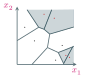
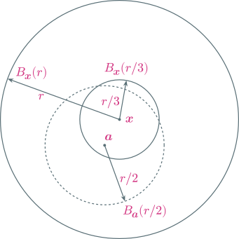
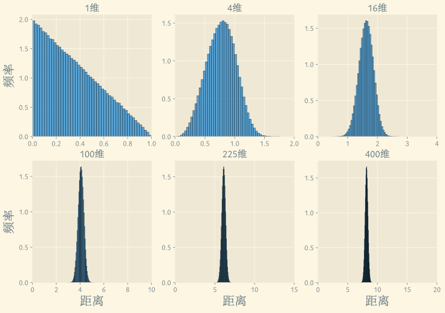

---
presentation:
  margin: 0
  center: false
  transition: "none"
  enableSpeakerNotes: true
  slideNumber: "c/t"
  navigationMode: "linear"
---

@import "../css/font-awesome-4.7.0/css/font-awesome.css"
@import "../css/theme/solarized.css"
@import "../css/logo.css"
@import "../css/font.css"
@import "../css/color.css"
@import "../css/margin.css"
@import "../css/table.css"
@import "../css/main.css"
@import "../plugin/zoom/zoom.js"
@import "../plugin/notes/notes.js"
@import "../plugin/customcontrols/plugin.js"
@import "../plugin/customcontrols/style.css"
@import "../plugin/chalkboard/plugin.js"
@import "../plugin/chalkboard/style.css"
@import "../plugin/reveal.js-menu/menu.js"
@import "../js/anychart/anychart-core.min.js"
@import "../js/anychart/anychart-venn.min.js"
@import "../js/anychart/pastel.min.js"
@import "../js/anychart/venn-entropy.js"

<!-- slide data-notes="" -->

# 机器学习

## k-近邻

### 计算机学院&emsp;张腾

#### *tengzhang@hust.edu.cn*

<!-- slide vertical=true data-notes="" -->

##### 大纲

---

@import "../vega/outline.json" {as="vega" .top-2}

<!-- slide data-notes="" -->

##### k-近邻

---

基本假设：相似的样本属于相同的类别

如何刻画相似？距离函数：$\dist(\cdot, \cdot): \xc \times \xc \mapsto \rb^+$

输入：$\dc = \{ (\xv_i, y_i) \}_{i \in [m]} \subseteq \xc \times \yc$，近邻数$k$，待预测样本$\xv$

输出：$\xv$的类别$y$

1. 寻找近邻：求解$\nc_k(\xv) \subseteq \dc$使得$|\nc_k(\xv)| = k$，且对$\forall (\xv', y') \in \dc \setminus \nc_k(\xv)$，有$\dist(\xv, \xv') \ge \max_{\zv \in \nc_k(\xv)} \dist (\xv, \zv)$
2. 多数投票：输出$\mode(\{ y'': (\xv'', y'') \in \nc_k(\xv) \})$，其中$\mode(\cdot)$表示众数

 近邻法没有显式的学习过程

<!-- slide vertical=true data-notes="" -->

##### 空间划分 1-近邻

---

<!-- slide vertical data-notes="" -->

##### 超参设置

---

近邻数$k$：取值范围$[m] \cap \{2 \zb + 1\}$

- 奇数可保证取众数时不会出现打平的情况，zyzzj 常委都是奇数位
- 越小越容易过拟合，越大越容易欠拟合，实践中多通过交叉验证选取

距离函数：

- 闵可夫斯基距离$\dist(\xv, \zv) = \| \xv - \zv \|_p$，由$\ell_p$范数诱导出
- 马氏距离$\dist_\Mv (\xv, \zv) = (\xv - \zv)^\top \Mv (\xv - \zv)$，当$\Mv = \diag \{w_1, \ldots, w_d\}$时，即为加权平方距离$\sqrt{\sum_{j \in [d]} w_j (x_j - z_j)^2}$

度量学习 (metric learning)：学一个更好的距离函数，以马氏距离为例，记$\mc$、$\cc$分别为同类、异类样本对构成的集合

\begin{align}
    \min_{\Mv \succeq \zerov} \sum_{(\xv_i, \xv_j) \in \mc} \dist_\Mv(\xv_i, \xv_j), \quad \st \sum_{(\xv_i, \xv_j) \in \cc} \dist_\Mv(\xv_i, \xv_j) \ge 1
\end{align}

<!-- slide vertical data-notes="" -->

##### 优劣

---

优点

- 简单，全方位的
- 无训练过程，只需存下数据，惰性学习 (lazy learning)
- 样本极少时也能用
- 特征空间维度不高时效果很好
- 一致性：记贝叶斯最优分类器$h^\star$ 的错误率$R^\star = 0$，k-近邻也能渐进达到

缺点

- 预测很慢，要计算待预测样本与训练集中所有样本的距离
- 维度灾难：高维空间中的距离会失效，k-近邻效果很差

<!-- slide data-notes="" -->

##### 1-近邻法 分析

---

一些符号：

- 设输入空间$\xc \subseteq \rb^n$，类别标记集合$\yc = \{ 0, 1\}$
- 定义在$\xc \times \yc$上的联合分布$\ds$，$\xc$上的边际分布为$\ds_\xc$
- 训练集$\dc = \{ (\xv_i, y_i) \}_{i \in [m]} \subseteq \xc \times \yc$，其中每个$(\xv_i, y_i) \overset{\textrm{iid}}{\sim} \ds$
- 记$\eta(\xv) = \pb(y = 1 | \xv)$，$\dc$的生成可以看成先从$\ds_\xc$中独立同分布地采样出$\dc_\xc = \{ \xv_i \}_{i \in [m]}$，然后对每个$\xv_i$，从$\Bern(\eta(\xv_i))$中采样出$y_i$
- 贝叶斯最优学习器$h^\star$

<!-- slide vertical=true data-notes="" -->

##### 1-近邻法 分析

---

设待预测样本为$(\xv, y)$，$\dc_\xc$按与$\xv$的距离升序排列为$\xv_1, \ldots, \xv_m$，于是 1-近邻的泛化错误率为

\begin{align}
    \err (h) & = \eb_{\dc_\xc \sim \ds_\xc^m, \xv \sim \ds_\xc, y \sim \Bern(\eta(\xv)), y_1 \sim \Bern(\eta(\xv_1))} [\ib(y \ne y_1)] \\
    & = \eb_{\dc_\xc \sim \ds_\xc^m, \xv \sim \ds_\xc} [\pb_{y \sim \Bern(\eta(\xv)), y_1 \sim \Bern(\eta(\xv_1))} (y \ne y_1)] \\
    & = \eb_{\dc_\xc \sim \ds_\xc^m, \xv \sim \ds_\xc} [ \eta(\xv) (1 - \eta(\xv_1)) + (1 - \eta(\xv)) \eta(\xv_1) ] \\
    & = \eb_{\dc_\xc \sim \ds_\xc^m, \xv \sim \ds_\xc} [ 2 \eta(\xv) (1 - \eta(\xv)) + (\eta(\xv) - \eta(\xv_1)) (2 \eta(\xv) - 1)] \\
    & = 2 \eb_{\xv \sim \ds_\xc} [ \eta(\xv) (1 - \eta(\xv))] + \eb_{\dc_\xc \sim \ds_\xc^m, \xv \sim \ds_\xc} [ (\eta(\xv) - \eta(\xv_1)) (2 \eta(\xv) - 1) ]
\end{align}

其中第一项为在$\xv$处采样 2 次，类别标记不同的概率

<!-- slide data-notes="" -->

##### 1-近邻法 渐进分析

---

\begin{align}
    \err (h) = 2 \eb_{\xv \sim \ds_\xc} [ \eta(\xv) (1 - \eta(\xv))] + \eb_{\dc_\xc \sim \ds_\xc^m, \xv \sim \ds_\xc} [ (\eta(\xv) - \eta(\xv_1)) (2 \eta(\xv) - 1) ]
\end{align}

随着样本数$m$的增大，$\xv$与$\xv_1$的距离单调递减，当$m \to \infty$时，若$\xv_1 \to \xv$，则第二项$\to 0$，只剩第一项

\begin{align}
    \err(h) & = 2 \eb_{\xv \sim \ds_\xc} [ \eta(\xv) (1 - \eta(\xv))] \\
    & = 2 \eb_{\xv \sim \ds_\xc} [ \pb(y=1|\xv) \pb(y=0|\xv) ] \\
    & = 2 \eb_{\xv \sim \ds_\xc} [ \pb(y \ne h^\star(\xv)|\xv) (1 - \pb(y \ne h^\star(\xv)|\xv))] \\
    & = 2 \err(h^\star) - 2 \eb_{\xv \sim \ds_\xc} [\pb(y \ne h^\star(\xv)|\xv)^2] \\
    & = 2 \err(h^\star) - 2 \err(h^\star)^2 - 2 \vb [\pb(y \ne h^\star(\xv)|\xv)] \\
    & \le 2 \err(h^\star) (1 - \err(h^\star)) \le 2 \err(h^\star)
\end{align}

最后一个等号是根据$二阶矩 = 期望^2 + 方差$

剩下只需确定$m \to \infty$时保证$\xv_1 \to \xv$的条件

<!-- slide vertical=true data-notes="" -->

##### 1-近邻法 渐进分析

---

条件：输入空间是可分度量空间

可分性 (separability)：具有可数稠密子集

- 若度量空间$\xc$的子集$\mc$满足对$\forall x \in \xc$，$x$的任意邻域与$\mc$交集非空，则称$\mc$在$\xc$中稠密，$\qb$在$\rb$中稠密，$\qb$可数，因此$\rb$可分
- 可分性限制了空间的复杂度，即便空间中的元素可能是不可数的，但每个元素都可以被一个可数集中的元素无限逼近，而可数集更好处理

几乎必然 (almost surely, a.s.) 成立也称以概率 1 成立

- 当随机事件的样本空间有限时，等价于必然成立
- 当随机事件的样本空间无限时，两者不等价

在$[0,1]$上随机挑一个数$x$，$x$几乎必然不等于$0.5$

<!-- slide vertical=true data-notes="" -->

##### 1-近邻法 渐进分析

---

引理：对$\forall \xv \in \xc$，设$\{\xvh_m\}_{m = 1,2, \ldots}$是 1-近邻序列，$\xvh_m \overset{\textrm{a.s.}}{\to} \xv$

证明：记$\xv$的邻域$\bc_\xv(r)$：以$\xv$为球心、$r$为半径的球

定义空间中的好点：对$\forall r > 0$有$\pb(\bc_\xv(r)) > 0$，于是

\begin{align}
    \lim_{m \to \infty} \pb(\dist(\xvh_m, \xv) > r) = \lim_{m \to \infty} (1 - \pb(\bc_\xv(r)))^m = 0
\end{align}

由$r$的任意性知$\lim_{m \to \infty} \pb(\dist(\xvh_m, \xv) = 0) = 1$，从而$\xvh_m \overset{\textrm{a.s.}}{\to} \xv$

已证“好点的 1-近邻序列收敛于自身的概率为 1”，如果“空间中好点的概率也为 1”，则结论成立

<!-- slide vertical=true data-notes="" -->

##### 1-近邻法 渐进分析

---

定义空间中的坏点：存在$r > 0$使得$\pb(\bc_\xv(r)) = 0$，设全部的坏点构成集合$\nc$，只需证$\pb(\nc) = 0$

根据可分性，$\xc$存在可数稠密子集$\ac$，且存在点$\av \in \bc_\xv(r/3) \wedge \ac$，考虑包含$\xv$的邻域$\bc_\av (r/2)$，易知其包含于$\bc_\xv(r)$，故$\pb(\bc_\av (r/2)) = 0$

每个坏点会对应一个以$\av$为球心的球，若多个坏点对应同一个$\av$，取并集，即半径最大的球，注意$\ac$可数，因此最终只需可数个概率为零的球即可覆盖全部坏点，故$\pb(\nc) = 0$

<!-- slide data-notes="" -->

##### 推广到多分类

---

设$\yc = [c]$，1-近邻的正确率 $\overset{\textrm{a.s.}}{\to}$ 在$\xv$处采样两次标记相同的概率

\begin{align}
    \pb(y \ne h(\xv) | \xv) = 1 - \pb(y = h^\star(\xv)|\xv)^2 - \sum_{j \neq h^\star(\xv)} \pb(y = j|\xv)^2
\end{align}

由柯西不等式

\begin{align}
    \sum_{j \neq h^\star(\xv)} \pb(y = j|\xv)^2 \ge \frac{( \sum_{j \neq h^\star(\xv)} \pb(y = j|\xv) )^2}{c-1}  = \frac{\pb(y \ne h^\star(\xv)|\xv)^2}{c-1}
\end{align}

回代可得

\begin{align}
    \pb(y \ne h(\xv) | \xv) & \le 1 - (1 - \pb(y \ne h^\star(\xv)|\xv))^2 - \frac{\pb(y \ne h^\star(\xv)|\xv)^2}{c-1} \\
    & = 2 \pb(y \ne h^\star(\xv)|\xv) - \frac{c}{c-1} \pb(y \ne h^\star(\xv)|\xv)^2
\end{align}

<!-- slide vertical=true data-notes="" -->

##### 推广到多分类

---

\begin{align}
    \pb(y \ne h(\xv) | \xv) \le 2 \pb(y \ne h^\star(\xv)|\xv) - \frac{c}{c-1} \pb(y \ne h^\star(\xv)|\xv)^2
\end{align}

两边求期望，再次利用$二阶矩 = 期望^2 + 方差$有

\begin{align}
    \err(h) & \le 2 \err(h^\star) - \frac{c}{c-1} (\err(h^\star)^2 + \vb [p (y \ne h^\star(\xv) | \xv)]) \\
    & \le \err(h^\star) \left( 2 - \frac{c}{c-1} \err(h^\star) \right)
\end{align}

<!-- slide data-notes="" -->

##### 1-近邻法 非渐进分析

---

渐进分析描述的是$m \to \infty$的情况，实际中只有有限个样本，我们想知道$\err(h)$随着样本数增长以怎样的速度增长

第一项还按前面的方式处理，下面处理第二项

\begin{align}
    \eb_{\dc_\xc \sim \ds_\xc^m, \xv \sim \ds_\xc} [ (\eta(\xv) - \eta(\xv_1)) (2 \eta(\xv) - 1) ]
\end{align}

设$\eta(\cdot)$是$c$-李普希茨连续函数，即$|\eta(\xv) - \eta(\xv_1)| \le c \| \xv - \xv_1 \|_2$，注意$\eta(\xv) \in [0,1] \Longrightarrow |2 \eta(\xv) - 1| \le 1$，于是

\begin{align}
    \eb_{\dc_\xc \sim \ds_\xc^m, \xv \sim \ds_\xc} [ (\eta(\xv) - \eta(\xv_1)) (2 \eta(\xv) - 1) ] \le c ~ \eb_{\dc_\xc \sim \ds_\xc^m, \xv \sim \ds_\xc} [ \| \xv - \xv_1 \|_2 ]
\end{align}

问题转化为控制$\xv$与其 1-近邻$\xv_1$的距离

<!-- slide vertical=true data-notes="" -->

##### 1-近邻法 非渐进分析

---

设$\xc = [0,1]^n$，将其均匀切分成$r^n$个小立方体$\cc_1, \ldots, \cc_{r^n}$，若$\xv$、$\xv_1$落在同一个$\cc_i$，则其距离$\le \sqrt{n}/r$，否则其距离$\le \sqrt{n}$

记与$\dc_{\xc}$无交集的小正方体的并集为$\ac$、与$\dc_{\xc}$有交集的小正方体的并集为$\bc$

\begin{align}
    \ac = \cup_{i: \cc_i \cap \dc_{\xc} = \emptyset} \cc_i, \quad \bc = \xc \setminus \ac = \cup_{i: \cc_i \cap \dc_{\xc} \ne \emptyset} \cc_i
\end{align}

$\xv \in \ac$、$\xv \in \bc$恰有一个发生，前者代表$\xv$与任何训练样本都不在一个$\cc_i$内，后者代表$\xv$与某个训练样本在同一个$\cc_i$内，于是

\begin{align}
    \eb_{\dc_\xc \sim \ds_\xc^m, \xv \sim \ds_\xc} [ \| \xv - \xv_1 \|_2 ] \le \eb_{\dc_\xc \sim \ds_\xc^m} \left[ \pb (\ac) \sqrt{n} + \pb (\bc) \frac{\sqrt{n}}{r} \right]
\end{align}

<!-- slide vertical=true data-notes="" -->

##### 1-近邻法 非渐进分析

---

对于$\pb (\ac)$有

\begin{align}
    \eb_{\dc_\xc \sim \ds_\xc^m} [\pb (\ac)]
     & = \eb_{\dc_\xc \sim \ds_\xc^m} [\pb (\cup_{i: \cc_i \cap \dc_{\xc} = \emptyset} \cc_i) ] \\
     & = \eb_{\dc_\xc \sim \ds_\xc^m} \left[ \sum_{i \in [r^n]} \pb (\cc_i) \ib(\cc_i \cap \dc_{\xc} = \emptyset) \right] \\
     & = \sum_{i \in [r^n]} \pb (\cc_i) \eb_{\dc_\xc \sim \ds_\xc^m} \left[ \ib(\cc_i \cap \dc_{\xc} = \emptyset) \right] \\
     & = \sum_{i \in [r^n]} \pb (\cc_i) (1 - \pb (\cc_i))^m \le \sum_{i \in [r^n]} \pb (\cc_i) \exp (- \pb (\cc_i) m) \\
     & \le r^n \max_{i \in [r^n]} \pb (\cc_i) \exp (- \pb (\cc_i) m) \le \frac{r^n}{me}
\end{align}

- 第一个不等号：$1 - x \le \exp(-x)$
- 第三个不等号：$a \exp (- ma) \le 1/me$，对$a$求导易证

<!-- slide vertical=true data-notes="" -->

##### 1-近邻法 非渐进分析

---

对于$\pb (\bc)$，直接用其平凡上界$\pb (\bc) \le 1$，全部回代有

\begin{align}
    \err(h) \le 2 \err(h^\star) (1-\err(h^\star)) + c \sqrt{n} \left( \frac{r^n}{me} + \frac{1}{r} \right)
\end{align}

右边第二项在$r = (me/n)^{\frac{1}{n+1}}$时最紧，代入有

\begin{align}
    \err(h) \le 2 \err(h^\star) (1-\err(h^\star)) + c (me)^{\frac{-1}{n+1}} \frac{n+1}{n} n^{\frac{n+3}{2(n+1)}}
\end{align}

令$c (me)^{\frac{-1}{n+1}} \frac{n+1}{n} n^{\frac{n+3}{2(n+1)}} \le \epsilon$，注意$e^{\frac{-1}{n+1}} \ge 1 - \frac{1}{n+1} = \frac{n}{n+1}$，于是

\begin{align}
    m \ge \left( c \frac{n}{n+1} \frac{n+1}{n} n^{\frac{n+3}{2(n+1)}} / \epsilon \right)^{n+1} \ge \left( \frac{c}{\epsilon} \right)^{n+1} n^{\frac{n+3}{2}}
\end{align}

即要想控制$\xv$与 1-近邻$\xv_1$的距离，所需样本数关于维度呈指数增长，这称为维度灾难 (curse of dimensionality)

<!-- slide data-notes="" -->

##### k-近邻法 非渐进分析

---

对于$k > 1$的情形，可仿照前面的思路证明

\begin{align}
    \err(h) \le \left( 1 + \sqrt{\frac{8}{k}} \right) \err(h^\star) + \left( 2k + \left( 2 + \sqrt{\frac{8}{k}} \right) c \sqrt{n} \right) m^{-\frac{1}{n+1}}
\end{align}

增大$k$可以改善$\err(h^\star)$的系数，但会增加第二项，因此$k$并非越大越好

<!-- slide data-notes="" -->

##### 维度灾难 近邻不近

---

设$\xc = [0,1]^d$为$d$维单位立方体，训练样本在立方体内均匀分布

对任意待测试样本$\xv$，设包含其$k$-近邻的最小立方体的边长为$l$

$l^d \approx k / m$，则$l \approx \sqrt[d]{k/m}$，取$m=1000$、$k=10$

| $d$ |  $2$  |   $3$   |  $10$   |  $100$  |  $1000$  |  $10000$  |
| :-: | :---: | :-----: | :-----: | :-----: | :------: | :-------: |
| $l$ | $0.1$ | $0.215$ | $0.631$ | $0.955$ | $0.9954$ | $0.99954$ |

当$d=1000$时，$10$-近邻近乎覆盖整个$\xc$，已经不是$\xv$的邻域了

<!-- slide vertical=true data-notes="" -->

##### 维度灾难 距离失效

---

在各维度下随机生成$2000$个样本，统计所有样本对间的距离

