---
presentation:
  margin: 0
  center: false
  transition: "none"
  enableSpeakerNotes: true
  slideNumber: "c/t"
  navigationMode: "linear"
---

@import "../css/font-awesome-4.7.0/css/font-awesome.css"
@import "../css/theme/solarized.css"
@import "../css/logo.css"
@import "../css/font.css"
@import "../css/color.css"
@import "../css/margin.css"
@import "../css/table.css"
@import "../css/main.css"
@import "../plugin/zoom/zoom.js"
@import "../plugin/notes/notes.js"
@import "../plugin/customcontrols/plugin.js"
@import "../plugin/customcontrols/style.css"
@import "../plugin/chalkboard/plugin.js"
@import "../plugin/chalkboard/style.css"
@import "../plugin/reveal.js-menu/menu.js"
@import "../js/anychart/anychart-core.min.js"
@import "../js/anychart/anychart-venn.min.js"
@import "../js/anychart/pastel.min.js"
@import "../js/anychart/venn-entropy.js"

<!-- slide data-notes="" -->

<div class="bottom20"></div>

# 机器学习

<hr class="width50 center">

## 神经网络

<div class="bottom8"></div>

### 计算机学院&emsp;张腾

#### *tengzhang@hust.edu.cn*

<!-- slide vertical=true data-notes="" -->

##### 大纲

---

@import "../vega/outline.json" {as="vega" .top-2}

<!-- slide vertical=true data-notes="" -->

##### 发展历史

---

<div class="top-4"></div>

@import "../mermaid/nn.mermaid"

<div class="top-2"></div>

- 八十年代红极一时：x86 系列 CPU 和内存条技术较七十年代显著提高
- 近十年梅开二度：大数据防止过拟合，显卡等计算设备性能显著提升

<!-- slide data-notes="" -->

##### 神经网络

---

@import "../dot/nn.dot" {.center}

<div class="top0"></div>

- 黄色部分就是个 M-P 神经元模型
- 大量的神经元并行串联就构成了神经网络
- 只要存在隐藏层，神经网络就拥有了非线性分类能力

<!-- slide vertical=true data-notes="" -->

##### 形式化

---

引入下面的记号：

- $L$：神经网络的层数
- $n_l$：第$l$层神经元的个数
- $h_l(\cdot)$：第$l$层的激活函数
- $\Wv_l \in \rb^{n_l \times n_{l-1}}$：第$l-1$层到第$l$层的权重矩阵
- $\bv_l \in \rb^{n_l}$：第$l$层的偏置 (截距)
- $\zv_l \in \rb^{n_l}$：第$l$层神经元的输入
- $\av_l \in \rb^{n_l}$：第$l$层神经元的输出

<div class="top4"></div>

神经网络第$l$层的计算过程：$\zv_l = \Wv_l \av_{l-1} + \bv_l$，$\av_l = h_l (\zv_l)$

整个网络$\xv = \av_0 \xrightarrow{\Wv_1,\bv_1} \zv_1 \xrightarrow{h_1} \av_1 \xrightarrow{\Wv_2,\bv_2} \cdots \xrightarrow{\Wv_L,\bv_L} \zv_L \xrightarrow{h_L} \av_L = \hat{\yv}$

<!-- slide data-notes="" -->

##### 激活函数

---

最早的 M-P 模型采用阶跃函数$\sgn(\cdot)$作为激活函数

改进方向：

- 连续并几乎处处可导，可以高效计算
- 导数的值域在合适的范围内，否则影响用梯度下降进行训练

<div class="top2"></div>

常见的有

- Sigmoid 型：对率函数，双曲正切函数
- ReLU，带泄漏的 ReLU，带参数的 ReLU，ELU，Softplus
- Swish 函数
- Maxout 单元

<!-- slide vertical=true data-notes="" -->

##### Sigmoid 型

---

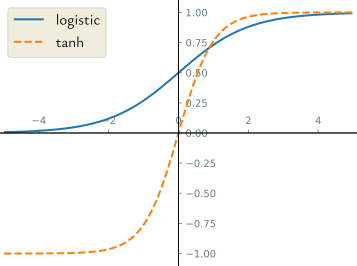

<!-- slide vertical=true data-notes="" -->

##### 对率函数

---

将$\rb$<span class="blue">挤压</span>到$[0,1]$，输出拥有<span class="blue">概率</span>意义：

<p>
\begin{align}
    \sigma(z) = \frac{1}{1 + \exp (-z)} = \begin{cases}
        1, & z \to \infty \\
        0, & z \to -\infty
    \end{cases}
\end{align}
</p>

<div class="top2"></div>

对率函数连续可导，在<span class="blue">零处导数最大</span>

<p>
\begin{align}
    \nabla \sigma(z) = \sigma(z) (1 - \sigma(z)) \le \left( \frac{\sigma(z) + 1 - \sigma(z)}{2} \right)^2 = \frac{1}{4}
\end{align}
</p>

均值不等式等号成立的条件是$\sigma(z) = 1 - \sigma(z)$，即$z = 0$

<!-- slide vertical=true data-notes="" -->

##### 双曲正切函数

---

将$\rb$<span class="blue">挤压</span>到$[-1,1]$，<span class="blue">输出零中心化</span>，对率函数的放大平移

<p>
\begin{align}
    \tanh(z) & = \frac{\exp(z) - \exp(-z)}{\exp(z) + \exp(-z)} = \frac{1 - \exp(-2z)}{1 + \exp(-2z)} = 2 \sigma(2z) - 1 \\[2pt]
    & = \begin{cases}
        1, & z \to \infty \\
        -1, & z \to -\infty
    \end{cases}
\end{align}
</p>

<p>
\begin{align}
    \nabla \tanh(z) = 4 \sigma(2z) (1 - \sigma(2z)) \le 1
\end{align}
</p>

双曲正切函数连续可导，在$z = 0$处导数最大

输出零中心化使得非输入层的输入都在零附近，而双曲正切函数在零处导数最大，梯度下降更新效率较高，对率函数输出恒为正，会减慢梯度下降的收敛速度

<!-- slide data-notes="" -->

##### 整流线性单元

---

整流线性单元 (<span class="blue">re</span>ctified <span class="blue">l</span>inear <span class="blue">u</span>nit, ReLU)：

<p>
\begin{align}
    \relu(z) = \max \{ 0, z \} = \begin{cases}
        z & z \ge 0 \\ 0 & z < 0
    \end{cases}
\end{align}
</p>

优点

- 单侧抑制，稀疏兴奋，节能
- 计算只涉及比较操作，高效
- 在$z > 0$时导数恒为$1$，缓解了<span class="blue">梯度消失</span>问题

<div class="top2"></div>

缺点

- 死亡 ReLU 问题：对异常值特别敏感

<!-- slide vertical=true data-notes="" -->

##### 死亡 ReLU 问题

---

由链式法则有

<p>
\begin{align}
    \nabla_{\wv} \relu(\wv^\top \xv + b) & = \frac{\partial \relu(\wv^\top \xv + b)}{\partial (\wv^\top \xv + b)} \frac{\partial (\wv^\top \xv + b)}{\partial \wv} \\
    & = \frac{\partial \max \{ 0, \wv^\top \xv + b \}}{\partial (\wv^\top \xv + b)} \xv \\
    & = \ib(\wv^\top \xv + b \ge 0) \xv
\end{align}
</p>

如果第一个隐藏层中的某个神经元对应的$(\wv,b)$初始化不当，使得对任意$\xv$有$\wv^\top \xv + b < 0$，那么其关于$(\wv,b)$的梯度将为零，在以后的训练过程中永远不会被更新

解决方案：带泄漏的 ReLU，带参数的 ReLU，ELU，Softplus

<!-- slide vertical=true data-notes="" -->

##### ReLU 变体

---

带泄漏的 ReLU：当$\wv^\top \xv + b < 0$时也有非零梯度

<p>
\begin{align}
    \lrelu(z) & = \begin{cases}
        z & z \ge 0 \\ \gamma z & z < 0
    \end{cases} \\
    & = \max \{ 0, z \} + \gamma \min \{ 0, z \} \overset{\gamma < 1}{=} \max \{ z, \gamma z \}
\end{align}
</p>

其中斜率$\gamma$是一个很小的常数，比如$0.01$

<div class="top2"></div>

带参数的 ReLU：斜率$\gamma_i$可学习

<p>
\begin{align}
    \prelu(z) & = \begin{cases}
        z & z \ge 0 \\ \gamma_i z & z < 0
    \end{cases} \\[4pt]
    & = \max \{ 0, z \} + \gamma_i \min \{ 0, z \}
\end{align}
</p>

可以不同神经元有不同的参数，也可以一组神经元共享一个参数

<!-- slide vertical=true data-notes="" -->

##### ReLU 变体

---

指数线性单元 (<span class="blue">e</span>xponential <span class="blue">l</span>inear <span class="blue">u</span>nit, ELU)

<p>
\begin{align}
    \elu(z) & = \begin{cases}
        z & z \ge 0 \\ \gamma (\exp(z) - 1) & z < 0
    \end{cases} \\[4pt]
    & = \max \{ 0, z \} + \min \{ 0, \gamma (\exp(z) - 1) \}
\end{align}
</p>

<div class="top2"></div>

Softplus 函数可以看作 ReLU 的平滑版本：

<p>
\begin{align}
    \softplus(z) = \ln (1 + \exp(z))
\end{align}
</p>

其导数为对率函数

<p>
\begin{align}
    \nabla \softplus(z) = \frac{\exp(z)}{1 + \exp(z)} = \frac{1}{1 + \exp(-z)}
\end{align}
</p>

<!-- slide vertical=true data-notes="" -->

##### ReLU 族

---

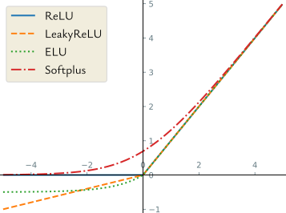

<!-- slide data-notes="自门控的意思是控制自己是否激活的\sigma (\beta z)也跟有关" -->

##### Swish 函数

---

Swish 函数是一种自门控 (self-gated) 激活函数：

<p>
\begin{align}
    \swish(z) = z \cdot \sigma (\beta z) = \frac{z}{1 + \exp(-\beta z)}
\end{align}
</p>

其中$\beta$是一个可学习的参数

- 当$\sigma (\beta z)$接近于$1$时，门处于<span class="blue">开</span>状态，激活函数的输出近似于$z$本身
- 当$\sigma (\beta z)$接近于$0$时，门处于<span class="blue">关</span>状态，激活函数的输出近似于$0$

<!-- slide vertical=true data-notes="" -->

##### Swish 函数

---


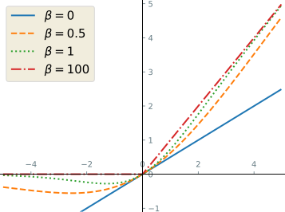

<!-- slide vertical=true data-notes="" -->

##### Maxout 单元

---

考虑神经网络的第$l$层：

<p>
\begin{align}
    \zv_l & = \Wv_l \av_{l-1} + \bv_l \\
    \av_l & = h_l (\zv_l)
\end{align}
</p>

前面提到的激活函数都是$\rb \mapsto \rb$的，即$[\av_l]_i = h_l ([\zv_l]_i), ~ i \in [n_l]$

Maxout 单元是$\rb^{n_l} \mapsto \rb$的，输入就是$\zv_l$，其定义为

<p>
\begin{align}
    \maxout (\zv) = \max_{k \in [K]} \{ \wv_k^\top \zv + b_k \}
\end{align}
</p>

<div class="top2"></div>

- 整体学习输入到输出间的非线性关系
- $\relu(z) = \max \{ 0, z \}$与$\lrelu(z) \overset{\gamma < 1}{=} \max \{ z, \gamma z \}$都是 Maxout 单元的特例

<!-- slide data-notes="" -->

##### 神经网络的表示能力

---

考虑所有的布尔函数，$\xc = \{1,-1\}^n$，$\yc = \{1,-1\}$

- 计算机中任意数都是用整数个 (不妨设为$b$) 个比特来表示
- 任意$f: \rb^n \mapsto \rb$在计算机中都是$g: \{1,-1\}^{nb} \mapsto \{1,-1\}^b$

<div class="bottom4"></div>

对任意$n$，存在深度为$2$的神经网络表示出$\{1,-1\}^n \mapsto \{1,-1\}$的所有布尔函数

对任意目标函数$f: \{1,-1\}^n \mapsto \{1,-1\}$，设$\uv_1, \ldots, \uv_k$为正样本

- 输入层$n+1$个结点，接收输入样本$\xv$和常数$1$
- 隐藏层$2^n+1$个结点，$g_i (\xv) = \sign (\xv^\top \uv_i - (n-1))$可判断$\xv == \uv_i$
- 输出层$1$个结点，$\sign (\sum_{i \in [k]} g_i (\xv) + (k-1))$

<p class="footnote comments"> 可以证明隐藏层需要指数多的神经元是没法改进的</p>

<!-- slide vertical=true data-notes="" -->

##### 神经网络的表示能力

---

考虑$\rb^2 \mapsto \{1,-1\}$的函数

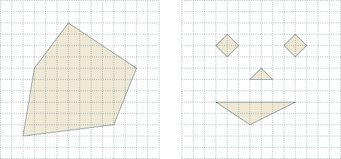

- 左图，5 个半空间围成的凸多面体，两层神经网络，隐藏层每个神经元对应一个半空间，输出层取 5 个半空间的交
- 右图，4 个凸多面体，三层神经网络，前两层同左图，第二个隐藏层每个神经元对应一个凸多面体，输出层取 4 个凸多面体的并
- 交：$\sign (\sum_{i \in [k]} x_i - (k-1))$、并：$\sign (\sum_{i \in [k]} x_i + (k-1))$

<!-- slide vertical=true data-notes="" -->

##### 神经网络的表示能力

---

神经网络的抽象化表示

- 有向无环图$\gc = (\vc, \ec)$
- 边上的权重函数$w: \ec \mapsto \rb$
- 每个结点对应一个神经元，每个神经元有一个激活函数$\sigma: \rb \mapsto \rb$

<div class="bottom2"></div>

若神经网络的

- 激活函数为$\sgn(\cdot)$，则$\VC$维为$\oc (|\ec| \log |\ec|)$
- 激活函数为$\sigma(\cdot)$，则$\VC$维为$\Omega (|\ec|^2)$、$\oc (|\vc|^2 |\ec|^2)$

<div class="bottom2"></div>

若神经网络能表示$\{1,-1\}^n \mapsto \{1,-1\}$的所有布尔函数，则$\VC$维为$2^n$，于是$2^n \le \oc (|\ec| \log |\ec|) \le \oc (|\vc|^3)$，从而$|\vc| \ge \Omega (2^{n/3})$

<!-- slide vertical=true data-notes="" -->

##### 神经网络的表示能力

---

设$\fc_n$是图灵机在$T(n)$时间内能实现的布尔函数集合，则存在常数$b$、$c$以及神经元数不超过$c T(n)^2 + b$的神经网络能实现$\fc_n$

证明思路：函数 => 门电路 => 阶跃激活函数实现与或非门

<div class="bottom4"></div>

万有逼近能力：设目标函数$f: [-1,1]^n \mapsto [-1,1]$是李普希茨连续函数，固定$\epsilon > 0$，存在以$\sigma(\cdot)$为激活函数的神经网络$h$使得对$\forall \xv \in [-1,1]^n$有$|f(\xv) - h(\xv)| \le \epsilon$

证明思路：将$[-1,1]^n$分解成小正方体，由于$f$李普希茨连续，因此在每个小正方体内变化很小，近似为一个常数，神经网络根据输入的$\xv$确定小正方体，然后输出$f$在那个小正方体中的均值

<!-- slide data-notes="" -->

##### 应用到机器学习

---

@import "../dot/ml-nn.dot"

<div class="top-2"></div>

前$L-1$层是复合函数$\psi: \rb^d \mapsto \rb^{n_{L-1}}$，可看作一种特征变换方法

最后一层是学习器$\hat{\yv} = g(\psi(\xv); \Wv_L, \bv_L)$，对输入进行预测

- 若$y \in \{ 1, -1 \} 或 \{ 1,0 \}$，最后一层只需$1$个神经元，采用对率激活函数
- 若$y \in [c]$，最后一层需$c$个神经元，采用 Softmax 激活函数

<div class="top2"></div>

<p class="comments"> 对率回归也可看作只有一层 (没有隐藏层) 的神经网络</p>

<!-- slide vertical=true data-notes="" -->

##### 深度学习

---

传统机器学习：特征工程和模型学习两阶段分开进行

@import "../dot/ml-old.dot"

<div class="top2"></div>

深度学习：特征工程和模型学习合二为一，端到端 (end-to-end)

@import "../dot/ml-nn.dot"

<!-- slide data-notes="" -->

##### 求解参数

---

整个网络$\xv = \av_0 \xrightarrow{\Wv_1,\bv_1} \zv_1 \xrightarrow{h_1} \av_1 \xrightarrow{\Wv_2,\bv_2} \cdots \xrightarrow{\Wv_L,\bv_L} \zv_L \xrightarrow{h_L} \av_L = \hat{\yv}$

神经网络的优化目标为

<p>
\begin{align}
    \min_{\Wv, \bv} ~ \frac{1}{m} \sum_{i \in [m]} \ell (\yv_i, \hat{\yv}_i)
\end{align}
</p>

其中损失$\ell (\yv, \hat{\yv})$的计算为<span class="blue">正向传播</span>

- 样本从输入层进入，经隐藏层逐层传播到最后输出层
- $\hat{\yv} = \av_L = h_L (\zv_L)$是对样本$\xv$的预测，据此计算$\ell (\yv, \hat{\yv}) = \ell (\yv, h_L (\zv_L))$

<div class="top2"></div>

梯度下降更新公式为

<p>
\begin{align}
    \Wv ~ \gets ~ \Wv - \frac{\eta}{m} \sum_{i \in [m]} \class{yellow}{\frac{\partial \ell (\yv_i, \hat{\yv}_i)}{\partial \Wv}}, \quad \bv ~ \gets ~ \bv - \frac{\eta}{m} \sum_{i \in [m]} \class{yellow}{\frac{\partial \ell (\yv_i, \hat{\yv}_i)}{\partial \bv}}
\end{align}
</p>

<!-- slide vertical=true data-notes="" -->

##### 求解参数

---

最后一层$\zv_L = \Wv_L ~ \av_{L-1} + \bv_L$，$\av_L = h_L (\zv_L)$，由<span class="blue">链式法则</span>有

<p>
\begin{align}
    \frac{\partial \ell (\yv, \hat{\yv})}{\partial \bv_L} & = \frac{\partial \ell (\yv, \hat{\yv})}{\partial \zv_L} \frac{\partial \zv_L}{\partial \bv_L} = \deltav_L^\top \frac{\partial \zv_L}{\partial \bv_L} = \deltav_L^\top \\
    \frac{\partial \ell (\yv, \hat{\yv})}{\partial \Wv_L} & = \sum_{j \in [n_L]} \frac{\partial \ell (\yv, \hat{\yv})}{\partial [\zv_L]_j} \frac{\partial [\zv_L]_j}{\partial \Wv_L} = \sum_{j \in [n_L]} [\deltav_L]_j \frac{\partial [\zv_L]_j}{\partial \Wv_L}
\end{align}
</p>

其中$\deltav_L^\top = \partial \ell (\yv, \hat{\yv}) / \partial \zv_L \in \rb^{n_L}$为第$L$层的<span class="blue">误差项</span>，可直接求解

类似的，对第$l$层$\zv_l = \Wv_l \av_{l-1} + \bv_l$，$\av_l = h_l (\zv_l)$，由<span class="blue">链式法则</span>有

<p>
\begin{align}
    \frac{\partial \ell (\yv, \hat{\yv})}{\partial \bv_l} = \deltav_l^\top, \quad \frac{\partial \ell (\yv, \hat{\yv})}{\partial \Wv_l} = \sum_{j \in [n_l]} [\deltav_l]_j \frac{\partial [\zv_l]_j}{\partial \Wv_l}
\end{align}
</p>

其中$\deltav_l^\top = \partial \ell (\yv, \hat{\yv}) / \partial \zv_l \in \rb^{n_l}$为第$l$层的<span class="blue">误差项</span>

<!-- slide data-notes="" -->

##### 反向传播

---

<span class="blue">反向传播</span> (<span class="blue">b</span>ack<span class="blue">p</span>ropagation, BP)：前一层误差由后一层得到

<p>
\begin{align}
    \deltav_{l-1}^\top = \frac{\partial \ell (\yv, \hat{\yv})}{\partial \zv_{l-1}} = \frac{\partial \ell (\yv, \hat{\yv})}{\partial \zv_l} \frac{\partial \zv_l}{\partial \av_{l-1}} \frac{\partial \av_{l-1}}{\partial \zv_{l-1}} = \deltav_l^\top \Wv_l \frac{\partial h_{l-1}(\zv_{l-1})}{\partial \zv_{l-1}}
\end{align}
</p>

最后对第$l$层$\zv_l = \Wv_l \av_{l-1} + \bv_l$，如何求$\partial [\zv_l]_j / \partial \Wv_l$？

注意$[\zv_l]_j = \sum_k [\Wv_l]_{jk} [\av_{l-1}]_k + [\bv_l]_j$只与$\Wv_l$的第$j$行有关，于是

<p>
\begin{align}
    & \frac{\partial [\zv_l]_j}{\partial \Wv_l} = \underbrace{\begin{bmatrix} \zerov, \ldots, \av_{l-1}, \ldots, \zerov \end{bmatrix}}_{第j列为\av_{l-1}} = \av_{l-1} \ev_j^\top \\[4pt]
    & \Longrightarrow \frac{\partial \ell (\yv, \hat{\yv})}{\partial \Wv_l} = \sum_{j \in [n_l]} [\deltav_l]_j \frac{\partial [\zv_l]_j}{\partial \Wv_l} = \av_{l-1} \sum_{j \in [n_l]} [\deltav_l]_j \ev_j^\top = \av_{l-1} \deltav_l^\top
\end{align}
</p>

<!-- slide vertical=true data-notes="" -->

##### 神经网络训练

---

输入：训练集，验证集，相关超参数

1. 随机初始化$\Wv$和$\bv$
2. <span class="blue">while</span> 神经网络在验证集上的精度仍在上升
3. &emsp;&emsp;对训练集中的样本随机重排序
4. &emsp;&emsp;<span class="blue">for</span> $i = 1, \ldots, m$ <span class="blue">do</span>
5. &emsp;&emsp;&emsp;&emsp;获取样本$(\xv_i, \yv_i)$
6. &emsp;&emsp;&emsp;&emsp;正向传播，依次计算$\av_l = h_l(\Wv_l \av_{l-1} + \bv_l)$，最后得到$\ell (\yv_i, \hat{\yv}_i)$
7. &emsp;&emsp;&emsp;&emsp;反向传播，依次计算误差项$\deltav_l^\top = \deltav_{l+1}^\top \Wv_{l+1} \diag (h_l'(\zv_l))$
8. &emsp;&emsp;&emsp;&emsp;计算梯度$\partial \ell (\yv_i, \hat{\yv}_i) / \partial \Wv_l = \av_{l-1} \deltav_l^\top$、$\partial \ell (\yv_i, \hat{\yv}_i) / \partial \bv_l = \deltav_l^\top$
9. &emsp;&emsp;&emsp;&emsp;采用梯度下降更新$\Wv_l$和$\bv_l$

输出：$\Wv$和$\bv$

<!-- slide data-notes="" -->

##### sklearn中的神经网络

---

```python {.line-numbers .top-1 .left4 highlight=[2,4-20]}
import numpy as np
from sklearn.neural_network import MLPClassifier

mlp = MLPClassifier(
    hidden_layer_sizes=(h),    # 隐藏层神经元个数
    activation='logistic',     # identity, logistic, tanh, relu
    max_iter=100,              # 最大迭代轮数
    solver='lbfgs',            # 求解器
    alpha=0,                   # 正则项系数
    batch_size=32,             # 批量大小
    learning_rate='constant',  # constant, invscaling, adaptive
    shuffle=True,              # 每轮是否将样本重新排序,
    momentum=0.9,              # 动量法系数, sgd only
    nesterovs_momentum=True,   # 动量法用Nesterov加速
    early_stopping=False,      # 是否提早停止
    warm_start=False,          # 是否开启热启动机制
    random_state=1,
    verbose=False
    ...
)

clf = mlp.fit(X, y)
acc = clf.score(X, y)
```

<div class="top2"></div>

<!-- slide vertical=true data-notes="" -->

##### sklearn中的神经网络

---

- 以异或 4 个点为中心，从 2 维高斯分布中各采样 255 个样本
- 单隐藏层，对率激活函数，lbfgs 求解器


<!-- slide vertical=true data-notes="" -->

##### sklearn中的神经网络

---

- 以异或 4 个点为中心，从 2 维高斯分布中各采样 255 个样本
- 单隐藏层，3 个神经元，lbfgs 求解器


<!-- slide vertical=true data-notes="" -->

##### sklearn中的神经网络

---

- 以异或 4 个点为中心，从 2 维高斯分布中各采样 255 个样本
- 单隐藏层，7 个神经元，ReLU 激活函数


<!-- slide data-notes="" -->

##### 用TensorFlow实现

---

```python {.line-numbers .top-1 .left4 highlight=[10-21,30-49,52]}
from tensorflow.keras.layers import Dense
from tensorflow.keras.models import Sequential
from tensorflow.keras.optimizers import Adam

model = Sequential()
model.add(Dense(units=3, activation="sigmoid", input_shape=(2, )))
model.add(Dense(units=1, activation='sigmoid'))

model.summary()  # 打印模型
# _________________________________________________________________
#  Layer (type)                Output Shape              Param #
# =================================================================
#  dense (Dense)               (None, 3)                 9
#
#  dense_1 (Dense)             (None, 1)                 4
#
# =================================================================
# Total params: 13
# Trainable params: 13
# Non-trainable params: 0
# _________________________________________________________________

model.compile(
    optimizer=Adam(0.1),
    loss="binary_crossentropy",
    metrics=['accuracy']
)

model.fit(X, y, epochs=10, batch_size=32)
# Epoch 1/10
# 32/32 [==============] - 0s 1ms/step - loss: 0.6481 - accuracy: 0.6309
# Epoch 2/10
# 32/32 [==============] - 0s 1ms/step - loss: 0.5064 - accuracy: 0.7500
# Epoch 3/10
# 32/32 [==============] - 0s 1000us/step - loss: 0.3309 - accuracy: 0.8369
# Epoch 4/10
# 32/32 [==============] - 0s 1ms/step - loss: 0.1383 - accuracy: 1.0000
# Epoch 5/10
# 32/32 [==============] - 0s 1ms/step - loss: 0.0643 - accuracy: 1.0000
# Epoch 6/10
# 32/32 [==============] - 0s 1ms/step - loss: 0.0395 - accuracy: 1.0000
# Epoch 7/10
# 32/32 [==============] - 0s 1ms/step - loss: 0.0276 - accuracy: 1.0000
# Epoch 8/10
# 32/32 [==============] - 0s 1ms/step - loss: 0.0208 - accuracy: 1.0000
# Epoch 9/10
# 32/32 [==============] - 0s 994us/step - loss: 0.0165 - accuracy: 1.0000
# Epoch 10/10
# 32/32 [==============] - 0s 997us/step - loss: 0.0134 - accuracy: 1.0000

loss, acc = model.evaluate(X, y, verbose=2)
# 32/32 - 0s - loss: 0.0121 - accuracy: 1.0000 - 93ms/epoch - 3ms/step
```

<div class="top2"></div>

<!-- slide vertical=true data-notes="" -->

##### 用TensorFlow实现

---

- 以异或 4 个点为中心，从 2 维高斯分布中各采样 255 个样本
- 单隐藏层，对率激活函数，Adam 求解器


<!-- slide data-notes="" -->

##### 梯度消失

---

神经网络中误差反向传播的迭代公式为

<p>
\begin{align}
    \deltav_l^\top = \frac{\partial \ell (\yv, \hat{\yv})}{\partial \zv_l} = \frac{\partial \ell (\yv, \hat{\yv})}{\partial \zv_{l+1}} \frac{\partial \zv_{l+1}}{\partial \av_l} \frac{\partial \av_l}{\partial \zv_l} = \deltav_{l+1}^\top \Wv_{l+1} \diag (h_l'(\zv_l))
\end{align}
</p>

对于 Sigmoid 型激活函数

- $\nabla \sigma(z) = \sigma(z) (1 - \sigma(z)) \le 1/4$
- $\nabla \tanh(z) = 4 \sigma(2z) (1 - \sigma(2z)) \le 1$

<div class="top2"></div>

误差每传播一层都会乘以一个小于等于$1$的系数，当网络层数很深时，梯度会不断衰减甚至消失，使得整个网络很难训练

解决方案：使用导数比较大的激活函数，比如 ReLU

<!-- slide vertical=true data-notes="" -->

##### 残差网络

---

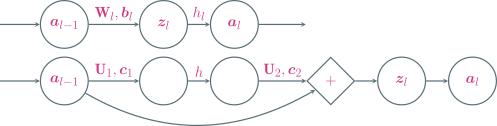

残差模块 $\zv_l = \av_{l-1} + \class{yellow}{\Uv_2 \cdot h(\Uv_1 \cdot \av_{l-1} + \cv_1) + \cv_2} = \av_{l-1} + \class{yellow}{f(\av_{l-1})}$

假设$\av_l = \zv_l$，即残差模块输出不使用激活函数，对$\forall t \in [l]$有

<p>
\begin{align}
    \av_l = \av_{l-1} + f(\av_{l-1}) = \av_{l-2} + f(\av_{l-2}) + f(\av_{l-1}) = \cdots = \av_{l-t} + \sum_{i=l-t}^{l-1} f(\av_i)
\end{align}
</p>

<p class="comments"> 低层输入可以<span class="blue">恒等</span>传播到任意高层</p>

<!-- slide vertical=true data-notes="" -->

##### 残差网络

---

低层输入可以<span class="blue">恒等</span>传播到任意高层

<p>
\begin{align}
    \av_l = \av_{l-t} + \sum_{i=l-t}^{l-1} f(\av_i)
\end{align}
</p>

由链式法则有

<p>
\begin{align}
    \frac{\partial \ell}{\partial \av_{l-t}} & = \frac{\partial \ell}{\partial \av_l} \frac{\partial \av_l}{\partial \av_{l-t}} = \frac{\partial \ell}{\partial \av_l} \left( \frac{\partial \av_{l-t}}{\partial \av_{l-t}} + \frac{\partial }{\partial \av_{l-t}} \sum_{i=l-t}^{l-1} f(\av_i) \right) \\
    & = \frac{\partial \ell}{\partial \av_l} \left( \Iv + \frac{\partial }{\partial \av_{l-t}} \sum_{i=l-t}^{l-1} f(\av_i) \right) \\
    & = \frac{\partial \ell}{\partial \av_l} + \frac{\partial \ell}{\partial \av_l} \left( \frac{\partial }{\partial \av_{l-t}} \sum_{i=l-t}^{l-1} f(\av_i) \right)
\end{align}
</p>

<p class="comments"> 高层误差可以<span class="blue">恒等</span>传播到任意低层，梯度消失得以缓解</p>

<!-- slide data-notes="" -->

##### 神经网络的变种

---

神经网络已被扩展到多种类型的数据上

@import "../dot/grid-sequence.dot" {class="left10 top2 bottom1"}

@import "../dot/graph.dot" {engine="neato" class="left64per top-24per"}

- 网格数据，如图片，卷积神经网络
- 序列数据，如文本，循环神经网络
- 图数据，如药物分子，图神经网络

<!-- slide data-notes="" -->

##### 卷积神经网络

---

图像数据集 [ImageNet](https://image-net.org/index.php)：

- 共有$14,197,122$训练图片、$50,000$验证图片、$100,000$测试图片
- 共有$1,000$个类别，通过众包进行标注
- 图片分辨率：$256 \times 256$、$224 \times 224$、$299 \times 299$

<div class="top2"></div>

用全连接网络训练 ImageNet

- 图片全部裁减到$224 \times 224$，输入层神经元个数为$50,176$
- 共有$1,000$个类别，输出层神经元个数为$1,000$
- 假设只有一个隐藏层，神经元个数取个折中$10,000$

<div class="top2"></div>

总参数量为$(50,176 + 1,000) \times 10,000 = 511,760,000$

- 训练效率非常低
- 很容易出现过拟合

<!-- slide vertical=true data-notes="" -->

##### 局部连接 权值共享

---

@import "../dot/dense-vs-cnn.dot" {.center}

<div class="top0"></div>

局部连接：每个神经元只与前一层确定数量的 (远小于总数) 神经元相连

权值共享：确定数量的神经元均采用相同的输入权重系数

限制神经元的输入权重个数，降低参数规模，降低模型复杂度

<!-- slide vertical=true data-notes="" -->

##### 局部连接 权值共享

---

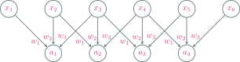

<p>
\begin{align}
    \qquad \qquad \qquad \qquad a_1 & = x_1 \times w_1 + x_2 \times w_2 + x_3 \times w_3 \\
    a_2 & = x_2 \times w_1 + x_3 \times w_2 + x_4 \times w_3 \\
    a_3 & = x_3 \times w_1 + x_4 \times w_2 + x_5 \times w_3 \\
    a_4 & = x_4 \times w_1 + x_5 \times w_2 + x_6 \times w_3
\end{align}
</p>

<p class="center top6">卷积神经网络：局部连接，权值共享</p>

<!-- slide data-notes="" -->

##### 一维卷积

---

<p>
\begin{align}
    (f \otimes g) [n] = \sum_{m = -\infty}^\infty f[m] \cdot g[n-m]
\end{align}
</p>


取$f[i] = x_i$，$g[-2] = w_3$，$g[-1] = w_2$，$g[0] = w_1$，其余为零

<p>
\begin{align}
    a_n = x_n w_1 + x_{n+1} w_2 + x_{n+2} w_3 = \sum_{m = -\infty}^\infty f[m] \cdot g[n-m] = (f \otimes g) [n]
\end{align}
</p>

<!-- slide vertical=true data-notes="" -->

##### 二维卷积

---

针对输入是矩阵的情形

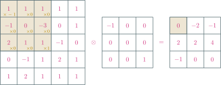

深色区域称为对应输出神经元的<span class="blue">感受野</span> (receptive field)

<!-- slide data-notes="" -->

##### 二维卷积 图像滤波

---

平滑去噪

<div class="multi_column top6 left6" style="height:280px">
    
    <div style="display:flex;align-items:center;height:100%">
        <p class="left2">
            $\otimes ~ \begin{bmatrix}
                \frac{1}{9} & \frac{1}{9} & \frac{1}{9} \\ \frac{1}{9} & \frac{1}{9} & \frac{1}{9} \\ \frac{1}{9} & \frac{1}{9} & \frac{1}{9}
            \end{bmatrix} ~ =$ 
        </p>
    </div>
    
</div>

<!-- slide vertical=true data-notes="" -->

##### 二维卷积 图像滤波

---

边缘提取

<div class="multi_column top6 left6" style="height:280px">
    
    <div style="display:flex;align-items:center;height:100%">
        <p class="left2">
            $\otimes ~ \begin{bmatrix}
                0 & 1 & 1 \\ -1 & 0 & 1 \\ -1 & -1 & 0
            \end{bmatrix} ~ = $ 
        </p>
    </div>
    
</div>

<!-- slide data-notes="" -->

##### 汇聚

---

汇聚 (pooling) 层也叫子采样 (subsampling) 层

- 最大汇聚 (maximum pooling)：取区域内神经元最大值，<span class="blue">拥有一定的平移不变性</span>

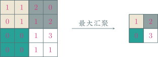

- 平均汇聚 (mean pooling)：取区域内神经元平均值

<div class="top4"></div>

<p class="comments"> 将区域下采样为一个值，减少网络参数，降低模型复杂度</p>

<!-- slide data-notes="" -->

##### 卷积神经网络

---

卷积神经网络由卷积层、汇聚层、全连接层交叉堆叠而成

@import "../dot/cnn.dot" {.center}

<div class="top0"></div>

趋势

- 更小的卷积核，比如$3 \times 3$
- 更深的结构，比如层数大于$50$
- 汇聚层的作用可由卷积步长代替，使用逐渐减少，趋向于全卷积网络

<!-- slide data-notes="" -->

##### 经典网络 LeNet-5

---

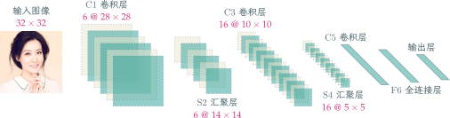

<!-- slide vertical=true data-notes="" -->

##### LeNet-5 手写数字识别

---

@import "../python/lenet-mnist.py" {.line-numbers .top-1 .left4}

<!-- slide data-notes="" -->

##### 经典网络复用

---

使用在 ImageNet 训练好的残差网络 ResNet50 进行图像分类

@import "../python/resnet50-reuse.py" {.line-numbers .top-1}


<!-- slide data-notes="" -->

##### 语言模型

---

对于给定序列$\xv_1, \ldots, \xv_T$，计算联合概率$p(\xv_T, \ldots, \xv_1)$

- $p(\mathrm{make America great again}) > p(\mathrm{great America make again}) ?$，判别哪个序列更像人话
- 预测下一个词：hello [ world | China | Wuhan | HUST ]？

<div class="bottom4"></div>

前面的词很重要：As the debugger reports no error, the screen prints hello <span class="blue">world</span>

根据条件概率公式

<p>
\begin{align}
    p(\xv_T, \ldots, \xv_1) = p(\xv_T | \xv_{T-1}, \ldots, \xv_1) \cdots p(\xv_3 | \xv_2, \xv_1) ~ p(\xv_2 | \xv_1) ~ p(\xv_1)
\end{align}
</p>

引入马尔可夫假设：当前词出现的概率只依赖于前$n - 1$个词

<!-- slide vertical=true data-notes="" -->

##### n-gram 统计语言模型

---

当前词出现的概率只依赖于前$n - 1$个词

- $n = 1: p(\xv_i | \xv_{i-1}, \ldots, \xv_1) = p(\xv_i)$
- $n = 2: p(\xv_i | \xv_{i-1}, \ldots, \xv_1) = p(\xv_i | \xv_{i-1})$
- $n = 3: p(\xv_i | \xv_{i-1}, \ldots, \xv_1) = p(\xv_i | \xv_{i-1}, \xv_{i-2})$

<div class="bottom2"></div>

优点：

- 采用极大似然估计，参数易训练 (数数)
- 完全包含了前$n - 1$个词的全部信息
- 可解释性强，直观易理解

<div class="bottom2"></div>

缺点：

- 不够灵活，只能固定地看前$n - 1$个词
- 随着$n$的增大，参数空间呈指数增长
- 单纯的基于统计频次，泛化能力差

<!-- slide vertical=true data-notes="" -->

##### 神经语言模型

---

第一层为嵌入 (embedding) 层

- 设词典里共有$N$个词
- $N$维独热编码 → $d$维词向量
- 可学习参数总个数为$N \times d$

<div class="threelines width50 lefta right4 top-20per bottom-2 tighttable">

| 编号 |   单词   | 独热编码 |    词向量     |
| :--: | :------: | :------: | :-----------: |
|  1   |    as    | 0…00001  | [1.2, 3.1, …] |
|  2   |   the    | 0…00010  | [0.1, 4.2, …] |
|  3   | debugger | 0…00100  | [1.0, 3.1, …] |

</div>

$4$个词的滑动窗口，词向量维度$d = 5$，隐藏层神经元个数$13$

@import "../dot/nn4langmodel.dot" {.top-1}

<p class="width29 lefta right5 top-24per bottom-2">神经网络的结构得先固定，故滑动窗口大小得先固定，模型灵活性不够</p>

<!-- slide data-notes="" -->

##### 循环神经网络

---

处理任意长序列，记住之前得到的信息

给定序列$\xv_1, \ldots, \xv_T$，循环神经网络更新为

<p>
\begin{align}
    \av_t = h(\class{yellow}{\Uv \av_{t-1}} + \Wv \xv_t + \bv), ~ \av_0 = \zerov
\end{align}
</p>

其中$h$是一个非线性激活函数

循环神经网络隐藏层神经元存在自指，时间维度上权值共享

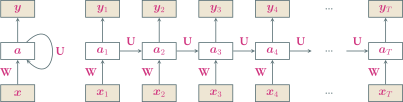

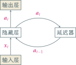

<!-- slide vertical=true data-notes="" -->

##### 动力系统观点

---

<p>
\begin{align}
    \zv_t & = \class{yellow}{\Uv \av_{t-1}} + \Wv \xv_t + \bv \\
    \av_t & = h(\zv_t)
\end{align}
</p>

循环神经网络的更新可以看成一个<span class="blue">动力系统</span>，因此隐藏层的输出$\av_t$在很多文献上也称为<span class="blue">状态</span> (state)

梯度下降就是在用 (前向) 欧拉法离散地求解动力系统

<p>
\begin{align}
    \wv_{t+1} = \wv_t - \eta f'(\wv_t) \Longrightarrow \frac{\wv_{t+1} - \wv_t}{\eta} = - f'(\wv_t) \Longrightarrow \dot{\wv} = - f'(\wv)
\end{align}
</p>

Nesterov 加速梯度的动力系统表示：$\ddot{\wv} + (3/t) \dot{\wv} = - f'(\wv)$

<p class="footnote book"> 动力系统 (dynamical system)：使用 (微分) 方程描述空间中所有点随时间变化情况的系统</p>

<!-- slide vertical=true data-notes="" -->

##### 动力系统观点

---

梯度下降的微分方程表示：$\dot{\wv} = - f'(\wv)$

引入函数

<p>
\begin{align}
    \ec(t) = t (f(\wv) - f^\star) + \frac{1}{2} \| \wv - \wv^\star \|_2^2
\end{align}
</p>

<p>
\begin{align}
    \ec'(t) & = f(\wv) - f^\star + t \dot{\wv}^\top f'(\wv) + \dot{\wv}^\top (\wv - \wv^\star) \\
    & = - \|f'(\wv)\|_2^2 + f(\wv) - f^\star - f'(\wv)^\top (\wv - \wv^\star) \\
    & = - \|f'(\wv)\|_2^2 + f(\wv) + f'(\wv)^\top (\wv^\star - \wv) - f^\star \leq 0
\end{align}
</p>

根据$\ec$单调下降可得梯度下降的收敛率

<p>
\begin{align}
    f(\wv) - f^\star \leq \frac{\ec(t)}{t} \leq \frac{\ec(0)}{t} = \frac{\| \wv_0 - \wv^\star \|_2^2}{2t} = O \left( \frac{1}{t} \right)
\end{align}
</p>

<!-- slide data-notes="" -->

##### 应用到机器学习

---

序列到类别的模式

输入$\xv_1, \ldots, \xv_T$，输出$\yh \in [c]$，文本分类、情感分析

两种模式：

- 序列的最终表示$\av_T$输入给分类器$g$进行分类：$\hat{y} = g(\av_T)$
- 将整个序列的平均状态$\av$输入给分类器$g$进行分类：$\hat{y} = g(\av)$

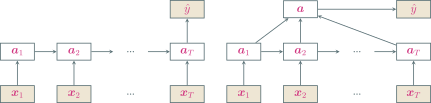

<!-- slide vertical=true data-notes="" -->

##### IMDB 影评情感分析

---

@import "../python/rnn-imdb.py" {.line-numbers .top-1 .left4 highlight=[]}

<!-- slide vertical=true data-notes="" -->

##### 应用到机器学习

---

同步的序列到序列模式

输入$\xv_1, \ldots, \xv_T$，同步输出$\yh_1, \ldots, \yh_T$，词性标注、股市预测

<p>
\begin{align}
    \hat{y}_t = g(\av_t), ~ \forall t \in [T]
\end{align}
</p>

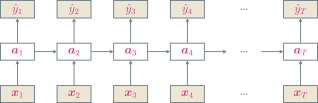

<!-- slide vertical=true data-notes="" -->

##### 应用到机器学习

---

异步的序列到序列模式，也称为<span class="blue">编码器-解码器</span>模型

输入$\xv_1, \ldots, \xv_T$，输出$\yvh_1, \ldots, \yvh_S$，无需同步输出和保持相同长度，机器翻译、问答系统、图像描述

<p>
\begin{align}
    \av_t & = h_1 (\av_{t-1}, \xv_t), ~ \forall t \in [T] \\
    \av_{T+t} & = h_2 (\av_{T+t-1}, \yvh_{t-1}), ~ \forall t \in [S] \\
    \yvh_t & = g(\av_{T+t}), ~ \forall t \in [S]
\end{align}
</p>

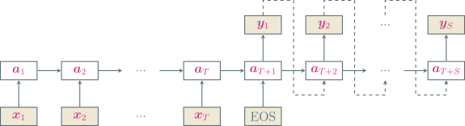

<!-- slide data-notes="" -->

##### 随时间反向传播

---

对$\zv = \Wv \av + \bv$有

<p>
\begin{align}
    \frac{\partial z_j}{\partial \Wv} = \av \ev_j^\top, \quad \frac{\partial \zv}{\partial \bv} = \Iv, \quad \frac{\partial \zv}{\partial \av} = \Wv
\end{align}
</p>

<br>

同理对$\zv_k = \Uv \av_{k-1} + \Wv \xv_k + \bv$有

<p>
\begin{align}
    \frac{\partial [\zv_k]_j}{\partial \Uv} = \av_{k-1} \ev_j^\top, \quad \frac{\partial [\zv_k]_j}{\partial \Wv} = \xv_k \ev_j^\top, \quad \frac{\partial \zv_k}{\partial \bv} = \Iv, \quad \frac{\partial \zv_k}{\partial \av_{k-1}} = \Uv
\end{align}
</p>

随时间反向传播 (<span class="blue">b</span>ack<span class="blue">p</span>ropagation <span class="blue">t</span>hrough <span class="blue">t</span>ime, BPTT)：

- 循环神经网络可看作展开的多层前馈网络，每层对应每个时刻
- 所有层参数共享，因此参数的真实梯度是所有“展开层”的梯度之和

<!-- slide vertical=true data-notes="" -->

##### 随时间反向传播

---

对$\zv_k = \Uv \av_{k-1} + \Wv \xv_k + \bv$有

<p>
\begin{align}
    \frac{\partial [\zv_k]_j}{\partial \Uv} = \av_{k-1} \ev_j^\top, \quad \frac{\partial [\zv_k]_j}{\partial \Wv} = \xv_k \ev_j^\top, \quad \frac{\partial \zv_k}{\partial \bv} = \Iv, \quad \frac{\partial \zv_k}{\partial \av_{k-1}} = \Uv
\end{align}
</p>

记时刻$t$损失为$\lc_t$，总损失$\lc = \sum_{t \in [T]} \lc_t$，$\deltav_{t,k}^\top = \partial \lc_t / \partial \zv_k$为时刻$t$的损失对时刻$k \in [t]$隐藏层输入的导数

注意$\av_k = h(\zv_k)$，由链式法则

<p>
\begin{align}
    \deltav_{t,k}^\top = \frac{\partial \lc_t}{\partial \zv_k} = \frac{\partial \lc_t}{\partial \zv_{k+1}} \frac{\partial \zv_{k+1}}{\partial \av_k} \frac{\partial \av_k}{\partial \zv_k} = \deltav_{t,k+1}^\top \Uv ~  \diag (h'(\zv_k))
\end{align}
</p>

依然有反向传播的结构

<!-- slide vertical=true data-notes="" -->

##### 随时间反向传播

---

对$\zv_k = \Uv \av_{k-1} + \Wv \xv_k + \bv$有

<p>
\begin{align}
    \frac{\partial [\zv_k]_j}{\partial \Uv} = \av_{k-1} \ev_j^\top, \quad \frac{\partial [\zv_k]_j}{\partial \Wv} = \xv_k \ev_j^\top, \quad \frac{\partial \zv_k}{\partial \bv} = \Iv, \quad \frac{\partial \zv_k}{\partial \av_{k-1}} = \Uv
\end{align}
</p>

记时刻$t$损失为$\lc_t$，总损失$\lc = \sum_{t \in [T]} \lc_t$，$\deltav_{t,k}^\top = \partial \lc_t / \partial \zv_k$为时刻$t$的损失对时刻$k \in [t]$隐藏层输入的导数

<p>
\begin{align}
    \frac{\partial \lc}{\partial \Uv} & = \sum_{t \in [T]} \sum_{k \in [t]} \sum_j \frac{\partial \lc_t}{\partial [\zv_k]_j} \frac{\partial [\zv_k]_j}{\partial \Uv} = \sum_{t \in [T]} \sum_{k \in [t]} \av_{k-1} \deltav_{t,k}^\top \\
    \frac{\partial \lc}{\partial \Wv} & = \sum_{t \in [T]} \sum_{k \in [t]} \sum_j \frac{\partial \lc_t}{\partial [\zv_k]_j} \frac{\partial [\zv_k]_j}{\partial \Wv} = \sum_{t \in [T]} \sum_{k \in [t]} \xv_k \deltav_{t,k}^\top \\
    \frac{\partial \lc}{\partial \bv} & = \sum_{t \in [T]} \sum_{k \in [t]} \frac{\partial \lc_t}{\partial \zv_k} \frac{\partial \zv_k}{\partial \bv} = \deltav_{t,k}^\top
\end{align}
</p>

<!-- slide data-notes="" -->

##### 长程依赖问题

---

设$t > k$，反向传播公式经递推有

<p>
\begin{align}
    \deltav_{t,k}^\top = \deltav_{t,k+1}^\top \Uv ~  \diag (h'(\zv_k))  = \cdots = \deltav_{t,t} ~ \Pi_{\tau=k}^{t-1} \left( \Uv ~ \diag (h'(\zv_\tau)) \right)
\end{align}
</p>

定义$\gamma = \| \Uv ~ \diag (h'(\zv_\tau)) \|$

- 若$\gamma > 1$，当$t - k \to \infty$时，出现梯度爆炸
- 若$\gamma < 1$，当$t - k \to \infty$时，出现梯度消失

<div class="top2"></div>

长程依赖问题：循环神经网络理论上可学习长时间间隔状态间的依赖，但由于梯度爆炸/消失，实际上只能学习短期的依赖

- 挑选激活函数使得$\| \Uv ~ \diag (h'(\zv_\tau)) \| \approx 1$，需要足够的炼丹经验
- 梯度爆炸：权重衰减，梯度截断
- 梯度消失：引入残差结构$\av_t = \av_{t-1} + f(\xv_t, \av_{t-1})$，但随着时间$t$的增长，$\av_t$会越来越大，隐状态变得饱和，但其存储信息的能力是有限的

<!-- slide vertical=true data-notes="" -->

##### 门控机制

---

有选择地加入新信息，同时有选择地遗忘之前累积的信息

- 长短期记忆 (<span class="blue">l</span>ong <span class="blue">s</span>hort-<span class="blue">t</span>erm <span class="blue">m</span>emory, LSTM) 网络
- 门控循环单元 (<span class="blue">g</span>ated <span class="blue">r</span>ecurrent <span class="blue">u</span>nit, GRU) 网络

<!-- slide data-notes="" -->

##### LSTM 网络

---

引入一个新的内部状态$\cv_t$专门进行线性的循环信息传递，同时输出信息给隐藏层的外部状态$\av_t$

<p>
\begin{align}
    \cv_t & = \fv_t \odot \cv_{t-1} + \iv_t \odot \widetilde{\cv}_t \\
    \av_t & = \ov_t \odot \tanh(\cv_t)
\end{align}
</p>

其中$\odot$为向量元素乘积

- $\widetilde{\cv}_t = \tanh(\Wv_c \xv_t + \Uv_c \av_{t−1} + \bv_c)$是通过非线性函数得到的候选状态
- <span class="blue">遗忘门</span>$\fv_t = \sigma(\Wv_f \xv_t + \Uv_f \av_{t−1} + \bv_f) \in (0,1)$控制上一个时刻的内部状态$\cv_{t-1}$需要遗忘多少信息
- <span class="blue">输入门</span>$\iv_t = \sigma(\Wv_i \xv_t + \Uv_i \av_{t−1} + \bv_i) \in (0,1)$控制当前时刻的候选状态$\widetilde{\cv}_t$需要保存多少信息
- <span class="blue">输出门</span>$\ov_t = \sigma(\Wv_o \xv_t + \Uv_o \av_{t−1} + \bv_o) \in (0,1)$控制当前时刻的内部状态$\cv_t$需要输出多少信息给外部状态$\av_t$

<!-- slide vertical=true data-notes="" -->

##### LSTM 网络

---

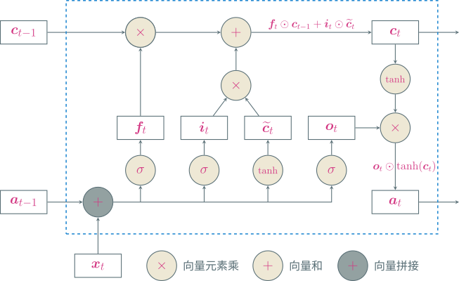

<!-- slide vertical=true data-notes="" -->

##### LSTM 网络

---

LSTM 网络的紧凑形式

<p>
\begin{align}
    \begin{bmatrix}
        \widetilde{\cv}_t \\ \ov_t \\ \iv_t \\ \fv_t
    \end{bmatrix} & = \begin{bmatrix}
        \tanh \\ \sigma \\ \sigma \\ \sigma
    \end{bmatrix} \left( \Wv \begin{bmatrix}
        \xv_t \\ \av_{t-1}
    \end{bmatrix} + \bv \right) \\
    \cv_t & = \fv_t \odot \cv_{t-1} + \iv_t \odot \widetilde{\cv}_t \\
    \av_t & = \ov_t \odot \tanh(\cv_t)
\end{align}
</p>

循环神经网络中的隐状态$\av$存储了历史信息，可以看作一种记忆，但它每个时刻都会被重写，因此只是一种短期记忆

LSTM 中的记忆单元$\cv$可以在某个时刻捕捉到关键信息将其保存，且生命周期要长于短期记忆$\av$，因此称为长的短期记忆

<!-- slide vertical=true data-notes="" -->

##### LSTM 网络变种

---

无遗忘门的 LSTM 网络：$\cv_t = \fv_t \odot \cv_{t-1} + \iv_t \odot \widetilde{\cv}_t$，记忆饱和

<div class="top2"></div>

peephole 连接：三个门不但依赖于输入$\xv_t$和上一时刻的隐状态$\av_{t−1}$，也依赖于上一个时刻的记忆单元$\cv_{t−1}$

<p>
\begin{align}
    \fv_t & = \sigma(\Wv_f \xv_t + \Uv_f \av_{t−1} + \Vv_f \cv_{t−1} + \bv_f) \\
    \iv_t & = \sigma(\Wv_i \xv_t + \Uv_i \av_{t−1} + \Vv_i \cv_{t−1} + \bv_i) \\
    \ov_t & = \sigma(\Wv_o \xv_t + \Uv_o \av_{t−1} + \Vv_o \cv_{t−1} + \bv_o)
\end{align}
</p>

耦合输入门和遗忘门：LSTM 中的输入门和遗忘门有些互补关系，同时用两个门存在冗余

<p>
\begin{align}
    \cv_t = (\onev - \iv_t) \odot \cv_{t-1} + \iv_t \odot \widetilde{\cv}_t
\end{align}
</p>

<!-- slide data-notes="" -->

##### GRU 网络

---

不引入额外的记忆单元，更新方式为

<p>
\begin{align}
    \av_t = \zv_t \odot \av_{t−1} + (\onev − \zv_t) \odot \widetilde{\av}_t
\end{align}
</p>

<div class="bottom2"></div>

- $\zv_t = \sigma(\Wv_z \xv_t + \Uv_z \av_{t−1} + \bv_z) \in (0,1)$为更新门
- $\widetilde{\av}_t = \tanh(\Wv_a \xv_t + \Uv_a (\rv_t \odot \av_{t−1}) + \bv_a)$表示当前时刻的候选状态
- $\rv_t = \sigma(\Wv_r \xv_t + \Uv_r \av_{t−1} + \bv_r) \in (0,1)$为重置门，控制候选状态$\widetilde{\av}_t$的计算是否依赖上一时刻的状态$\av_{t−1}$

<div class="bottom2"></div>

几个特例

- $\zv_t = \onev$，当前状态$\av_t$等于上一时刻状态$\av_{t−1}$，和当前输入$\xv_t$无关
- $\zv_t = \zerov$、$\rv = \onev$，GRU 网络退化为简单循环网络
- $\zv_t = \zerov$、$\rv = \zerov$，当前状态$\av_t$只和当前输入$\xv_t$相关，和上一时刻的状态$\av_{t−1}$无关

<!-- slide vertical=true data-notes="" -->

##### GRU 网络

---

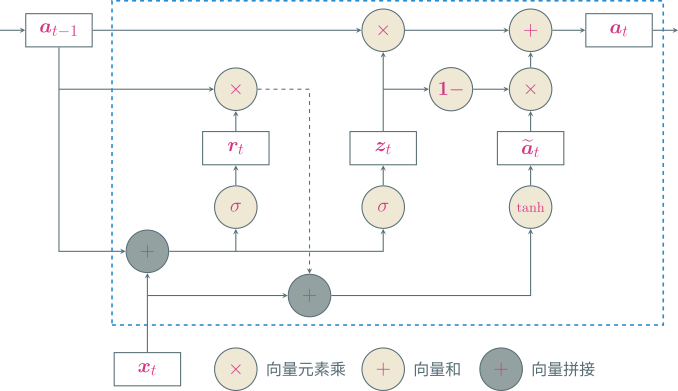

<!-- slide data-notes="" -->

##### 深层循环网络

---

增加同一时刻网络输入到输出之间的路径$\xv_t \to \hat{y}_t$，从而增强循环神经网络的能力

堆叠循环神经网络：将多个循环网络堆叠起来

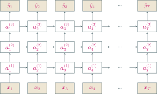

<!-- slide vertical=true data-notes="" -->

##### 深层循环网络

---

增加同一时刻网络输入到输出之间的路径$\xv_t \to \hat{y}_t$，从而增强循环神经网络的能力

双向循环神经网络：两层循环神经网络信息传递方向不同

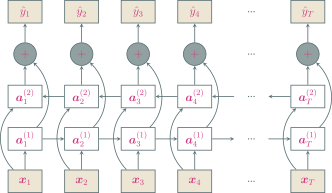

<!-- slide data-notes="" -->

##### 注意力机制

---

<span class="blue">编码器-解码器</span> (encoder-decoder) 模型

<p>
\begin{align}
    \av_{T+1} = f(\xv_1, \ldots, \xv_T), \quad \yv_s = g(\av_{T+1}, \yv_1, \ldots, \yv_{s-1}), ~ s \in [S]
\end{align}
</p>


问题：生成每个目标$\yv_s$时，使用的都是相同的语义编码$\av_{T+1}$

I love you <span class="blue">China</span> → 我爱你 <span class="blue">中国</span>

<!-- slide vertical=true data-notes="" -->

##### 注意力机制

---

每次输出，从输入序列中遴选信息，使用不同的语义编码

<p>
\begin{align}
    \cv_1 & = f_1(\xv_1, \ldots, \xv_T), \quad \yv_1 = g(\cv_1) \\
    \cv_2 & = f_2(\xv_1, \ldots, \xv_T), \quad \yv_2 = g(\cv_2, \yv_1) \\
    \cv_3 & = f_3(\xv_1, \ldots, \xv_T), \quad \yv_3 = g(\cv_3, \yv_1, \yv_2) \\
    & \qquad \vdots \\
    \cv_S & = f_S(\xv_1, \ldots, \xv_T), \quad \yv_S = g(\cv_S, \yv_1, \yv_2, \ldots, \yv_{S-1}) \\
\end{align}
</p>

引入一个和当前输出相关的查询$\qv$，通过打分函数$s(\cdot, \cdot)$计算每个输入与查询之间的相关性，即注意力，据此计算语义编码$\cv$

- 打分函数的设计？
- 如何计算$\cv = \att(\Xv, \qv)$

<!-- slide vertical=true data-notes="" -->

##### 注意力机制

---

打分函数

- 加性模型：$s(\xv_i, \qv) = \vv^\top \tanh (\Wv \xv_i + \Uv \qv)$
- 点积模型：$s(\xv_i, \qv) = \xv_i^\top \qv$
- 缩放点积模型：$s(\xv_i, \qv) = \xv_i^\top \qv / \sqrt{d}$
- 双线性模型：$s(\xv_i, \qv) = \xv_i^\top \Wv \qv$

其中$\Wv, \Uv, \vv$为可学习的参数，$d$为输入向量的维度

计算$\att(\Xv, \qv)$：依据<span class="blue">注意力值</span>加权平均，例如

<p>
\begin{align}
    \att(\Xv, \qv) = \sum_{t \in [T]} \class{yellow}{\alpha_t} \xv_t, \quad \class{yellow}{\alpha_t} = \softmax (s(\xv_t, \qv)) = \frac{\exp(s(\xv_t, \qv))}{\sum_{i \in [T]} \exp(s(\xv_i, \qv))}
\end{align}
</p>

<!-- slide vertical=true data-notes="" -->

##### 软性注意力机制

---

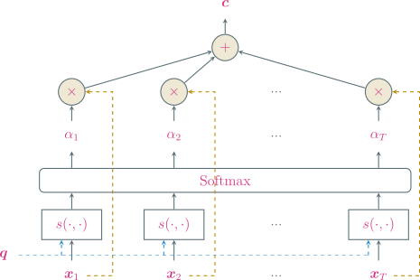

<!-- slide vertical=true data-notes="" -->

##### 注意力机制变体

---

<span class="blue">硬性注意力</span>：只注意一个输入

- 选取注意力值最高的：$j = \argmax_{t \in [T]} \alpha_t$，$\att(\Xv, \qv) = \xv_j$
- 根据注意力分布随机采样

<div class="bottom2"></div>

缺点：损失函数与注意力值的函数关系不可导，无法使用反向传播进行训练

<div class="bottom2"></div>

<span class="blue">键值对注意力</span>：输入$(\Kv, \Vv) = [(\kv_1, \vv_1), \ldots, (\kv_T, \vv_T)]$

- 键用来计算注意力，值用来计算输出
- 当$\Kv = \Vv$时，键值对注意力就退化成普通的注意力

<div class="bottom2"></div>

<p>
\begin{align}
    \att((\Kv, \Vv), \qv) = \sum_{t \in [T]} \class{yellow}{\alpha_t} \vv_t, \quad \class{yellow}{\alpha_t} = \frac{\exp(s(\kv_t, \qv))}{\sum_{i \in [T]} \exp(s(\kv_i, \qv))}
\end{align}
</p>

<!-- slide vertical=true data-notes="" -->

##### 注意力机制变体

---

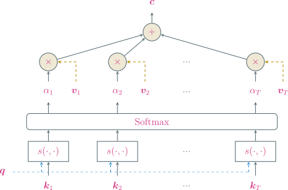

<!-- slide vertical=true data-notes="" -->

##### 注意力机制变体

---

<span class="blue">多头注意力</span>：多个查询并行$\Qv = [\qv_1, \ldots, \qv_M]$，选取多组信息

<p>
\begin{align}
    \att((\Kv, \Vv), \Qv) = \mlp(\att((\Kv, \Vv), \qv_1) \oplus \cdots \oplus \att((\Kv, \Vv), \qv_M))
\end{align}
</p>

其中$\oplus$表示向量拼接

<div class="bottom2"></div>

<span class="blue">结构化注意力</span>：

- 前面的注意力机制都假设所有输入信息同等重要，是一种扁平结构
- 如果输入信息本身具有层次结构，比如文本可以分为词、句子、段落、篇章等不同粒度的层次，可以使用层次化注意力进行更好的信息选择

<!-- slide data-notes="" -->

##### 注意力机制应用

---

注意力机制一般作为神经网络的一个组件，用来做信息遴选

- 查询通常采用解码器的隐藏状态
- 键、值通常采用编码器的隐藏状态

<div class="bottom4"></div>

指针网络：将注意力分布作为指出相关信息位置的软性指针

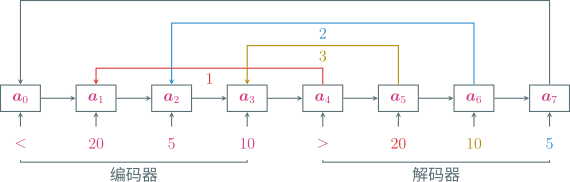

<!-- slide vertical=true data-notes="" -->

##### 注意力机制应用

---

建立输入序列间的长距离依赖关系

- CNN、RNN 都是局部编码，只有增加层数才能进行远距离信息交互
- 全连接神经网络可直接进行远距离信息交互，但参数对位置是固定的

<div class="bottom4"></div>

自注意力机制

- 每个输入同时充当查询、键、值三个角色，输入之间相互计算注意力
- 忽略了输入信息的位置，单独使用时需加入位置编码信息来进行修正

<div class="bottom2"></div>

<p>
\begin{align}
    \Xv & = [\xv_1, \ldots, \xv_T] \in \rb^{d \times T} \\
    \Qv & = \Wv_Q \Xv, \quad \Kv = \Wv_K \Xv, \quad \Vv = \Wv_V \Xv \\
    \cv_i & = \att((\Kv, \Vv), \qv_i) = \sum_{t \in [T]} \alpha_{it} \vv_t = \sum_{t \in [T]} \softmax(s(\qv_i, \kv_t)) \vv_t
\end{align}
</p>

<!-- slide data-notes="灵材：可免费获取的 MNIST 有 10 类，ImageNet 则有上千类，丹师是从药童做起，多模态：混合灵草和妖兽 <br><br> 丹方里最重要的是灵阵，控制如何抽取和凝结灵材中的灵性。灵阵中有若干节点，然后通过回路连接这些节点。灵材沿着回路游走经过每个节点处进行一步一步的提纯 <br><br> 半自动 不用你手动求导 做反向传播 更高端的可以使用多个丹炉同时开火炼制一枚灵丹 tf boy pt boy <br><br> 手中富裕的买 囊中羞涩的租" -->

##### 当代炼丹术

---

@import "../dot/alchemy.dot" {.center}

<div class="top-1"></div>

一个优秀丹师的自我修养：

- 灵材品质差要会自己手搓，旋转、翻转、缩放、平移、加噪声
- 因材制宜设计灵阵，空间灵材用卷积灵阵，时间灵材用循环灵阵，...
- 仔细观察丹炉状态，防止爆炉，若仙丹成色不好则改进配置重新来过
