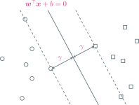
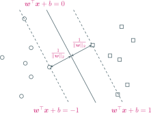
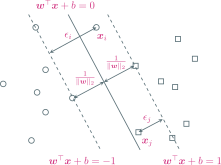
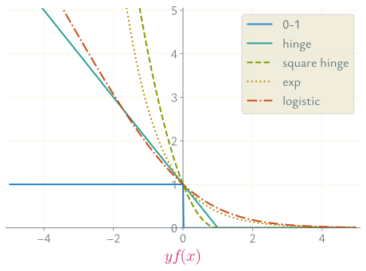

---
presentation:
  margin: 0
  center: false
  transition: "none"
  enableSpeakerNotes: true
  slideNumber: "c/t"
  navigationMode: "linear"
---

@import "../css/font-awesome-4.7.0/css/font-awesome.css"
@import "../css/theme/solarized.css"
@import "../css/logo.css"
@import "../css/font.css"
@import "../css/color.css"
@import "../css/margin.css"
@import "../css/table.css"
@import "../css/main.css"
@import "../plugin/zoom/zoom.js"
@import "../plugin/notes/notes.js"
@import "../plugin/customcontrols/plugin.js"
@import "../plugin/customcontrols/style.css"
@import "../plugin/chalkboard/plugin.js"
@import "../plugin/chalkboard/style.css"
@import "../plugin/reveal.js-menu/menu.js"
@import "../js/anychart/anychart-core.min.js"
@import "../js/anychart/anychart-venn.min.js"
@import "../js/anychart/pastel.min.js"
@import "../js/anychart/venn-entropy.js"
@import "https://cdn.bootcdn.net/ajax/libs/jquery/3.5.0/jquery.js"

<!-- slide data-notes="" -->

# 机器学习

## 支持向量机

### 计算机学院&emsp;张腾

#### *tengzhang@hust.edu.cn*

<!-- slide vertical=true data-notes="" -->

##### 大纲

---

@import "../vega/outline.json" {as="vega" .top-2}

<!-- slide vertical=true data-notes="" -->

##### 发明人

---

Vladimir Vapnik：苏联统计学家

Corinna Cortes：纽约 Google Research 的负责人

    
    

<!-- slide vertical=true data-notes="" -->

##### 最大间隔准则

---

$\dc = \{ (\xv_i, y_i) \}_{i \in [m]}$，$\xv_i \in \xc \subseteq \rb^d$，$y_i \in \{ 1, -1 \}$

超平面$\wv^\top \xv + b = 0$，点$(\xv_i, y_i)$到超平面的距离为$\frac{y_i (\wv^\top \xv_i + b)}{\|\wv\|_2}$

最大间隔准则：最大化最小距离

\begin{align}
    \max_{\wv,b} & ~ \gamma \\ \st & ~ \frac{y_i (\wv^\top \xv_i + b)}{\|\wv\|_2} \ge \gamma, ~ \forall i \in [m]
\end{align}

<!-- slide vertical=true data-notes="" -->

##### 最大间隔准则

---

$\dc = \{ (\xv_i, y_i) \}_{i \in [m]}$，$\xv_i \in \xc \subseteq \rb^d$，$y_i \in \{ 1, -1 \}$

\begin{align}
    & \max_{\wv,b} ~ \gamma, \quad \st ~ \frac{y_i (\wv^\top \xv_i + b)}{\|\wv\|_2} \ge \gamma, ~ \forall i \in [m] \\
    & \qquad \qquad \qquad \Updownarrow \\
    & \max_{\wv,b} ~ \frac{\hat{\gamma}}{\|\wv\|_2}, \quad \st ~ y_i (\wv^\top \xv_i + b) \ge \hat{\gamma}, ~ \forall i \in [m] \quad \longleftarrow \hat{\gamma} = \gamma \|\wv\|_2 \\
    & \qquad \qquad \qquad \Updownarrow \\
    & \max_{\wv,b} ~ \frac{1}{\|\wv\|_2}, \quad \st ~ y_i (\wv^\top \xv_i + b) \ge 1, ~ \forall i \in [m] \quad \longleftarrow \hat{\gamma} = 1 \\
    & \qquad \qquad \qquad \Updownarrow \\
    & \min_{\wv,b} ~ \frac{1}{2} \|\wv\|_2^2, \quad \st ~ y_i (\wv^\top \xv_i + b) \ge 1, ~ \forall i \in [m]
\end{align}

$\hat{\gamma}$的取值不影响优化，若$(\wv, b, \hat{\gamma})$是最优解，则$(c \wv, c b, c \hat{\gamma})$也是

<!-- slide data-notes="" -->

##### 支持向量机

---

根据最大间隔准则导出支持向量机：

\begin{align}
    \min_{\wv,b} ~ \frac{1}{2} \|\wv\|_2^2, \quad \st ~ y_i (\wv^\top \xv_i + b) \ge 1, ~ \forall i \in [m]
\end{align}

- 分类超平面$\wv^\top \xv_i + b = 0$
- 支持超平面$\wv^\top \xv_i + b = \pm 1$，位于该超平面上的样本有最小间隔

<!-- slide vertical=true data-notes="" -->

##### 支持向量机

---

根据最大间隔准则导出支持向量机：

\begin{align}
    \min_{\wv,b} ~ \frac{1}{2} \|\wv\|_2^2, \quad \st ~ y_i (\wv^\top \xv_i + b) \ge 1, ~ \forall i \in [m]
\end{align}

该优化问题属于二次规划 (quadratic programming, QP)

- 目标函数是关于$\wv$的强凸 (strongly convex) 二次函数，最优解唯一
- 约束是$m$个线性不等式

上面的 QP 问题称为支持向量机的原问题 (primal problem)

- 可调用标准的 QP 求解器进行求解，但有更高效的方法
- 变量个数等于$d+1$，高维空间中求解可能会很低效
- 另一个等价形式：对偶问题 (dual problem)，两者殊途同归

<!-- slide data-notes="" -->

##### 对偶问题

---

支持向量机原问题：

\begin{align}
    \min_{\wv,b} ~ f(\wv) = \frac{1}{2} \|\wv\|_2^2, \quad \st ~ y_i (\wv^\top \xv_i + b) \ge 1, ~ \forall i \in [m]
\end{align}

引入拉格朗日乘子$\alphav \ge \zerov$，拉格朗日函数为

\begin{align}
    L(\wv, b, \alphav) = \frac{1}{2} \|\wv\|_2^2 - \sum_{i \in [m]} \underbrace{\alpha_i (y_i (\wv^\top \xv_i + b) - 1)}_{\ge ~ 0}
\end{align}

定义对偶函数$g(\alphav) = \min_{\wv,b} L(\wv, b, \alphav)$，于是

\begin{align}
    g(\alphav) = \min_{\wv,b} L(\wv, b, \alphav) \le L(\wv, b, \alphav) \le f(\wv)
\end{align}

- 上式对任意可行 (满足约束) 的$(\wv,b)$均成立
- 设原问题最优解为$(\wv^\star, b^\star)$，则$g(\alphav) \le f(\wv^\star) \triangleq p^\star$

<!-- slide vertical=true data-notes="" -->

##### 对偶问题

---

对$\forall \alphav \ge \zerov$，对偶函数$g(\alphav)$给出了原问题最优值$p^\star$的一个下界

所有下界中最好的下界有多好？即最紧的下界

\begin{align}
    \max_{\alphav \ge \zerov} g(\alphav) & = \max_{\alphav \ge \zerov} \min_{\wv,b} L(\wv, b, \alphav) \\
    & = \max_{\alphav \ge \zerov} \min_{\wv,b} \Bigg\{ \frac{1}{2} \|\wv\|_2^2 - \sum_{i \in [m]} \alpha_i (y_i (\wv^\top \xv_i + b) - 1) \Bigg\}
\end{align}

先化简内部优化问题，令$L(\wv, b, \alphav)$关于$\wv$和$b$的偏导为零

\begin{align}
    \wv = \sum_{i \in [m]} \alpha_i y_i \xv_i, \quad \sum_{i \in [m]} \alpha_i y_i = 0
\end{align}

<!-- slide vertical=true data-notes="" -->

##### 对偶问题

---

$\wv = \sum_{i \in [m]} \alpha_i y_i \xv_i$，$\sum_{i \in [m]} \alpha_i y_i = 0$，回代可得

\begin{align}
    \max_{\alphav \ge \zerov} g(\alphav) & = \max_{\alphav \ge \zerov} \min_{\wv,b} \Bigg\{ \frac{1}{2} \|\wv\|_2^2 - \sum_{i \in [m]} \alpha_i (y_i (\wv^\top \xv_i + b) - 1) \Bigg\} \\
    & = \max_{\alphav \ge \zerov} \Bigg\{ - \frac{1}{2} \sum_{i \in [m]} \sum_{j \in [m]} \alpha_i \alpha_j y_i y_j \xv_i^\top \xv_j + \sum_{i \in [m]} \alpha_i \Bigg\} \\
    & = \max_{\alphav \ge \zerov} \bigg\{ - \frac{1}{2} \alphav^\top \Hv \alphav + \onev^\top \alphav \bigg\} \quad \longleftarrow [\Hv]_{ij} = y_i y_j \xv_i^\top \xv_j
\end{align}

这就是支持向量机的对偶问题，依然是个 QP 问题

- 将$\max$改成$\min$，去掉负号，目标函数是关于$\alphav$的凸二次函数
- $\alphav \ge \zerov$是$m$个线性不等式约束，$\sum_{i \in [m]} \alpha_i y_i = 0$是一个等式约束
- 变量个数等于样本数$m$，与维度无关

<!-- slide data-notes="" -->

##### 强对偶

---

支持向量机的原问题和对偶问题分别为

\begin{align}
    & \min_{\wv,b} ~ f(\wv) = \frac{1}{2} \|\wv\|_2^2, \quad \st ~ y_i (\wv^\top \xv_i + b) \ge 1, ~ \forall i \in [m] \\
    & \max_{\alphav \ge \zerov} ~ g(\alphav) = - \frac{1}{2} \sum_{i \in [m]} \sum_{j \in [m]} \alpha_i \alpha_j y_i y_j \xv_i^\top \xv_j + \sum_{i \in [m]} \alpha_i, \quad \st ~ \yv^\top \alphav = 0
\end{align}

设最优解分别为$(\wv^\star, b^\star)$、$\alphav^\star$，记$p^\star = f(\wv^\star)$、$d^\star = g(\alphav^\star)$

- 弱对偶：$d^\star \le p^\star$，必然成立
- 强对偶：$d^\star = p^\star$，并不总是成立，但对支持向量机是成立的

 有一些判定强对偶成立的充分条件，如 <a href="https://en.wikipedia.org/wiki/Slater%27s_condition" target="_blank">Slater 条件</a>

<!-- slide vertical=true data-notes="" -->

##### 最优性条件

---

根据强对偶性，下式所有不等号只能取等号

\begin{align}
    f(\wv^\star) = g(\alphav^\star) & = \min_{\wv,b} L(\wv, b, \alphav^\star) \\
    & = \min_{\wv,b} \Bigg\{ \frac{1}{2} \|\wv\|_2^2 - \sum_{i \in [m]} \alpha_i^\star (y_i (\wv^\top \xv_i + b) - 1) \Bigg\} \\
    & \overset{①}{\le} \frac{1}{2} \|\wv^\star\|_2^2 - \sum_{i \in [m]} \alpha_i^\star (y_i ({\wv^\star}^\top \xv_i + b^\star) - 1) \overset{②}{\le} f(\wv^\star)
\end{align}

①：原问题最优解$(\wv^\star, b^\star)$就是拉格朗日函数的驻点

\begin{align}
    \wv^\star = \sum_{i \in [m]} \alpha_i^\star y_i \xv_i, ~ \sum_{i \in [m]} \alpha_i^\star y_i = 0
\end{align}

<!-- slide vertical=true data-notes="" -->

##### 最优性条件

---

根据强对偶性，下式所有不等号只能取等号

\begin{align}
    f(\wv^\star) = g(\alphav^\star) & = \min_{\wv,b} L(\wv, b, \alphav^\star) \\
    & = \min_{\wv,b} \Bigg\{ \frac{1}{2} \|\wv\|_2^2 - \sum_{i \in [m]} \alpha_i^\star (y_i (\wv^\top \xv_i + b) - 1) \Bigg\} \\
    & \overset{①}{\le} \frac{1}{2} \|\wv^\star\|_2^2 - \sum_{i \in [m]} \alpha_i^\star (y_i ({\wv^\star}^\top \xv_i + b^\star) - 1) \overset{②}{\le} f(\wv^\star)
\end{align}

②：互补松弛条件 (complementary slackness condition)

\begin{align}
    \forall i & \in [m] : ~ \alpha_i^\star (y_i ({\wv^\star}^\top \xv_i + b^\star) - 1) = 0 \\[4pt]
    & \Longleftrightarrow \begin{cases}
    \alpha_i^\star > 0 \Longrightarrow y_i ({\wv^\star}^\top \xv_i + b^\star) = 1 \Longleftrightarrow {\wv^\star}^\top \xv_i + b^\star = y_i \\
    y_i ({\wv^\star}^\top \xv_i + b^\star) > 1 \Longrightarrow \alpha_i^\star = 0
    \end{cases}
\end{align}

<!-- slide vertical=true data-notes="" -->

##### KKT 条件

---

将前面的结果汇总可得 KKT 条件

\begin{align}
    \begin{cases}
    \wv^\star = \sum_{i \in [m]} \alpha_i^\star y_i \xv_i & \longleftarrow \partial L(\wv, b, \alphav^\star) / \partial \wv = \zerov \\
    \sum_{i \in [m]} \alpha_i^\star y_i = 0 & \longleftarrow \partial L(\wv, b, \alphav^\star) / \partial b = 0 \\
    \alpha_i^\star (y_i ({\wv^\star}^\top \xv_i + b^\star) - 1) = 0, ~ \forall i \in [m] & \longleftarrow 互补松弛条件 \\
    y_i ({\wv^\star}^\top \xv_i + b^\star) \ge 1, ~ \alpha_i^\star \ge 0, ~ \forall i \in [m] & \longleftarrow 原问题和对偶问题的约束
    \end{cases}
\end{align}

- $\wv^\star = \sum_{i \in [m]} \alpha_i^\star y_i \xv_i$：原问题最优解只由训练样本线性表出
- 若某个$\alpha_i^\star > 0$，则$y_i ({\wv^\star}^\top \xv_i + b^\star) - 1 = 0$，由此可解出$b^\star$
- 非零$\alpha_i^\star$对应的样本称为支持向量 (support vector, SV)，均位于支持超平面${\wv^\star}^\top \xv_i + b^\star = \pm 1$上，不在支持超平面上的样本对应的$\alpha_i^\star = 0$
- $\wv^\star$只与部分支持向量有关，故名支持向量机 (SV machine, SVM)
- 预测：${\wv^\star}^\top \zv + b^\star = \sum_{i \in [m]} (\alpha_i^\star \xv_i^\top \zv) y_i  + b^\star$，加权多数投票的形式

<!-- slide data-notes="" -->

##### 核支持向量机

---

支持向量机：

\begin{align}
    & \min_{\wv,b} ~ \frac{1}{2} \|\wv\|_2^2, \quad \st ~ y_i (\wv^\top \xv_i + b) \ge 1, ~ \forall i \in [m] \\
    & \max_{\alphav \ge \zerov} \Bigg\{ - \frac{1}{2} \sum_{i \in [m]} \sum_{j \in [m]} \alpha_i \alpha_j y_i y_j \xv_i^\top \xv_j + \sum_{i \in [m]} \alpha_i \Bigg\}, \quad \st ~ \yv^\top \alphav = 0
\end{align}

若数据非线性可分怎么办？核支持向量机

\begin{align}
    & \min_{\wv,b} ~ \frac{1}{2} \|\wv\|_2^2, \quad \st ~ y_i (\wv^\top \class{blue}{\phi(\xv_i)} + b) \ge 1, ~ \forall i \in [m] \\
    & \max_{\alphav \ge \zerov} \Bigg\{ - \frac{1}{2} \sum_{i \in [m]} \sum_{j \in [m]} \alpha_i \alpha_j y_i y_j \class{blue}{\phi(\xv_i)^\top \phi(\xv_j)} + \sum_{i \in [m]} \alpha_i \Bigg\}, \quad \st ~ \yv^\top \alphav = 0
\end{align}

<!-- slide vertical=true data-notes="" -->

##### 核支持向量机

---

训练：

\begin{align}
    & \min_{\wv,b} ~ \frac{1}{2} \|\wv\|_2^2, \quad \st ~ y_i (\wv^\top \phi(\xv_i) + b) \ge 1, ~ \forall i \in [m] \\
    & \max_{\alphav \ge \zerov} \Bigg\{ - \frac{1}{2} \sum_{i \in [m]} \sum_{j \in [m]} \alpha_i \alpha_j y_i y_j \class{blue}{\kappa(\xv_i,\xv_j)} + \sum_{i \in [m]} \alpha_i \Bigg\}, \quad \st ~ \yv^\top \alphav = 0
\end{align}

预测：

\begin{align}
    \wv^\top \phi(\zv) + b = \sum_{i \in [m]} \alpha_i y_i \phi(\xv_i)^\top \phi(\zv) + b = \sum_{i \in [m]} \alpha_i y_i \kappa(\xv_i, \zv) + b
\end{align}

<!-- slide data-notes="" -->

##### 正定核函数

---

对称函数$\kappa: \xc \times \xc \mapsto \rb$可作为某个希尔伯特空间$\hb$的内积函数，当且仅当它是正定核 (positive semidefinite kernel)，即对任意数据集$\{ \xv_i \}_{i \in [m]} \subseteq \xc$，核矩阵$\Kv = [\kappa(\xv_i, \xv_j)]_{i,j \in [m]}$是半正定矩阵

利用已知正定核构造新的正定核，例如$\kappa_1 + \kappa_2$、$\kappa_1 \cdot \kappa_2$等

正向：若$\kappa(\xv_i, \xv_j) = \langle \phi(\xv_i), \phi(\xv_j) \rangle_{\hb}$、$\kappa(\xv, \xv) = \| \phi(\xv) \|_{\hb}^2 \ge 0$

\begin{align}
    \av^\top \Kv \av & = \sum_{i \in [m]} \sum_{j \in [m]} a_i a_j \kappa(\xv_i, \xv_j) = \left\langle \sum_{i \in [m]} a_i \phi(\xv_i), \sum_{j \in [m]} a_j \phi(\xv_j) \right\rangle_{\hb} \\
    & = \left\| \sum_{i \in [m]} a_i \phi(\xv_i) \right\|_{\hb}^2 \ge 0
\end{align}

<!-- slide vertical=true data-notes="" -->

##### 正定核函数

---

反向：考虑$\xc \mapsto \rb$的所有函数构成的空间$\rb^{\xc} = \{ f: \xc \mapsto \rb \}$，对$\forall \xv \in \xc$，函数$\kappa(\cdot, \xv) \in \rb^{\xc}$

考虑所有$\kappa(\cdot, \xv)$张成的线性空间$\hc$，定义

\begin{align}
    \left\langle \sum_i a_i \kappa(\cdot, \xv_i), \sum_j b_j \kappa(\cdot, \xv'_j) \right\rangle_{\hc} = \sum_{i,j} a_i b_j \kappa(\xv_i, \xv'_j) = \av^\top \Kv \bv
\end{align}

验证内积的条件：加法线性、数乘线性、对称性、非负性

记$\phi: \xv \mapsto \kappa(\cdot, \xv)$，于是

\begin{align}
    \kappa(\xv_i, \xv_j) = \langle \kappa(\cdot, \xv_i), \kappa(\cdot, \xv_j) \rangle_{\hc} = \langle \phi(\xv_i), \phi(\xv_j) \rangle_{\hc}
\end{align}

<!-- slide data-notes="" -->

##### 软间隔支持向量机

---

问题：

- 很难确定什么样的核映射能保证样本在新的特征空间线性可分
- 即便恰好找到了这样的核映射，如何确定其没有引起过拟合？

方案：允许约束$y_i (\wv^\top \phi(\xv_i) + b) \ge 1$对少数样本不成立

\begin{align}
    \min_{\wv,b} \Bigg\{\frac{1}{2} \|\wv\|_2^2 + C \underbrace{\sum_{i \in [m]} \ib(y_i (\wv^\top \phi(\xv_i) + b) < 1) }_{破坏约束的样本个数} \Bigg\}
\end{align}

难点：指示函数$\ib(\cdot)$非凸非连续，导致问题很难求解

<!-- slide vertical=true data-notes="" -->

##### 软间隔支持向量机

---

用 hinge 损失代替指示函数可得软间隔支持向量机：

\begin{align}
    \min_{\wv,b} \Bigg\{ \frac{1}{2} \|\wv\|_2^2 + C\sum_{i \in [m]} \max \{ 0, 1- y_i (\wv^\top \phi(\xv_i) + b) \} \Bigg\}
\end{align}

令$\epsilon_i = \max \{ 0, 1- y_i (\wv^\top \phi(\xv_i) + b) \}$可得约束形式：

\begin{align}
    \min_{\wv,b} & ~ \Bigg\{ \frac{1}{2} \|\wv\|_2^2 + C\sum_{i \in [m]} \epsilon_i \Bigg\} \\[2pt]
    \st & ~ y_i (\wv^\top \phi(\xv_i) + b) \ge 1 - \epsilon_i \\
    & ~ \epsilon_i \ge 0, ~ \forall i \in [m]
\end{align}

- $\epsilon_i$称为松弛变量 (slack variable)
- $\epsilon_i$刻画了约束被破坏的程度

<!-- slide vertical=true data-notes="" -->

##### 软间隔支持向量机

---

软间隔支持向量机原问题

\begin{align}
    无约束形式： \min_{\wv,b} & ~ \Bigg\{ \frac{1}{2} \|\wv\|_2^2 + C\sum_{i \in [m]} \max \{ 0, 1- y_i (\wv^\top \phi(\xv_i) + b) \} \Bigg\} \\
    有约束形式： \min_{\wv,b} & ~ \Bigg\{ \frac{1}{2} \|\wv\|_2^2 + C\sum_{i \in [m]} \epsilon_i \Bigg\} \\
    \st & ~ y_i (\wv^\top \phi(\xv_i) + b) \ge 1 - \epsilon_i, ~ \epsilon_i \ge 0, ~ \forall i \in [m]
\end{align}

软间隔支持向量机对偶问题

\begin{align}
    \max_{0 \le \alpha_i \class{blue}{\le C}} \Bigg\{ - \frac{1}{2} \sum_{i \in [m]} \sum_{j \in [m]} \alpha_i \alpha_j y_i y_j \kappa(\xv_i,\xv_j) + \sum_{i \in [m]} \alpha_i \Bigg\}, \quad \st ~ \yv^\top \alphav = 0
\end{align}

 区别就是$\alpha_i$多了个上界约束

<!-- slide data-notes="" -->

##### 支持向量机的求解

---

\begin{align}
    & \min_{\wv,b} \Bigg\{ \frac{1}{2} \|\wv\|_2^2 + C\sum_{i \in [m]} \max \{ 0, 1- y_i (\wv^\top \phi(\xv_i) + b) \} \Bigg\} \\
    & \max_{0 \le \alpha_i \le C} \Bigg\{ - \frac{1}{2} \sum_{i \in [m]} \sum_{j \in [m]} \alpha_i \alpha_j y_i y_j \kappa(\xv_i,\xv_j) + \sum_{i \in [m]} \alpha_i \Bigg\}, \quad \st ~ \yv^\top \alphav = 0
\end{align}

当采用线性核函数时，原问题、对偶问题择其易解者解之

- 原问题无约束，可直接用随机梯度下降及其变种，参考 Pegasos
- 对偶问题可采用 SMO，每次取一对$(\alpha_i, \alpha_j)$进行优化，参考 libSVM

当采用非线性核函数时，一般只考虑对偶问题

省略$b$可去掉等式约束$\yv^\top \alphav = 0$，所有$\alpha_i$去耦合，每次可只取一对$(\alpha_i)$进行优化，即坐标下降，参考 liblinear

<!-- slide data-notes="" -->

##### 正则化项 + 损失函数

---

\begin{align}
    \min_{\wv,b} \Bigg\{ \frac{1}{2} \underbrace{\|\wv\|_2^2}_{正则化项} + C\sum_{i \in [m]} \underbrace{\max \{ 0, 1- y_i (\wv^\top \phi(\xv_i) + b) \}}_{损失函数} \Bigg\}
\end{align}

- $\ell_2$正则$\| \wv \|_2^2$，得到稠密的$\wv$
- $\ell_1$正则$\| \wv \|_1$，得到稀疏的$\wv$，附带特征选择的作用
- $\ell_\infty$正则$\| \wv \|_\infty$，得到所有分量值相同的$\wv$
- $\ell_{2,1}$正则$\sum_j \| \wv_j \|_2$，特征分组，组内稠密，组间稀疏
- $\ell_{1,2}$正则$(\sum_j \| \wv_j \|_1)^2$，特征分组，组内稀疏，组间稠密
- 弹性网：$\ell_1$正则和$\ell_2$正则的线性组合
- OSCAR：$\ell_1$正则和成对$\ell_\infty$正则的线性组合

<!-- slide vertical=true data-notes="" -->

##### 正则化项 + 损失函数

---

\begin{align}
    \min_{\wv,b} \Bigg\{ \frac{1}{2} \underbrace{\|\wv\|_2^2}_{正则化项} + C\sum_{i \in [m]} \underbrace{\max \{ 0, 1- y_i (\wv^\top \phi(\xv_i) + b) \}}_{损失函数} \Bigg\}
\end{align}

- hinge 损失：$l(y, f(\xv)) = \max \{ 0, 1 - y f(\xv) \}$，软间隔支持向量机
- 平方 hinge 损失：$l(y, f(\xv)) = [\max \{ 0, 1 - y f(\xv) \}]^2$
- 平方损失：$l(y, f(\xv)) = (y - f(\xv))^2$，岭回归
- $\epsilon$-不敏感损失：$l(y, f(\xv)) = \max \{ 0, |y - f(\xv)| - \epsilon \}$，支持向量回归
- 指数损失：$l(y, f(\xv)) = \exp (- y f(\xv))$
- 对率损失：$l(y, f(\xv)) = \log (1 + \exp (- y f(\xv)))$，对率回归

<!-- slide vertical=true data-notes="" -->

##### 损失函数

---

<!-- slide vertical=true data-notes="" -->

##### 问题核化条件

---

表示定理 (representer theorem)：考虑一般形式的问题

\begin{align}
    \min_{\wv} \left\{ f( \langle \wv, \phi(\xv_1) \rangle, \ldots, \langle \wv, \phi(\xv_m) \rangle ) + \Omega(\| \wv \|) \right\}
\end{align}

其中$f: \rb^m \mapsto \rb$是任意函数 (损失项)，$\Omega: \rb_+ \mapsto \rb$是单调增函数 (正则项)，则最优解$\wv^\star$是$\phi(\xv_1), \ldots, \phi(\xv_m)$的线性组合

正交分解：$\wv = \uv + \vv$，其中$\uv \in \span \{ \phi(\xv_i) \}_{i \in [m]}$

- $f( \langle \wv, \phi(\xv_1) \rangle, \ldots, \langle \wv, \phi(\xv_m) \rangle ) = f( \langle \uv, \phi(\xv_1) \rangle, \ldots, \langle \uv, \phi(\xv_m) \rangle )$
- $\Omega(\| \wv \|) = \Omega(\sqrt{\| \uv \|^2 + \| \vv \|^2 }) \ge \Omega(\sqrt{\| \uv \|^2}) = \Omega(\| \uv \|)$

即$\wv \rightarrow \uv$后不改变损失项的值，但可以减少正则项的值

<!-- slide data-notes="" -->

##### 间隔 泛化

---

设$\VC (\hc) = d$，ERM 算法至少以$1 - \delta$的概率有

\begin{align}
    R (h_D^\erm) \le R_D (h_D^\erm) + \sqrt{\frac{8 d \ln (2em/d) + 8 \ln (4/\delta)}{m}}
\end{align}

设$\hc$是$\rb^n$中的超平面集合，$\VC$维为$n+1$，若采用高斯核做特征映射，$\VC$维为无穷，上面的泛化界没有意义

支持向量机的$\hc$是$\rb^n$中的大间隔超平面集合

\begin{align}
    R (h) \le R_D (h) + 4 \sqrt{\frac{r^2}{m \rho^2}} + \sqrt{\frac{\ln \log_2 (2 r / \rho) }{m}} + \sqrt{\frac{\log (2 / \delta)}{2m}}
\end{align}

泛化界不依赖$\VC$维

<!-- slide data-notes="vertical=true " -->

##### 模型汇总

---

