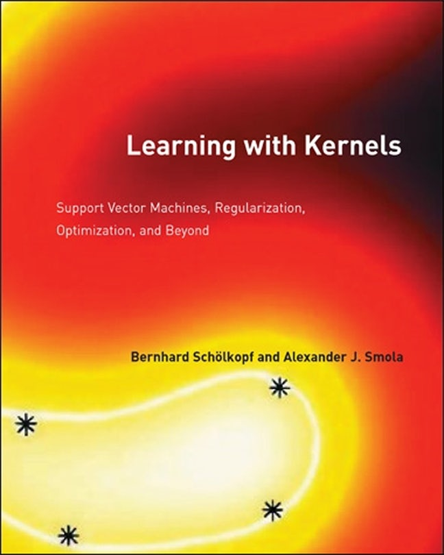
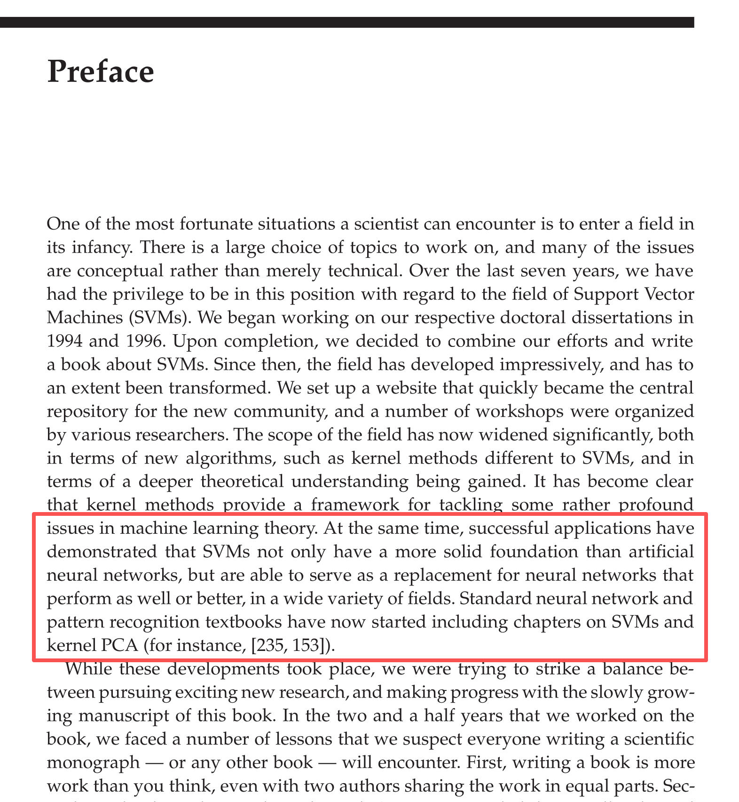
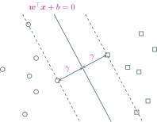
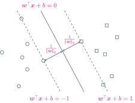
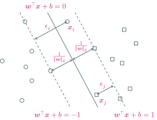

---
presentation:
  margin: 0
  center: false
  transition: "none"
  enableSpeakerNotes: true
  slideNumber: "c/t"
  navigationMode: "linear"
---

@import "../css/font-awesome-4.7.0/css/font-awesome.css"
@import "../css/theme/solarized.css"
@import "../css/logo.css"
@import "../css/font.css"
@import "../css/color.css"
@import "../css/margin.css"
@import "../css/table.css"
@import "../css/main.css"
@import "../plugin/zoom/zoom.js"
@import "../plugin/notes/notes.js"
@import "../plugin/customcontrols/plugin.js"
@import "../plugin/customcontrols/style.css"
@import "../plugin/chalkboard/plugin.js"
@import "../plugin/chalkboard/style.css"
@import "../plugin/reveal.js-menu/menu.js"
@import "../js/anychart/anychart-core.min.js"
@import "../js/anychart/anychart-venn.min.js"
@import "../js/anychart/pastel.min.js"
@import "../js/anychart/venn-entropy.js"

<!-- slide data-notes="" -->

# 机器学习

## 支持向量机

### 计算机学院&emsp;张腾

#### *tengzhang@hust.edu.cn*

<!-- slide vertical=true data-notes="" -->

##### 大纲

---

@import "../vega/outline.json" {as="vega" .top-2}

<!-- slide vertical=true data-notes="" -->

##### 发明人

---

Vladimir Vapnik：苏联统计学家

Corinna Cortes：纽约 Google Research 的负责人

    
    

<!-- slide vertical=true data-notes="" -->

##### 时代的眼泪

---

    
    

<!-- slide data-notes="" -->

##### 最大间隔准则

---

数据集$\dc = \{ (\xv_i, y_i) \}_{i \in [m]}$且线性可分，$\xv_i \in \xc \subseteq \rb^n$，$y_i \in \{ 1, -1 \}$

超平面$\wv^\top \xv + b = 0$，点$(\xv_i, y_i)$到超平面的距离为$\frac{y_i (\wv^\top \xv_i + b)}{\|\wv\|_2}$

最大间隔准则：最大化最小距离

\begin{align}
    \max_{\wv,b,\gamma} & ~ \gamma \\ 
    \st & ~ \frac{y_i (\wv^\top \xv_i + b)}{\|\wv\|_2} \ge \gamma, ~ \forall i \in [m]
\end{align}

<!-- slide vertical=true data-notes="" -->

##### 最大间隔准则

---

数据集$\dc = \{ (\xv_i, y_i) \}_{i \in [m]}$且线性可分，$\xv_i \in \xc \subseteq \rb^n$，$y_i \in \{ 1, -1 \}$

\begin{align}
    & \max_{\wv,b,\gamma} ~ \gamma, \quad \st ~ \frac{y_i (\wv^\top \xv_i + b)}{\|\wv\|_2} \ge \gamma, ~ \forall i \in [m] \\
    & \qquad \qquad \qquad \Updownarrow \\
    & \max_{\wv,b,\hat{\gamma}} ~ \frac{\hat{\gamma}}{\|\wv\|_2}, \quad \st ~ y_i (\wv^\top \xv_i + b) \ge \hat{\gamma}, ~ \forall i \in [m] \quad \longleftarrow \hat{\gamma} = \gamma \|\wv\|_2 \\
    & \qquad \qquad \qquad \Updownarrow \\
    & \max_{\wv,b} ~ \frac{1}{\|\wv\|_2}, \quad \st ~ y_i (\wv^\top \xv_i + b) \ge 1, ~ \forall i \in [m] \quad \longleftarrow \hat{\gamma} = 1 \\
    & \qquad \qquad \qquad \Updownarrow \\
    & \min_{\wv,b} ~ \frac{1}{2} \|\wv\|_2^2, \quad \st ~ y_i (\wv^\top \xv_i + b) \ge 1, ~ \forall i \in [m]
\end{align}

若$(\wv, b, \hat{\gamma})$是最优解，则$(c \wv, c b, c \hat{\gamma})$也是最优解，因此$\hat{\gamma}$的取值不影响优化，可直接取为$1$

<!-- slide vertical=true data-notes="" -->

##### 支持向量机

---

根据最大间隔准则导出支持向量机：

\begin{align}
    \min_{\wv,b} & ~ \frac{1}{2} \|\wv\|_2^2 \\
     \st & ~ y_i (\wv^\top \xv_i + b) \ge 1, ~ \forall i \in [m]
\end{align}

- 分类超平面$\wv^\top \xv_i + b = 0$
- $\gamma \|\wv\|_2 = \hat{\gamma} = 1 \Longrightarrow \gamma = 1/\|\wv\|_2$
- 支持超平面$\wv^\top \xv_i + b = \pm 1$，位于该超平面上的样本有最小间隔

 若数据非线性可分，约束$y_i (\wv^\top \xv_i + b) \ge 1$无法对所有样本都成立

<!-- slide data-notes="" -->

##### 软间隔支持向量机

---

引入非负松弛变量$\epsilon_i \ge 1 - y_i (\wv^\top \xv_i + b)$表示约束被破坏的程度

将松弛变量的和加进目标函数中，得到软间隔 (soft margin) 支持向量机

\begin{align}
    \min_{\wv,b,\epsilon_i} & ~ \Bigg\{ \frac{1}{2} \|\wv\|_2^2 + C\sum_{i \in [m]} \epsilon_i \Bigg\} \\[2pt]
    \st & ~ y_i (\wv^\top \xv_i + b) \ge 1 - \epsilon_i \\
    & ~ \epsilon_i \ge 0, ~ \forall i \in [m]
\end{align}

- 超参数 C 权衡最大间隔、最小约束破坏
- 超参数通常都用 C，故也称 C-支持向量机
- 无松弛变量的版本称为硬间隔支持向量机

<!-- slide vertical=true data-notes="" -->

##### 软间隔支持向量机

---

有约束形式

\begin{align}
    \min_{\wv,b,\epsilon_i} & ~ \Bigg\{ \frac{1}{2} \|\wv\|_2^2 + C \sum_{i \in [m]} \epsilon_i \Bigg\} \\[2pt]
    \st & ~ y_i (\wv^\top \xv_i + b) \ge 1 - \epsilon_i \\
    & ~ \epsilon_i \ge 0, ~ \forall i \in [m]
\end{align}

将约束移到目标函数里消去$\epsilon_i$，得到无约束形式

\begin{align}
    \min_{\wv,b} \Bigg\{ \frac{1}{2} \|\wv\|_2^2 + C\sum_{i \in [m]} \max \{ 0, 1- y_i (\wv^\top \xv_i + b) \} \Bigg\}
\end{align}

其中$\max \{ 0, 1- y_i (\wv^\top \xv_i + b) \}$称为 hinge 损失

<!-- slide data-notes="" -->

##### 对偶问题

---

软间隔支持向量机：

\begin{align}
    \min_{\wv,b,\epsilon_i} \underbrace{\frac{1}{2} \|\wv\|_2^2 + C \sum_{i \in [m]} \epsilon_i}_{f(\wv, \epsilon_i)}, \quad \st ~ y_i (\wv^\top \xv_i + b) \ge 1 - \epsilon_i, ~ \epsilon_i \ge 0, ~\forall i \in [m]
\end{align}

定义指示函数$\ib_\infty (z) = \begin{cases} 0, & z \le 0 \\ \infty, & z > 0 \end{cases}$，于是软间隔支持向量机可重写为

\begin{align}
    \min_{\wv,b,\epsilon_i} \Bigg\{f(\wv, \epsilon_i) + \sum_{i \in [m]} \ib_\infty (1 - \epsilon_i - y_i (\wv^\top \xv_i + b)) + \sum_{i \in [m]} \ib_\infty (- \epsilon_i) \Bigg\}
\end{align}

即目标函数不变，不满足约束额外受到无穷大的惩罚

<!-- slide vertical=true data-notes="" -->

##### 对偶问题

---

指示函数不连续，很难优化，引入<a href="https://en.wikipedia.org/wiki/Lagrange_multiplier" target="balnk_">拉格朗日乘子</a>$\alpha_i \ge 0$、$\beta_i \ge 0$，易知

\begin{align}
    & f(\wv, \epsilon_i) + \sum_{i \in [m]} \ib_\infty (1 - \epsilon_i - y_i (\wv^\top \xv_i + b)) + \sum_{i \in [m]} \ib_\infty (- \epsilon_i) \\
    = & \max_{\alpha_i \ge 0,\beta_i \ge 0} \underbrace{\Bigg\{ f(\wv, \epsilon_i) + \sum_{i \in [m]} \alpha_i (1 - \epsilon_i - y_i (\wv^\top \xv_i + b)) + \sum_{i \in [m]} \beta_i (- \epsilon_i) \Bigg\}}_{\ls(\wv, b, \epsilon_i, \alpha_i,\beta_i)}
\end{align}

其中$\ls(\wv, b, \epsilon_i, \alpha_i,\beta_i)$称为拉格朗日函数，软间隔支持向量机进一步写为

\begin{align}
    \min_{\wv,b,\epsilon_i} \max_{\alpha_i \ge 0,\beta_i \ge 0} \ls(\wv, b, \epsilon_i, \alpha_i,\beta_i)
\end{align}

根据<a href="https://en.wikipedia.org/wiki/Max%E2%80%93min_inequality" target="balnk_">极大极小不等式</a> (max–min inequality) 可得原问题的下界

\begin{align}
    \min_{\wv,b,\epsilon_i} \max_{\alpha_i \ge 0,\beta_i \ge 0} \ls(\wv, b, \epsilon_i, \alpha_i,\beta_i) \ge \max_{\alpha_i \ge 0,\beta_i \ge 0} \min_{\wv,b,\epsilon_i} \ls(\wv, b, \epsilon_i, \alpha_i,\beta_i)
\end{align}

<!-- slide vertical=true data-notes="" -->

##### 对偶问题

---

问题下界

\begin{align}
    \max_{\alpha_i \ge 0,\beta_i \ge 0} \min_{\wv,b,\epsilon_i} \underbrace{\Bigg\{ \frac{1}{2} \|\wv\|_2^2 + C \sum_{i \in [m]} \epsilon_i + \sum_{i \in [m]} \alpha_i (1 - \epsilon_i - y_i (\wv^\top \xv_i + b)) + \sum_{i \in [m]} \beta_i (- \epsilon_i) \Bigg\}}_{\ls(\wv, b, \epsilon_i, \alpha_i,\beta_i)}
\end{align}

先化简内部优化问题，令$\ls$关于$\wv$、$b$、$\epsilon_i$的偏导为零

\begin{align}
    \wv = \sum_{i \in [m]} \alpha_i y_i \xv_i, \quad \sum_{i \in [m]} \alpha_i y_i = 0, \quad C = \alpha_i + \beta_i
\end{align}

回代可得

\begin{align}
    \max_{\alpha_i \ge 0,\beta_i \ge 0} \Bigg\{ - \frac{1}{2} \sum_{i \in [m]} \sum_{j \in [m]} \alpha_i \alpha_j y_i y_j \xv_i^\top \xv_j + \sum_{i \in [m]} \alpha_i \Bigg\}, \quad \st ~ \sum_{i \in [m]} \alpha_i y_i = 0, ~ C = \alpha_i + \beta_i
\end{align}

<!-- slide vertical=true data-notes="" -->

##### 对偶问题

---

消去$\beta_i$，可得软间隔支持向量机的对偶问题 (dual problem)

\begin{align}
    \max_{0 \le \alpha_i \le C} \Bigg\{ - \frac{1}{2} \sum_{i \in [m]} \sum_{j \in [m]} \alpha_i \alpha_j y_i y_j \xv_i^\top \xv_j + \sum_{i \in [m]} \alpha_i \Bigg\}, \quad \st ~ \sum_{i \in [m]} \alpha_i y_i = 0
\end{align}

记$\Yv = \diag \{ y_1, \ldots, y_m \}$、$[\Kv]_{ij} = \xv_i^\top \xv_j$，对偶问题可写成矩阵形式

\begin{align}
    \max_{\zerov \le \alphav \le C \onev} \underbrace{\bigg\{ - \frac{1}{2} \alphav^\top \Yv \Kv \Yv \alphav + \onev^\top \alphav \bigg\}}_{g(\alphav)}, \quad \st ~ \yv^\top \alphav = 0
\end{align}

<!-- slide data-notes="" -->

##### 强对偶

---

支持向量机的原问题和对偶问题分别为

\begin{align}
    & \min_{\wv,b,\epsilon_i} \underbrace{\frac{1}{2} \|\wv\|_2^2 + C \sum_{i \in [m]} \epsilon_i}_{f(\wv, \epsilon_i)}, \quad \st ~ y_i (\wv^\top \xv_i + b) \ge 1 - \epsilon_i, ~ \epsilon_i \ge 0, ~\forall i \in [m] \\
    & \max_{0 \le \alpha_i \le C} \underbrace{\Bigg\{ - \frac{1}{2} \sum_{i \in [m]} \sum_{j \in [m]} \alpha_i \alpha_j y_i y_j \xv_i^\top \xv_j + \sum_{i \in [m]} \alpha_i \Bigg\}}_{g(\alphav)}, \quad \st ~ \sum_{i \in [m]} \alpha_i y_i = 0
\end{align}

设原问题最优解为$(\wv^\star, b^\star, \epsilon_i^\star)$、对偶问题最优解为$\alphav^\star$，

- 弱对偶：$f(\wv^\star, \epsilon_i^\star) \ge g(\alphav^\star)$，必然成立，极大极小不等式
- 强对偶：$f(\wv^\star, \epsilon_i^\star) = g(\alphav^\star)$，并不总是成立，但对支持向量机是成立的

 有一些判定强对偶成立的充分条件，如 <a href="https://en.wikipedia.org/wiki/Slater%27s_condition" target="_blank">Slater 条件</a>

<!-- slide vertical=true data-notes="" -->

##### 最优性条件

---

根据强对偶性，下式所有不等号只能取等号

\begin{align}
    & f(\wv^\star, \epsilon_i^\star) = g(\alphav^\star) = \min_{\wv,b,\epsilon_i} \ls(\wv, b, \epsilon_i, \alphav^\star, \betav^\star) \\
    = & \min_{\wv,b,\epsilon_i} \Bigg\{ \frac{1}{2} \|\wv\|_2^2 + C \sum_{i \in [m]} \epsilon_i + \sum_{i \in [m]} \alpha_i^\star (1 - \epsilon_i - y_i (\wv^\top \xv_i + b)) + \sum_{i \in [m]} \beta_i^\star (- \epsilon_i) \Bigg\} \\
    \overset{①}{\le} & \frac{1}{2} \|\wv^\star\|_2^2 + C \sum_{i \in [m]} \epsilon_i^\star + \sum_{i \in [m]} \alpha_i^\star (1 - \epsilon_i^\star - y_i ({\wv^\star}^\top \xv_i + b^\star)) + \sum_{i \in [m]} \beta_i^\star (- \epsilon_i^\star) \\
    \overset{②}{\le} & f(\wv^\star, \epsilon_i^\star)
\end{align}

①：原问题最优解$(\wv^\star, b^\star, \epsilon_i^\star)$就是拉格朗日函数的驻点

\begin{align}
    \wv^\star = \sum_{i \in [m]} \alpha_i^\star y_i \xv_i, ~ \sum_{i \in [m]} \alpha_i^\star y_i = 0, ~ C = \alpha_i^\star + \beta_i^\star
\end{align}

<!-- slide vertical=true data-notes="" -->

##### 最优性条件

---

根据强对偶性，下式所有不等号只能取等号

\begin{align}
    & f(\wv^\star, \epsilon_i^\star) = g(\alphav^\star) = \min_{\wv,b,\epsilon_i} \ls(\wv, b, \epsilon_i, \alphav^\star, \betav^\star) \\
    = & \min_{\wv,b,\epsilon_i} \Bigg\{ \frac{1}{2} \|\wv\|_2^2 + C \sum_{i \in [m]} \epsilon_i + \sum_{i \in [m]} \alpha_i^\star (1 - \epsilon_i - y_i (\wv^\top \xv_i + b)) + \sum_{i \in [m]} \beta_i^\star (- \epsilon_i) \Bigg\} \\
    \overset{①}{\le} & \frac{1}{2} \|\wv^\star\|_2^2 + C \sum_{i \in [m]} \epsilon_i^\star + \sum_{i \in [m]} \alpha_i^\star (1 - \epsilon_i^\star - y_i ({\wv^\star}^\top \xv_i + b^\star)) + \sum_{i \in [m]} \beta_i^\star (- \epsilon_i^\star) \\
    \overset{②}{\le} & f(\wv^\star, \epsilon_i^\star)
\end{align}

②：互补松弛条件 (complementary slackness condition)

\begin{align}
    \forall i & \in [m] : ~ \alpha_i^\star (1 - \epsilon_i^\star - y_i ({\wv^\star}^\top \xv_i + b^\star)) = 0, ~ \beta_i^\star \epsilon_i^\star = 0
\end{align}

<!-- slide vertical=true data-notes="" -->

##### KKT 条件

---

将前面的结果汇总可得 KKT 条件

\begin{align}
    \begin{cases}
    \wv^\star = \sum_{i \in [m]} \alpha_i^\star y_i \xv_i & \longleftarrow \partial \ls / \partial \wv = \zerov \\
    \sum_{i \in [m]} \alpha_i^\star y_i = 0 & \longleftarrow \partial \ls / \partial b = 0 \\
    C = \alpha_i^\star + \beta_i^\star & \longleftarrow \partial \ls / \partial \epsilon_i^\star = 0 \\
    \alpha_i^\star (1 - \epsilon_i^\star - y_i ({\wv^\star}^\top \xv_i + b^\star)) = 0, ~ \beta_i^\star \epsilon_i^\star = 0, ~ \forall i \in [m] & \longleftarrow 互补松弛条件 \\
    y_i ({\wv^\star}^\top \xv_i + b^\star) \ge 1 - \epsilon_i^\star, ~ \epsilon_i^\star \ge 0, ~ \forall i \in [m] & \longleftarrow 约束 \\
    \alpha_i^\star \ge 0, ~ \beta_i^\star \ge 0, ~ \forall i \in [m] & \longleftarrow 拉格朗日乘子非负
    \end{cases}
\end{align}

- $\wv^\star = \sum_{i \in [m]} \alpha_i^\star y_i \xv_i$：原问题最优解只由训练样本线性表出 (表示定理)
- 若$y_i ({\wv^\star}^\top \xv_i + b^\star) > 1$，则$\alpha_i^\star = 0$，支持超平面外的样本没有用
- 若$\alpha_i^\star > 0$，则$y_i ({\wv^\star}^\top \xv_i + b^\star) = 1 - \epsilon_i^\star$，这些样本位于支持超平面上或内，由于它们组成了解，故称为支持向量，算法得名支持向量机
- 若$\alpha_i^\star < C$，则$\beta_i^\star > 0 \Longrightarrow \epsilon_i^\star = 0$，故对$\alpha_i^\star \in (0,C)$，有$y_i ({\wv^\star}^\top \xv_i + b^\star) = 1$，由此可解出$b^\star$
- 预测：${\wv^\star}^\top \zv + b^\star = \sum_{i \in [m]} (\alpha_i^\star \xv_i^\top \zv) y_i  + b^\star$，加权多数投票的形式

<!-- slide data-notes="" -->

##### 核支持向量机

---

支持向量机：

\begin{align}
    & \min_{\wv,b,\epsilon_i} \Bigg\{ \frac{1}{2} \|\wv\|_2^2 + C \sum_{i \in [m]} \epsilon_i \Bigg\}, \quad \st ~ y_i (\wv^\top \xv_i + b) \ge 1 - \epsilon_i, ~ \epsilon_i \ge 0, ~\forall i \in [m] \\
    & \max_{0 \le \alpha_i \le C} \Bigg\{ - \frac{1}{2} \sum_{i \in [m]} \sum_{j \in [m]} \alpha_i \alpha_j y_i y_j \xv_i^\top \xv_j + \sum_{i \in [m]} \alpha_i \Bigg\}, \quad \st ~ \sum_{i \in [m]} \alpha_i y_i = 0
\end{align}

对偶问题可很方便地引入核映射，得到核支持向量机

\begin{align}
    & \min_{\wv,b,\epsilon_i} \Bigg\{ \frac{1}{2} \|\wv\|_2^2 + C \sum_{i \in [m]} \epsilon_i \Bigg\}, \quad \st ~ y_i (\wv^\top \class{blue}{\phi(\xv_i)} + b) \ge 1 - \epsilon_i, ~ \epsilon_i \ge 0, ~ \forall i \in [m] \\
    & \max_{0 \le \alpha_i \le C} \Bigg\{ - \frac{1}{2} \sum_{i \in [m]} \sum_{j \in [m]} \alpha_i \alpha_j y_i y_j \class{blue}{\phi(\xv_i)^\top \phi(\xv_j)} + \sum_{i \in [m]} \alpha_i \Bigg\}, \quad \st ~ \sum_{i \in [m]} \alpha_i y_i = 0
\end{align}

<!-- slide vertical=true data-notes="" -->

##### 核支持向量机

---

训练：

\begin{align}
    & \min_{\wv,b,\epsilon_i} \Bigg\{ \frac{1}{2} \|\wv\|_2^2 + C \sum_{i \in [m]} \epsilon_i \Bigg\}, \quad \st ~ y_i (\wv^\top \class{blue}{\phi(\xv_i)} + b) \ge 1 - \epsilon_i, ~ \epsilon_i \ge 0, ~ \forall i \in [m] \\
    & \max_{0 \le \alpha_i \le C} \Bigg\{ - \frac{1}{2} \sum_{i \in [m]} \sum_{j \in [m]} \alpha_i \alpha_j y_i y_j \class{blue}{\kappa(\xv_i, \xv_j)} + \sum_{i \in [m]} \alpha_i \Bigg\}, \quad \st ~ \sum_{i \in [m]} \alpha_i y_i = 0
\end{align}

预测：

\begin{align}
    \wv^\top \phi(\zv) + b = \sum_{i \in [m]} \alpha_i y_i \phi(\xv_i)^\top \phi(\zv) + b = \sum_{i \in [m]} \alpha_i y_i \kappa(\xv_i, \zv) + b
\end{align}

<!-- slide data-notes="" -->

##### 正定核函数

---

对称函数$\kappa: \xc \times \xc \mapsto \rb$可作为某个希尔伯特空间$\hb$的内积函数，当且仅当它是正定核 (positive semidefinite kernel)，即对任意数据集$\{ \xv_i \}_{i \in [m]} \subseteq \xc$，核矩阵$\Kv = [\kappa(\xv_i, \xv_j)]_{i,j \in [m]}$是半正定矩阵

利用已知正定核可构造新的正定核，例如$\kappa_1 + \kappa_2$、$\kappa_1 \cdot \kappa_2$等

正向：若$\kappa(\xv_i, \xv_j) = \langle \phi(\xv_i), \phi(\xv_j) \rangle_{\hb}$、$\kappa(\xv, \xv) = \| \phi(\xv) \|_{\hb}^2 \ge 0$，则

\begin{align}
    \av^\top \Kv \av & = \sum_{i \in [m]} \sum_{j \in [m]} a_i a_j \kappa(\xv_i, \xv_j) = \left\langle \sum_{i \in [m]} a_i \phi(\xv_i), \sum_{j \in [m]} a_j \phi(\xv_j) \right\rangle_{\hb} \\
    & = \left\| \sum_{i \in [m]} a_i \phi(\xv_i) \right\|_{\hb}^2 \ge 0
\end{align}

即$\Kv$是半正定矩阵

<!-- slide vertical=true data-notes="" -->

##### 正定核函数

---

反向：考虑$\xc \mapsto \rb$的所有函数构成的空间$\rb^{\xc} = \{ f: \xc \mapsto \rb \}$，对$\forall \xv \in \xc$，函数$\kappa(\cdot, \xv) \in \rb^{\xc}$

考虑所有$\kappa(\cdot, \xv)$张成的线性空间$\hc \subset \rb^{\xc}$，定义

\begin{align}
    \left\langle \sum_i a_i \kappa(\cdot, \xv_i), \sum_j b_j \kappa(\cdot, \xv'_j) \right\rangle_{\hc} = \sum_{i,j} a_i b_j \kappa(\xv_i, \xv'_j) = \av^\top \Kv \bv
\end{align}

不难验证上式满足内积的所有条件：加法线性、数乘线性、对称性 ($\kappa$是对称函数)、非负定性 ($\Kv$是半正定矩阵)，故$\hc$构成内积空间

将$\hc$完备化可得<a href="https://en.wikipedia.org/wiki/Reproducing_kernel_Hilbert_space" target="blank_">再生核希尔伯特空间</a>$\hb$ (RKHS)，记$\phi: \xv \mapsto \kappa(\cdot, \xv)$

\begin{align}
    & \kappa(\xv_i, \xv_j) = \langle \kappa(\cdot, \xv_i), \kappa(\cdot, \xv_j) \rangle_{\hb} = \langle \phi(\xv_i), \phi(\xv_j) \rangle_{\hb} \\
    & \forall f = \sum_i a_i \kappa(\cdot, \xv_i) \Longrightarrow \left\langle f, \kappa(\cdot, \xv) \right\rangle_{\hb} = \sum_i a_i \kappa(\xv_i, \xv) = f(\xv) \quad \longleftarrow 再生性
\end{align}

<!-- slide data-notes="" -->

##### 支持向量机的求解

---

原问题：变量个数为特征数$n$

\begin{align}
    & \min_{\wv,b} \Bigg\{ \frac{1}{2} \|\wv\|_2^2 + C\sum_{i \in [m]} \max \{ 0, 1- y_i (\wv^\top \phi(\xv_i) + b) \} \Bigg\} \\
    & \min_{\wv,b,\epsilon_i} \Bigg\{ \frac{1}{2} \|\wv\|_2^2 + C \sum_{i \in [m]} \epsilon_i \Bigg\}, \quad \st ~ y_i (\wv^\top \phi(\xv_i) + b) \ge 1 - \epsilon_i, ~ \epsilon_i \ge 0, ~ \forall i \in [m] \\
\end{align}

对偶问题：变量个数为样本数$m$

\begin{align}
    \max_{0 \le \alpha_i \le C} \Bigg\{ - \frac{1}{2} \sum_{i \in [m]} \sum_{j \in [m]} \alpha_i \alpha_j y_i y_j \class{blue}{\kappa(\xv_i, \xv_j)} + \sum_{i \in [m]} \alpha_i \Bigg\}, \quad \st ~ \sum_{i \in [m]} \alpha_i y_i = 0
\end{align}

- 若采用线性核，原问题、对偶问题择其易解者解之
- 若采用非线性核，除非可显式写出对应的核映射，否则只考虑求解对偶问题

<!-- slide vertical=true data-notes="" -->

##### 支持向量机的求解

---

原问题：变量个数为特征数$n$

\begin{align}
    \min_{\wv,b} \Bigg\{ \frac{1}{2} \|\wv\|_2^2 + C\sum_{i \in [m]} \max \{ 0, 1- y_i (\wv^\top \xv_i + b) \} \Bigg\}
\end{align}

无约束形式可直接用随机次梯度下降及其变种，参考 Pegasos

<!-- slide vertical=true data-notes="" -->

##### 支持向量机的求解

---

原问题：变量个数为特征数$n$

\begin{align}
    \min_{\wv,b,\epsilon_i} \Bigg\{ \frac{1}{2} \|\wv\|_2^2 + C \sum_{i \in [m]} \epsilon_i \Bigg\}, \quad \st ~ y_i (\wv^\top \xv_i + b) \ge 1 - \epsilon_i, ~ \epsilon_i \ge 0, ~ \forall i \in [m] \\
\end{align}

有约束形式可写成标准的二次规划 (quadratic programming, QP) 形式

\begin{align}
    \min_{\wv,b,\epsilonv} & ~ \left\{ \frac{1}{2} \begin{bmatrix} \wv \\ b \\ \epsilonv \end{bmatrix}^\top \begin{bmatrix} \Iv & 0 & \zerov \\ \zerov & 0 & \zerov \\ \zerov & \zerov & \zerov \end{bmatrix} \begin{bmatrix} \wv \\ b \\ \epsilonv \end{bmatrix} + \begin{bmatrix} \zerov \\ 0 \\ C \onev \end{bmatrix}^\top \begin{bmatrix} \wv \\ b \\ \epsilonv \end{bmatrix} \right\} \\
    \st & ~ \begin{bmatrix} - \Yv \Xv & - \yv & -\Iv \\ \zerov & 0 & -\Iv \end{bmatrix} \begin{bmatrix} \wv \\ b \\ \epsilonv \end{bmatrix} \le \begin{bmatrix} - \onev \\ \zerov \end{bmatrix}
\end{align}

<!-- slide vertical=true data-notes="" -->

##### 支持向量机的求解

---

对偶问题：变量个数为样本数$m$

\begin{align}
    \max_{0 \le \alpha_i \le C} \Bigg\{ - \frac{1}{2} \sum_{i \in [m]} \sum_{j \in [m]} \alpha_i \alpha_j y_i y_j \class{blue}{\kappa(\xv_i, \xv_j)} + \sum_{i \in [m]} \alpha_i \Bigg\}, \quad \st ~ \sum_{i \in [m]} \alpha_i y_i = 0
\end{align}

对偶问题也是QP，但箱式约束$0 \le \alpha_i \le C$比原问题要好处理很多

SMO：每次取一对$(\alpha_i, \alpha_j)$进行优化，参考 libSVM

坐标下降：省略$b$可去掉等式约束$\yv^\top \alphav = 0$，所有$\alpha_i$去耦合，每次可只取一个$\alpha_i$进行优化，参考 liblinear

<!-- slide data-notes="" -->

##### 正则化项 + 损失函数

---

\begin{align}
    \min_{\wv,b} \Bigg\{ \frac{1}{2} \underbrace{\|\wv\|_2^2}_{正则化项} + C\sum_{i \in [m]} \underbrace{\max \{ 0, 1- y_i (\wv^\top \phi(\xv_i) + b) \}}_{损失函数} \Bigg\}
\end{align}

- $\ell_2$正则$\| \wv \|_2^2$，得到稠密的$\wv$
- $\ell_1$正则$\| \wv \|_1$，得到稀疏的$\wv$，附带特征选择的作用
- $\ell_\infty$正则$\| \wv \|_\infty$，得到所有分量值相同的$\wv$
- $\ell_{2,1}$正则$\sum_j \| \wv_j \|_2$，特征分组，组内稠密，组间稀疏
- $\ell_{1,2}$正则$(\sum_j \| \wv_j \|_1)^2$，特征分组，组内稀疏，组间稠密
- 弹性网：$\ell_1$正则和$\ell_2$正则的线性组合
- OSCAR：$\ell_1$正则和成对$\ell_\infty$正则的线性组合

<!-- slide vertical=true data-notes="" -->

##### 正则化项 + 损失函数

---

\begin{align}
    \min_{\wv,b} \Bigg\{ \frac{1}{2} \underbrace{\|\wv\|_2^2}_{正则化项} + C\sum_{i \in [m]} \underbrace{\max \{ 0, 1- y_i (\wv^\top \phi(\xv_i) + b) \}}_{损失函数} \Bigg\}
\end{align}

- hinge 损失：$l(y, f(\xv)) = \max \{ 0, 1 - y f(\xv) \}$，软间隔支持向量机
- 平方 hinge 损失：$l(y, f(\xv)) = [\max \{ 0, 1 - y f(\xv) \}]^2$
- 平方损失：$l(y, f(\xv)) = (y - f(\xv))^2$，岭回归
- $\epsilon$-不敏感损失：$l(y, f(\xv)) = \max \{ 0, |y - f(\xv)| - \epsilon \}$，支持向量回归
- 指数损失：$l(y, f(\xv)) = \exp (- y f(\xv))$
- 对率损失：$l(y, f(\xv)) = \log (1 + \exp (- y f(\xv)))$，对率回归

<!-- slide vertical=true data-notes="" -->

##### 损失函数

---

<!-- slide vertical=true data-notes="" -->

##### 问题核化条件

---

表示定理 (representer theorem)：考虑一般形式的问题

\begin{align}
    \min_{\wv} \left\{ f( \langle \wv, \phi(\xv_1) \rangle, \ldots, \langle \wv, \phi(\xv_m) \rangle ) + \Omega(\| \wv \|) \right\}
\end{align}

其中$f: \rb^m \mapsto \rb$是任意函数 (损失项)，$\Omega: \rb_+ \mapsto \rb$是单调增函数 (正则项)，则最优解$\wv^\star$是$\phi(\xv_1), \ldots, \phi(\xv_m)$的线性组合

正交分解：$\wv = \uv + \vv$，其中$\uv \in \span \{ \phi(\xv_i) \}_{i \in [m]}$

- $f( \langle \wv, \phi(\xv_1) \rangle, \ldots, \langle \wv, \phi(\xv_m) \rangle ) = f( \langle \uv, \phi(\xv_1) \rangle, \ldots, \langle \uv, \phi(\xv_m) \rangle )$
- $\Omega(\| \wv \|) = \Omega(\sqrt{\| \uv \|^2 + \| \vv \|^2 }) \ge \Omega(\sqrt{\| \uv \|^2}) = \Omega(\| \uv \|)$

即$\wv \rightarrow \uv$后不改变损失项的值，但可以减少正则项的值

<!-- slide data-notes="" -->

##### 间隔 泛化

---

设$\VC (\hc) = d$，ERM 算法至少以$1 - \delta$的概率有

\begin{align}
    R (h_\dc^\erm) \le R_\dc (h_\dc^\erm) + \sqrt{\frac{8 d \ln (2em/d) + 8 \ln (4/\delta)}{m}}
\end{align}

设$\hc$是$\rb^n$中的超平面集合，$\VC$维为$n+1$，若采用高斯核做特征映射，$\VC$维为无穷，上面的泛化界没有意义

支持向量机的$\hc$是$\rb^n$中的大间隔超平面集合

\begin{align}
    R (h) \le R_\dc (h) + 4 \sqrt{\frac{r^2}{m \rho^2}} + \sqrt{\frac{\ln \log_2 (2 r / \rho) }{m}} + \sqrt{\frac{\log (2 / \delta)}{2m}}
\end{align}

泛化界不依赖$\VC$维

<!-- slide data-notes="vertical=true " -->

##### 二分类模型总览

---

3 个数据集：月牙型、圆环型、线性可分 + 均匀随机噪声

200 个样本：训练 (120)、测试 (80)，右下角为测试准确率

