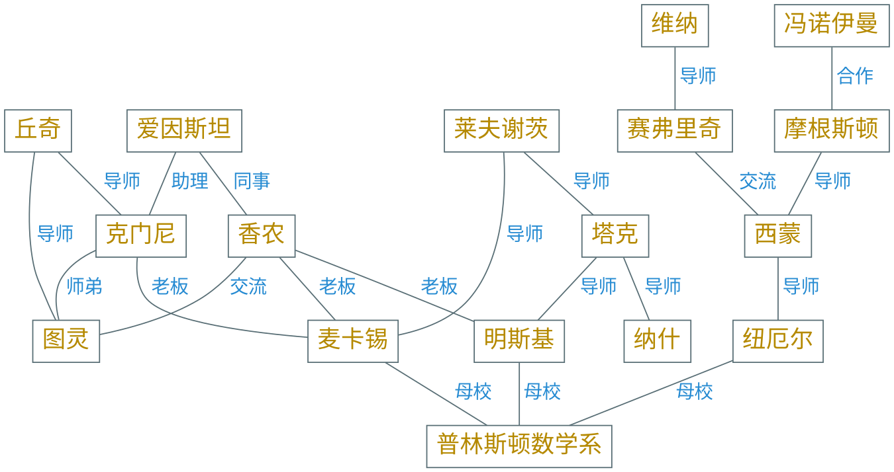

---
presentation:
  margin: 0
  center: false
  transition: "convex"
  enableSpeakerNotes: true
  slideNumber: "c/t"
  navigationMode: "linear"
---

@import "../css/font-awesome-4.7.0/css/font-awesome.css"
@import "../css/theme/solarized.css"
@import "../css/logo.css"
@import "../css/font.css"
@import "../css/color.css"
@import "../css/margin.css"
@import "../css/main.css"
@import "../plugin/zoom/zoom.js"
@import "../plugin/customcontrols/plugin.js"
@import "../plugin/customcontrols/style.css"
@import "../plugin/chalkboard/plugin.js"
@import "../plugin/chalkboard/style.css"
@import "../plugin/menu/menu.js"
@import "../js/anychart/anychart-core.min.js"
@import "../js/anychart/anychart-venn.min.js"
@import "../js/anychart/pastel.min.js"
@import "../js/anychart/venn-ml.js"

<!-- slide data-notes="" -->

##### 课程群

---


<!-- slide data-notes="" -->

<div class="bottom20"></div>

# 机器学习

<hr class="width50 center">

## 绪论

<div class="bottom8"></div>

### 计算机学院 &nbsp;&nbsp; 张腾

#### _tengzhang@hust.edu.cn_

<!-- slide vertical=true data-notes="" -->

##### 课程安排

---

授课：张腾

时间：40 学时

- 28 学时理论，周三 7 - 8 节课、周五 1 - 2 节课 (第 10 ~ 16 周)
- 12 学时实验，周四 9 - 12 节课 (第 12、15 ~ 16 周，在线)

考核：1 ~ 2 次大作业 (细节待定)

<!-- slide vertical=true data-notes="" -->

##### 参考书目

---

<div class="top-2">
    
    
    
</div>

<div class="top-5">
    
    
    
</div>

<!-- slide data-notes="" -->

##### 引言

---

@import "../puml/ml.puml" {.center}

<!-- slide data-background-video="../videos/facial-recognition.webm" data-background-video-loop data-background-video-muted vertical=true data-notes="" -->

<!-- slide data-background-video="../videos/alphago.mp4" data-background-video-loop data-background-video-muted vertical=true data-notes="可能有人会想到alphago，这个围棋程序16年一经面世就横扫围棋界，将李世乭、柯杰等多位世界冠军杀得毫无还手之力" -->

<!-- slide data-background-video="../videos/self-driving.mp4" data-background-video-loop data-background-video-muted vertical=true data-notes="可能也有人会想到自动驾驶，现在百度、谷歌、特斯拉、比亚迪许多公司都在布局研究，我们国家也在出政策大力扶持" -->

<!-- slide data-notes="" -->

##### 引言

---

机器学习接管生活

<div>
    
    
    
    
    
</div>

<!-- slide data-transition="convex-in none" vertical=true data-notes="前三个对应前面的视频" -->

##### 引言

---

@import "../dot/ml-app.dot" {.left12}

<!-- slide data-transition="none convex-out" vertical=true data-notes="前三个对应前面的视频" -->

##### 引言

---

@import "../dot/ml-app-dev.dot" {.left12}

<!-- slide data-notes="" -->

##### 与传统算法区别

---

@import "../dot/csalg-mlalg.dot" {.center}

### <span class="fragment">机器学习算法是一种<span class="yellow">元算法</span> (_meta algorithm_)</span>

<!-- slide vertical=true data-notes="" -->

##### 举个例子

---


<div class="width60 top-60per left38per">

> 寻龙诀：<br>寻龙分金看缠山，一重缠是一重关，关门如有八重险，不出阴阳八卦形。发丘印，摸金符，搬山卸岭寻龙诀；人点蜡，鬼吹灯，勘舆倒斗觅星峰；水银癍，养明器，龙楼宝殿去无数；窨沉棺，青铜椁，八字不硬莫近前。入口为马，马为离卦；子鼠遇马为坎离；未羊遇马为坤离；戌狗遇马为乾离，上乾下离见生门。

</div>

<!-- slide vertical=true data-notes="" -->

##### 举个例子

---


- 传统算法 (寻龙诀)：山川地势 → 有无大墓
- 机器学习算法：(山川地势, 有无大墓) 的数据 → 寻龙诀

<div class="bottom4"></div>

#### <span class="fragment">机器学习算法早已用于分析遥感图像，检测石油矿产等资源</span>

<!-- slide vertical=true data-notes="" -->

##### 多学科交叉

---

<div id="venn-ml" class="center"></div>

<!-- slide data-notes="" -->

##### 动手实践

---

编程语言：Python (首选)、Julia、Matlab

机器学习必备的第三方开源扩展包

- NumPy：针对高维矩阵、数组运算的数学函数库
- pandas：用于操纵数值表格和时间序列的函数库
- SciPy：用于最优化、线性代数、积分、插值的数学函数库
- Matplotlib：绘图库
- scikit-learn：机器学习库
- TensorFlow：谷歌开发的神经网络函数库
- PyTorch：脸书开发的神经网络函数库

<div class="bottom2"></div>

第三方扩展包之间依赖关系复杂，新手推荐用 Anaconda

开发环境个人偏爱 VS Code

<!-- slide data-background-iframe="https://mirrors.tuna.tsinghua.edu.cn/help/anaconda/" vertical=true data-background-interactive data-notes="" -->

<!-- slide data-notes="" -->

##### 大纲

---

@import "../vega/outline.json" {as="vega" .top-2}

<!-- slide vertical=true data-notes="" -->

##### 背景

---

维纳 《控制论》：

> 第一次工业革命：用某种机器来减轻甚至代替<span class="blue">体力</span>劳动<br>
> 上世纪中叶：用某种新型机器来减轻甚至代替<span class="blue">脑力</span>劳动

关键：让机器具有人类的智能

问题：什么是智能？

<!-- slide data-notes="" -->

##### 起源

---

图灵 Alan Turing 1912.6.23 ~ 1954.6.7

1950《Computing Machinery and Intelligence》

<div>
    
    
    
</div>

<!-- slide vertical=true data-notes="" -->

##### 起源

---

1950《Computing Machinery and Intelligence》

<span class="blue">图灵测试</span>：一个人在不接触对方的情况下，通过一种特殊的方式，和对方进行一系列的问答，如果在相当长时间内，他无法根据这些问题判断对方是人还是计算机，那么就可以认为这个计算机是智能的

</div>

要想通过图灵测试，机器得具备多种能力

- 学习：机器学习
- 感知：计算机视觉，语音识别
- 认知：自然语言处理，知识表示

<!-- slide data-notes="" -->

##### 元年

---

1956 达特茅斯会议 十仙过海

<div class="top-2">
    
    
    
    
    
</div>

<div class="top-5">
    
    
    
    
    
</div>

<!-- slide vertical=true data-notes="" -->

##### 元年

---



<!-- slide vertical=true data-notes="" -->

##### 元年

---

<div class="multi_column top_2">
    
    
</div>

<!-- slide data-notes="" -->

##### 发展历史

---

@import "../mermaid/ai.mermaid"

<!-- slide vertical=true data-notes="" -->

##### 发展历史

---

@import "../mermaid/ai.mermaid"

<!-- slide data-notes="" -->

|   公式   | $\|\av\|^2 + \|\bv\|^2 = \|\cv\|^2$  |
| :------: | :----------------------------------: |
| **条件** | $A \rightarrow \neg B \wedge \neg C$ |
|          |    $\neg A \rightarrow B \vee C$     |
|          | $B \rightarrow \neg A \wedge \neg C$ |
|          |    $\neg B \rightarrow A \vee C$     |

<!-- slide data-notes="" -->

```python {.line-numbers highlight=[1-9,14,21-22]}
import numpy as np
from scipy.spatial import distance

X = np.random.rand(100, 10000)
D1 = distance.cdist(X, X, 'euclidean') # 原样本的成对距离矩阵

transformer = random_projection.GaussianRandomProjection() # 高斯随机矩阵
XX = transformer.fit_transform(X)
D2 = distance.cdist(XX, XX, 'euclidean') # 投影后样本的成对距离矩阵

XX.shape
(100, 3947)

np.linalg.norm(D1 - D2, ord='fro') # 两个成对距离矩阵差的F范数
46.74573519884732

transformer = random_projection.GaussianRandomProjection() # 稀疏随机矩阵
XX = transformer.fit_transform(X)
D2 = distance.cdist(XX, XX, 'euclidean') # 投影后样本的成对距离矩阵

np.linalg.norm(D1 - D2, ord='fro') # 两个成对距离矩阵差的F范数
43.819210159457796
```

<!-- slide vertical=true data-notes="" -->

<pre><code data-line-numbers="3-5|8-10|13-15"><table>
    <tr>
        <td>Apples</td>
        <td>$1</td>
        <td>7</td>
    </tr>
    <tr>
        <td>Oranges</td>
        <td>$2</td>
        <td>18</td>
    </tr>
    <tr>
        <td>Kiwi</td>
        <td>$3</td>
        <td>1</td>
    </tr>
</table></code></pre>

<!-- slide data-notes="" -->

<p class="fragment">Fade in</p>
<p class="fragment fade-out">Fade out</p>
<p class="fragment highlight-red">Highlight red</p>
<p class="fragment fade-in-then-out">Fade in, then out</p>
<p class="fragment fade-up">Slide up while fading in</p>

<!-- slide vertical=true data-notes="" -->

<div class="r-stack">
    
    
    
</div>

<!-- slide data-notes="" -->

<div class="width80 center">
<h3 class="r-fit-text">FIT TEXT</h3>
</div>

<div class="width80 center">
<h3 class="r-fit-text">CAN BE USED FOR MULTIPLE HEADLINES</h3>
</div>

<!-- slide data-auto-animate data-notes="" -->

<div data-id="box" style="height: 50px; background: salmon;"></div>

<!-- slide data-auto-animate data-notes="" -->

<div data-id="box" style="height: 200px; background: blue;"></div>

<!-- slide data-auto-animate data-notes="" -->

- 赵
- 孙
- 周

<!-- slide data-auto-animate vertical=true data-notes="" -->

- 赵
- 钱
- 孙
- 李
- 周

<!-- slide data-notes="" -->

{++添加++}

{--删除--}

{~~替~>换~~}

{>>注释<<}

高亮{==高亮==}高亮
