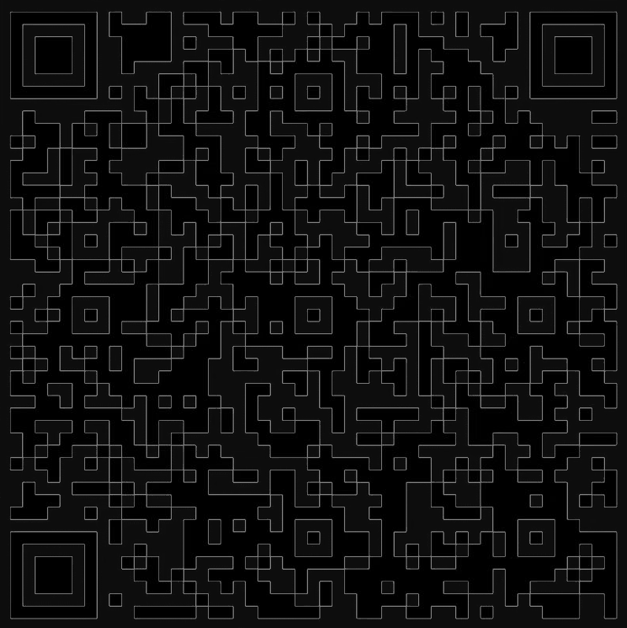

---
presentation:
  margin: 0
  center: false
  transition: "convex"
  enableSpeakerNotes: true
  slideNumber: "c/t"
  navigationMode: "linear"
---

@import "../css/font-awesome-4.7.0/css/font-awesome.css"
@import "../css/theme/solarized.css"
@import "../css/logo.css"
@import "../css/font.css"
@import "../css/color.css"
@import "../css/margin.css"
@import "../css/table.css"
@import "../css/main.css"
@import "../plugin/zoom/zoom.js"
@import "../plugin/customcontrols/plugin.js"
@import "../plugin/customcontrols/style.css"
@import "../plugin/chalkboard/plugin.js"
@import "../plugin/chalkboard/style.css"
@import "../plugin/menu/menu.js"
@import "../js/anychart/anychart-core.min.js"
@import "../js/anychart/anychart-venn.min.js"
@import "../js/anychart/pastel.min.js"
@import "../js/anychart/venn-ml.js"

<!-- slide data-notes="" -->

##### 课程群

---

<!-- slide data-notes="" -->

# 机器学习

## 绪论

### 计算机学院 &nbsp;&nbsp; 张腾

#### _tengzhang@hust.edu.cn_

<!-- slide vertical=true data-notes="" -->

##### 课程安排

---

授课：张腾

时间：40 学时

- 28 学时理论，周三 7 ~ 8 节课、周五 1 ~ 2 节课 (第 10 ~ 16 周)
- 12 学时实验，周四 9 ~ 12 节课 (第 12、15 ~ 16 周，在线)

考核：1 ~ 2 次大作业 (细节待定)

<!-- slide vertical=true data-notes="" -->

##### 参考书目

---

    
    
    

    
    
    

<!-- slide data-notes="" -->

##### 引言

---

@import "../puml/ml.puml" {.center}

<!-- slide data-menu-title="人脸识别" data-background-video="../videos/facial-recognition.webm" data-background-video-loop data-background-video-muted vertical=true data-notes="" -->

<!-- slide data-menu-title="人机对弈" data-background-video="../videos/alphago.mp4" data-background-video-loop data-background-video-muted vertical=true data-notes="可能有人会想到alphago，这个围棋程序16年一经面世就横扫围棋界，将李世乭、柯杰等多位世界冠军杀得毫无还手之力" -->

<!-- slide data-menu-title="自动驾驶" data-background-video="../videos/self-driving.mp4" data-background-video-loop data-background-video-muted vertical=true data-notes="可能也有人会想到自动驾驶，现在百度、谷歌、特斯拉、比亚迪许多公司都在布局研究，我们国家也在出政策大力扶持" -->

<!-- slide data-notes="" -->

##### 引言

---

机器学习接管生活

    
    
    
    
    

<!-- slide data-transition="convex-in none" vertical=true data-notes="前三个对应前面的视频" -->

##### 引言

---

@import "../dot/ml-app.dot" {.left12}

<!-- slide data-transition="none convex-out" vertical=true data-notes="前三个对应前面的视频" -->

##### 引言

---

@import "../dot/ml-app-dev.dot" {.left12}

<!-- slide data-notes="" -->

##### 与传统算法区别

---

@import "../dot/csalg-mlalg.dot" {.center}

### 机器学习算法是一种元算法 (_meta algorithm_)

<!-- slide vertical=true data-notes="" -->

##### 举个例子

---

> 寻龙诀： 寻龙分金看缠山，一重缠是一重关，关门如有八重险，不出阴阳八卦形。发丘印，摸金符，搬山卸岭寻龙诀；人点蜡，鬼吹灯，勘舆倒斗觅星峰；水银癍，养明器，龙楼宝殿去无数；窨沉棺，青铜椁，八字不硬莫近前。入口为马，马为离卦；子鼠遇马为坎离；未羊遇马为坤离；戌狗遇马为乾离，上乾下离见生门。

<!-- slide vertical=true data-notes="" -->

##### 举个例子

---

- 传统算法 (寻龙诀)：山川地势 → 有无大墓
- 机器学习算法：(山川地势, 有无大墓) 的数据 → 寻龙诀

#### 机器学习算法早已用于分析遥感图像，检测石油矿产等资源

<!-- slide vertical=true data-notes="" -->

##### 多学科交叉

---

<!-- slide data-notes="" -->

##### 动手实践

---

编程语言：Python (首选)、Julia、Matlab

机器学习必备的第三方开源扩展包

- NumPy：针对高维矩阵、数组运算的数学函数库
- pandas：用于操纵数值表格和时间序列的函数库
- SciPy：用于最优化、线性代数、积分、插值的数学函数库
- Matplotlib：绘图库
- scikit-learn：机器学习库
- TensorFlow：谷歌开发的神经网络函数库
- PyTorch：脸书开发的神经网络函数库

第三方扩展包之间依赖关系复杂，新手推荐用 Anaconda

开发环境个人偏爱 VS Code

<!-- slide data-menu-title="Anaconda" data-background-iframe="https://mirrors.tuna.tsinghua.edu.cn/help/anaconda/" vertical=true data-background-interactive data-notes="" -->

<!-- slide data-notes="" -->

##### 大纲

---

@import "../vega/outline.json" {as="vega" .top-2}

<!-- slide vertical=true data-notes="" -->

##### 背景

---

维纳 Norbert Wiener 1894.11.26 ~ 1964.3.18 《控制论》

> 第一次工业革命：用某种机器来减轻甚至代替体力劳动 
> 上世纪中叶：用某种新型机器来减轻甚至代替脑力劳动

关键：让机器具有人类的智能

问题：什么是智能？

<!-- slide data-notes="" -->

##### 起源

---

图灵 Alan Turing 1912.6.23 ~ 1954.6.7

1950《Computing Machinery and Intelligence》

    
    
    

<!-- slide vertical=true data-notes="" -->

##### 图灵测试

---

1950《Computing Machinery and Intelligence》

图灵测试：一个人在不接触对方的情况下，通过一种特殊的方式，和对方进行一系列的问答，如果在相当长时间内，他无法根据这些问题判断对方是人还是计算机，那么就可以认为这个计算机是智能的

要想通过图灵测试，机器得具备多种能力

- 学习：机器学习
- 感知：计算机视觉，语音识别
- 认知：自然语言处理，知识表示

<!-- slide data-notes="" -->

##### 达特茅斯会议

---

人工智能元年 1956 达特茅斯会议 十仙过海

    
    
    
    
    

    
    
    
    
    

<!-- slide vertical=true data-notes="" -->

##### 人物关系

---

@import "../dot/dartmouth.dot" {.center}

<!-- slide vertical=true data-notes="" -->

##### 会议内容

---

七个研究方向：

- 自动计算机，“自动”指的是可编程
- 编程语言
- 神经网络
- 计算规模理论，即计算复杂性
- 自我改进，即机器学习
- 抽象
- 随机性和创见性

干货：西蒙、纽厄尔的“逻辑理论家” (Logic Theorist)

- 第一个可运行的人工智能程序
- 证明罗素《数学原理》中的命题逻辑定理

<!-- slide vertical=true data-notes="" -->

##### 忆往昔峥嵘岁月稠

---

    
    

有些人会后就离开科研一线，去工业界赚钱去了

有些人后来出坑回踩，走向了人工智能的对立面

<!-- slide data-notes="" -->

##### 人工智能发展史

---

@import "../mermaid/ai.mermaid"

<!-- slide data-notes="" -->

##### 推理期

---

机器擅长固定套路的计算 vs. 人类擅长妙手偶得的推理

西蒙、纽厄尔设计了“逻辑理论家”程序

- 1952 年证明了《数学原理》中的 38 条定理
- 1963 年证明了《数学原理》中的 52 条定理，定理 2.85 的证明更巧妙
- 西蒙、纽厄尔获得了 1975 年的图灵奖

衰退：并非所有问题都可以转换成推理问题

- 十万步内无法证明两个连续函数之和还是连续函数

<!-- slide vertical=true data-notes="" -->

##### 王浩、吴文俊的工作

---

- 1959 年王浩证明了《数学原理》中的 150 条一阶逻辑定理和 200 条命题逻辑定理，关于复杂性的研究引出学生库克的 NP 理论
- 1978 年吴文俊给出几何定理证明，也称数学机械化

    
    

<!-- slide vertical=true data-notes="" -->

##### 谁说了实话

---

- A：B 和 C 都是说谎者
- B：A 和 C 都是说谎者
- C：A 和 B 中至少有一个说谎者

根据 A 说实话与否有 (利用$p \rightarrow q \Longleftrightarrow \neg p \vee q$)

- $A \rightarrow \neg B \wedge \neg C \Longleftrightarrow A \rightarrow \neg B, ~ A \rightarrow \neg C \Longleftrightarrow (1)~\neg A \vee \neg B, ~ (2)~ \neg A \vee \neg C$
- $\neg A \rightarrow B \vee C \Longleftrightarrow (3)~ A \vee B \vee C$

根据 B 说实话与否有

- $B \rightarrow \neg A \wedge \neg C \Longleftrightarrow B \rightarrow \neg A, ~ B \rightarrow \neg C \Longleftrightarrow (4)~\neg B \vee \neg C$

根据 C 说实话与否有

- $C \rightarrow \neg A \vee \neg B \Longleftrightarrow (5)~\neg A \vee \neg B \vee \neg C$
- $\neg C \rightarrow A \wedge B \Longleftrightarrow (6)~A \vee C, ~ (7)~B \vee C $

<!-- slide vertical=true data-notes="" -->

##### 归结原理

---

1. $\neg A \vee \neg B$
2. $\neg A \vee \neg C$
3. $A \vee B \vee C$
4. $\neg B \vee \neg C$
5. $\neg A \vee \neg B \vee \neg C$
6. $A \vee C$
7. $B \vee C$

利用归结原理 $P \vee Q, ~ \neg P \vee R \Longrightarrow Q \vee R$ 消除变量

8. 1 + 7：$\neg A \vee C$
9. 6 + 8：$C$，C 是老实人
10. 2 + 8：$\neg A$，A 是说谎者
11. 4 + 9：$\neg B$，B 是说谎者

<!-- slide data-notes="" -->

##### 知识期

---

教训：光会逻辑推理还不够，机器得拥有知识

信仰：知识就是力量

专家系统 = 知识库 + 推理机

- 在特定领域内具有专家水平解决问题能力的程序系统
- 第一个成功的专家系统 DENDRAL 于 1965 年问世
- 知识工程之父费根鲍姆获得了 1994 年的图灵奖

衰退：

- 人工构建知识库成本太高
- 很多知识获取困难，甚至无法被清晰地表示出来

<!-- slide vertical=true data-notes="" -->

##### 动物识别专家系统

---

@import "../dot/reasoning.dot"

<!-- slide data-notes="对于人类的很多智能行为，我们很难描述出其背后的知识" -->

##### 图像知识？

---

我们人类是如何识别这些手写数字的？

@import "../img/number.svg" {.center .width80}

<!-- slide vertical=true data-notes="" -->

##### 文本知识？

---

我们人类是如何判断这首词的情感的？

> 明月几时有？把酒问青天。不知天上宫阙，今夕是何年。我欲乘风归去，又恐琼楼玉宇，高处不胜寒。起舞弄清影，何似在人间。 
> 转朱阁，低绮户，照无眠。不应有恨，何事长向别时圆？人有悲欢离合，月有阴晴圆缺，此事古难全。但愿人长久，千里共婵娟。

<!-- slide vertical=true data-notes="" -->

##### 语音知识？

---

我们人类是如何识别下面这段语音的？

<svg version="1.1" xmlns="http://www.w3.org/2000/svg" style="display:none;"><symbol id="pause" viewBox="0 0 1024 1024"><path fill="#586e75" d="M512 1024C229.696 1024 0 794.304 0 512S229.696 0 512 0s512 229.696 512 512-229.696 512-512 512zm0-960C264.96 64 64 264.96 64 512s200.96 448 448 448 448-200.96 448-448S759.04 64 512 64z"/><path fill="#586e75" d="M416 352h64v320h-64V352zm128 0h64v320h-64V352z"/></symbol><symbol id="play" viewBox="0 0 1024 1024"><path fill="#586e75" d="M512 0C229.228 0 0 229.241 0 512s229.228 512 512 512c282.759 0 512-229.241 512-512S794.759 0 512 0zm0 970.105c-253.009 0-458.105-205.11-458.105-458.105S258.99 53.895 512 53.895c252.995 0 458.105 205.11 458.105 458.105S764.995 970.105 512 970.105zM377.263 727.58l377.263-215.552L377.263 296.42V727.58z"/></symbol></svg>

<a href="javascript:" id="btnPlay" role="button" style="margin:0;"><svg><use href="#play"/></svg></a>
<a href="javascript:" id="btnPause" role="button" style="margin:0;"><svg><use href="#pause"/></svg></a>

@import "../js/wavesurfer/wavesurfer.js"
@import "../js/wavesurfer/play-audio.js"

<h3 class="fragment top8">启示：让机器从数据中自动学习得到知识</h3>
