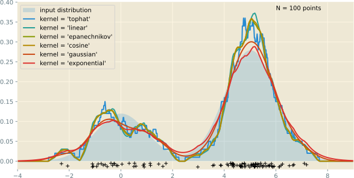

---
presentation:
  margin: 0
  center: false
  transition: "convex"
  enableSpeakerNotes: true
  slideNumber: "c/t"
  navigationMode: "linear"
---

@import "../css/font-awesome-4.7.0/css/font-awesome.css"
@import "../css/theme/solarized.css"
@import "../css/logo.css"
@import "../css/font.css"
@import "../css/color.css"
@import "../css/margin.css"
@import "../css/table.css"
@import "../css/main.css"
@import "../plugin/zoom/zoom.js"
@import "../plugin/customcontrols/plugin.js"
@import "../plugin/customcontrols/style.css"
@import "../plugin/chalkboard/plugin.js"
@import "../plugin/chalkboard/style.css"
@import "../plugin/menu/menu.js"
@import "../js/anychart/anychart-core.min.js"
@import "../js/anychart/anychart-venn.min.js"
@import "../js/anychart/pastel.min.js"
@import "../js/anychart/venn-ml.js"

<!-- slide data-notes="" -->

# 机器学习

## 基本概念

### 计算机学院 &nbsp;&nbsp; 张腾

#### _tengzhang@hust.edu.cn_

<!-- slide vertical=true data-notes="" -->

##### 大纲

---

@import "../vega/outline.json" {as="vega" .top-2}

<!-- slide vertical=true data-notes="" -->

##### 机器学习

---

一般流程

@import "../dot/ml-old.dot" {.top0 .bottom0}

原始数据：表格、图片、视频、文本、语音、……

特征工程：

- 提取：选取、构造对目标任务有用的潜在特征
- 处理：无序的离散类别特征 → 数值特征，缺失处理，标准化
- 变换：对特征进行挑选或映射得到对目标任务更有效的特征

模型学习：最核心的部分，学习一个用来预测的映射

<!-- slide data-notes="" -->

##### 监督学习

---

所有样本都有类别标记

| 原始数据 |   样本/示例    |  属性/特征   |   标记   |
| :------: | :------------: | :----------: | :------: |
|  $o_1$   | $(\xv_1, y_1)$ | $\xv_1[1:d]$ |  $y_1$   |
|  $o_2$   | $(\xv_2, y_2)$ | $\xv_2[1:d]$ |  $y_2$   |
| $\vdots$ |    $\vdots$    |   $\vdots$   | $\vdots$ |
|  $o_m$   | $(\xv_m, y_m)$ | $\xv_m[1:d]$ |  $y_m$   |

任务类型：

- 二分类：$y \in \{ 1, -1 \}$或者$y \in \{ 0,1 \}$
- 多分类：$y \in [C] = \{ 1, 2, \ldots, C \}$
- 回归：$y \in \Rbb$或连续集合
- 结构预测：$y$可以是向量、序列、语法树、……

<!-- slide vertical=true data-notes="第一列是三个人工数据集，第一个呈半月形，第二个呈圆环型，第三个线性可分，两种颜色深色的为训练样本，稍浅些的为测试样本，每个数据集各有20%的噪声    右边三列为线性核支持向量机、高斯核支持向量机、神经网络在这些数据集上的分类结果，右下角是预测精度    前两个数据集非线性可分，后两个分类器非线性分类器，注意对比观察它们的效果" -->

##### 二分类示例

---

<!-- slide vertical=true data-notes="多分类就不止2类了 比如数字识别 就是10类了" -->

##### 多分类示例

---

<!-- slide vertical=true data-notes="" -->

##### 混淆矩阵

---

<!-- slide vertical=true data-notes="" -->

##### 回归

---

线性回归：用最小二乘求解超定方程组 (方程个数比未知数多)

<!-- slide data-notes="现实中很多任务，获取类别标记代价很大，比如病人的X光图片，需要高水平的专家医生来看才能给出标记，所以不能指望所有样本都有类别标记" -->

##### 半监督学习

---

只有部分样本有类别标记，如何利用其它未标记样本？

| 原始数据  |    样本/示例     |    属性/特征     |   标记   |
| :-------: | :--------------: | :--------------: | :------: |
|   $o_1$   |  $(\xv_1, y_1)$  |   $\xv_1[1:d]$   |  $y_1$   |
| $\vdots$  |     $\vdots$     |     $\vdots$     | $\vdots$ |
|   $o_l$   |  $(\xv_l, y_l)$  |   $\xv_m[1:d]$   |  $y_l$   |
| $o_{l+1}$ | $(\xv_{l+1}, -)$ | $\xv_{l+1}[1:d]$ |   $-$    |
| $\vdots$  |     $\vdots$     |     $\vdots$     | $\vdots$ |
| $o_{l+u}$ | $(\xv_{l+u}, -)$ | $\xv_{l+u}[1:d]$ |   $-$    |

任务类型：

- 转导 (transductive) 学习：预测$\xv_{l+1}, \ldots, \xv_{l+u}$的类别标记
- 归纳 (inductive) 学习：必须有显式模型，能对未知样本进行预测

<!-- slide data-notes="" -->

##### 无监督学习

---

所有样本都没有类别标记

| 原始数据 |  样本/示例   |  属性/特征   |   标记   |
| :------: | :----------: | :----------: | :------: |
|  $o_1$   | $(\xv_1, -)$ | $\xv_1[1:d]$ |   $-$    |
|  $o_2$   | $(\xv_2, -)$ | $\xv_2[1:d]$ |   $-$    |
| $\vdots$ |   $\vdots$   |   $\vdots$   | $\vdots$ |
|  $o_m$   | $(\xv_m, -)$ | $\xv_m[1:d]$ |   $-$    |

任务类型：

- 聚类 (clustering)：依相似度将数据分成$K$个簇 (cluster)
- 降维/嵌入：为样本学习新的特征
- 密度估计：估计样本空间的概率密度$P(\xv)$，寻找数据的生成机制

<!-- slide vertical=true data-notes="" -->

##### 聚类

---

- 原始数据由 6 个簇组成
- K 均值算法指定聚成 4 个簇，每种颜色对应一个簇，菱形为簇中心

<!-- slide vertical=true data-notes="" -->

##### 密度估计

---

- 直方图是最简单的密度估计方法，数数即可，对间隔的选择极其敏感
- 核密度估计：$\rho(\zv) = \sum_{i \in [m]} \kappa ((\zv-\xv_i)/h)$

<!-- slide vertical=true data-notes="" -->

##### 密度估计

---

- 核密度估计：$\rho(\zv) = \sum_{i \in [m]} \kappa ((\zv-\xv_i)/h)$

<!-- slide data-notes="" -->

##### 机器学习方法分类

---

米哈尔斯基 等《机器学习：一种人工智能途径》 _Machine Learning: An Artificial Intelligence Approach_

- 从样例中学习
- 在问题求解和规划中学习
- 通过观察和发现学习
- 从指令中学习

费根鲍姆 等《人工智能手册》 _The Handbook of Artificial Intelligence_

- 机械学习，死记硬背式学习，信息存储检索
- 示教学习，类似于“从指令中学习”
- 类比学习，类似于“通过观察和发现学习”
- {==归纳学习==}，类似于“从样例中学习”，目前研究最多、应用最广

<!-- slide vertical=true data-notes="" -->

##### 机器学习流派

---

多明戈斯 Pedro Domingos
《终极算法》_The Master Algorithm_

- 符号学派：规则学习，决策树
- 连接学派：感知机，神经网络
- {--进化学派--}
- 统计学派：朴素贝叶斯，贝叶斯网
- 类推学派：k-近邻，支持向量机

灵魂问题：哪个算法更好？

#### {==没有免费的午餐==}定理 (No Free Lunch Theorem, NFL 定理)

<ul class="top2">
    <li class="fragment">脱离具体的问题空谈什么算法好没有意义</li>
    <li class="fragment">学习算法自身的<mark>归纳偏好</mark>应与问题相匹配</li>
</ul>

<!-- slide data-notes="" -->

##### 约还是不约？

---

| 约会次序 | 约会时间 | 约会方式 | 当天温度 | 当天电视节目 | 答应约会 |
| :------: | :------: | :------: | :------: | :----------: | :------: |
|    1     |   周末   |   吃饭   |   暖和   |    不好看    |    否    |
|    2     |   周末   |   逛街   |   暖和   |     好看     |    是    |
|    3     |   周末   |   逛街   |   暖和   |    不好看    |    是    |
|    4     |   周末   |   逛街   |   炎热   |     好看     |    否    |
|    5     |   周末   |   逛街   |   炎热   |    不好看    |    ?     |

### 女人心海底针 让机器学习读心术来拯救你

<!-- slide vertical=true data-notes="" -->

##### 符号学派

---

| 约会次序 | 约会时间 | 约会方式 | 当天温度 | 当天电视节目 | 答应约会 |
| :------: | :------: | :------: | :------: | :----------: | :------: |
|    1     |   周末   |   吃饭   |   暖和   |    不好看    |    否    |
|    2     |   周末   |   逛街   |   暖和   |     好看     |    是    |
|    3     |   周末   |   逛街   |   暖和   |    不好看    |    是    |
|    4     |   周末   |   逛街   |   炎热   |     好看     |    否    |
|    5     |   周末   |   逛街   |   炎热   |    不好看    |    ?     |

符号学派：用“{==若……且……则……==}”形式的{==合取规则==}覆盖数据

$(\text{方式} = \text{逛街}) \wedge (\text{温度} = \text{暖和}) \rightarrow \text{约会}$

- 可解释强，用户可以秒懂
- 学习中易于引入人类知识

<!-- slide vertical=true data-notes="" -->

##### 连接学派

---

| 约会次序 | 约会时间 | 约会方式 | 当天温度 | 当天电视节目 | 答应约会 |
| :------: | :------: | :------: | :------: | :----------: | :------: |
|    1     |   周末   |   吃饭   |   暖和   |    不好看    |    否    |
|    2     |   周末   |   逛街   |   暖和   |     好看     |    是    |
|    3     |   周末   |   逛街   |   暖和   |    不好看    |    是    |
|    4     |   周末   |   逛街   |   炎热   |     好看     |    否    |
|    5     |   周末   |   逛街   |   炎热   |    不好看    |    ?     |

连接学派：用{==带阈值==}的{==线性函数==}拟合数据

$\sgn(w_0 + w_1 \times \text{次序} + \cdots + w_5 \times \text{电视}) \rightarrow \{\text{是}, \text{否}\}$

- 知识是分布式存储的，由权重系数$w_0, w_1, \ldots, w_5$表示
- 将上述函数广泛并行串联就是神经网络

<!-- slide vertical=true data-notes="" -->

##### 统计学派

---

| 约会次序 | 约会时间 | 约会方式 | 当天温度 | 当天电视节目 | 答应约会 |
| :------: | :------: | :------: | :------: | :----------: | :------: |
|    1     |   周末   |   吃饭   |   暖和   |    不好看    |    否    |
|    2     |   周末   |   逛街   |   暖和   |     好看     |    是    |
|    3     |   周末   |   逛街   |   暖和   |    不好看    |    是    |
|    4     |   周末   |   逛街   |   炎热   |     好看     |    否    |
|    5     |   周末   |   逛街   |   炎热   |    不好看    |    ?     |

统计学派：利用贝叶斯公式求后验概率

$\Pr (\text{约会}|\text{次序},\ldots,\text{电视}) = \frac{\Pr (\text{次序},\ldots,\text{电视}|\text{约会}) \Pr (\text{约会}) \qquad \quad}{\Pr (\text{次序},\ldots,\text{电视}) \qquad}$

- 先验$\Pr (\text{约会})$反映了在没有任何信息的情况下成功约会的信念
- 数据通过似然$\Pr (\text{次序},\ldots,\text{电视}|\text{约会})$调整我们对成功约会的信念

<!-- slide vertical=true data-notes="" -->

##### 类推学派

---

| 约会次序 | 约会时间 | 约会方式 | 当天温度 | 当天电视节目 | 答应约会 |
| :------: | :------: | :------: | :------: | :----------: | :------: |
|    1     |   周末   |   吃饭   |   暖和   |    不好看    |    否    |
|    2     |   周末   |   逛街   |   暖和   |     好看     |    是    |
|    3     |   周末   |   逛街   |   暖和   |    不好看    |    是    |
|    4     |   周末   |   逛街   |   炎热   |     好看     |    否    |
|    5     |   周末   |   逛街   |   炎热   |    不好看    |    ?     |

类推学派：查找最相似的样本，据此做预测

- 过往越相似的样本，参考价值越大
- 对待预测的样本 5，其与样本 3、样本 4 均只有一个属性不同
- 根据样本 3、样本 4 的经验进行预测，答应约会的概率为 50%

<!-- slide data-notes="" -->

##### 模型评估

---

给定模型$f$、样例集$D = \{ (\xv_1, y_1), (\xv_2, y_2), \ldots, (\xv_m, y_m) \}$

回归：{==均方误差==} (mean squared error)

$$
\begin{align*}
    E(f;D) = \frac{1}{m} \sum_{i \in [m]} (f(\xv_i) - y_i)^2
\end{align*}
$$

分类：{==错误率==} (error rate)、{==精度==} (accuracy)

$$
\begin{align*}
    & \text{错误率}~E(f;D) = \frac{1}{m} \sum_{i \in [m]} \Ibb (f(\xv_i) \ne y_i) \\[3pt]
    & \text{精度}~\acc(f;D) = 1 - E(f;D)
\end{align*}
$$

<!-- slide vertical=true data-notes="" -->

##### 查准率 查全率

---

二分类结果的{==混淆矩阵==} (confusion matrix)

|           |   预测 正例    |   实际 负例    |
| :-------: | :------------: | :------------: |
| 真实 正例 | $\TP$ (真正例) | $\FN$ (假反例) |
| 真实 负例 | $\FP$ (假正例) | $\TN$ (真反例) |

{==查准率==} (precision)：预测的约会中有多少比例真的约会了

{==查全率==} (recall)：所有的约会中有多少比例被预测出来了

$$
\begin{align*}
    & \mathrm{Precision} = \frac{\TP}{\TP + \FP}, \quad \mathrm{Recall} = \frac{\TP}{\TP + \FN} \\[5pt]
    & \mathrm{F1} = \frac{2 \times \mathrm{Precision} \times \mathrm{Recall}}{\mathrm{Precision} + \mathrm{Recall}} = \frac{2 \times \TP}{\text{样例总数} + \TP - \TN \quad}
\end{align*}
$$

<!-- slide data-menu-title="sklearn中的性能度量" data-background-iframe="https://scikit-learn.org/stable/modules/model_evaluation.html" vertical=true data-background-interactive data-notes="" -->

<!-- slide data-notes="" -->

##### 模型选择

---

选择宗旨：在{==未知数据==}上表现好，即{==泛化==} (generalization) 好

训练数据集：

$$
\begin{align*}
    E(f;D) = \frac{1}{m} \sum_{i \in [m]} (f(\xv_i) - y_i)^2, ~ E(f;\Dcal) = \int_{\xv \sim \Dcal} (f(\xv) - y)^2 \Pr(\xv) \diff \xv
\end{align*}
$$

分类：{==错误率==} (error rate)、{==精度==} (accuracy)

$$
\begin{align*}
    E(f;D) = \frac{1}{m} \sum_{i \in [m]} \Ibb (f(\xv_i) \ne y_i), ~ E(f;\Dcal) = \int_{\xv \sim \Dcal} \Ibb(f(\xv) \ne y) \Pr(\xv) \diff \xv
\end{align*}
$$

，$\acc(f;\Dcal) = 1 - E(f;\Dcal)$

<!-- slide vertical=true data-notes="" -->

##### 泛化

---

@import "../python/overfitting.svg" {.center .width90 title="过拟合"}
