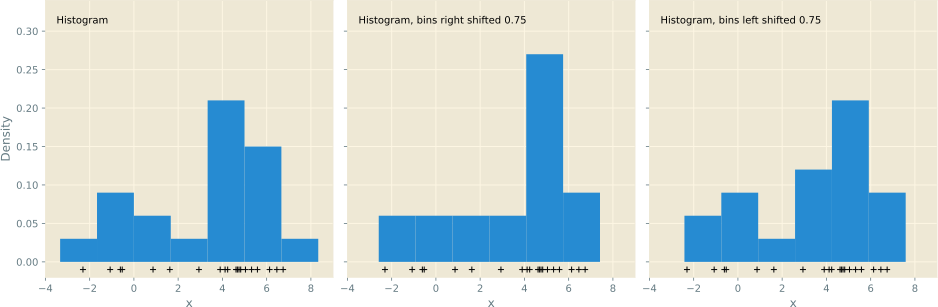

---
presentation:
  margin: 0
  center: false
  transition: "convex"
  enableSpeakerNotes: true
  slideNumber: "c/t"
  navigationMode: "linear"
---

@import "../css/font-awesome-4.7.0/css/font-awesome.css"
@import "../css/theme/solarized.css"
@import "../css/logo.css"
@import "../css/font.css"
@import "../css/color.css"
@import "../css/margin.css"
@import "../css/table.css"
@import "../css/main.css"
@import "../plugin/zoom/zoom.js"
@import "../plugin/customcontrols/plugin.js"
@import "../plugin/customcontrols/style.css"
@import "../plugin/chalkboard/plugin.js"
@import "../plugin/chalkboard/style.css"
@import "../plugin/menu/menu.js"
@import "../js/anychart/anychart-core.min.js"
@import "../js/anychart/anychart-venn.min.js"
@import "../js/anychart/pastel.min.js"
@import "../js/anychart/venn-ml.js"

<!-- slide data-notes="" -->

##### 大纲

---

@import "../vega/outline.json" {as="vega" .top-2}

<!-- slide vertical=true data-notes="" -->

##### 机器学习

---

一般流程

@import "../dot/ml-old.dot" {.top0 .bottom0}

<div class="bottom0"></div>

原始数据：表格、图片、视频、文本、语音、……

特征工程：

- 提取：选取、构造对目标任务有用的潜在特征
- 处理：无序的离散类别特征 → 数值特征，缺失处理，标准化
- 变换：对特征进行挑选或映射得到对目标任务更有效的特征

模型学习：最核心的部分，学习一个用来预测的映射

<!-- slide data-notes="" -->

##### 监督学习

---

所有样本都有类别标记

<div class="threelines column1-border-right-solid head-highlight-1 tr-hover top-2 bottom-2">

| 原始数据 |      样本      |   属性特征   | 类别标记 |
| :------: | :------------: | :----------: | :------: |
|  $o_1$   | $(\xv_1, y_1)$ | $\xv_1[1:d]$ |  $y_1$   |
|  $o_2$   | $(\xv_2, y_2)$ | $\xv_2[1:d]$ |  $y_2$   |
| $\vdots$ |    $\vdots$    |   $\vdots$   | $\vdots$ |
|  $o_m$   | $(\xv_m, y_m)$ | $\xv_m[1:d]$ |  $y_m$   |

</div>

任务类型：

- 二分类：$y \in \{ 1, -1 \}$或者$y \in \{ 0,1 \}$
- 多分类：$y \in [C] = \{ 1, 2, \ldots, C \}$
- 回归：$y \in \Rbb$或连续集合
- 结构预测：$y$可以是向量、序列、语法树、……

<!-- slide vertical=true data-notes="第一列是三个人工数据集，第一个呈半月形，第二个呈圆环型，第三个线性可分，两种颜色深色的为训练样本，稍浅些的为测试样本，每个数据集各有20%的噪声 <br><br> 右边三列为线性核支持向量机、高斯核支持向量机、神经网络在这些数据集上的分类结果，右下角是预测精度 <br><br> 前两个数据集非线性可分，后两个分类器非线性分类器，注意对比观察它们的效果" -->

##### 二分类示例

---


<!-- slide vertical=true data-notes="多分类就不止2类了 比如数字识别 就是10类了" -->

##### 监督学习 多分类示例

---


<!-- slide vertical=true data-notes="" -->

##### 混淆矩阵

---


<!-- slide vertical=true data-notes="" -->

##### 回归

---

线性回归：用最小二乘求解超定方程组 (方程个数比未知数多)


<!-- slide data-notes="现实中很多任务，获取类别标记代价很大，比如病人的X光图片，需要高水平的专家医生来看才能给出标记，所以不能指望所有样本都有类别标记" -->

##### 半监督学习

---

只有部分样本有类别标记，如何利用其它未标记样本？

<div class="threelines column1-border-right-solid row4-border-top-dashed head-highlight-1 tr-hover top-2 bottom-2">

| 原始数据  |         样本         |     属性特征     | 类别标记 |
| :-------: | :------------------: | :--------------: | :------: |
|   $o_1$   |    $(\xv_1, y_1)$    |   $\xv_1[1:d]$   |  $y_1$   |
| $\vdots$  |       $\vdots$       |     $\vdots$     | $\vdots$ |
|   $o_l$   |    $(\xv_l, y_l)$    |   $\xv_m[1:d]$   |  $y_l$   |
| $o_{l+1}$ | $(\xv_{l+1}, \NULL)$ | $\xv_{l+1}[1:d]$ | $\NULL$  |
| $\vdots$  |       $\vdots$       |     $\vdots$     | $\vdots$ |
| $o_{l+u}$ | $(\xv_{l+u}, \NULL)$ | $\xv_{l+u}[1:d]$ | $\NULL$  |

</div>

任务类型：

- 转导 (transductive) 学习：预测$\xv_{l+1}, \ldots, \xv_{l+u}$的类别标记
- 归纳 (inductive) 学习：必须有显式模型，能对未知样本进行预测

<!-- slide data-notes="" -->

##### 无监督学习

---

所有样本都没有类别标记

<div class="threelines column1-border-right-solid head-highlight-1 tr-hover top-2 bottom-2">

| 原始数据 |       样本       |   属性特征   | 类别标记 |
| :------: | :--------------: | :----------: | :------: |
|  $o_1$   | $(\xv_1, \NULL)$ | $\xv_1[1:d]$ | $\NULL$  |
|  $o_2$   | $(\xv_2, \NULL)$ | $\xv_2[1:d]$ | $\NULL$  |
| $\vdots$ |     $\vdots$     |   $\vdots$   | $\vdots$ |
|  $o_m$   | $(\xv_m, \NULL)$ | $\xv_m[1:d]$ | $\NULL$  |

</div>

任务类型：

- 聚类：$\xv_i \mapsto c_i \in [K]$，根据相似度将样本划分成$K$个簇 (cluster)
- 降维或嵌入：$\xv_i \mapsto \zv_i \in \Rbb^l$，为样本学习新的特征
- 密度估计：估计样本空间的概率密度$P(\xv)$，寻找数据的生成机制

<!-- slide vertical=true data-notes="" -->

##### 聚类

---

- 原始数据由 6 个簇组成
- K 均值算法指定聚成 4 个簇，每种颜色对应一个簇，菱形为簇中心
- 红色和蓝色各由 2 个簇组成


<!-- slide vertical=true data-notes="" -->

##### 密度估计

---

- 直方图是最简单的密度估计方法，数数即可，对间隔的选择极其敏感
- 核密度估计：$\rho(\zv) = \sum_{i \in [m]} \kappa ((\zv-\xv_i)/h)$



<!-- slide vertical=true data-notes="" -->

##### 密度估计

---

- 核密度估计：$\rho(\zv) = \sum_{i \in [m]} \kappa ((\zv-\xv_i)/h)$


<!-- slide data-notes="" -->

##### 机器学习方法分类

---

米哈尔斯基 _Machine Learning: An Artificial Intelligence Approach_

- 从样例中学习
- 在问题求解和规划中学习
- 通过观察和发现学习
- 从指令中学习

<div class="top1"></div>

费根鲍姆 _The Handbook of Artificial Intelligence_

- 机械学习，死记硬背式学习，信息存储检索
- 示教学习，类似于“从指令中学习”
- 类比学习，类似于“通过观察和发现学习”
- 归纳学习，类似于“从样例中学习”

<div class="top1"></div>

目前研究最多、应用最广的就是“从样例中学习”

<!-- slide vertical=true data-notes="" -->

##### 机器学习方法分类

---

多明戈斯 _The Master Algorithm_

- 符号学派
- 连接学派
- 进化学派
- 统计学派
- 类推学派

<div class="top1"></div>

目前研究最多、应用最广的就是{==从样例中学习==}

<!-- slide data-notes="" -->

##### 特征提取 以文本为例

---

<span class="blue">词袋模型</span> (bag-of-words)：文本是单词的集合，单词独立无序

- 所有文本全部$d$个不同的单词构成词典，每个文本提取$d$个特征
- 若词典第$i$个词在当前文本中出现过，则其第$i$个特征为$1$，否则为$0$

```python {.line-numbers .top0 .left4 highlight=[4-5]}
from sklearn.feature_extraction.text import CountVectorizer
import pandas as pd

document1 = "I have a pen, I have an apple, apple pen."
document2 = "I have a pen, I have pineapple, pineapple pen."

cv = CountVectorizer(lowercase=False, token_pattern='\w+', binary=True)
model = cv.fit_transform([document1, document2])
pd.DataFrame(model.toarray(), columns=cv.get_feature_names_out())
```

<div class="threelines column1-border-right-solid column1-bold head-highlight-1 tr-hover top-4">

|  词典  |  I  |  a  | an  | apple | have | pen | pineapple |
| :----: | :-: | :-: | :-: | :---: | :--: | :-: | :-------: |
| 文本 1 |  1  |  1  |  1  |   1   |  1   |  1  |     0     |
| 文本 2 |  1  |  1  |  0  |   0   |  1   |  1  |     1     |

</div>

<!-- slide vertical=true data-notes="" -->

##### 特征提取 以文本为例

---

<span class="blue">词袋模型</span> (bag-of-words)：文本是单词的集合，单词独立无序

- 所有文本全部$d$个不同的单词构成词典，每个文本提取$d$个特征
- 若词典第$i$个词在当前文本中出现了$k$次，则其第$i$个特征为$k$

```python {.line-numbers .top0 .left4 highlight=[4-5]}
from sklearn.feature_extraction.text import CountVectorizer
import pandas as pd

document1 = "I have a pen, I have an apple, apple pen."
document2 = "I have a pen, I have pineapple, pineapple pen."

cv = CountVectorizer(lowercase=False, token_pattern='\w+')
model = cv.fit_transform([document1, document2])
pd.DataFrame(model.toarray(), columns=cv.get_feature_names_out())
```

<div class="threelines column1-border-right-solid column1-bold head-highlight-1 tr-hover top-4">

|  词典  |  I  |  a  | an  | apple | have | pen | pineapple |
| :----: | :-: | :-: | :-: | :---: | :--: | :-: | :-------: |
| 文本 1 |  2  |  1  |  1  |   2   |  2   |  2  |     0     |
| 文本 2 |  2  |  1  |  0  |   0   |  2   |  2  |     2     |

</div>

<!-- slide vertical=true data-notes="这里要说一下啥是 l1 l2" -->

##### 特征提取 以文本为例

---

<span class="blue">词频 - 逆文本频率</span>特征：对当前文本重要的单词必然

- 在当前文本中出现的频率高，即词频 (term frequency, tf) 高
- 在其他文本中出现的频率低，即逆文本频率 (inverse document frequency, idf) 高

tf = 单词在当前文本中出现的次数 / 当前文本的总词数<br>idf = ln ((全部文本数 + C) / (包含该词的总文本数 + C)) + 1</span>

- C = 0，若词典包含从未在任何文本中出现的词，会有分母为零的问题
- C = 1，sklearn 默认的平滑版本，相当于额外有一个包含所有词的文本

tf - idf 特征 = normalize (tf × idf)，即将 tf 和 idf 相乘后再标准化

- $\ell_1$标准化，tf × idf / sum (tf × idf)，即线性变换成概率分布
- $\ell_2$标准化，tf × idf / sqrt(sum ([tf × idf]^2))，即线性变换成模 1 向量

<!-- slide vertical=true data-notes="" -->

##### 特征提取 以文本为例

---

```python {.line-numbers .top0 .left4 highlight=[4-5]}
from sklearn.feature_extraction.text import TfidfVectorizer
import pandas as pd

document1 = "I have a pen, I have an apple, apple pen."
document2 = "I have a pen, I have pineapple, pineapple pen."

tv = TfidfVectorizer(lowercase=False, token_pattern='\w+',
                     norm='l1', smooth_idf=False) # l1归一化 idf不平滑
model = tv.fit_transform([document1, document2])
pd.DataFrame(model.toarray(), columns=cv.get_feature_names_out())
```

<div class="threelines row3-border-top-dashed row3-border-bottom-dashed column1-border1-right-dashed-head row1-column1-border1-right-dashed row3-column1-border1-right-dashed row4-column1-border1-right-dashed head-highlight-1 tr-hover top-4">

|   词典   |     I      |     a      |     an     |   apple    |    have    |    pen     | pineapple  |
| :------: | :--------: | :--------: | :--------: | :--------: | :--------: | :--------: | :--------: |
|    tf    |   2 / 10   |   1 / 10   |   1 / 10   |   2 / 10   |   2 / 10   |   2 / 10   |     0      |
|    ^     |   2 / 9    |   1 / 9    |     0      |     0      |   2 / 9    |   2 / 9    |   2 / 9    |
|   idf    | ln (1) + 1 | ln (1) + 1 | ln (2) + 1 | ln (2) + 1 | ln (1) + 1 | ln (1) + 1 | ln (2) + 1 |
| tf - idf |  0.165571  |  0.082785  |  0.140168  |  0.280335  |  0.165571  |  0.165571  |  0.000000  |
|    ^     |  0.192561  |  0.096281  |  0.000000  |  0.000000  |  0.192561  |  0.192561  |  0.326035  |

</div>

<!-- slide data-notes="" -->

##### 特征 离散类别 → 数值

---

<div class="threelines column9-border-right-solid head-highlight-1 tr-hover">

| 编号 | 色泽 | 根蒂 | 敲声 | 纹理 | 脐部 | 触感 | 密度  | 含糖率 | 好瓜 |
| :--: | :--: | :--: | :--: | :--: | :--: | :--: | :---: | :----: | :--: |
|  1   | 青绿 | 蜷缩 | 浊响 | 清晰 | 凹陷 | 硬滑 | 0.697 | 0.460  |  是  |
|  2   | 乌黑 | 蜷缩 | 沉闷 | 清晰 | 凹陷 | 硬滑 | 0.774 | 0.376  |  是  |
|  3   | 乌黑 | 稍蜷 | 沉闷 | 稍糊 | 稍凹 | 硬滑 | 0.666 | 0.091  |  否  |
|  4   | 浅白 | 硬挺 | 清脆 | 模糊 | 平坦 | 硬滑 | 0.245 | 0.057  |  否  |

</div>

- 序数编码 (ordinal encoding)：清晰 - 0、稍糊 - 1、模糊 - 2，<span class="blue">需类别特征本身有序</span>，否则若青绿 - 0、乌黑 - 1、浅白 - 2，为何 | 青绿 - 浅白 | > | 乌黑 - 浅白 | ？
- 独热编码 (one-hot encoding)：青绿 - 001、乌黑 - 010、浅白 - 100，一碗水端平，所有取值距离相等，但若取值很多码会很长，且不适应动态出现的新取值
- 哈希编码 (hash encoding)：用哈希函数将任意输入映射到有限整数范围，码长固定，也能适应动态出现的新取值，但可能存在信息丢失

<!-- slide vertical=true data-notes="" -->

##### 特征独热编码

---

```python {.line-numbers .top0 .left2}
import numpy as np
from sklearn.preprocessing import LabelBinarizer, OneHotEncoder

X = np.array([
    [1, '青绿', '蜷缩', '浊响', '清晰', '凹陷', '硬滑', 0.697, 0.460],
    [2, '乌黑', '蜷缩', '沉闷', '清晰', '凹陷', '硬滑', 0.774, 0.376],
    [3, '乌黑', '稍蜷', '沉闷', '稍糊', '稍凹', '硬滑', 0.666, 0.091],
    [4, '浅白', '硬挺', '清脆', '模糊', '平坦', '硬滑', 0.245, 0.057],])
y = np.array(['是', '是', '否', '否']) # 类别标记只有两种取值
LabelBinarizer().fit_transform(y).squeeze()
[1 1 0 0]

enc = OneHotEncoder()
enc.fit_transform(X[:, 1:7]).toarray() # 对6个类别特征采用独热编码
[[0. 0. 1. 0. 0. 1. 0. 1. 0. 0. 1. 0. 1. 0. 0. 1.]
 [1. 0. 0. 0. 0. 1. 1. 0. 0. 0. 1. 0. 1. 0. 0. 1.]
 [1. 0. 0. 0. 1. 0. 1. 0. 0. 0. 0. 1. 0. 0. 1. 1.]
 [0. 1. 0. 1. 0. 0. 0. 0. 1. 1. 0. 0. 0. 1. 0. 1.]]

enc.get_feature_names_out() # 独热编码对应的原始特征
['x0_乌黑' 'x0_浅白' 'x0_青绿' 'x1_硬挺' 'x1_稍蜷' 'x1_蜷缩' 'x2_沉闷' 'x2_浊响'
 'x2_清脆' 'x3_模糊' 'x3_清晰' 'x3_稍糊' 'x4_凹陷' 'x4_平坦' 'x4_稍凹' 'x5_硬滑']
```

<!-- slide data-notes="有时会因为特殊原因，特征不是完整的，比如医院的病人数据，病人不可能把你的所有检查都来一遍，都是能省则省 <br><br> 本来机器学习的目的是要找到特征到类别标记的映射，对于缺失特征，可以将其先看作要预测的类别标记，先学一个无缺失特征到有缺失特征的映射，利用这个映射先将缺失的特征都补上，然后再学习类别标记 <br><br> 比如图里这个例子，含糖率有缺失，我就先用除含糖率外的特征学习一个到含糖率的映射，这是一个回归问题" -->

##### 特征缺失处理

---

<div class="threelines column9-border-right-solid head-highlight-1 tr-hover bottom-2">

| 编号 | 色泽 | 根蒂 | 敲声 | 纹理 | 脐部 | 触感 | 密度  | 含糖率 | 好瓜 |
| :--: | :--: | :--: | :--: | :--: | :--: | :--: | :---: | :----: | :--: |
|  1   | 青绿 | 蜷缩 | 浊响 | 清晰 | 凹陷 | 硬滑 | 0.697 |   -    |  是  |
|  2   | 乌黑 | 蜷缩 | 沉闷 | 清晰 | 凹陷 | 硬滑 | 0.774 | 0.376  |  是  |
|  3   | 乌黑 | 稍蜷 | 沉闷 |  -   | 稍凹 | 硬滑 | 0.666 | 0.091  |  否  |
|  4   | 浅白 | 硬挺 | 清脆 | 模糊 | 平坦 | 硬滑 | 0.245 | 0.057  |  否  |

</div>

删除：直接删除有特征缺失的样本，简单粗暴，信息损失

补全：

- 用未缺失该特征的样本计算平均数、中位数、众数填充，引入噪声？
- 用没有缺失的特征<span class="blue">学习并预测</span>缺失特征的取值，若两者之间无关？
- 将“缺失”本身作为一种特征取值

忽略：采用对缺失特征不敏感的学习模型，如决策树

<!-- slide vertical=true data-notes="" -->

##### 特征缺失处理

---

```python {.line-numbers .top0 .left2}
import numpy as np
from sklearn.impute import SimpleImputer

X = np.array([
    [1, '青绿', '蜷缩', '浊响', '清晰', '凹陷', '硬滑', 0.697, np.nan],
    [2, '乌黑', '蜷缩', '沉闷', '清晰', '凹陷', '硬滑', 0.774, 0.376],
    [3, '乌黑', '稍蜷', '沉闷', '-', '稍凹', '硬滑', 0.666, 0.091],
    [4, '浅白', '硬挺', '清脆', '模糊', '平坦', '硬滑', 0.245, 0.057],
])

imp_mean = SimpleImputer(strategy='mean')
imp_mean.fit_transform(X[:, 7:9]) # 用均值填充
[[0.697    0.17466667],
 [0.774    0.376     ],
 [0.666    0.091     ],
 [0.245    0.057     ]]

imp_median = SimpleImputer(strategy='median')
imp_median.fit_transform(X[:, 7:9]) # 用中位数填充
[[0.697    0.091],
 [0.774    0.376],
 [0.666    0.091],
 [0.245    0.057]]
```

<!-- slide vertical=true data-notes="" -->

##### 特征缺失处理

---

```python {.line-numbers .top0 .left2}
import numpy as np
from sklearn.impute import SimpleImputer

X = np.array([
    [1, '青绿', '蜷缩', '浊响', '清晰', '凹陷', '硬滑', 0.697, np.nan],
    [2, '乌黑', '蜷缩', '沉闷', '清晰', '凹陷', '硬滑', 0.774, 0.376],
    [3, '乌黑', '稍蜷', '沉闷', '-', '稍凹', '硬滑', 0.666, 0.091],
    [4, '浅白', '硬挺', '清脆', '模糊', '平坦', '硬滑', 0.245, 0.057],
])

imp_frequent = SimpleImputer(missing_values='-', strategy='most_frequent')
imp_frequent.fit_transform(X[:, 1:7].astype('object')) # 用众数填充
[['青绿', '蜷缩', '浊响', '清晰', '凹陷', '硬滑'],
 ['乌黑', '蜷缩', '沉闷', '清晰', '凹陷', '硬滑'],
 ['乌黑', '稍蜷', '沉闷', '清晰', '稍凹', '硬滑'],
 ['浅白', '硬挺', '清脆', '模糊', '平坦', '硬滑']]

imp_iter = IterativeImputer()
imp_iter.fit_transform(X[:, 7:9]) # 回归器默认采用BayesianRidge
[[0.697    0.20908713],
 [0.774    0.376     ],
 [0.666    0.091     ],
 [0.245    0.057     ]]
```

<!-- slide data-notes="" -->

##### 特征标准化

---

也称归一化，旨在<span class="blue">消除不同特征间的量纲影响</span>

离差标准化：将原始特征线性变换到 [0, 1] 区间

$$
\begin{align*}
    x \leftarrow \frac{x - x_\min}{x_\max - x_\min} \in [0,1]
\end{align*}
$$

最大值标准化：除以该特征的绝对值最大值

$$
\begin{align*}
    x \leftarrow \frac{x}{\max_{i \in [m]} |x_i|} \in [-1,1]
\end{align*}
$$

标准差标准化：经过处理的特征近似符合标准正态分布$\Ncal(0,1)$

$$
\begin{align*}
    x \leftarrow \frac{x - \mu}{\sigma}, \quad x \leftarrow \frac{x - x_{\text{median}}}{\sum_{i \in [m]} |x_i - x_{\text{median}}| / m}
\end{align*}
$$

<!-- slide vertical=true data-notes="" -->

##### 离差与最大值标准化

---

```python {.line-numbers .top0 .left2}
import numpy as np
from sklearn.preprocessing import MinMaxScaler, MaxAbsScaler

X = np.array([
    [1, '青绿', '蜷缩', '浊响', '清晰', '凹陷', '硬滑', 0.697, 0.460],
    [2, '乌黑', '蜷缩', '沉闷', '清晰', '凹陷', '硬滑', 0.774, 0.376],
    [3, '乌黑', '稍蜷', '沉闷', '稍糊', '稍凹', '硬滑', 0.666, 0.091],
    [4, '浅白', '硬挺', '清脆', '模糊', '平坦', '硬滑', 0.245, 0.057],
])

MinMaxScaler().fit_transform(X[:, 7:9]) # 最大值变成1 同时 最小值变成0
[[0.85444234    1.        ],
 [1.            0.79156328],
 [0.79584121    0.08436725],
 [0.            0.        ]]

MaxAbsScaler().fit_transform(X[:, 7:9]) # 最大值变成1
[[0.9005168     1.        ],
 [1.            0.8173913 ],
 [0.86046512    0.19782609],
 [0.31653747    0.12391304]]
```

<!-- slide vertical=true data-notes="" -->

##### 标准差标准化

---

```python {.line-numbers .top0 .left2}
import numpy as np
from sklearn.preprocessing import scale

X = np.array([
    [1, '青绿', '蜷缩', '浊响', '清晰', '凹陷', '硬滑', 0.697, 0.460],
    [2, '乌黑', '蜷缩', '沉闷', '清晰', '凹陷', '硬滑', 0.774, 0.376],
    [3, '乌黑', '稍蜷', '沉闷', '稍糊', '稍凹', '硬滑', 0.666, 0.091],
    [4, '浅白', '硬挺', '清脆', '模糊', '平坦', '硬滑', 0.245, 0.057],
])

x = scale(X[:, 7:9])
x
[[ 0.49236904     1.22314674]
 [ 0.86589038     0.74303307]
 [ 0.34199032    -0.88592404]
 [-1.70024974    -1.08025576]]

x.mean(axis=0) # 均值接近0
[-1.11022302e-16    -1.66533454e-16]

x.std(axis=0) # 标准差为1
[1.    1.]
```
