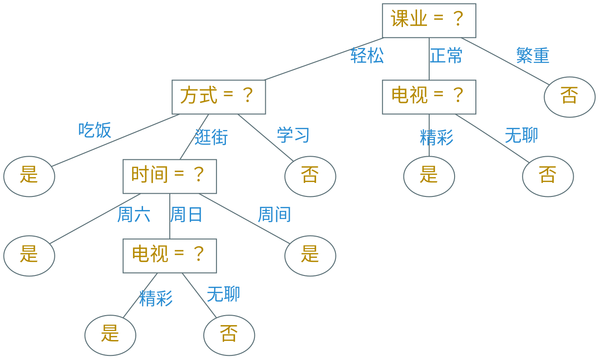

---
presentation:
  margin: 0
  center: false
  transition: "convex"
  enableSpeakerNotes: true
  slideNumber: "c/t"
  navigationMode: "linear"
---

@import "../css/font-awesome-4.7.0/css/font-awesome.css"
@import "../css/theme/solarized.css"
@import "../css/logo.css"
@import "../css/font.css"
@import "../css/color.css"
@import "../css/margin.css"
@import "../css/table.css"
@import "../css/main.css"
@import "../plugin/zoom/zoom.js"
@import "../plugin/customcontrols/plugin.js"
@import "../plugin/customcontrols/style.css"
@import "../plugin/chalkboard/plugin.js"
@import "../plugin/chalkboard/style.css"
@import "../plugin/menu/menu.js"
@import "../js/anychart/anychart-core.min.js"
@import "../js/anychart/anychart-venn.min.js"
@import "../js/anychart/pastel.min.js"
@import "../js/anychart/venn-ml.js"

<!-- slide data-notes="" -->

# 机器学习

## 决策树

### 计算机学院 &nbsp;&nbsp; 张腾

#### _tengzhang@hust.edu.cn_

<!-- slide vertical=true data-notes="" -->

##### 大纲

---

@import "../vega/outline.json" {as="vega" .top-2}

<!-- slide data-notes="" -->

##### 符号学派 规则学习

---

规则学习中的{==规则==} (rule) 指狭义的逻辑规则，呈 if-then 形式

$$
\begin{align*}
    \qquad \overbrace{\otimes}^{\text{规则头}} \underbrace{\longleftarrow}_{\text{蕴含}} \overbrace{f_1 \wedge \underbrace{f_2}_{\text{文字}} \wedge \cdots \wedge f_L}^{\text{规则体}}
\end{align*}
$$

文字 (literal)：对特征进行检验的布尔表达式，如$(\text{天气 = 雨天})$

- 规则头：也是文字，一般表示规则判定的标记、类别或概念
- 规则体：即前提，由逻辑文字组成的合取式，文字个数称为规则长度

一个规则可以看成一个学习模型

符合规则的样本称为被该规则{==覆盖==} (cover)

<!-- slide vertical=true data-notes="" -->

##### 覆盖

---

| 次序 | 时间 | 方式 | 天气 | 课业 | 疫情 | 电视 | 约会 |
| :--: | :--: | :--: | :--: | :--: | :--: | :--: | :--: |
|  1   | 周六 | 吃饭 | 晴天 | 轻松 | 清零 | 精彩 |  是  |
|  2   | 周日 | 吃饭 | 阴天 | 轻松 | 清零 | 精彩 |  是  |
|  3   | 周日 | 吃饭 | 晴天 | 轻松 | 清零 | 精彩 |  是  |
|  4   | 周六 | 吃饭 | 阴天 | 轻松 | 清零 | 精彩 |  是  |
|  5   | 周间 | 吃饭 | 晴天 | 轻松 | 清零 | 精彩 |  是  |
|  6   | 周六 | 逛街 | 晴天 | 轻松 | 平缓 | 无聊 |  是  |
|  7   | 周日 | 逛街 | 晴天 | 正常 | 平缓 | 无聊 |  是  |
|  8   | 周日 | 逛街 | 晴天 | 轻松 | 平缓 | 精彩 |  是  |
|  9   | 周日 | 逛街 | 阴天 | 正常 | 平缓 | 精彩 |  否  |
|  10  | 周六 | 学习 | 雨天 | 轻松 | 严峻 | 无聊 |  否  |
|  11  | 周间 | 学习 | 雨天 | 繁重 | 严峻 | 精彩 |  否  |
|  12  | 周间 | 吃饭 | 晴天 | 繁重 | 严峻 | 无聊 |  否  |
|  13  | 周六 | 逛街 | 晴天 | 正常 | 清零 | 精彩 |  否  |
|  14  | 周间 | 逛街 | 阴天 | 正常 | 清零 | 精彩 |  否  |
|  15  | 周日 | 逛街 | 晴天 | 轻松 | 平缓 | 无聊 |  否  |
|  16  | 周间 | 吃饭 | 晴天 | 繁重 | 严峻 | 精彩 |  否  |
|  17  | 周六 | 吃饭 | 阴天 | 正常 | 平缓 | 精彩 |  否  |

$\class{blue}{\text{是} \longleftarrow (\text{方式=吃饭}) \wedge (\text{疫情=清零})}$

$\class{red}{\text{否} \longleftarrow (\text{课业=繁重})}$

<!-- slide vertical=true data-notes="" -->

##### 冲突

---

一个样本若被判定结果不同的多个规则覆盖，称发生了{==冲突==}

{==冲突消解==} (conflict resolution)：

- 投票法：少数服从多数
- 排序法：在规则集合上定义一个优先级顺序
- 元规则法：规则的规则，例如“发生冲突时使用长度最小的规则”

规则集合未必能覆盖所有未知样本

$$
\begin{align*}
    \qquad \qquad \text{规则集合} = \begin{cases}
        \text{是} \longleftarrow (\text{方式=吃饭}) \wedge (\text{疫情=清零}) \\
        \text{否} \longleftarrow (\text{课业=繁重}) \end{cases}
\end{align*}
$$

默认规则：例如“未被规则集合覆盖的都不约会”

<!-- slide data-notes="" -->

##### 序贯覆盖

---

序贯覆盖 (sequential covering)，即逐条归纳

- 从空规则开始，将正类作为规则头，遍历每个特征的取值
- 若当前规则的规则体仅覆盖正类样本，则由此产生一条规则
- 去掉所有已被覆盖的样本
- 在剩下的训练数据集上重复上述过程

<!-- slide data-transition="convex-in none" vertical=true data-notes="" -->

##### 序贯覆盖 单文字规则

---

| 次序 | 时间 | 方式 | 天气 | 课业 | 疫情 | 电视 | 约会 |
| :--: | :--: | :--: | :--: | :--: | :--: | :--: | :--: |
|  1   | 周六 | 吃饭 | 晴天 | 轻松 | 清零 | 精彩 |  是  |
|  2   | 周日 | 吃饭 | 阴天 | 轻松 | 清零 | 精彩 |  是  |
|  3   | 周日 | 吃饭 | 晴天 | 轻松 | 清零 | 精彩 |  是  |
|  4   | 周六 | 吃饭 | 阴天 | 轻松 | 清零 | 精彩 |  是  |
|  5   | 周间 | 吃饭 | 晴天 | 轻松 | 清零 | 精彩 |  是  |
|  6   | 周六 | 逛街 | 晴天 | 轻松 | 平缓 | 无聊 |  是  |
|  7   | 周日 | 逛街 | 晴天 | 正常 | 平缓 | 无聊 |  是  |
|  8   | 周日 | 逛街 | 晴天 | 轻松 | 平缓 | 精彩 |  是  |
|  9   | 周日 | 逛街 | 阴天 | 正常 | 平缓 | 精彩 |  否  |
|  10  | 周六 | 学习 | 雨天 | 轻松 | 严峻 | 无聊 |  否  |
|  11  | 周间 | 学习 | 雨天 | 繁重 | 严峻 | 精彩 |  否  |
|  12  | 周间 | 吃饭 | 晴天 | 繁重 | 严峻 | 无聊 |  否  |
|  13  | 周六 | 逛街 | 晴天 | 正常 | 清零 | 精彩 |  否  |
|  14  | 周间 | 逛街 | 阴天 | 正常 | 清零 | 精彩 |  否  |
|  15  | 周日 | 逛街 | 晴天 | 轻松 | 平缓 | 无聊 |  否  |
|  16  | 周间 | 吃饭 | 晴天 | 繁重 | 严峻 | 精彩 |  否  |
|  17  | 周六 | 吃饭 | 阴天 | 正常 | 平缓 | 精彩 |  否  |

$\text{是} \longleftarrow (\text{时间=周六})$

<!-- slide data-transition="none" vertical=true data-notes="" -->

##### 序贯覆盖 单文字规则

---

| 次序 | 时间 | 方式 | 天气 | 课业 | 疫情 | 电视 | 约会 |
| :--: | :--: | :--: | :--: | :--: | :--: | :--: | :--: |
|  1   | 周六 | 吃饭 | 晴天 | 轻松 | 清零 | 精彩 |  是  |
|  2   | 周日 | 吃饭 | 阴天 | 轻松 | 清零 | 精彩 |  是  |
|  3   | 周日 | 吃饭 | 晴天 | 轻松 | 清零 | 精彩 |  是  |
|  4   | 周六 | 吃饭 | 阴天 | 轻松 | 清零 | 精彩 |  是  |
|  5   | 周间 | 吃饭 | 晴天 | 轻松 | 清零 | 精彩 |  是  |
|  6   | 周六 | 逛街 | 晴天 | 轻松 | 平缓 | 无聊 |  是  |
|  7   | 周日 | 逛街 | 晴天 | 正常 | 平缓 | 无聊 |  是  |
|  8   | 周日 | 逛街 | 晴天 | 轻松 | 平缓 | 精彩 |  是  |
|  9   | 周日 | 逛街 | 阴天 | 正常 | 平缓 | 精彩 |  否  |
|  10  | 周六 | 学习 | 雨天 | 轻松 | 严峻 | 无聊 |  否  |
|  11  | 周间 | 学习 | 雨天 | 繁重 | 严峻 | 精彩 |  否  |
|  12  | 周间 | 吃饭 | 晴天 | 繁重 | 严峻 | 无聊 |  否  |
|  13  | 周六 | 逛街 | 晴天 | 正常 | 清零 | 精彩 |  否  |
|  14  | 周间 | 逛街 | 阴天 | 正常 | 清零 | 精彩 |  否  |
|  15  | 周日 | 逛街 | 晴天 | 轻松 | 平缓 | 无聊 |  否  |
|  16  | 周间 | 吃饭 | 晴天 | 繁重 | 严峻 | 精彩 |  否  |
|  17  | 周六 | 吃饭 | 阴天 | 正常 | 平缓 | 精彩 |  否  |

$\text{是} \longleftarrow (\text{时间=周日})$

<!-- slide data-transition="none" vertical=true data-notes="" -->

##### 序贯覆盖 双文字规则

---

| 次序 | 时间 | 方式 | 天气 | 课业 | 疫情 | 电视 | 约会 |
| :--: | :--: | :--: | :--: | :--: | :--: | :--: | :--: |
|  1   | 周六 | 吃饭 | 晴天 | 轻松 | 清零 | 精彩 |  是  |
|  2   | 周日 | 吃饭 | 阴天 | 轻松 | 清零 | 精彩 |  是  |
|  3   | 周日 | 吃饭 | 晴天 | 轻松 | 清零 | 精彩 |  是  |
|  4   | 周六 | 吃饭 | 阴天 | 轻松 | 清零 | 精彩 |  是  |
|  5   | 周间 | 吃饭 | 晴天 | 轻松 | 清零 | 精彩 |  是  |
|  6   | 周六 | 逛街 | 晴天 | 轻松 | 平缓 | 无聊 |  是  |
|  7   | 周日 | 逛街 | 晴天 | 正常 | 平缓 | 无聊 |  是  |
|  8   | 周日 | 逛街 | 晴天 | 轻松 | 平缓 | 精彩 |  是  |
|  9   | 周日 | 逛街 | 阴天 | 正常 | 平缓 | 精彩 |  否  |
|  10  | 周六 | 学习 | 雨天 | 轻松 | 严峻 | 无聊 |  否  |
|  11  | 周间 | 学习 | 雨天 | 繁重 | 严峻 | 精彩 |  否  |
|  12  | 周间 | 吃饭 | 晴天 | 繁重 | 严峻 | 无聊 |  否  |
|  13  | 周六 | 逛街 | 晴天 | 正常 | 清零 | 精彩 |  否  |
|  14  | 周间 | 逛街 | 阴天 | 正常 | 清零 | 精彩 |  否  |
|  15  | 周日 | 逛街 | 晴天 | 轻松 | 平缓 | 无聊 |  否  |
|  16  | 周间 | 吃饭 | 晴天 | 繁重 | 严峻 | 精彩 |  否  |
|  17  | 周六 | 吃饭 | 阴天 | 正常 | 平缓 | 精彩 |  否  |

$\text{是} \longleftarrow (\text{时间=周六}) \wedge (\text{方式=吃饭})$

<!-- slide data-transition="none" vertical=true data-notes="" -->

##### 序贯覆盖 双文字规则

---

| 次序 | 时间 | 方式 | 天气 | 课业 | 疫情 | 电视 | 约会 |
| :--: | :--: | :--: | :--: | :--: | :--: | :--: | :--: |
|  1   | 周六 | 吃饭 | 晴天 | 轻松 | 清零 | 精彩 |  是  |
|  2   | 周日 | 吃饭 | 阴天 | 轻松 | 清零 | 精彩 |  是  |
|  3   | 周日 | 吃饭 | 晴天 | 轻松 | 清零 | 精彩 |  是  |
|  4   | 周六 | 吃饭 | 阴天 | 轻松 | 清零 | 精彩 |  是  |
|  5   | 周间 | 吃饭 | 晴天 | 轻松 | 清零 | 精彩 |  是  |
|  6   | 周六 | 逛街 | 晴天 | 轻松 | 平缓 | 无聊 |  是  |
|  7   | 周日 | 逛街 | 晴天 | 正常 | 平缓 | 无聊 |  是  |
|  8   | 周日 | 逛街 | 晴天 | 轻松 | 平缓 | 精彩 |  是  |
|  9   | 周日 | 逛街 | 阴天 | 正常 | 平缓 | 精彩 |  否  |
|  10  | 周六 | 学习 | 雨天 | 轻松 | 严峻 | 无聊 |  否  |
|  11  | 周间 | 学习 | 雨天 | 繁重 | 严峻 | 精彩 |  否  |
|  12  | 周间 | 吃饭 | 晴天 | 繁重 | 严峻 | 无聊 |  否  |
|  13  | 周六 | 逛街 | 晴天 | 正常 | 清零 | 精彩 |  否  |
|  14  | 周间 | 逛街 | 阴天 | 正常 | 清零 | 精彩 |  否  |
|  15  | 周日 | 逛街 | 晴天 | 轻松 | 平缓 | 无聊 |  否  |
|  16  | 周间 | 吃饭 | 晴天 | 繁重 | 严峻 | 精彩 |  否  |
|  17  | 周六 | 吃饭 | 阴天 | 正常 | 平缓 | 精彩 |  否  |

$\text{是} \longleftarrow (\text{时间=周日}) \wedge (\text{方式=吃饭})$

<!-- slide data-transition="none" vertical=true data-notes="" -->

##### 序贯覆盖 双文字规则

---

| 次序 | 时间 | 方式 | 天气 | 课业 | 疫情 | 电视 | 约会 |
| :--: | :--: | :--: | :--: | :--: | :--: | :--: | :--: |
|  1   | 周六 | 吃饭 | 晴天 | 轻松 | 清零 | 精彩 |  是  |
|  2   | 周日 | 吃饭 | 阴天 | 轻松 | 清零 | 精彩 |  是  |
|  3   | 周日 | 吃饭 | 晴天 | 轻松 | 清零 | 精彩 |  是  |
|  4   | 周六 | 吃饭 | 阴天 | 轻松 | 清零 | 精彩 |  是  |
|  5   | 周间 | 吃饭 | 晴天 | 轻松 | 清零 | 精彩 |  是  |
|  6   | 周六 | 逛街 | 晴天 | 轻松 | 平缓 | 无聊 |  是  |
|  7   | 周日 | 逛街 | 晴天 | 正常 | 平缓 | 无聊 |  是  |
|  8   | 周日 | 逛街 | 晴天 | 轻松 | 平缓 | 精彩 |  是  |
|  9   | 周日 | 逛街 | 阴天 | 正常 | 平缓 | 精彩 |  否  |
|  10  | 周六 | 学习 | 雨天 | 轻松 | 严峻 | 无聊 |  否  |
|  11  | 周间 | 学习 | 雨天 | 繁重 | 严峻 | 精彩 |  否  |
|  12  | 周间 | 吃饭 | 晴天 | 繁重 | 严峻 | 无聊 |  否  |
|  13  | 周六 | 逛街 | 晴天 | 正常 | 清零 | 精彩 |  否  |
|  14  | 周间 | 逛街 | 阴天 | 正常 | 清零 | 精彩 |  否  |
|  15  | 周日 | 逛街 | 晴天 | 轻松 | 平缓 | 无聊 |  否  |
|  16  | 周间 | 吃饭 | 晴天 | 繁重 | 严峻 | 精彩 |  否  |
|  17  | 周六 | 吃饭 | 阴天 | 正常 | 平缓 | 精彩 |  否  |

$\text{是} \longleftarrow (\text{时间=周日}) \wedge (\text{方式=吃饭})$

$\class{red}{\text{是} \longleftarrow (\text{时间=周间}) \wedge (\text{课业=轻松})}$

<!-- slide data-transition="none" vertical=true data-notes="" -->

##### 序贯覆盖 双文字规则

---

| 次序 | 时间 | 方式 | 天气 | 课业 | 疫情 | 电视 | 约会 |
| :--: | :--: | :--: | :--: | :--: | :--: | :--: | :--: |
|  1   | 周六 | 吃饭 | 晴天 | 轻松 | 清零 | 精彩 |  是  |
|  2   | 周日 | 吃饭 | 阴天 | 轻松 | 清零 | 精彩 |  是  |
|  3   | 周日 | 吃饭 | 晴天 | 轻松 | 清零 | 精彩 |  是  |
|  4   | 周六 | 吃饭 | 阴天 | 轻松 | 清零 | 精彩 |  是  |
|  5   | 周间 | 吃饭 | 晴天 | 轻松 | 清零 | 精彩 |  是  |
|  6   | 周六 | 逛街 | 晴天 | 轻松 | 平缓 | 无聊 |  是  |
|  7   | 周日 | 逛街 | 晴天 | 正常 | 平缓 | 无聊 |  是  |
|  8   | 周日 | 逛街 | 晴天 | 轻松 | 平缓 | 精彩 |  是  |
|  9   | 周日 | 逛街 | 阴天 | 正常 | 平缓 | 精彩 |  否  |
|  10  | 周六 | 学习 | 雨天 | 轻松 | 严峻 | 无聊 |  否  |
|  11  | 周间 | 学习 | 雨天 | 繁重 | 严峻 | 精彩 |  否  |
|  12  | 周间 | 吃饭 | 晴天 | 繁重 | 严峻 | 无聊 |  否  |
|  13  | 周六 | 逛街 | 晴天 | 正常 | 清零 | 精彩 |  否  |
|  14  | 周间 | 逛街 | 阴天 | 正常 | 清零 | 精彩 |  否  |
|  15  | 周日 | 逛街 | 晴天 | 轻松 | 平缓 | 无聊 |  否  |
|  16  | 周间 | 吃饭 | 晴天 | 繁重 | 严峻 | 精彩 |  否  |
|  17  | 周六 | 吃饭 | 阴天 | 正常 | 平缓 | 精彩 |  否  |

$\text{是} \longleftarrow (\text{时间=周日}) \wedge (\text{方式=吃饭})$

$\class{red}{\text{是} \longleftarrow (\text{时间=周间}) \wedge (\text{课业=轻松})}$

$\class{yellow}{\text{是} \longleftarrow (\text{方式=吃饭}) \wedge (\text{课业=轻松})}$

<!-- slide data-transition="none" vertical=true data-notes="" -->

##### 序贯覆盖 双文字规则

---

| 次序 | 时间 | 方式 | 天气 | 课业 | 疫情 | 电视 | 约会 |
| :--: | :--: | :--: | :--: | :--: | :--: | :--: | :--: |
|  1   | 周六 | 吃饭 | 晴天 | 轻松 | 清零 | 精彩 |  是  |
|  2   | 周日 | 吃饭 | 阴天 | 轻松 | 清零 | 精彩 |  是  |
|  3   | 周日 | 吃饭 | 晴天 | 轻松 | 清零 | 精彩 |  是  |
|  4   | 周六 | 吃饭 | 阴天 | 轻松 | 清零 | 精彩 |  是  |
|  5   | 周间 | 吃饭 | 晴天 | 轻松 | 清零 | 精彩 |  是  |
|  6   | 周六 | 逛街 | 晴天 | 轻松 | 平缓 | 无聊 |  是  |
|  7   | 周日 | 逛街 | 晴天 | 正常 | 平缓 | 无聊 |  是  |
|  8   | 周日 | 逛街 | 晴天 | 轻松 | 平缓 | 精彩 |  是  |
|  9   | 周日 | 逛街 | 阴天 | 正常 | 平缓 | 精彩 |  否  |
|  10  | 周六 | 学习 | 雨天 | 轻松 | 严峻 | 无聊 |  否  |
|  11  | 周间 | 学习 | 雨天 | 繁重 | 严峻 | 精彩 |  否  |
|  12  | 周间 | 吃饭 | 晴天 | 繁重 | 严峻 | 无聊 |  否  |
|  13  | 周六 | 逛街 | 晴天 | 正常 | 清零 | 精彩 |  否  |
|  14  | 周间 | 逛街 | 阴天 | 正常 | 清零 | 精彩 |  否  |
|  15  | 周日 | 逛街 | 晴天 | 轻松 | 平缓 | 无聊 |  否  |
|  16  | 周间 | 吃饭 | 晴天 | 繁重 | 严峻 | 精彩 |  否  |
|  17  | 周六 | 吃饭 | 阴天 | 正常 | 平缓 | 精彩 |  否  |

$\text{是} \longleftarrow (\text{时间=周日}) \wedge (\text{方式=吃饭})$

$\class{red}{\text{是} \longleftarrow (\text{时间=周间}) \wedge (\text{课业=轻松})}$

$\class{yellow}{\text{是} \longleftarrow (\text{方式=吃饭}) \wedge (\text{课业=轻松})}$

$\class{blue}{\text{是} \longleftarrow (\text{课业=轻松}) \wedge (\text{电视=精彩})}$

<!-- slide data-transition="none" vertical=true data-notes="" -->

##### 序贯覆盖 双文字规则

---

| 次序 | 时间 | 方式 | 天气 | 课业 | 疫情 | 电视 | 约会 |
| :--: | :--: | :--: | :--: | :--: | :--: | :--: | :--: |
|  1   | 周六 | 吃饭 | 晴天 | 轻松 | 清零 | 精彩 |  是  |
|  2   | 周日 | 吃饭 | 阴天 | 轻松 | 清零 | 精彩 |  是  |
|  3   | 周日 | 吃饭 | 晴天 | 轻松 | 清零 | 精彩 |  是  |
|  4   | 周六 | 吃饭 | 阴天 | 轻松 | 清零 | 精彩 |  是  |
|  5   | 周间 | 吃饭 | 晴天 | 轻松 | 清零 | 精彩 |  是  |
|  6   | 周六 | 逛街 | 晴天 | 轻松 | 平缓 | 无聊 |  是  |
|  7   | 周日 | 逛街 | 晴天 | 正常 | 平缓 | 无聊 |  是  |
|  8   | 周日 | 逛街 | 晴天 | 轻松 | 平缓 | 精彩 |  是  |
|  9   | 周日 | 逛街 | 阴天 | 正常 | 平缓 | 精彩 |  否  |
|  10  | 周六 | 学习 | 雨天 | 轻松 | 严峻 | 无聊 |  否  |
|  11  | 周间 | 学习 | 雨天 | 繁重 | 严峻 | 精彩 |  否  |
|  12  | 周间 | 吃饭 | 晴天 | 繁重 | 严峻 | 无聊 |  否  |
|  13  | 周六 | 逛街 | 晴天 | 正常 | 清零 | 精彩 |  否  |
|  14  | 周间 | 逛街 | 阴天 | 正常 | 清零 | 精彩 |  否  |
|  15  | 周日 | 逛街 | 晴天 | 轻松 | 平缓 | 无聊 |  否  |
|  16  | 周间 | 吃饭 | 晴天 | 繁重 | 严峻 | 精彩 |  否  |
|  17  | 周六 | 吃饭 | 阴天 | 正常 | 平缓 | 精彩 |  否  |

$\text{是} \longleftarrow (\text{时间=周日}) \wedge (\text{方式=吃饭})$

$\class{red}{\text{是} \longleftarrow (\text{时间=周间}) \wedge (\text{课业=轻松})}$

$\class{yellow}{\text{是} \longleftarrow (\text{方式=吃饭}) \wedge (\text{课业=轻松})}$

$\class{blue}{\text{是} \longleftarrow (\text{课业=轻松}) \wedge (\text{电视=精彩})}$

$\class{orange}{\text{是} \longleftarrow (\text{课业=正常}) \wedge (\text{电视=无聊})}$

<!-- slide data-transition="none" vertical=true data-notes="" -->

##### 序贯覆盖 三文字规则

---

| 次序 | 时间 | 方式 | 天气 | 课业 | 疫情 | 电视 | 约会 |
| :--: | :--: | :--: | :--: | :--: | :--: | :--: | :--: |
|  1   | 周六 | 吃饭 | 晴天 | 轻松 | 清零 | 精彩 |  是  |
|  2   | 周日 | 吃饭 | 阴天 | 轻松 | 清零 | 精彩 |  是  |
|  3   | 周日 | 吃饭 | 晴天 | 轻松 | 清零 | 精彩 |  是  |
|  4   | 周六 | 吃饭 | 阴天 | 轻松 | 清零 | 精彩 |  是  |
|  5   | 周间 | 吃饭 | 晴天 | 轻松 | 清零 | 精彩 |  是  |
|  6   | 周六 | 逛街 | 晴天 | 轻松 | 平缓 | 无聊 |  是  |
|  7   | 周日 | 逛街 | 晴天 | 正常 | 平缓 | 无聊 |  是  |
|  8   | 周日 | 逛街 | 晴天 | 轻松 | 平缓 | 精彩 |  是  |
|  9   | 周日 | 逛街 | 阴天 | 正常 | 平缓 | 精彩 |  否  |
|  10  | 周六 | 学习 | 雨天 | 轻松 | 严峻 | 无聊 |  否  |
|  11  | 周间 | 学习 | 雨天 | 繁重 | 严峻 | 精彩 |  否  |
|  12  | 周间 | 吃饭 | 晴天 | 繁重 | 严峻 | 无聊 |  否  |
|  13  | 周六 | 逛街 | 晴天 | 正常 | 清零 | 精彩 |  否  |
|  14  | 周间 | 逛街 | 阴天 | 正常 | 清零 | 精彩 |  否  |
|  15  | 周日 | 逛街 | 晴天 | 轻松 | 平缓 | 无聊 |  否  |
|  16  | 周间 | 吃饭 | 晴天 | 繁重 | 严峻 | 精彩 |  否  |
|  17  | 周六 | 吃饭 | 阴天 | 正常 | 平缓 | 精彩 |  否  |

$\text{是} \longleftarrow (\text{时间=周日}) \wedge (\text{方式=吃饭})$

$\class{red}{\text{是} \longleftarrow (\text{时间=周间}) \wedge (\text{课业=轻松})}$

$\class{yellow}{\text{是} \longleftarrow (\text{方式=吃饭}) \wedge (\text{课业=轻松})}$

$\class{blue}{\text{是} \longleftarrow (\text{课业=轻松}) \wedge (\text{电视=精彩})}$

$\class{orange}{\text{是} \longleftarrow (\text{课业=正常}) \wedge (\text{电视=无聊})}$

$\class{cyan}{\text{是} \longleftarrow (\text{时间=周六}) \wedge (\text{方式=逛街}) \\ \quad \quad \quad \wedge (\text{课业=轻松})}$

<!-- slide data-notes="" -->

##### 决策树

---

序贯覆盖：删除样本 决策树：划分样本

<!-- slide vertical=true data-notes="" -->

##### 基本算法

---

输入：训练集$D = \{ (\xv_i, y_i) \}_{i \in [m]}$，属性集$A = \{ a_j \}_{j \in [d]}$ 过程：函数$\TG(D,A)$

1. 生成结点$\node$
2. {==if==} $D$中样本全属于同一类别$C$ {==then==} &nbsp;&nbsp;&nbsp;&nbsp;// 递归情形 1
3. &emsp;&emsp;将$\node$标记为$C$类叶结点 {==return==}
4. {==if==} $A = \emptyset$ {==or==} $D$中样本在$A$上取值相同 {==then==} &nbsp;&nbsp;&nbsp;&nbsp;// 递归情形 2
5. &emsp;&emsp;将$\node$标记为叶结点，其类别标记为$D$中样本最多的类 {==return==}
6. 从$A$中选择最优划分属性$a_\star$，对$a_\star$的每一个取值$a_\star^v$，为$\node$生成一个分支，令$D_v$表示$D$在$a_\star$上取值为$a_\star^v$的样本子集
7. {==if==} $D_v = \emptyset$ {==then==} &nbsp;&nbsp;&nbsp;&nbsp;// 递归情形 3
8. &emsp;&emsp;将分支结点标记为叶结点，其类别标记为$D$中样本最多的类 {==return==}
9. {==else==}
10. &emsp;&emsp;以$\TG(D_v, A \setminus \{ a_\star \})$为分支结点

输出：以$\node$为根结点的一棵决策树

<!-- slide data-notes="" -->

##### 划分选择

---

目标：随着划分的不断进行，决策树节点的{==纯度==}越来越高

设训练集$D$中第$k$类样本的比例为$p_k = \Pr(y = k)$，{==熵==}定义为

$$
\begin{align*}
    \qquad E(D) = - \sum_{k \in |\Ycal|} p_k \log p_k
\end{align*}
$$

熵$E(D)$越小，纯度越高
