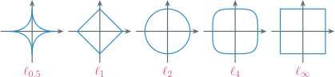
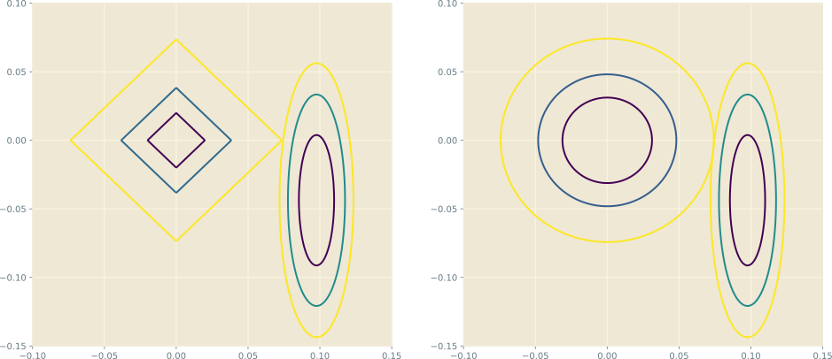
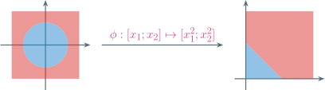

---
presentation:
  margin: 0
  center: false
  slideNumber: "c/t"
  navigationMode: "linear"
---

@import "../css/theme/solarized.css"
@import "../css/logo.css"
@import "../css/font.css"
@import "../css/color.css"
@import "../css/margin.css"
@import "../css/table.css"
@import "../css/main.css"

<!-- slide data-notes="" -->

##### 特征变换

---

模型学习前的最后一步，亦有将该步与模型学习融合的做法

当部分特征冗余甚至有害时，挑选或生成有用的特征子集

- 去除低方差特征，特别是那些在所有样本上取值均不变的特征
- 先计算 F 检验值、卡方检验值、互信息、线性相关性等统计量，然后据此设立阈值选择特征
- 引入$\ell_1$等稀疏范数作为约束，将选择特征与模型学习合二为一
- 通过 PCA、随机投影等降维技术浓缩现有特征

<div class="top2"></div>

当特征稀缺时，利用现有特征构造新的特征

- 凭经验显式构造：$[x_1; x_2] \xrightarrow{\Rbb^2 \mapsto \Rbb^6} [x_1^2; x_2^2; \sqrt{2} x_1 x_2; \sqrt{2} x_1; \sqrt{2} x_2; 1]$
- 利用核函数$\kappa(\xv, \zv) = \phi(\xv)^\top \phi(\zv)$隐式构造，代表性方法为支持向量机
- 利用非线性函数复合$f_n ( f_{n-1} ( \cdots f_2 (f_1 (\xv))))$，代表性方法为神经网络

<!-- slide vertical=true data-notes="" -->

##### 特征选择 低方差过滤

---

过滤低方差特征，尤其是那些在所有样本上取值均相同的特征

```python {.line-numbers .top-2 .left4 highlight=[10,14-17,20]}
import numpy as np
from sklearn.feature_selection import VarianceThreshold

X = np.array( # 对6个离散类别特征采用了独热编码
    [[1., 1., 0., 0., 1., 0., 0., 1., 0., 0., 1., 0., 1.],
     [1., 0., 0., 1., 1., 0., 0., 1., 0., 1., 0., 1., 0.],
     [1., 0., 1., 0., 0., 1., 0., 1., 1., 0., 0., 1., 0.],
     [1., 0., 0., 1., 1., 0., 1., 0., 0., 0., 1., 0., 1.]])
X.shape
(4, 13)

# 第1列由特征“时间”而来 四个样本都取值“周六” 独热编码后都是1 方差为0
XX = VarianceThreshold(threshold=0.01).fit_transform(X)
[[1., 0., 0., 1., 0., 0., 1., 0., 0., 1., 0., 1.],
 [0., 0., 1., 1., 0., 0., 1., 0., 1., 0., 1., 0.],
 [0., 1., 0., 0., 1., 0., 1., 1., 0., 0., 1., 0.],
 [0., 0., 1., 1., 0., 1., 0., 0., 0., 1., 0., 1.]]

XX.shape
(4, 12)
```

<!-- slide data-notes="" -->

##### 特征选择 方差分析

---

设共有$k$个类别，总样本数为$m = \sum_{i \in [k]} m_i$，总体均值为$\xbar$<br>设第$i$类第$j$个样本为$x_{ij}$，第$i$类的均值为$\xbar_i$，则总体偏差

$$
\begin{align*}
    \sum_{i \in [k]} & \sum_{j \in [m_i]} (x_{ij} - \xbar)^2 = \sum_{i \in [k]} \sum_{j \in [m_i]} (x_{ij} - \xbar_i + \xbar_i - \xbar)^2 \\
    & = \sum_{i \in [k]} \sum_{j \in [m_i]} [ (x_{ij} - \xbar_i)^2 + (\xbar_i - \xbar)^2 ] + \sum_{i \in [k]} 2 \underbrace{\sum_{j \in [m_i]} (x_{ij} - \xbar_i)}_{=0} (\xbar_i - \xbar) \\
    & = \sum_{i \in [k]} \sum_{j \in [m_i]} (x_{ij} - \xbar_i)^2 + \sum_{i \in [k]} m_i (\xbar_i - \xbar)^2 = \SSE + \SSB
\end{align*}
$$

- $\SSE$为各类样本与均值的偏差，越小说明每个类别各自聚集越紧密
- $\SSB$为各类均值与总体的偏差，越小说明不同类别的均值差异越小
- $F = \frac{\SSB/(k-1)}{\SSE/(m-k)}$越小，说明类别间差异越小

<!-- slide vertical=true data-notes="" -->

##### 特征选择 方差分析

---

对任意特征根据类别标记一分为二计算$F$值，判断差异是否显著

<div class="threelines column7-border-right-solid head-highlight-1 tr-hover top-2 bottom-2">

| 次序 | 时间 | 方式 | 天气 | 课业 | 疫情 | 电视 | 约会 |
| :--: | :--: | :--: | :--: | :--: | :--: | :--: | :--: |
|  1   | 周六 | 吃饭 | 晴天 | 轻松 | 清零 | 精彩 |  是  |
|  6   | 周六 | 逛街 | 晴天 | 轻松 | 平缓 | 无聊 |  是  |
|  10  | 周六 | 学习 | 雨天 | 轻松 | 严峻 | 无聊 |  否  |
|  13  | 周六 | 逛街 | 晴天 | 正常 | 清零 | 精彩 |  否  |

</div>

对特征“次序”，总体均值$\xbar = 7.5$

- 正类特征$1,6$，均值$3.5$、偏差$2.5^2 + 2.5^2 = 12.5$
- 负类特征$10,13$，均值$11.5$、偏差$1.5^2 + 1.5^2 = 4.5$
- $\SSE = 12.5 + 4.5 = 17$，$\SSB = 2(3.5-7.5)^2 + 2(11.5-7.5)^2 = 64$
- $F = \frac{\SSB/(k-1)}{\SSE/(m-k)} = \frac{64/(2-1)}{17/(4-2)} = 7.52941176$

<!-- slide vertical=true data-notes="" -->

##### 特征选择 方差分析

---

经独热编码，特征“是否无聊”的四个取值是$0,1,1,0$，均值$0.5$

- 正类特征均值$0.5$、偏差$0.5$，负类特征均值$0.5$、偏差$0.5$
- $\SSE = 0.5 + 0.5 = 1$，$\SSB = 0$，$F = \frac{\SSB/(k-1)}{\SSE/(m-k)} = 0$

```python {.line-numbers .top-1 .left4 highlight=[15-17]}
import numpy as np
from sklearn.feature_selection import SelectKBest, f_classif

X = np.array([ # 已去掉方差为零的特征
    [1., 1., 0., 0., 1., 0., 0., 1., 0., 0., 1., 0., 1.],
    [6., 0., 0., 1., 1., 0., 0., 1., 0., 1., 0., 1., 0.],
    [10., 0., 1., 0., 0., 1., 0., 1., 1., 0., 0., 1., 0.],
    [13., 0., 0., 1., 1., 0., 1., 0., 0., 0., 1., 0., 1.],
])
y = [1, 1, 0, 0]

sk = SelectKBest(f_classif)
sk.fit_transform(X, y)
sk.scores_
[7.52941176, 1.        , 1.        , 0.        , 1.        ,
 1.        , 1.        , 1.        , 1.        , 1.        ,
 0.        , 0.        , 0.        ]
```

<!-- slide data-notes="" -->

##### 特征选择 卡方检验

---

- 若随机变量$X$和$Y$独立，则$\Pr(X,Y) = \Pr(X) \cdot \Pr(Y)$
- $|\Pr(X,Y) - \Pr(X) \cdot \Pr(Y)|$可衡量$X$和$Y$的独立程度

<div class="threelines row4-border-top-solid column1-border-right-solid column3-border-right-solid column1-bold">

|          |                  好瓜                   |                 坏瓜                  | 边际概率 |
| :------: | :-------------------------------------: | :-----------------------------------: | :------: |
|   青绿   | $1, ~ (0.5 = 4 \times 0.25 \times 0.5)$ | $0, (0.5 = 4 \times 0.25 \times 0.5)$ |  $0.25$  |
|   乌黑   |  $1, ~ (1 = 4 \times 0.5 \times 0.5)$   |  $1, (1 = 4 \times 0.5 \times 0.5)$   |  $0.5$   |
|   浅白   | $0, ~ (0.5 = 4 \times 0.25 \times 0.5)$ | $1, (0.5 = 4 \times 0.25 \times 0.5)$ |  $0.25$  |
| 边际概率 |                  $0.5$                  |                 $0.5$                 |   $1$    |

</div>

- $X$是色泽，$Y$是瓜的好坏，总样本数为$4$
- 括号前的<span class="blue">观测频数</span>$o = 4 \times p(X,Y)$，括号中的<span class="blue">期望频数</span>$e = 4 \times p(X) p(Y)$

$$
\begin{align*}
    \chi^2 = \sum_{ij} \frac{(o_{ij}-e_{ij})^2}{e_{ij}} = 4 \times \frac{(1 - 0.5)^2}{0.5} = 2
\end{align*}
$$

<!-- slide vertical=true data-notes="并非所有的特征都对后面的模型学习有用" -->

##### 特征选择 卡方检验

---

```python {.line-numbers .top-1 .left4 highlight=[15-17]}
import numpy as np
from sklearn.feature_selection import SelectKBest, chi2

X = np.array([
    [1, 0, 0, 1, 0, 0, 0, 1, 0, 0, 0, 0, 0, 0.697, 0.460],
    [2, 1, 0, 0, 0, 0, 1, 0, 0, 0, 0, 0, 0, 0.774, 0.376],
    [3, 1, 0, 0, 0, 1, 1, 0, 0, 0, 1, 0, 1, 0.666, 0.091],
    [4, 0, 1, 0, 1, 0, 0, 0, 1, 1, 0, 1, 0, 0.245, 0.057],
])
y = [1, 1, 0, 0]

sk = SelectKBest(chi2, k=1)
sk.fit_transform(X, y)
sk.scores_
[8.53333333, 1.        , 1.        , 0.        , 0.33333333,
 1.        , 1.        , 0.33333333, 1.        , 1.        ,
 0.        , 0.        , 0.        ]
```

独热编码将色泽分成了三个特征，其卡方检验值为 0 + 1 + 1 = 2

<!-- slide data-notes="并非所有的特征都对后面的模型学习有用" -->

##### 特征选择 互信息

熵 (entropy) 可以度量<span class="blue">随机变量的不确定性</span>

$$
\begin{align*}
    H(X) = - \sum_{i \in [m]} p(x_i) \log p(x_i) = - \Ebb [\log p(X)], \quad 0 \log 0 \triangleq 0
\end{align*}
$$

当$p(x_1) = \cdots = p(x_m) = \frac{1}{m}$时，熵达到最大值$\log m$

拉格朗日函数$L = - \sum_{i \in [m]} p(x_i) \log p(x_i) - \alpha (\sum_{i \in [m]} p(x_i) - 1)$，令

$$
\begin{align*}
    \frac{\partial L}{\partial p(x_i)} = - \log p(x_i) - 1 - \alpha = 0 ~ \Longrightarrow ~ p(x_i) = \exp(-1-\alpha) = \frac{1}{m}
\end{align*}
$$

当某个$p(x_i) = 1$、其余为零时，熵达到最小值$0$，此时无不确定性

$$
\begin{align*}
    H(X) = \sum_{i \in [m]} p(x_i) \log \frac{1}{p(x_i)} \ge \sum_{i \in [m]} p(x_i) \log 1 = 0
\end{align*}
$$

<!-- slide vertical=true data-notes="并非所有的特征都对后面的模型学习有用" -->

##### 特征选择 互信息

联合熵：两个随机变量的联合不确定性

$$
\begin{align*}
    H(X,Y) = - \sum_{i \in [m]} \sum_{j \in [n]} p(x_i,y_j) \log p(x_i,y_j) = - \Ebb [\log p(X,Y)]
\end{align*}
$$

条件熵：给定一个随机变量的取值后，另一个随机变量的不确定性

$$
\begin{align*}
    H(X|Y) & = H(X,Y) - H(Y) \\
    & = - \sum_{i \in [m]} \sum_{j \in [n]} p(x_i,y_j) \log p(x_i,y_j) + \sum_{j \in [n]} \class{blue}{p(y_j)} \log p(y_j) \\
    & = - \sum_{i \in [m]} \sum_{j \in [n]} p(x_i,y_j) \log p(x_i,y_j) + \sum_{j \in [n]} \class{blue}{\sum_{i \in [m]} p(x_i,y_j)} \log p(y_j) \\
    & = - \sum_{i \in [m]} \sum_{j \in [n]} p(x_i,y_j) \log p(x_i|y_j) \\
    & = - \Ebb [\log p(X|Y)]
\end{align*}
$$

<!-- slide vertical=true data-notes="随机变量独立 互信息为零 交集为空" -->

##### 特征选择 互信息

互信息：两个随机变量之间的相关程度

$$
\begin{align*}
    I(X;Y) & = H(X) - H(X|Y) \\
    & = - \sum_{i \in [m]} \class{blue}{p(x_i)} \log p(x_i) + \sum_{i \in [m]} \sum_{j \in [n]} p(x_i,y_j) \log p(x_i|y_j) \\
    & = - \sum_{i \in [m]} \class{blue}{\sum_{j \in [n]} p(x_i,y_j)} \log p(x_i) + \sum_{i \in [m]} \sum_{j \in [n]} p(x_i,y_j) \log \frac{p(x_i,y_j)}{p(y_j)} \\
    & = - \sum_{i \in [m]} \sum_{j \in [n]} p(x_i,y_j) \log \frac{p(x_i)p(y_j)}{p(x_i,y_j)} = \Ebb \left[ \log \frac{p(X,Y)}{p(X)p(Y)} \right]
\end{align*}
$$

互信息 (交集) 与熵、联合熵 (并集)、条件熵 (差集) 的关系为

$$
\begin{align*}
    I(X;Y) & = H(X) - H(X|Y) = H(Y) - H(Y|X) \\
    & = H(X) + H(Y) - H(X,Y) \\
    & = H(X,Y) - H(X|Y) - H(Y|X)
\end{align*}
$$

<!-- slide vertical=true data-notes="随机变量独立 互信息为零 交集为空" -->

##### 特征选择 互信息

利用每个特征和类别标记之间的互信息进行挑选

```python {.line-numbers}
import numpy as np
from sklearn.feature_selection import SelectKBest, mutual_info_classif

X = np.array([
    [1, 0, 0, 1, 0, 0, 1, 0, 1, 0, 0, 1, 0, 1, 0, 0, 1, 0.697, 0.460],
    [2, 1, 0, 0, 0, 0, 1, 1, 0, 0, 0, 1, 0, 1, 0, 0, 1, 0.774, 0.376],
    [3, 1, 0, 0, 0, 1, 0, 1, 0, 0, 0, 0, 1, 0, 0, 1, 1, 0.666, 0.091],
    [4, 0, 1, 0, 1, 0, 0, 0, 0, 1, 1, 0, 0, 0, 1, 0, 1, 0.245, 0.057],
])
y = [1, 1, 0, 0]

sk = SelectKBest(mutual_info_classif)
sk.fit_transform(X, y)
sk.scores_
[0.58333333, 0.        , 0.        , 0.20833333, 0.        ,
 0.        , 0.83333333, 0.        , 0.        , 0.20833333,
 0.        , 0.83333333, 0.20833333, 0.83333333, 0.08333333,
 0.        , 0.        , 0.        , 0.83333333]
```

<!-- slide data-notes="并非所有的特征都对后面的模型学习有用" -->

##### 特征选择 线性相关性

$$
\begin{align*}
    \rho_{xy} = \frac{\cov(x,y)}{\sigma_x \sigma_y} = \frac{\sum_{i \in [m]} (x_i - \xbar)(y_i - \ybar)}{\sqrt{\sum_{i \in [m]} (x_i - \xbar)^2} \sqrt{\sum_{i \in [m]} (y_i - \ybar)^2}}
\end{align*}
$$

```python {.line-numbers}
import numpy as np

X = np.array([ # 最后一列为y
    [1, 0, 0, 1, 0, 0, 1, 0, 1, 0, 0, 1, 0, 1, 0, 0, 0.697, 0.460, 1],
    [2, 1, 0, 0, 0, 0, 1, 1, 0, 0, 0, 1, 0, 1, 0, 0, 0.774, 0.376, 1],
    [3, 1, 0, 0, 0, 1, 0, 1, 0, 0, 0, 0, 1, 0, 0, 1, 0.666, 0.091, 0],
    [4, 0, 1, 0, 1, 0, 0, 0, 0, 1, 1, 0, 0, 0, 1, 0, 0.245, 0.057, 0],
])

corr = np.corrcoef(X, rowvar=False)
corr[-1,:]
[-0.89442719,  0.        , -0.57735027,  0.57735027, -0.57735027,
 -0.57735027,  1.        ,  0.        ,  0.57735027, -0.57735027,
 -0.57735027,  1.        , -0.57735027,  1.        , -0.57735027,
 -0.57735027,  0.67912971,  0.9830899 ,  1.        ]
```

<!-- slide data-notes="绝对值就是实数上的最简单的范数" -->

##### 特征选择 稀疏范数

范数$\|\cdot\|$：长度概念的推广，对任意标量$\alpha$和向量空间中的$\uv, \vv$

- (半)正定性：$\| \uv \| \ge 0$，且$\| \uv \| = 0$当且仅当$\uv = \zerov$
- 齐次性：$\| \alpha \uv \| = |\alpha| \cdot \| \uv \|$
- 三角不等式：$\| \uv + \vv \| \le \| \uv \| + \| \vv \|$

<br>

机器学习中常用的是向量的$\ell_p$范数：$\| \wv \|_p \triangleq (\sum_{i \in d} |w_i|^p)^{1/p}$

- $\ell_1$范数：$\| \wv \|_1 = \sum_{i \in d} |w_i|$，各元素绝对值之和
- $\ell_2$范数：$\| \wv \|_2 = \sqrt{\sum_{i \in d} w_i^2}$，各元素平方和的正平方根
- $\ell_\infty$范数：$\| \wv \|_\infty = \max_{i \in d} |w_i|$，各元素绝对值的最大值

<br>

当$0 \le p < 1$时，$\| \cdot \|_p$不再是合法的范数，不满足三角不等式

- $\ell_0$范数：$\| \wv \|_0 = |\{ i \in d \mid w_i \ne 0 \}|$，非零元素的个数

<!-- slide vertical=true data-notes="" -->

##### 特征选择 稀疏范数

$\Rbb^2$上的 5 个$\ell_p$范数球$\{ \wv \mid \| \wv \|_p \le t \}$



- 将$\ell_p~(0 \le p \le 1)$范数球作为学习模型的可行域，可导出稀疏的解
- 所有$\ell_p~(p \ge 1)$范数球都是凸集，数学性质好

$\ell_1$唯一既凸且稀疏，将其范数球作为$\Rbb^2$上最小二乘的可行域

$$
\begin{align*}
    \min_{w_1, w_2} ~ \left \| \begin{bmatrix}
        -2.0011 & -0.8994 \\
        -1.0311 &  0.3146 \\
         0.6900 &  1.7222 \\
         2.3422 & -1.1373 \\
    \end{bmatrix} \begin{bmatrix}
        w_1 \\
        w_2 \\
    \end{bmatrix} - \begin{bmatrix}
        1 \\
        1 \\
        0 \\
        0 \\
    \end{bmatrix} \right\|^2 \quad \st ~ |w_1| + |w_2| \le t
\end{align*}
$$

<!-- slide vertical=true data-notes="" -->

##### 特征选择 稀疏范数

- 左图中以原点为中心的同心正方形是$\ell_1$范数球的等高线
- 右图中以原点为中心的同心圆是$\ell_2$范数球的等高线
- 两图中左边的一系列同心椭圆是$\| \Xv \wv - \yv \|^2$的等高线



椭圆与正方形必然交在正方形的顶点处，这意味着最优的$w_2 = 0$

<!-- slide data-notes="要说一下矩阵的F范数" -->

##### 特征变换 主成分分析

构造$\Rbb^D$中的$d$个标准正交基$\wv_1, \ldots, \wv_d$，将样本投到该$d$维子空间

$$
\begin{align*}
    \Xv \in \Rbb^{m \times D} \xrightarrow[降维]{\Wv = [\wv_1, \ldots, \wv_d] \in \Rbb^{D \times d}} \Xv \Wv \in \Rbb^{m \times d} \xrightarrow[重构]{\Wv^\top \in \Rbb^{d \times D}} \Xv \Wv \Wv^\top
\end{align*}
$$

投影到$d ~ (<D)$维子空间存在信息损失，$\Wv$应使得<span class="blue">重构误差尽可能小</span>

$$
\begin{align*}
    \| \Xv & - \Xv \Wv \Wv^\top \|_F^2 = \tr [(\Xv - \Xv \Wv \Wv^\top) (\Xv - \Xv \Wv \Wv^\top)^\top] \\
    & = \tr [\Xv \Xv^\top - 2 \Xv \Wv \Wv^\top \Xv^\top + \Xv \Wv \class{blue}{\mathtip{\Wv^\top \Wv}{等于单位阵\Iv}} \Wv^\top \Xv^\top] \\
    & = \tr [\Xv \Xv^\top - \Xv \Wv \Wv^\top \Xv^\top] \\
    & = \const - \tr [\Wv^\top \Xv^\top \Xv \Wv] \quad \longleftarrow ~ \tr [\Av \Bv] = \tr [\Bv \Av] \\
    & = \const - \wv_1^\top \Xv^\top \Xv \wv_1 - \cdots - \wv_d^\top \Xv^\top \Xv \wv_d
\end{align*}
$$

$$
\begin{align*}
    \Longrightarrow \quad \mathop{\mathrm{argmin}}_{\Wv^\top \Wv = \Iv} \| \Xv & - \Xv \Wv \Wv^\top \|_F^2 = \mathop{\mathrm{argmax}}_{\Wv^\top \Wv = \Iv} \sum_{i \in [d]} \wv_i^\top \Xv^\top \Xv \wv_i
\end{align*}
$$

<!-- slide vertical=true data-notes="" -->

##### 特征变换 主成分分析

$$
\begin{align*}
    \mathop{\mathrm{argmin}}_{\Wv^\top \Wv = \Iv} \| \Xv & - \Xv \Wv \Wv^\top \|_F^2 = \mathop{\mathrm{argmax}}_{\Wv^\top \Wv = \Iv} \sum_{i \in [d]} \wv_i^\top \Xv^\top \Xv \wv_i
\end{align*}
$$

假设已平移样本使其中心在原点 (不影响后续模型学习)，即$\onev^\top \Xv = \zerov$

$\Xv \wv_1$是样本在第$1$个投影方向$\wv_1$上的投影，投影均值$\onev^\top \Xv \wv_1 = 0$

$$
\begin{align*}
    \wv_1^\top \Xv^\top \Xv \wv_1 = \sum_{i \in [m]} (\xv_i^\top \wv_1)^2 = \sum_{i \in [m]} (\xv_i^\top \wv_1 - 0)^2 = \var [\xv_i^\top \wv_1]
\end{align*}
$$

<span class="blue">最小化重构误差</span>等价于<span class="blue">最大化投影方差</span>，即投影后样本尽可能散得开

拉格朗日函数$L = \wv_1^\top \Xv^\top \Xv \wv_1 - \alpha (\wv_1^\top \wv_1 - 1)$

$$
\begin{align*}
    \frac{\partial L}{\partial \wv_1} = 2 \Xv^\top \Xv \wv_1 - 2 \alpha \wv_1 = \zerov \Longrightarrow \mathtip{\wv_1^\top \Xv^\top \Xv \wv_1 = \alpha}{\wv_1应为\Xv^\top \Xv最大特征值对应的特征向量}
\end{align*}
$$

<!-- slide vertical=true data-notes="" -->

##### 特征变换 主成分分析

<span class="blue">主成分分析</span> (PCA)：寻找一系列投影方向 (成分) 使重构误差最小

```python {.line-numbers}
import numpy as np
from sklearn.decomposition import PCA

X = np.array([
    [1, 0, 0, 1, 0, 0, 1, 0, 1, 0, 0, 1, 0, 1, 0, 0, 1, 0.697, 0.460],
    [2, 1, 0, 0, 0, 0, 1, 1, 0, 0, 0, 1, 0, 1, 0, 0, 1, 0.774, 0.376],
    [3, 1, 0, 0, 0, 1, 0, 1, 0, 0, 0, 0, 1, 0, 0, 1, 1, 0.666, 0.091],
    [4, 0, 1, 0, 1, 0, 0, 0, 0, 1, 1, 0, 0, 0, 1, 0, 1, 0.245, 0.057],
])

pca = PCA(n_components=2) # 降到2维
XX = pca.fit_transform(X)
XX
[[-2.00117642, -0.8994997 ],
 [-1.03113008,  0.31462009],
 [ 0.69000731,  1.72221775],
 [ 2.34229919, -1.13733814]]
np.linalg.norm(X - pca.inverse_transform(XX)) # 计算重构误差
1.2626787274464972

pca = PCA(n_components=3) # 降到3维
XX = pca.fit_transform(X)
XX
[[-2.00117642, -0.8994997 , -0.60604575],
 [-1.03113008,  0.31462009,  1.00575703],
 [ 0.69000731,  1.72221775, -0.46027295],
 [ 2.34229919, -1.13733814,  0.06056167]]

np.linalg.norm(X - pca.inverse_transform(XX)) # 计算重构误差
1.7568561344411767e-15
```

<!-- slide data-notes="" -->

##### 特征变换 随机投影

Johnson–Lindenstrauss 定理：给定$\epsilon \in (0,1)$和正整数$m$，设$d$满足

$$
\begin{align*}
    d \ge 4 (\epsilon^2/2 - \epsilon^3/3)^{-1} \ln m
\end{align*}
$$

则对$\Rbb^D$中的任意$m$个点组成的集合$\Scal$，存在可在随机多项式时间内得到的线性映射$f: \Rbb^D \mapsto \Rbb^d$使得对任意$\uv, \vv \in \Scal$有

$$
\begin{align*}
    (1 - \epsilon) \| \uv -\vv \|^2 \le \| f(\uv) - f(\vv) \|^2 \le (1 + \epsilon) \| \uv - \vv \|^2
\end{align*}
$$

<br>

JL 定理表明<span class="blue">高维空间中的点集映射到低维空间可相对保持距离</span>

<br>

投影矩阵通常采用

- 高斯随机矩阵：每个元素从高斯随机变量$\Ncal(0,1/d)$中采样
- 稀疏随机矩阵：每个元素以$1/2s$的概率取$\pm \sqrt{s/d}$，以$1-1/s$的概率取$0$

<!-- slide vertical=true data-notes="" -->

##### 特征变换 随机投影

```python {.line-numbers}
import numpy as np
from scipy.spatial import distance

X = np.random.rand(100, 10000)
D1 = distance.cdist(X, X, 'euclidean') # 原样本的成对距离矩阵

transformer = random_projection.GaussianRandomProjection() # 高斯随机矩阵
XX = transformer.fit_transform(X)
D2 = distance.cdist(XX, XX, 'euclidean') # 投影后样本的成对距离矩阵

XX.shape
(100, 3947)

np.linalg.norm(D1 - D2, ord='fro') # 两个成对距离矩阵差的F范数
46.74573519884732

transformer = random_projection.GaussianRandomProjection() # 稀疏随机矩阵
XX = transformer.fit_transform(X)
D2 = distance.cdist(XX, XX, 'euclidean') # 投影后样本的成对距离矩阵

np.linalg.norm(D1 - D2, ord='fro') # 两个成对距离矩阵差的F范数
43.819210159457796
```

<!-- slide data-notes="" -->

##### 特征变换

---

模型学习前的最后一步，亦有将该步与模型学习融合的做法

<div class="invis" markdown=1>

当部分特征冗余甚至有害时，挑选或生成有用的特征子集

- 去除低方差特征，特别是那些在所有样本上取值均不变的特征
- 先计算 F 检验值、卡方检验值、互信息、线性相关性等统计量，然后据此设立阈值选择特征
- 引入$\ell_1$等稀疏范数作为约束，将选择特征与模型学习合二为一
- 通过 PCA、随机投影等降维技术浓缩现有特征

</div>

<br>

当特征稀缺时，利用现有特征构造新的特征

- 凭经验显式构造：$\xv = [x_1; x_2] \xrightarrow{\Rbb^2 \mapsto \Rbb^6} \xvt = [x_1^2; x_2^2; \sqrt{2} x_1 x_2; \sqrt{2} x_1; \sqrt{2} x_2; 1]$
- 利用核函数$\kappa(\xv, \zv) = \phi(\xv)^\top \phi(\zv)$隐式构造，其中$\phi: \Rbb^d \mapsto \Hbb$是核映射，代表性方法为核方法
- 利用非线性函数复合$f_n ( f_{n-1} ( \cdots f_2 (f_1 (\xv))))$，代表性方法为神经网络

<!-- slide vertical=true data-notes="" -->

##### 特征变换 构造新特征

凭经验显式构造映射$\phi$，如二次多项式特征：

$$
\begin{align*}
    \xv = [x_1; x_2] \xrightarrow{\phi: ~ \Rbb^2 \mapsto \Rbb^6} \xvt = [x_1^2; x_2^2; \sqrt{2} x_1 x_2; \sqrt{2} x_1; \sqrt{2} x_2; 1]
\end{align*}
$$



- 原本圆内是一类样本，圆外是另一类样本，它们无法<span class="blue">线性可分</span>
- 只需将$[x_1; x_2] \mapsto [z_1 = x_1^2; z_2 = x_2^2]$，在新的$(z_1,z_2)$空间中就线性可分了

$$
\begin{align*}
    x_1^2 + x_2^2 \le t ~ \longrightarrow ~ z_1 + z_2 \le t
\end{align*}
$$

<!-- slide data-notes="" -->

##### 特征变换 核技巧

显式构造映射$\phi$过于依赖使用者的姿势水平，如果后续模型的学习

- 不需要样本$\xv$的新特征的显式表示$\phi(\xv)$
- 只用到新特征空间的内积$\phi(\xv)^\top \phi(\zv)$

那么对映射$\phi([x_1;x_2]) = [x_1^2; x_2^2; \sqrt{2} x_1 x_2; \sqrt{2} x_1; \sqrt{2} x_2; 1]$和样本$\xv,\zv$有

$$
\begin{align*}
    \phi(\xv)^\top \phi(\zv) & = x_1^2 z_1^2 + x_2^2 z_2^2 + 2 x_1 x_2 z_1 z_2 + 2 x_1 z_1 + 2 x_2 z_2 + 1 \\
    & = (x_1 z_1 + x_2 z_2 + 1)^2 \\
    & = (\xv^\top \zv + 1)^2 \\
    & = \kappa (\xv, \zv)
\end{align*}
$$

换言之构造新特征有两套方案：

- 显式构造核映射$\phi([x_1;x_2]) = [x_1^2; x_2^2; \sqrt{2} x_1 x_2; \sqrt{2} x_1; \sqrt{2} x_2; 1]$
- 通过在原空间直接定义<span class="blue">核函数</span>$\kappa (\xv, \zv) = (\xv^\top \zv + 1)^2$隐式构造，这称为核技巧

<!-- slide data-notes="" -->

##### 特征变换 核函数

核函数$\kappa(\cdot, \cdot)$是双变量对称函数，即$\kappa(\xv, \zv) = \kappa(\zv, \xv)$，常见的有：

- 线性核$\kappa (\xv, \zv) = \xv^\top \zv$，相当于用了恒等核映射$\phi(\xv) = \xv$
- 多项式核$\kappa (\xv, \zv) = (\xv^\top \zv + k)^d$，$k = 0$则为齐次多项式核，$d \in \Zbb_+$
- 高斯核$\kappa (\xv, \zv) = \exp (- \| \xv - \zv \|^2 / 2 \sigma^2)$，$\sigma > 0$称为高斯核的带宽 (width)
- 拉普拉斯核$\kappa (\xv, \zv) = \exp (- \| \xv - \zv \| / \sigma)$，$\sigma > 0$
- Sigmoid 核$\kappa (\xv, \zv) = \tanh (\beta \xv^\top \zv + \theta)$，$\tanh$为双曲正切函数，$\beta > 0$，$\theta < 0$

<br>

将 PCA 中的样本$\xv$用$\phi(\xv)$替代，就得到了核 PCA，先升维再降维

<br>

PCA：$\max_{\|\wv\|_2^2 = 1} \wv^\top \Xv^\top \Xv \wv$ → 核 PCA：$\max_{\|\wv\|_2^2 = 1} \wv^\top \phi(\Xv)^\top \phi(\Xv) \wv$

其中$\Xv = \begin{bmatrix} \xv_1^\top \\ \vdots \\ \xv_m^\top \end{bmatrix}$、$\phi(\Xv) = \begin{bmatrix} \phi(\xv_1)^\top \\ \vdots \\ \phi(\xv_m)^\top \end{bmatrix}$，注意两个$\wv$的维度不一样

<!-- slide vertical=true data-notes="" -->

##### 特征变换 核 PCA

问题：如何让模型中只出现内积$\phi(\xv_i)^\top \phi(\xv_j)$的形式？

对$\wv$做正交分解$\wv = \sum_{i \in [m]} \alpha_i \phi(\xv_i) + \vv = \phi(\Xv)^\top \alphav + \vv$，其中

$$
\begin{align*}
    \vv \perp \span \{ \phi(\xv_1), \ldots, \phi(\xv_m) \} ~ \Longrightarrow ~ \phi(\Xv) \vv = \zerov
\end{align*}
$$

于是

$$
\begin{align*}
    & \|\wv\|_2^2 = \alphav^\top \phi(\Xv) \phi(\Xv)^\top \alphav + \vv^\top \vv = \alphav^\top \Kv \alphav + \vv^\top \vv \\
    & \phi(\Xv) \wv = \phi(\Xv) (\phi(\Xv)^\top \alphav + \vv) = \phi(\Xv) \phi(\Xv)^\top \alphav = \Kv \alpha
\end{align*}
$$

其中$\Kv = \phi(\Xv) \phi(\Xv)^\top = \begin{bmatrix} \phi(\xv_1)^\top \phi(\xv_1) & \cdots & \phi(\xv_1)^\top \phi(\xv_m) \\ \vdots & \ddots & \vdots \\ \phi(\xv_m)^\top \phi(\xv_1) & \cdots & \phi(\xv_m)^\top \phi(\xv_m) \end{bmatrix}$为核矩阵

核 PCA 可重写为$\max_{\alphav, \vv} ~ \alphav^\top \Kv \Kv \alphav, \quad \st ~ \alphav^\top \Kv \alphav + \vv^\top \vv = 1$

<!-- slide vertical=true data-notes="" -->

##### 特征变换 核 PCA

核 PCA：$\max_{\alphav, \vv} ~ \alphav^\top \Kv \Kv \alphav, \quad \st ~ \alphav^\top \Kv \alphav + \vv^\top \vv = 1$

设最优解为$(\alphav_\star, ~ \vv_\star)$，下面说明$\vv_\star = \zerov$

- 若$\vv_\star^\top \vv_\star = c > 0$，则$\alphav_\star^\top \Kv \alphav_\star = 1 - c < 1$
- $(\alphav_0 = 1 / \sqrt{1-c} ~ \alphav_\star, ~ \vv_0 = \zerov)$也是一组可行解
- 显然$\alphav_0^\top \Kv \Kv \alphav_0 = \alphav_\star^\top \Kv \Kv \alphav_\star / (1-c) > \alphav_\star^\top \Kv \Kv \alphav_\star$，这与$\alphav_\star$的最优性矛盾

<br>

核 PCA 的最终形式为$\max_\alphav ~ \alphav^\top \Kv \Kv \alphav, \quad \st ~ \alphav^\top \Kv \alphav = 1$

通过拉格朗日乘子法求得系数$\alphav$后，样本$\xv_j$在成分$\wv$上的投影为

$$
\begin{align*}
    \wv^\top \phi(\xv_j) = \sum_{i \in [m]} \alpha_i \phi(\xv_i)^\top \phi(\xv_j) = \sum_{i \in [m]} \alpha_i \kappa (\xv_i, \xv_j)
\end{align*}
$$

通过核 PCA 可以看出，全程我们都用不到$\phi(\cdot)$，只需要$\kappa(\cdot, \cdot)$

<!-- slide data-notes="" -->

##### 特征变换 非线性复合

设$\sigma_1, \ldots, \sigma_l$是一系列简单的非线性函数，如$[x]_+ = \max \{ x, 0 \}$

一个简单的$l$层神经网络：

$$
\begin{align*}
    \hv_1 & = \sigma_1(\Wv_1 \xv + \bv_1) \\
    \hv_2 & = \sigma_2(\Wv_2 \hv_1 + \bv_2) \\
    & \vdots \\
    \hv_{l-1} & = \sigma_{l-1}(\Wv_{l-1} \hv_{l-2} + \bv_{l-1}) \\
    f(\xv) & = \sigma_l (\Wv_l \hv_{l-1} + \bv_l)
\end{align*}
$$

前$l-1$层复合为特征变换，最后一层拟合类别标记，即为模型学习

<br>

对比：

- 核方法毕其功于一役，一个核函数直接搞定问题，难点在于<span class="blue">如何设计核函数</span>
- 神经网络步步为营，一步一个小目标，难点在于<span class="blue">如何设计一系列非线性函数</span>
