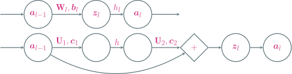

---
presentation:
  margin: 0
  center: false
  transition: "convex"
  enableSpeakerNotes: true
  slideNumber: "c/t"
  navigationMode: "linear"
---

@import "../css/font-awesome-4.7.0/css/font-awesome.css"
@import "../css/theme/solarized.css"
@import "../css/logo.css"
@import "../css/font.css"
@import "../css/color.css"
@import "../css/margin.css"
@import "../css/table.css"
@import "../css/main.css"
@import "../plugin/zoom/zoom.js"
@import "../plugin/customcontrols/plugin.js"
@import "../plugin/customcontrols/style.css"
@import "../plugin/chalkboard/plugin.js"
@import "../plugin/chalkboard/style.css"
@import "../plugin/menu/menu.js"
@import "../js/anychart/anychart-core.min.js"
@import "../js/anychart/anychart-venn.min.js"
@import "../js/anychart/pastel.min.js"
@import "../js/anychart/venn-ml.js"

<!-- slide data-notes="" -->

##### 应用到机器学习

---

@import "../dot/ml-nn.dot"

<div class="top-2"></div>

前$L-1$层是复合函数$\psi: \Rbb^d \mapsto \Rbb^{n_{L-1}}$，可看作一种特征变换方法

最后一层是学习器$\hat{\yv} = g(\psi(\xv); \Wv_L, \bv_L)$，对输入的$\psi(\xv)$进行预测

- 若$y \in \{ \pm 1 \} \text{ or } \{ 1,0 \}$，最后一层只需$1$个神经元，采用对率激活函数
- 若$y \in [c]$，最后一层需$c$个神经元，采用 Softmax 激活函数

<div class="top2"></div>

我的批注 对率回归也可看作只有一层(没有隐藏层)的神经网络

<!-- slide vertical=true data-notes="" -->

##### 深度学习

---

传统机器学习：特征工程和模型学习两阶段分开进行

@import "../dot/ml-old.dot"

<div class="top2"></div>

深度学习：特征工程和模型学习合二为一，端到端 (end-to-end)

@import "../dot/ml-nn.dot"

<!-- slide data-notes="" -->

##### <span style="font-weight:900">sklearn</span> 中的神经网络

---

```python {.line-numbers .top-1 .left4 highlight=[4,33-41]}
import matplotlib.pyplot as plt
import numpy as np
from mpl_toolkits.mplot3d import Axes3D
from sklearn.neural_network import MLPClassifier

np.random.seed(12345)

X_xor = np.array([[1, 1], [1, 0], [0, 1], [0, 0]])
y_xor = np.array([0, 1, 1, 0])  # 异或数据集
cov = [[0.01, 0], [0, 0.01]]
X, y = X_xor, y_xor
m = 100

# 以异或的4个点为中心 从2维高斯分布中各随机采样100个样本
for (xx, yy) in zip(X_xor, y_xor):
    x1, x2 = np.random.multivariate_normal(xx, cov, m).T
    X = np.r_[X, np.column_stack((x1, x2))]
    y = np.hstack((y, np.ones(m) * yy))

figure = plt.figure(figsize=(16, 8))

with plt.style.context('Solarize_Light2'):

    x_min, x_max = -0.5, 1.5
    y_min, y_max = -0.5, 1.5
    h = .01
    xx, yy = np.meshgrid(np.arange(x_min, x_max, h), np.arange(y_min, y_max, h))
    i = 0
    col = 4

    for hidden in np.arange(2, 2+col):

        mlp = MLPClassifier(
            hidden_layer_sizes=(hidden,),  # 隐藏层神经元个数
            activation='logistic',         # 激活函数
            max_iter=100,                  # 最大迭代轮数
            solver='lbfgs',                # 求解器
            alpha=0,                       # 正则项系数
            random_state=1,
            verbose=False
        )

        clf = mlp.fit(X, y)
        acc = clf.score(X, y)
        Z = clf.predict_proba(np.c_[xx.ravel(), yy.ravel()])
        Z = Z[:, 0].reshape(xx.shape)

        i += 1
        ax = plt.subplot(2, col, i)
        ax.set_xlim(xx.min(), xx.max())
        ax.set_ylim(yy.min(), yy.max())
        ax.set_xticks(())
        ax.set_yticks(())
        ax.contourf(xx, yy, Z, alpha=.8)
        ax.scatter(X[:, 0], X[:, 1], s=40, c=y, edgecolors='#002b36')
        ax.text((xx.min()+xx.max())/2, yy.min()+0.05, (r'$%d$ neurons, acc = %.2f' % (hidden, acc)).lstrip('0'), size=14, color='#002b36', horizontalalignment='center')

        ax = plt.subplot(2, col, i+col, projection='3d')
        ax.plot_surface(xx, yy, Z)
        ax.set_xticks(np.arange(x_min, x_max+0.1, 0.5))
        ax.set_yticks(np.arange(y_min, y_max+0.1, 0.5))
        ax.set_xlabel(r'$x_1$')
        ax.set_ylabel(r'$x_2$')

plt.tight_layout()
plt.show()
```

<!-- slide vertical=true data-notes="" -->

##### <span style="font-weight:900">sklearn</span> 中的神经网络

---

- 以异或 4 个点为中心，从 2 维高斯分布中各采样 100 个样本
- 单隐藏层，神经元个数分别取 2、3、4、5

@import "../python/mlp-xor.svg" {.center .width92}

<!-- slide data-notes="" -->

##### 用 <span style="font-weight:900">TensorFlow</span> 实现

---

```python {.line-numbers .top-1 .left4 highlight=[2,18,21-27]}
from sklearn.datasets import load_breast_cancer
from sklearn.model_selection import train_test_split
from tensorflow.keras.layers import Dense
from tensorflow.keras.models import Sequential
from tensorflow.keras.optimizers import SGD

X, y = load_breast_cancer(return_X_y=True)
X_train, X_test, y_train, y_test = train_test_split(X, y, random_state=0)

model = Sequential()
model.add(Dense(64, activation="relu"))
model.add(Dense(64, activation="relu"))
model.add(Dense(1, activation="sigmoid"))
model.compile(optimizer=SGD(0.001),
              loss="binary_crossentropy",
              metrics=["accuracy"],
              )

model.fit(X_train, y_train, epochs=10)
model.evaluate(X_test, y_test, verbose=2)

Epoch 1/10
14/14 [================] - 1s 1ms/step - loss: 51.0188 - accuracy: 0.4906
Epoch 2/10
14/14 [================] - 0s 1ms/step - loss: 1.0154 - accuracy: 0.7465
Epoch 3/10
14/14 [================] - 0s 1ms/step - loss: 0.5027 - accuracy: 0.8146
Epoch 4/10
14/14 [================] - 0s 1ms/step - loss: 0.4219 - accuracy: 0.8239
Epoch 5/10
14/14 [================] - 0s 1ms/step - loss: 0.4142 - accuracy: 0.8380
Epoch 6/10
14/14 [================] - 0s 1ms/step - loss: 0.3101 - accuracy: 0.8779
Epoch 7/10
14/14 [================] - 0s 1ms/step - loss: 0.2744 - accuracy: 0.8944
Epoch 8/10
14/14 [================] - 0s 1ms/step - loss: 0.2454 - accuracy: 0.9061
Epoch 9/10
14/14 [================] - 0s 1ms/step - loss: 0.3001 - accuracy: 0.8897
Epoch 10/10
14/14 [================] - 0s 1ms/step - loss: 0.2557 - accuracy: 0.8991

5/5 - 0s - loss: 0.2264 - accuracy: 0.9231
```

<!-- slide data-notes="" -->

##### 求解参数

设采用交叉熵损失，对样本$(\xv, y)$，损失函数为$\Lcal (\yv, \hat{\yv}) = - \yv \log \hat{\yv}$

优化目标为

$$
\begin{align*}
    \min_{\Wv, \bv} ~ \frac{1}{2} \| \Wv \|_F^2 + \frac{\lambda}{m} \sum_{i \in [m]} \Lcal (\yv_i, \hat{\yv}_i)
\end{align*}
$$

梯度下降 (标量对某矩阵求导的结果的尺寸与该矩阵呈转置关系)

$$
\begin{align*}
    \Wv & ~ \leftarrow ~ \Wv - \eta \left( \frac{\lambda}{m} \sum_{i \in [m]} \class{yellow}{\frac{\partial \Lcal (\yv_i, \hat{\yv}_i)}{\partial \Wv^\top}} + \Wv \right) \\
    \bv & ~ \leftarrow ~ \bv - \eta \cdot \frac{\lambda}{m} \sum_{i \in [m]} \class{yellow}{\frac{\partial \Lcal (\yv_i, \hat{\yv}_i)}{\partial \bv^\top}}
\end{align*}
$$

<!-- slide data-notes="" -->

##### 求解参数

整个网络：$\xv = \av_0 \xrightarrow{\Wv_1,\bv_1} \zv_1 \xrightarrow{h_1} \av_1 \xrightarrow{\Wv_2,\bv_2} \cdots \xrightarrow{\Wv_L,\bv_L} \zv_L \xrightarrow{h_L} \av_L = \hat{\yv}$

损失$\Lcal (\yv, \hat{\yv})$的计算为<span class="blue">正向传播</span>

- 样本从输入层进入，经隐藏层逐层传播到最后输出层
- $\hat{\yv} = \av_L = h_L (\zv_L)$是对样本$\xv$的预测，据此计算$\Lcal (\yv, \hat{\yv}) = \Lcal (\yv, h_L (\zv_L))$

先看最后一层$\zv_L = \Wv_L ~ \av_{L-1} + \bv_L$，$\av_L = h_L (\zv_L)$，由<span class="blue">链式法则</span> (?) 有

$$
\begin{align*}
    \frac{\partial \Lcal (\yv, \hat{\yv})}{\partial \bv_L} & = \frac{\partial \Lcal (\yv, \hat{\yv})}{\partial \zv_L} \frac{\partial \zv_L}{\partial \bv_L} = \deltav_L^\top \frac{\partial \zv_L}{\partial \bv_L} \\
    \frac{\partial \Lcal (\yv, \hat{\yv})}{\partial \Wv_L} & = \sum_{j \in [n_L]} \frac{\partial \Lcal (\yv, \hat{\yv})}{\partial [\zv_L]_j} \frac{\partial [\zv_L]_j}{\partial \Wv_L} = \sum_{j \in [n_L]} [\deltav_L]_j \frac{\partial [\zv_L]_j}{\partial \Wv_L}
\end{align*}
$$

其中$\deltav_L^\top = \partial \Lcal (\yv, \hat{\yv}) / \partial \zv_L \in \Rbb^{n_L}$为第$L$层的<span class="blue">误差项</span>，该项可直接求解

<!-- slide vertical=true data-notes="" -->

##### 求解参数 反向传播

整个网络：$\xv = \av_0 \xrightarrow{\Wv_1,\bv_1} \zv_1 \xrightarrow{h_1} \av_1 \xrightarrow{\Wv_2,\bv_2} \cdots \xrightarrow{\Wv_L,\bv_L} \zv_L \xrightarrow{h_L} \av_L = \hat{\yv}$

类似的对第$l$层$\zv_l = \Wv_l \av_{l-1} + \bv_l$，$\av_l = h_l (\zv_l)$，由<span class="blue">链式法则</span> (?) 有

$$
\begin{align*}
    \frac{\partial \Lcal (\yv, \hat{\yv})}{\partial \bv_l} = \deltav_l^\top \frac{\partial \zv_l}{\partial \bv_l}, \quad \frac{\partial \Lcal (\yv, \hat{\yv})}{\partial \Wv_l} = \sum_{j \in [n_l]} [\deltav_l]_j \frac{\partial [\zv_l]_j}{\partial \Wv_l}
\end{align*}
$$

其中$\deltav_l^\top = \partial \Lcal (\yv, \hat{\yv}) / \partial \zv_l \in \Rbb^{n_l}$为第$l$层的<span class="blue">误差项</span>

误差<span class="blue">反向传播</span> (**b**ack**p**ropagation, BP)：前一层的误差可由后一层得到

$$
\begin{align*}
    \deltav_{l-1}^\top = \frac{\partial \Lcal (\yv, \hat{\yv})}{\partial \zv_{l-1}} = \frac{\partial \Lcal (\yv, \hat{\yv})}{\partial \zv_l} \frac{\partial \zv_l}{\partial \av_{l-1}} \frac{\partial \av_{l-1}}{\partial \zv_{l-1}} = \deltav_l^\top \frac{\partial \zv_l}{\partial \av_{l-1}} \frac{\partial h_{l-1}(\zv_{l-1})}{\partial \zv_{l-1}}
\end{align*}
$$

对第$l$层$\zv_l = \Wv_l \av_{l-1} + \bv_l$，如何求$\partial \zv_l / \partial \av_{l-1}$、$\partial \zv_l / \partial \bv_l$、$\partial [\zv_l]_j / \partial \Wv_l$

<!-- slide vertical=true data-notes="" -->

##### 求解参数 反向传播

对$\zv = \Wv \av + \bv$，如何求$\partial \zv / \partial \av$、$\partial \zv / \partial \bv$、$\partial z_j / \partial \Wv$

由矩阵求导公式易知

$$
\begin{align*}
    \frac{\partial \zv}{\partial \av} = \frac{\partial (\Wv \av)}{\partial \av} = \Wv, \quad \frac{\partial \zv}{\partial \bv} = \frac{\partial \bv}{\partial \bv} = \Iv
\end{align*}
$$

注意$z_j = \sum_k w_{jk} a_k + b_k$只与$\Wv$的第$j$行有关，于是

$$
\begin{align*}
    \frac{\partial z_j}{\partial \Wv} = \underbrace{\begin{bmatrix} \zerov, \ldots, \av, \ldots, \zerov \end{bmatrix}}_{\text{only }\av\text{ at }j\text{-th column}} = \av \ev_j^\top
\end{align*}
$$

从而

$$
\begin{align*}
    \frac{\partial \Lcal (\yv, \hat{\yv})}{\partial \Wv_l} = \sum_{j \in [n_l]} [\deltav_l]_j \frac{\partial [\zv_l]_j}{\partial \Wv_l} = \av_{l-1} \sum_{j \in [n_l]} [\deltav_l]_j \ev_j^\top = \av_{l-1} \deltav_l^\top
\end{align*}
$$

<!-- slide vertical=true data-notes="" -->

##### 反向传播算法

输入：训练集$\Scal$，验证集$\Vcal$，以及相关超参数

1. 随机初始化$\Wv$和$\bv$
2. repeat
3. &emsp;&emsp;对训练集$\Scal$中的样本随机重排序
4. &emsp;&emsp;for $i = 1, \ldots, m$ do
5. &emsp;&emsp;&emsp;&emsp;获取样本$(\xv_i, y_i)$
6. &emsp;&emsp;&emsp;&emsp;前向传播，计算每一层的$\zv_l = \Wv_l \av_{l-1} + \bv_l$，直到最后一层
7. &emsp;&emsp;&emsp;&emsp;反向传播计算每一层的误差项$\deltav_l^\top = \deltav_{l+1}^\top \Wv_{l+1} \diag (h_l'(\zv_l))$
8. &emsp;&emsp;&emsp;&emsp;计算梯度$\partial \Lcal / \partial \Wv_l = \av_{l-1} \deltav_l^\top$、$\partial \Lcal / \partial \bv_l = \deltav_l^\top$
9. &emsp;&emsp;&emsp;&emsp;采用梯度下降更新$\Wv_l$和$\bv_l$
10. &emsp;&emsp;end
11. until 神经网络模型在验证集$\Vcal$上的错误率不再下降

输出：$\Wv$和$\bv$

<!-- slide data-notes="" -->

##### 梯度消失

神经网络中误差反向传播的迭代公式为

$$
\begin{align*}
    \deltav_l^\top = \frac{\partial \Lcal (\yv, \hat{\yv})}{\partial \zv_l} = \frac{\partial \Lcal (\yv, \hat{\yv})}{\partial \zv_{l+1}} \frac{\partial \zv_{l+1}}{\partial \av_l} \frac{\partial \av_l}{\partial \zv_l} = \deltav_{l+1}^\top \Wv_{l+1} \diag (h_l'(\zv_l))
\end{align*}
$$

对于 Sigmoid 型激活函数

- $\sigma'(z) = \sigma(z) (1 - \sigma(z)) \le \frac{1}{4}$
- $\tanh'(z) = 4 \sigma(2z) (1 - \sigma(2z)) \le 4 \cdot \frac{1}{4} = 1$

误差每传播一层都会乘以一个小于等于$1$的系数，当网络层数很深时，梯度会不断衰减甚至消失，使得整个网络很难训练

方案：使用导数比较大的激活函数，比如 ReLU

<!-- slide vertical=true data-notes="" -->

##### 残差网络



残差模块：$\zv_l = \av_{l-1} + \class{yellow}{\Uv_2 \cdot h(\Uv_1 \cdot \av_{l-1} + \cv_1) + \cv_2} = \av_{l-1} + \class{yellow}{f(\av_{l-1})}$

假设$\av_l = \zv_l$，即残差模块输出不使用激活函数，对$\forall t \in [l]$有

$$
\begin{align*}
    \av_l & = \av_{l-1} + f(\av_{l-1}) = \av_{l-2} + f(\av_{l-2}) + f(\av_{l-1}) \\
    & = \cdots = \av_{l-t} + \sum_{i=l-t}^{l-1} f(\av_i)
\end{align*}
$$

低层输入可以<span class="blue">恒等</span>传播到任意高层

<!-- slide vertical=true data-notes="" -->

##### 残差网络

$$
\begin{align*}
    \av_l = \av_{l-t} + \sum_{i=l-t}^{l-1} f(\av_i)
\end{align*}
$$

由链式法则有

$$
\begin{align*}
    \frac{\partial \Lcal}{\partial \av_{l-t}} & = \frac{\partial \Lcal}{\partial \av_l} \frac{\partial \av_l}{\partial \av_{l-t}} = \frac{\partial \Lcal}{\partial \av_l} \left( \frac{\partial \av_{l-t}}{\partial \av_{l-t}} + \frac{\partial }{\partial \av_{l-t}} \sum_{i=l-t}^{l-1} f(\av_i) \right) \\
    & = \frac{\partial \Lcal}{\partial \av_l} \left( \Iv + \frac{\partial }{\partial \av_{l-t}} \sum_{i=l-t}^{l-1} f(\av_i) \right) \\
    & = \frac{\partial \Lcal}{\partial \av_l} + \frac{\partial \Lcal}{\partial \av_l} \left( \frac{\partial }{\partial \av_{l-t}} \sum_{i=l-t}^{l-1} f(\av_i) \right)
\end{align*}
$$

高层误差可以<span class="blue">恒等</span>传播到任意低层，梯度消失得以缓解
