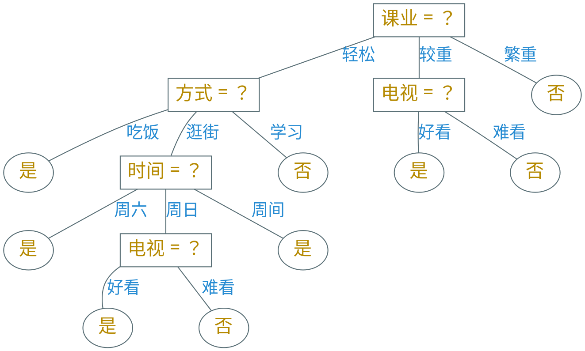

---
presentation:
  margin: 0
  center: false
  slideNumber: "c/t"
  navigationMode: "linear"
---

@import "../css/theme/solarized.css"
@import "../css/logo.css"
@import "../css/font.css"
@import "../css/color.css"
@import "../css/margin.css"
@import "../css/table.css"
@import "../css/main.css"

<!-- slide data-notes="" -->

##### 决策树

---

<!-- slide vertical=true data-notes="" -->

##### 决策树

---

输入：训练集$D = \{ (\xv_i, y_i) \}_{i \in [m]}$，属性集$A = \{ a_j \}_{j \in [d]}$ 过程：函数$\TG(D,A)$

1. 生成结点$\node$
2. {==if==} $D$中样本全属于同一类别$C$ {==then==}
3. &emsp;&emsp;将$\node$标为$C$类叶结点 {==return==}
5. {==if==} $A = \emptyset$ {==or==} $D$中样本在$A$上取值相同 {==then==}
6. &emsp;&emsp;将$\node$标为叶结点，其类别标记为$D$中样本最多的类 {==return==}
8. 从$A$中选择最优划分属性$a_\star$
9. {==for==} $a_\star$的每一个取值$a_\star^v$ {==do==}
10. &emsp;&emsp;为$\node$生成一个分支，令$D_v$表示$D$在$a_\star$上取值为$a_\star^v$的样本子集
11. {==if==} $D_v = \emptyset$ {==then==}
12. &emsp;&emsp;将分支结点标为叶结点，其类别标记为$D$中样本最多的类 {==return==}
12. {==else==}
12. &emsp;&emsp;以$\TG(D_v, A \setminus \{ a_\star \})$为分支结点