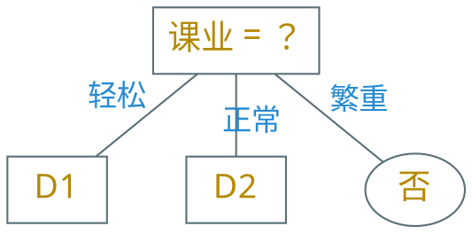
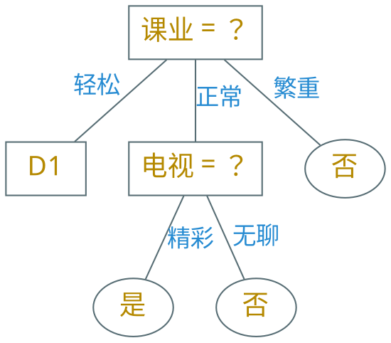

---
presentation:
  margin: 0
  center: false
  slideNumber: "c/t"
  navigationMode: "linear"
---

@import "../css/theme/solarized.css"
@import "../css/logo.css"
@import "../css/font.css"
@import "../css/color.css"
@import "../css/margin.css"
@import "../css/table.css"
@import "../css/main.css"

<!-- slide data-notes="" -->

##### 划分

---

| 次序 | 时间 | 方式 | 天气 | 课业 | 疫情 | 电视 | 约会 |
| :--: | :--: | :--: | :--: | :--: | :--: | :--: | :--: |
|  1   | 周六 | 吃饭 | 晴天 | 轻松 | 清零 | 精彩 |  是  |
|  2   | 周日 | 吃饭 | 阴天 | 轻松 | 清零 | 精彩 |  是  |
|  3   | 周日 | 吃饭 | 晴天 | 轻松 | 清零 | 精彩 |  是  |
|  4   | 周六 | 吃饭 | 阴天 | 轻松 | 清零 | 精彩 |  是  |
|  5   | 周间 | 吃饭 | 晴天 | 轻松 | 清零 | 精彩 |  是  |
|  6   | 周六 | 逛街 | 晴天 | 轻松 | 平缓 | 无聊 |  是  |
|  7   | 周日 | 逛街 | 晴天 | 正常 | 平缓 | 无聊 |  是  |
|  8   | 周日 | 逛街 | 晴天 | 轻松 | 平缓 | 精彩 |  是  |
|  9   | 周日 | 逛街 | 阴天 | 正常 | 平缓 | 精彩 |  否  |
|  10  | 周六 | 学习 | 雨天 | 轻松 | 严峻 | 无聊 |  否  |
|  11  | 周间 | 学习 | 雨天 | 繁重 | 严峻 | 精彩 |  否  |
|  12  | 周间 | 吃饭 | 晴天 | 繁重 | 严峻 | 无聊 |  否  |
|  13  | 周六 | 逛街 | 晴天 | 正常 | 清零 | 精彩 |  否  |
|  14  | 周间 | 逛街 | 阴天 | 正常 | 清零 | 精彩 |  否  |
|  15  | 周日 | 逛街 | 晴天 | 轻松 | 平缓 | 无聊 |  否  |
|  16  | 周间 | 吃饭 | 晴天 | 繁重 | 严峻 | 精彩 |  否  |
|  17  | 周六 | 吃饭 | 阴天 | 正常 | 平缓 | 精彩 |  否  |

$$
\begin{align*}
    & \gain (D, \text{时间}) = 0.109 \\
    & \gain (D, \text{方式}) = 0.143 \\
    & \gain (D, \text{天气}) = 0.141 \\
    & \gain (D, \text{课业}) = 0.381 \\
    & \gain (D, \text{疫情}) = 0.289 \\
    & \gain (D, \text{电视}) = 0.006 \\[4pt]
    & \text{属性“}\class{blue}{\text{课业}}\text{”的信息增益最大} \\[4pt]
    & D_1 = \{ 1, 2, 3, 4, 5, 6, 8, 10, 15 \} \\
    & D_2 = \{ 7, 9, 13, 14, 17 \} \\
    & D_3 = \{ 11, 12, 16 \} \text{，全负，纯了}
\end{align*}
$$

<!-- slide vertical=true data-notes="" -->

##### 划分

---

| 次序 | 时间 | 方式 | 天气 | 课业 | 疫情 | 电视 | 约会 |
| :--: | :--: | :--: | :--: | :--: | :--: | :--: | :--: |
|  7   | 周日 | 逛街 | 晴天 | 正常 | 平缓 | 无聊 |  是  |
|  9   | 周日 | 逛街 | 阴天 | 正常 | 平缓 | 精彩 |  否  |
|  13  | 周六 | 逛街 | 晴天 | 正常 | 清零 | 精彩 |  否  |
|  14  | 周间 | 逛街 | 阴天 | 正常 | 清零 | 精彩 |  否  |
|  17  | 周六 | 吃饭 | 阴天 | 正常 | 平缓 | 精彩 |  否  |

$$
\begin{align*}
    & \text{时间：} \frac{2}{5} H(\class{blue}{\{ 7,9 \}}) + \frac{2}{5} H(\{ 13,17 \}) + \frac{1}{5} H(\{ 14 \}) > 0 \\
    & \text{方式：} \frac{4}{5} H(\class{blue}{\{ 7,9,13,14 \}}) + \frac{1}{5} H(\{ 17 \}) > 0 \\
    & \text{天气：} \frac{2}{5} H(\class{blue}{\{ 7,13 \}}) + \frac{3}{5} H(\{ 9,14,17 \}) > 0 \\
    & \text{疫情：} \frac{3}{5} H(\class{blue}{\{ 7,9,17 \}}) + \frac{2}{5} H(\{ 13,14 \}) > 0 \\
    & \text{电视：} \frac{1}{5} H(\{ 7 \}) + \frac{4}{5} H(\{ 9,13,14,17 \}) = 0
\end{align*}
$$

<!-- slide data-notes="" -->

##### 划分

---

| 次序 | 时间 | 方式 | 天气 | 课业 | 疫情 | 电视 | 约会 |
| :--: | :--: | :--: | :--: | :--: | :--: | :--: | :--: |
|  1   | 周六 | 吃饭 | 晴天 | 轻松 | 清零 | 精彩 |  是  |
|  2   | 周日 | 吃饭 | 阴天 | 轻松 | 清零 | 精彩 |  是  |
|  3   | 周日 | 吃饭 | 晴天 | 轻松 | 清零 | 精彩 |  是  |
|  4   | 周六 | 吃饭 | 阴天 | 轻松 | 清零 | 精彩 |  是  |
|  5   | 周间 | 吃饭 | 晴天 | 轻松 | 清零 | 精彩 |  是  |
|  6   | 周六 | 逛街 | 晴天 | 轻松 | 平缓 | 无聊 |  是  |
|  8   | 周日 | 逛街 | 晴天 | 轻松 | 平缓 | 精彩 |  是  |
|  10  | 周六 | 学习 | 雨天 | 轻松 | 严峻 | 无聊 |  否  |
|  15  | 周日 | 逛街 | 晴天 | 轻松 | 平缓 | 无聊 |  否  |

$$
\begin{align*}
    \text{时间：} H & = \frac{4}{9} H(\{ 1,4,6,10 \}) + \frac{4}{9} H(\{ 2,3,8,15 \}) + \frac{1}{9} H(\{ 5 \}) \\
    & = \frac{4}{9} \left( - \frac{3}{4} \log \frac{3}{4} - \frac{1}{4} \log \frac{1}{4} \right) + \frac{4}{9} \left( - \frac{3}{4} \log \frac{3}{4} - \frac{1}{4} \log \frac{1}{4} \right) + 0 \\
    & = \frac{16}{9} - \frac{2}{3} \log 3 = 0.721
\end{align*}
$$

@import "../dot/dt-divide-d1.dot" {.left60per .top-60per}

<!-- slide vertical=true data-notes="" -->

##### 划分

---

| 次序 | 时间 | 方式 | 天气 | 课业 | 疫情 | 电视 | 约会 |
| :--: | :--: | :--: | :--: | :--: | :--: | :--: | :--: |
|  1   | 周六 | 吃饭 | 晴天 | 轻松 | 清零 | 精彩 |  是  |
|  2   | 周日 | 吃饭 | 阴天 | 轻松 | 清零 | 精彩 |  是  |
|  3   | 周日 | 吃饭 | 晴天 | 轻松 | 清零 | 精彩 |  是  |
|  4   | 周六 | 吃饭 | 阴天 | 轻松 | 清零 | 精彩 |  是  |
|  5   | 周间 | 吃饭 | 晴天 | 轻松 | 清零 | 精彩 |  是  |
|  6   | 周六 | 逛街 | 晴天 | 轻松 | 平缓 | 无聊 |  是  |
|  8   | 周日 | 逛街 | 晴天 | 轻松 | 平缓 | 精彩 |  是  |
|  10  | 周六 | 学习 | 雨天 | 轻松 | 严峻 | 无聊 |  否  |
|  15  | 周日 | 逛街 | 晴天 | 轻松 | 平缓 | 无聊 |  否  |

$$
\begin{align*}
    \text{方式：} H & = \frac{5}{9} H(\{ 1,2,3,4,5 \}) + \frac{3}{9} H(\{ 6,8,15 \}) + \frac{1}{9} H(\{ 10 \}) \\
    & = 0 + \frac{3}{9} \left( - \frac{2}{3} \log \frac{2}{3} - \frac{1}{3} \log \frac{1}{3} \right) + 0 \\
    & = \frac{1}{3} \log 3 - \frac{2}{9} = 0.306
\end{align*}
$$

@import "../dot/dt-divide-d1.dot" {.left60per .top-60per}

<!-- slide vertical=true data-notes="" -->

##### 划分

---

| 次序 | 时间 | 方式 | 天气 | 课业 | 疫情 | 电视 | 约会 |
| :--: | :--: | :--: | :--: | :--: | :--: | :--: | :--: |
|  1   | 周六 | 吃饭 | 晴天 | 轻松 | 清零 | 精彩 |  是  |
|  2   | 周日 | 吃饭 | 阴天 | 轻松 | 清零 | 精彩 |  是  |
|  3   | 周日 | 吃饭 | 晴天 | 轻松 | 清零 | 精彩 |  是  |
|  4   | 周六 | 吃饭 | 阴天 | 轻松 | 清零 | 精彩 |  是  |
|  5   | 周间 | 吃饭 | 晴天 | 轻松 | 清零 | 精彩 |  是  |
|  6   | 周六 | 逛街 | 晴天 | 轻松 | 平缓 | 无聊 |  是  |
|  8   | 周日 | 逛街 | 晴天 | 轻松 | 平缓 | 精彩 |  是  |
|  10  | 周六 | 学习 | 雨天 | 轻松 | 严峻 | 无聊 |  否  |
|  15  | 周日 | 逛街 | 晴天 | 轻松 | 平缓 | 无聊 |  否  |

$$
\begin{align*}
    \text{天气：} H & = \frac{6}{9} H(\{ 1,3,5,6,8,15 \}) + \frac{2}{9} H(\{ 2,4 \}) + \frac{1}{9} H(\{ 10 \}) \\
    & = \frac{2}{9} \left( - \frac{2}{3} \log \frac{2}{3} - \frac{1}{3} \log \frac{1}{3} \right) + \frac{2}{9} \left( - \frac{2}{3} \log \frac{2}{3} - \frac{1}{3} \log \frac{1}{3} \right) + 0 \\
    & = \frac{1}{3} \log 3 - \frac{2}{9} = 0.306
\end{align*}
$$

@import "../dot/dt-divide-d1.dot" {.left60per .top-60per}
