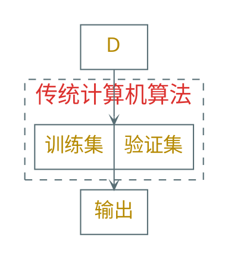
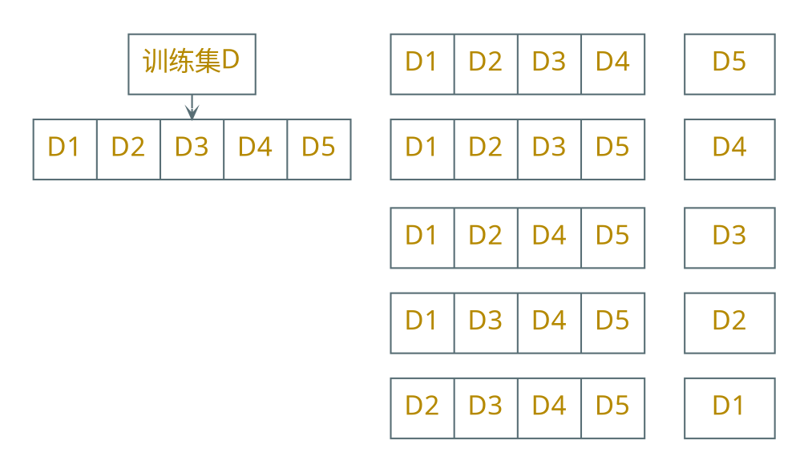

---
presentation:
  margin: 0
  center: false
  slideNumber: "c/t"
  navigationMode: "linear"
---

@import "../css/theme/solarized.css"
@import "../css/logo.css"
@import "../css/font.css"
@import "../css/color.css"
@import "../css/margin.css"
@import "../css/table.css"
@import "../css/main.css"

<!-- slide data-notes="" -->

##### 模型选择 验证

---

| 次序 | 约会时间 | 约会方式 | 当天天气 | 课业任务 | 疫情形势 | 当天电视 | 答应约会 |
| :--: | :------: | :------: | :------: | :------: | :------: | :------: | -------- |
|  1   |   周六   |   吃饭   |   晴天   |   轻松   |   清零   |   好看   | 是       |
|  2   |   周日   |   吃饭   |   阴天   |   轻松   |   清零   |   好看   | 是       |
|  3   |   周日   |   吃饭   |   晴天   |   轻松   |   清零   |   好看   | 是       |
|  4   |   周六   |   吃饭   |   阴天   |   轻松   |   清零   |   好看   | 是       |
|  5   |  工作日  |   吃饭   |   晴天   |   轻松   |   清零   |   好看   | 是       |
|  6   |   周六   |   逛街   |   晴天   |   轻松   |   平缓   |  不好看  | 是       |
|  7   |   周日   |   逛街   |   晴天   |   繁重   |   平缓   |  不好看  | 是       |
|  8   |   周日   |   逛街   |   晴天   |   轻松   |   平缓   |   好看   | 是       |
|  9   |   周日   |   逛街   |   阴天   |   繁重   |   平缓   |   好看   | 否       |
|  10  |   周六   |   学习   |   雨天   |   轻松   |   严峻   |  不好看  | 否       |
|  11  |  工作日  |   学习   |   雨天   |   备考   |   严峻   |   好看   | 否       |
|  12  |  工作日  |   吃饭   |   晴天   |   备考   |   严峻   |  不好看  | 否       |
|  13  |   周六   |   逛街   |   晴天   |   繁重   |   清零   |   好看   | 否       |
|  14  |  工作日  |   逛街   |   阴天   |   繁重   |   清零   |   好看   | 否       |
|  15  |   周日   |   逛街   |   晴天   |   轻松   |   平缓   |  不好看  | 否       |
|  16  |  工作日  |   吃饭   |   晴天   |   备考   |   严峻   |   好看   | 否       |
|  17  |   周六   |   吃饭   |   阴天   |   繁重   |   平缓   |   好看   | 否       |

<!-- slide data-notes="" -->

##### 模型选择 验证

---

事先选定合适的模型 (归纳偏倚) 很重要！

从训练集中随机选择一部分样本作为{==验证集==} (validation set)

- 在剩余的训练集上训练一个学习模型
- 在验证集上计算模型的误差

据此比较多个候选模型的性能

<!-- slide vertical=true data-notes="" -->

##### 模型选择 交叉验证

---

{==交叉验证==} (cross validation)：将训练集平均分为$n$份，每轮

- 在其中$n-1$份上训练一个学习模型
- 在剩余的$1$份上计算模型的误差

迭代$n$轮取平均，据此比较多个候选模型的性能

