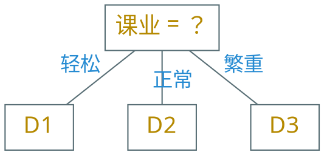
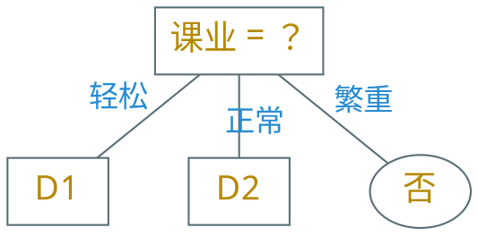

---
presentation:
  margin: 0
  center: false
  slideNumber: "c/t"
  navigationMode: "linear"
---

@import "../css/theme/solarized.css"
@import "../css/logo.css"
@import "../css/font.css"
@import "../css/color.css"
@import "../css/margin.css"
@import "../css/table.css"
@import "../css/main.css"

<!-- slide data-notes="" -->

##### 划分

---

| 次序 | 时间 | 方式 | 天气 | 课业 | 疫情 | 电视 | 约会 |
| :--: | :--: | :--: | :--: | :--: | :--: | :--: | :--: |
|  1   | 周六 | 吃饭 | 晴天 | 轻松 | 清零 | 精彩 |  是  |
|  2   | 周日 | 吃饭 | 阴天 | 轻松 | 清零 | 精彩 |  是  |
|  3   | 周日 | 吃饭 | 晴天 | 轻松 | 清零 | 精彩 |  是  |
|  4   | 周六 | 吃饭 | 阴天 | 轻松 | 清零 | 精彩 |  是  |
|  5   | 周间 | 吃饭 | 晴天 | 轻松 | 清零 | 精彩 |  是  |
|  6   | 周六 | 逛街 | 晴天 | 轻松 | 平缓 | 无聊 |  是  |
|  7   | 周日 | 逛街 | 晴天 | 正常 | 平缓 | 无聊 |  是  |
|  8   | 周日 | 逛街 | 晴天 | 轻松 | 平缓 | 精彩 |  是  |
|  9   | 周日 | 逛街 | 阴天 | 正常 | 平缓 | 精彩 |  否  |
|  10  | 周六 | 学习 | 雨天 | 轻松 | 严峻 | 无聊 |  否  |
|  11  | 周间 | 学习 | 雨天 | 繁重 | 严峻 | 精彩 |  否  |
|  12  | 周间 | 吃饭 | 晴天 | 繁重 | 严峻 | 无聊 |  否  |
|  13  | 周六 | 逛街 | 晴天 | 正常 | 清零 | 精彩 |  否  |
|  14  | 周间 | 逛街 | 阴天 | 正常 | 清零 | 精彩 |  否  |
|  15  | 周日 | 逛街 | 晴天 | 轻松 | 平缓 | 无聊 |  否  |
|  16  | 周间 | 吃饭 | 晴天 | 繁重 | 严峻 | 精彩 |  否  |
|  17  | 周六 | 吃饭 | 阴天 | 正常 | 平缓 | 精彩 |  否  |

$$
\begin{align*}
    \gain & (D, \text{时间}) = 0.109 \\
    \gain & (D, \text{方式}) = 0.143 \\
    \gain & (D, \text{天气}) = 0.141 \\
    \gain & (D, \text{课业}) = 0.381 \\
    \gain & (D, \text{疫情}) = 0.289 \\
    \gain & (D, \text{电视}) = 0.006
\end{align*}
$$

属性“{==课业==}”的信息增益最大

$D_1 = \{ 1, 2, 3, 4, 5, 6, 8, 10, 15 \}$
$D_2 = \{ 7, 9, 13, 14, 17 \}$
$D_3 = \{ 11, 12, 16 \}$，纯了

<!-- slide vertical=true data-notes="" -->

##### 划分

---

| 次序 | 时间 | 方式 | 天气 | 课业 | 疫情 | 电视 | 约会 |
| :--: | :--: | :--: | :--: | :--: | :--: | :--: | :--: |
|  7   | 周日 | 逛街 | 晴天 | 正常 | 平缓 | 无聊 |  是  |
|  9   | 周日 | 逛街 | 阴天 | 正常 | 平缓 | 精彩 |  否  |
|  13  | 周六 | 逛街 | 晴天 | 正常 | 清零 | 精彩 |  否  |
|  14  | 周间 | 逛街 | 阴天 | 正常 | 清零 | 精彩 |  否  |
|  17  | 周六 | 吃饭 | 阴天 | 正常 | 平缓 | 精彩 |  否  |

$H(D_2) = $

以时间划分：$H(\{ 7,9 \}) = 1$，$H(\{ 13,17 \}) = 0$，$H(\{ 14 \}) = 0$

- $H(\{ 7,9 \}) = - \frac{1}{2} \log \frac{1}{2} - \frac{1}{2} \log \frac{1}{2} = 1.000$
