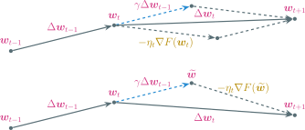

---
presentation:
  margin: 0
  center: false
  transition: "convex"
  enableSpeakerNotes: true
  slideNumber: "c/t"
  navigationMode: "linear"
---

@import "../css/font-awesome-4.7.0/css/font-awesome.css"
@import "../css/theme/solarized.css"
@import "../css/logo.css"
@import "../css/font.css"
@import "../css/color.css"
@import "../css/margin.css"
@import "../css/table.css"
@import "../css/main.css"
@import "../plugin/zoom/zoom.js"
@import "../plugin/customcontrols/plugin.js"
@import "../plugin/customcontrols/style.css"
@import "../plugin/chalkboard/plugin.js"
@import "../plugin/chalkboard/style.css"
@import "../plugin/menu/menu.js"
@import "../js/anychart/anychart-core.min.js"
@import "../js/anychart/anychart-venn.min.js"
@import "../js/anychart/pastel.min.js"
@import "../js/anychart/venn-ml.js"

<!-- slide data-notes="" -->

##### 优化算法 梯度下降

---

|   学习模型   |                                        标记集合                                         |                                      优化目标                                      |                  梯度                   |
| :----------: | :-------------------: | :-------------: | :------: |
|   线性回归   |                                         $\Rbb$                                          |                    $\min_{\wv} \sum_i (\wv^\top \xv_i - y_i)^2$                    | $2 \sum_i (\wv^\top \xv_i - y_i) \xv_i$ |
| 后验 概率 |                  $\Pr(y=+1 \big\arrowvert \xv) = \sigma(\wv^\top \xv)$                  |                $\Pr(y=1 \big\arrowvert \xv) = \sigma(\wv^\top \xv)$                |
|      ^       |                 $\Pr(y=-1 \big\arrowvert \xv) = \sigma(-\wv^\top \xv)$                  |               $\Pr(y=0 \big\arrowvert \xv) = \sigma(-\wv^\top \xv)$                |
| 优化 目标 |                $\min_{\wv} \sum_i \ln (1 + \exp(- y_i \wv^\top \xv_i))$                 |     $\min_{\wv} \sum_i (\ln (1 + \exp(\wv^\top \xv_i)) - y_i \wv^\top \xv_i)$      |
|      ^       |            $\min_{\wv} (- \sum_{i \in [m]} \ln \sigma(y_i \wv^\top \xv_i))$             | $\min_{\wv} \sum_{i \in [m]} (- \ln \sigma(-\wv^\top \xv_i) - y_i \wv^\top \xv_i)$ |
|    $\gv$     |                   $\sum_i (\sigma(y_i \wv^\top \xv_i) - 1) y_i \xv_i$                   |                   $\sum_i (\sigma(\wv^\top \xv_i) - y_i) \xv_i$                    |
|    $\Hv$     | $\sum_i (\sigma(y_i \wv^\top \xv_i)) (1 - \sigma(y_i \wv^\top \xv_i)) \xv_i \xv_i^\top$ |   $\sum_i \sigma(\wv^\top \xv_i) (1 - \sigma(\wv^\top \xv_i)) \xv_i \xv_i^\top$    | a |

<!-- slide data-notes="" -->

##### 优化算法 梯度下降

---

即采用优化算法求出如下优化问题的最优解

$$
\begin{align*}
    \min_\wv ~ F(\wv) \triangleq \lambda \cdot \Omega(\wv) + \frac{1}{m} \sum_{i \in [m]} l(y_i, f(\xv_i))
\end{align*}
$$

梯度下降 (GD)：$\wv_{t+1} \leftarrow \wv_t - \eta_t \nabla F(\wv_t)$，其中$\eta_t$称为步长或学习率

 

问题：当样本数$m$很大时，梯度$\nabla F(\wv_t)$计算开销很大

方案：小批量梯度下降，随机采样一个下标子集$\Bcal_t \subseteq [m]$

$$
\begin{align*}
    \wv_{t+1} \leftarrow \wv_t - \eta_t \left( \frac{1}{|\Bcal_t|} \sum_{i \in \Bcal_t} \nabla l(y_i, f(\xv_i)) + \lambda \cdot \nabla \Omega(\wv) \right)
\end{align*}
$$

若$|\Bcal_t| = 1$，则为常说的随机梯度下降 (SGD)

<!-- slide vertical=true data-notes="" -->

##### 优化算法 梯度下降

---

梯度下降解最小二乘

FOOTER3 图神经网络导论 机器学习 tengzhang@hust.edu.cn

<!-- slide vertical=true data-notes="" -->

HEADER GD vs. SGD

更新公式：

$$
\begin{align*}
    & \wv_{t+1} \leftarrow \wv_t - \eta_t \left( \frac{1}{m} \sum_{i \in [m]} \nabla l(y_i, f(\xv_i)) + \lambda \cdot \nabla \Omega(\wv) \right) \\
    & \wv_{t+1} \leftarrow \wv_t - \eta_t \left( \frac{1}{|\Bcal_t|} \sum_{i \in \Bcal_t} \nabla l(y_i, f(\xv_i)) + \lambda \cdot \nabla \Omega(\wv) \right)
\end{align*}
$$

- 当数据集中有冗余样本时，SGD 可以减少重复计算
- 迭代前期，SGD 更新频率快，较 GD 优势明显
- 迭代后期，GD 会停止于最优解处，SGD 则只能在最优解附近震荡
- 越靠近最优解，梯度越接近零，因此 GD 可以用恒定步长
- 最优解处随机梯度不一定为零，故 SGD 必须用衰减步长，否则算法不会停止
- SGD 因随机采样带来的噪声若能随着迭代而受到抑制，则可进一步加速，机器学习顶会有大量相关工作，包括 SAG，SAGA，SVRG 等及其衍生变种

FOOTER3 图神经网络导论 机器学习 tengzhang@hust.edu.cn

<!-- slide data-notes="" -->

HEADER 加速梯度下降

当目标函数的变量尺度不同时，梯度下降效率很低

动量法 (momentum)：$\wv_{t+1} = \wv_t - \eta_t \nabla F(\wv_t) + \gamma (\wv_t - \wv_{t-1})$

- 相对于梯度下降，多了第三项，上一轮的更新方向
- 参数$\gamma < 1$，通常取$0.9$

FOOTER3 图神经网络导论 机器学习 tengzhang@hust.edu.cn

<!-- slide vertical=true data-notes="" -->

HEADER 动量法

$$
\begin{align*}
    \wv_{t+1} - \wv_t & = - \eta_t \nabla F(\wv_t) + \gamma (\wv_t - \wv_{t-1}) \\
    \gamma (\wv_t - \wv_{t-1}) & = - \eta_{t-1} \gamma \nabla F(\wv_{t-1}) + \gamma^2 (\wv_{t-1} - \wv_{t-2}) \\
    & \vdots \\
    \gamma^{t-1} (\wv_2 - \wv_1) & = - \eta_1 \gamma^{t-1} \nabla F(\wv_1) + \mathtip{\gamma^t (\wv_1 - \wv_0)}{因为\wv_1 = \wv_0，故该项等于零} \\
    \Longrightarrow ~ \wv_{t+1} - \wv_t & = - \sum_{i \in [t]} \eta_i \gamma^{t-i} \nabla F(\wv_i)
\end{align*}
$$

动量法每步更新是历史梯度的加权平均

- 若近期梯度方向不太一致，则真实的更新幅度变小，减速，增加稳定性
- 若近期梯度方向较为一致，则真实的更新幅度变大，加速，加快收敛

Nesterov 加速梯度 (NAG)：改进动量法的第二步

$$
\begin{align*}
    \begin{cases} \widetilde{\wv} = \wv_t + \gamma (\wv_t - \wv_{t-1}) \\ \wv_{t+1} = \widetilde{\wv} - \eta_t \class{yellow}{\nabla F (\wv_t)} \end{cases} ~ \longrightarrow ~ \begin{cases} \widetilde{\wv} = \wv_t + \gamma (\wv_t - \wv_{t-1}) \\ \wv_{t+1} = \widetilde{\wv} - \eta_t \class{yellow}{\nabla F (\widetilde{\wv})} \end{cases}
\end{align*}
$$

FOOTER3 图神经网络导论 机器学习 tengzhang@hust.edu.cn

<!-- slide vertical=true data-notes="" -->

HEADER 动量法 vs. NAG

第$t$轮迭代示意图：

