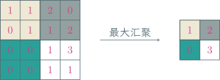

---
presentation:
  margin: 0
  center: false
  transition: "convex"
  enableSpeakerNotes: true
  slideNumber: "c/t"
  navigationMode: "linear"
---

@import "../css/font-awesome-4.7.0/css/font-awesome.css"
@import "../css/theme/solarized.css"
@import "../css/logo.css"
@import "../css/font.css"
@import "../css/color.css"
@import "../css/margin.css"
@import "../css/table.css"
@import "../css/main.css"
@import "../plugin/zoom/zoom.js"
@import "../plugin/customcontrols/plugin.js"
@import "../plugin/customcontrols/style.css"
@import "../plugin/chalkboard/plugin.js"
@import "../plugin/chalkboard/style.css"
@import "../plugin/menu/menu.js"
@import "../js/anychart/anychart-core.min.js"
@import "../js/anychart/anychart-venn.min.js"
@import "../js/anychart/pastel.min.js"
@import "../js/anychart/venn-ml.js"

<!-- slide data-notes="" -->

##### 卷积神经网络

---

图像数据集 [ImageNet](https://image-net.org/index.php)：

- 共有 14,197,122 训练图片、50,000 验证图片、100,000 测试图片
- 共有 1,000 个类别，通过众包进行标注
- 图片分辨率：256 × 256、224 × 224、299 × 299

用全连接网络训练 ImageNet

- 图片全部裁减到 224 × 224，输入层神经元个数为 50,176
- 共有 1,000 个类别，输出层神经元个数为 1,000
- 假设只有一个隐藏层，神经元个数取个折中 10,000

总参数量为 (50,176 + 1,000) × 10,000 = 511,760,000

- 训练效率非常低
- 很容易出现过拟合

<!-- slide vertical=true data-notes="" -->

##### 局部连接 权值共享

---

@import "../dot/dense-vs-cnn.dot"

局部连接：每个神经元只与前一层确定数量的 (远小于总数) 神经元相连

权值共享：确定数量的神经元均采用相同的输入权重系数

限制神经元的输入权重个数，降低参数规模，降低模型复杂度

<!-- slide vertical=true data-notes="" -->

##### 局部连接 权值共享

---

$$
\begin{align*}
    \qquad \qquad \qquad \qquad a_1 & = x_1 \times w_1 + x_2 \times w_2 + x_3 \times w_3 \\
    a_2 & = x_2 \times w_1 + x_3 \times w_2 + x_4 \times w_3 \\
    a_3 & = x_3 \times w_1 + x_4 \times w_2 + x_5 \times w_3 \\
    a_4 & = x_4 \times w_1 + x_5 \times w_2 + x_6 \times w_3
\end{align*}
$$

### 卷积神经网络：局部连接，权值共享

<!-- slide data-notes="" -->

##### 一维卷积

---

$$
\begin{align*}
    \quad (f \otimes g) [n] = \sum_{m = -\infty}^\infty f[m] \cdot g[n-m]
\end{align*}
$$

取$f[i] = x_i$，$g[-2] = w_3$，$g[-1] = w_2$，$g[0] = w_1$，其余为零

$$
\begin{align*}
    \quad a_n = x_n w_1 + x_{n+1} w_2 + x_{n+2} w_3 = \sum_{m = -\infty}^\infty f[m] \cdot g[n-m] = (f \otimes g) [n]
\end{align*}
$$

<!-- slide vertical=true data-notes="" -->

##### 二维卷积

---

针对输入是矩阵的情形

参与卷积的深色区域称为对应输出神经元的感受野 (receptive field)

<!-- slide data-notes="" -->

##### 二维卷积 图像滤波

---

平滑去噪

    
    

        

            $\otimes ~ \begin{bmatrix}
                \frac{1}{9} & \frac{1}{9} & \frac{1}{9} \\ \frac{1}{9} & \frac{1}{9} & \frac{1}{9} \\ \frac{1}{9} & \frac{1}{9} & \frac{1}{9}
            \end{bmatrix} ~ =$ 
        

    

    

<!-- slide vertical=true data-notes="" -->

##### 二维卷积 图像滤波

---

边缘提取

    
    

        

            $\otimes ~ \begin{bmatrix}
                0 & 1 & 1 \\ -1 & 0 & 1 \\ -1 & -1 & 0
            \end{bmatrix} ~ = $ 
        

    

    

<!-- slide data-notes="" -->

##### 汇聚

---

汇聚 (pooling) 层也叫子采样 (subsampling) 层

- 最大汇聚 (maximum pooling)：取区域内神经元最大值，拥有一定的平移不变性

- 平均汇聚 (mean pooling)：取区域内神经元平均值

 

我的批注 将区域下采样为一个值，减少网络参数，降低模型复杂度

<!-- slide data-notes="" -->

##### 卷积神经网络

---

卷积神经网络由卷积层、汇聚层、全连接层交叉堆叠而成

@import "../dot/cnn.dot"

趋势

- 更小的卷积核，比如 3 × 3
- 更深的结构，比如层数大于 50
- 汇聚层的作用可由卷积步长代替，使用比例逐渐降低，趋向于全卷积网络

<!-- slide data-notes="" -->

##### 经典网络 LeNet-5

---

<!-- slide vertical=true data-notes="" -->

##### LeNet-5 手写数字识别

---

@import "../python/tf-mnist.py" {.line-numbers .top-1}

<!-- slide data-notes="" -->

##### 经典网络复用

---

使用在 ImageNet 训练好的残差网络 ResNet50 进行图像分类

@import "../python/resnet50.py" {.line-numbers .top-1}

